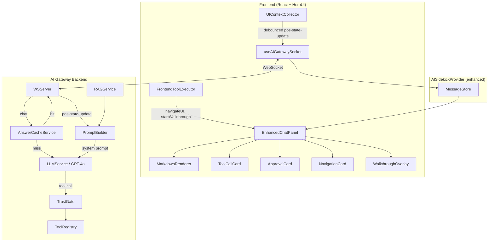
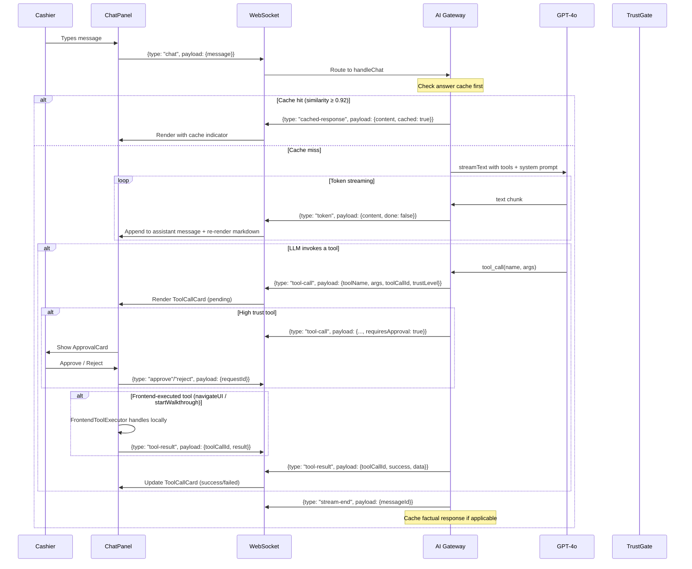

# Design Document: AI Chat Enhanced UI

## Overview

This design transforms the existing plain-text AI chat panel (`ai-chat.tsx`)
into a rich, interactive assistant interface. The current system streams GPT-4o
tokens over WebSocket and renders them as raw text. This feature adds:

1. **Markdown rendering** in chat bubbles via `react-markdown` with sanitization
2. **Interactive tool call/result cards** displayed inline as the LLM invokes
   tools
3. **High-trust approval cards** with Approve/Reject buttons for sensitive
   operations
4. **Real POS tool handlers** replacing the 24 stub handlers with actual POS
   operations
5. **Walkthrough overlay** for AI-generated step-by-step UI tutorials
6. **UI navigation tool** that opens drawers and highlights elements
7. **Full UI context snapshots** sent to the gateway with debouncing
8. **Answer caching** with pgvector similarity search for cross-cashier
   knowledge sharing

The design builds on the existing `AISidekickProvider`, `useAIGatewaySocket`
hook, `WSServer`, `TrustGate`, `ToolRegistry`, and `RAGService` without
replacing them.

## Architecture

### System Architecture



### Message Flow



### Frontend-Executed vs Backend-Executed Tools

Two tools execute on the frontend rather than the backend because they
manipulate the DOM:

| Tool               | Execution | Reason                                                        |
| ------------------ | --------- | ------------------------------------------------------------- |
| `navigateUI`       | Frontend  | Opens drawers, scrolls to sections, highlights DOM elements   |
| `startWalkthrough` | Frontend  | Creates spotlight overlay, positions popovers on DOM elements |
| All other 24 tools | Backend   | Operate on data (cart, customer, inventory, etc.)             |

The gateway sends `tool-call` messages for these tools with a
`frontendExecutable: true` flag. The frontend's `FrontendToolExecutor`
intercepts them, executes locally, and sends a `tool-result` message back to the
gateway so the LLM conversation history stays consistent.

## Components and Interfaces

### 1. Enhanced Chat Message Types

The current `ChatMessage` type in `ai-chat.tsx` only supports `user | assistant`
roles with a `content` string. The enhanced system needs a discriminated union:

```typescript
// apps/vite-template/src/contexts/ai-sidekick/chat-types.ts

/** Base fields shared by all chat messages */
interface ChatMessageBase {
  id: string;
  timestamp: number;
}

/** User text message */
interface UserMessage extends ChatMessageBase {
  type: "user";
  content: string;
}

/** Assistant text message (may contain markdown) */
interface AssistantMessage extends ChatMessageBase {
  type: "assistant";
  content: string;
  /** True if this response came from the answer cache */
  cached?: boolean;
}

/** Tool invocation by the LLM */
interface ToolCallMessage extends ChatMessageBase {
  type: "tool-call";
  toolCallId: string;
  toolName: string;
  args: Record<string, unknown>;
  trustLevel: "low" | "medium" | "high";
  requiresApproval: boolean;
  /** Whether this tool runs on the frontend */
  frontendExecutable: boolean;
  status:
    | "pending"
    | "approved"
    | "rejected"
    | "executing"
    | "success"
    | "failed"
    | "timed-out";
  result?: unknown;
  error?: string;
}

/** Tool execution result */
interface ToolResultMessage extends ChatMessageBase {
  type: "tool-result";
  toolCallId: string;
  success: boolean;
  data?: unknown;
  error?: string;
}

/** Navigation action performed by navigateUI tool */
interface NavigationMessage extends ChatMessageBase {
  type: "navigation";
  target: string;
  section?: string;
  element?: string;
  description: string;
}

/** System notification (connection status changes, errors) */
interface SystemMessage extends ChatMessageBase {
  type: "system";
  variant: "info" | "warning" | "error" | "success";
  content: string;
}

/** Discriminated union of all message types */
type ChatMessage =
  | UserMessage
  | AssistantMessage
  | ToolCallMessage
  | ToolResultMessage
  | NavigationMessage
  | SystemMessage;
```

### 2. Component Hierarchy

```
EnhancedChatPanel
├── ChatHeader (connection status indicator)
├── MessageList
│   ├── UserBubble
│   ├── AssistantBubble
│   │   └── MarkdownRenderer (react-markdown + rehype-sanitize)
│   ├── ToolCallCard (tool name, args summary, status badge, result)
│   ├── ApprovalCard (tool info + Approve/Reject buttons)
│   ├── NavigationCard (target description + "Go There" button)
│   ├── SystemNotification (connection changes, errors)
│   └── TypingIndicator (bouncing dots during streaming)
├── QuickSuggestions (initial prompt suggestions)
├── ChatInput (text input + send button, disabled during approval)
└── WalkthroughOverlay (portal, rendered outside chat panel)
    ├── SpotlightMask (SVG mask with cutout around target)
    └── StepPopover (title, description, action hint, nav buttons)
```

### 3. MarkdownRenderer Component

```typescript
// apps/vite-template/src/components/ai-sidekick/markdown-renderer.tsx

interface MarkdownRendererProps {
  /** Raw markdown content (may be partial during streaming) */
  content: string;
  /** Whether content is still being streamed (affects rendering strategy) */
  isStreaming?: boolean;
}
```

Implementation approach:

- Use `react-markdown` with `rehype-sanitize` for XSS prevention
- Use `remark-gfm` for GitHub-flavored markdown (tables, strikethrough)
- Custom component overrides for `code`, `a`, `pre` to match the POS design
  system
- Links render with `target="_blank"` and `rel="noopener noreferrer"`
- Code blocks get a dark background with monospace font, matching the existing
  `bg-surface-secondary` token
- During streaming, `react-markdown` re-renders on each token update; the
  component uses `React.memo` with content comparison to avoid unnecessary
  re-renders of completed message bubbles

### 4. ToolCallCard Component

```typescript
interface ToolCallCardProps {
  toolCallId: string;
  toolName: string;
  args: Record<string, unknown>;
  status: "pending" | "executing" | "success" | "failed";
  result?: unknown;
  error?: string;
}
```

Renders as a compact card within the message flow:

- Header: tool icon + human-readable tool name (mapped from registry)
- Body: summarized arguments (e.g., "Cart: Order #1, Promo: SUMMER25")
- Footer: status badge (spinner for pending/executing, checkmark for success, X
  for failed)
- Expandable result section on success

### 5. ApprovalCard Component

```typescript
interface ApprovalCardProps {
  toolCallId: string;
  toolName: string;
  args: Record<string, unknown>;
  trustLevel: "high";
  status: "pending" | "approved" | "rejected" | "timed-out";
  onApprove: (toolCallId: string) => void;
  onReject: (toolCallId: string) => void;
}
```

Renders as a prominent card with warning styling:

- Header: warning icon + "Approval Required"
- Body: tool name, action description, monetary amounts highlighted
- Footer: Approve (green) and Reject (red) buttons, disabled when not pending
- Timer indicator showing remaining approval time
- When pending, the chat input is disabled via context

### 6. NavigationCard Component

```typescript
interface NavigationCardProps {
  target: string;
  section?: string;
  element?: string;
  description: string;
  onNavigate: () => void;
}
```

Renders inline showing where the AI navigated:

- Icon + "Navigated to {target}" description
- "Go There" button that re-executes the navigation if the drawer was closed

### 7. WalkthroughOverlay Component

```typescript
interface WalkthroughStep {
  targetSelector: string;
  title: string;
  description: string;
  position: "top" | "bottom" | "left" | "right";
  actionHint?: string;
}

interface WalkthroughOverlayProps {
  steps: WalkthroughStep[];
  onComplete: () => void;
  onSkip: () => void;
}
```

Implementation:

- Rendered as a React portal attached to `document.body`
- Uses an SVG mask overlay that dims the entire screen except a spotlight cutout
  around the target element
- Target element rect is obtained via `getBoundingClientRect()` with a
  `ResizeObserver` for dynamic updates
- Popover is positioned using CSS `position: fixed` anchored to the target
  rect + the specified position
- Step navigation: Next, Back, Skip (or Done on last step)
- If a target selector doesn't match any DOM element, that step is skipped
  automatically
- Escape key dismisses the walkthrough
- Step counter shows "Step X of Y"

### 8. FrontendToolExecutor

```typescript
// apps/vite-template/src/contexts/ai-sidekick/frontend-tool-executor.ts

interface NavigateUIArgs {
  drawer: string;
  section?: string;
  element?: string;
}

interface StartWalkthroughArgs {
  steps: WalkthroughStep[];
}

type FrontendToolResult = {
  success: boolean;
  message: string;
};
```

This module handles tools that must execute on the frontend:

- `navigateUI`: Uses the drawer stack's `push()` to open drawers, scrolls to
  sections via `element.scrollIntoView()`, applies highlight animation via a
  temporary CSS class
- `startWalkthrough`: Sets walkthrough state in the provider, which triggers the
  `WalkthroughOverlay` portal

### 9. UIContextCollector

```typescript
// apps/vite-template/src/contexts/ai-sidekick/ui-context-collector.ts

interface UIContextSnapshot {
  route: string;
  activeCart: {
    id: string;
    label: string;
    itemCount: number;
    items: Array<{ name: string; quantity: number; price: number }>;
    total: number;
  } | null;
  assignedCustomer: {
    id: string;
    name: string;
    email?: string;
    loyaltyTier?: string;
  } | null;
  selectedEvent: {
    id: string;
    name: string;
    date: string;
  } | null;
  openDrawers: string[];
  sidebarCollapsed: boolean;
  darkMode: boolean;
  terminalId: string;
  currency: string;
  language: string;
}
```

Collection strategy:

- A `useUIContextCollector` hook inside `AISidekickProvider` aggregates state
  from `usePOS()`, `useLocation()`, and `useDrawerStack()`
- Changes are debounced at 500ms using a `useRef` + `setTimeout` pattern
- The debounced snapshot is sent via `gateway.sendPosStateUpdate()`
- Sensitive data (payment card numbers, auth tokens) is explicitly excluded from
  the snapshot

### 10. AnswerCacheService (Backend)

```typescript
// packages/ai-gateway/src/answer-cache-service.ts

interface CachedAnswer {
  id: string;
  tenantId: string;
  question: string;
  answer: string;
  questionEmbedding: number[];
  createdAt: Date;
  updatedAt: Date;
  hitCount: number;
}

interface AnswerCacheConfig {
  similarityThreshold: number; // default 0.92
  ttlDays: number; // default 30
}

class AnswerCacheService {
  constructor(pool: Pool, llm: LLMService, config?: Partial<AnswerCacheConfig>);

  /** Search for a cached answer. Returns null if no match above threshold. */
  async findSimilar(
    tenantId: string,
    question: string,
  ): Promise<CachedAnswer | null>;

  /** Store a new Q&A pair in the cache. */
  async store(
    tenantId: string,
    question: string,
    answer: string,
  ): Promise<void>;

  /** List cached Q&A pairs for admin review. */
  async list(
    tenantId: string,
    offset: number,
    limit: number,
  ): Promise<CachedAnswer[]>;

  /** Update a cached answer (admin edit). */
  async update(id: string, answer: string): Promise<void>;

  /** Delete a cached answer. */
  async delete(id: string): Promise<void>;

  /** Refresh stale entries older than TTL. */
  async refreshStale(tenantId: string): Promise<number>;
}
```

### 11. WebSocket Protocol Extensions

New server→client message types added to `WSServerMessage`:

```typescript
// Added to packages/ai-gateway/src/types.ts

// WSServerMessage.type gains:
| "tool-call"
| "tool-result"
| "cached-response"

// New typed server messages:
| {
    type: "tool-call";
    payload: {
      toolCallId: string;
      toolName: string;
      args: Record<string, unknown>;
      trustLevel: TrustLevel;
      requiresApproval: boolean;
      frontendExecutable: boolean;
    };
  }
| {
    type: "tool-result";
    payload: {
      toolCallId: string;
      success: boolean;
      data?: unknown;
      error?: string;
    };
  }
| {
    type: "cached-response";
    payload: {
      content: string;
      cached: true;
      sourceQuestionId: string;
    };
  }
```

New client→server message type for frontend tool results:

```typescript
// WSClientMessage.type gains:
| "tool-result"

// New typed client message:
| {
    type: "tool-result";
    payload: {
      toolCallId: string;
      success: boolean;
      data?: unknown;
      error?: string;
    };
  }
```

The existing message types (`chat`, `pos-state-update`, `approve`, `reject`,
`dismiss`, `delegation-change`) remain unchanged for backward compatibility.

## Data Models

### Database: Answer Cache Table

Added to `packages/ai-gateway/src/schema.sql`:

```sql
CREATE TABLE answer_cache (
  id              UUID PRIMARY KEY DEFAULT gen_random_uuid(),
  tenant_id       TEXT NOT NULL,
  question        TEXT NOT NULL,
  answer          TEXT NOT NULL,
  question_embedding vector(1536) NOT NULL,
  hit_count       INTEGER NOT NULL DEFAULT 0,
  created_at      TIMESTAMPTZ NOT NULL DEFAULT NOW(),
  updated_at      TIMESTAMPTZ NOT NULL DEFAULT NOW()
);

CREATE INDEX idx_answer_cache_tenant ON answer_cache (tenant_id);
CREATE INDEX idx_answer_cache_embedding ON answer_cache
  USING ivfflat (question_embedding vector_cosine_ops) WITH (lists = 100);
CREATE INDEX idx_answer_cache_stale ON answer_cache (tenant_id, updated_at);
```

### Frontend State: MessageStore

The `AISidekickProvider` gains a `messages: ChatMessage[]` array in its state,
replacing the current simple `chatTokens: string` approach:

```typescript
// State additions to AISidekickProvider
interface EnhancedChatState {
  messages: ChatMessage[];
  isStreaming: boolean;
  streamingMessageId: string | null;
  pendingApprovalId: string | null;
  walkthrough: {
    active: boolean;
    steps: WalkthroughStep[];
    currentStep: number;
  } | null;
}
```

The `messages` array is the single source of truth for the chat UI. It persists
in React state for the browser session lifetime (cleared on page refresh per
Requirement 6.3).

### Frontend State: UIContextSnapshot

Collected by `useUIContextCollector` hook, stored as a ref (not state, to avoid
re-renders), and sent to the gateway on change:

```typescript
// Stored as useRef<UIContextSnapshot> in AISidekickProvider
// Debounced at 500ms before sending via sendPosStateUpdate()
```

### Gateway Session Extension

The existing `SessionWithContext` interface in `ws-server.ts` is extended:

```typescript
interface SessionWithContext extends Session {
  posContext?: {
    cart?: unknown;
    customer?: unknown;
    alerts?: unknown[];
    // New fields for full UI context:
    route?: string;
    openDrawers?: string[];
    selectedEvent?: unknown;
    sidebarCollapsed?: boolean;
    darkMode?: boolean;
    terminalId?: string;
    currency?: string;
    language?: string;
  };
}
```

### Tool Definition Extensions

Two new frontend-executable tool definitions added to the registry:

```typescript
// packages/ai-gateway/src/tools/ui-tools.ts

const uiTools: ToolDefinition[] = [
  {
    name: "navigateUI",
    description:
      "Navigate the cashier to a specific screen, drawer, or UI element.",
    parameters: z.object({
      drawer: z
        .string()
        .describe("Drawer to open: profile, notifications, shift, membership"),
      section: z.string().optional().describe("Section within the drawer"),
      element: z
        .string()
        .optional()
        .describe("CSS selector of element to highlight"),
    }),
    trustLevel: "low",
    roles: ["cashier"],
    handler: async () => ({ success: true, message: "Frontend-executed tool" }),
  },
  {
    name: "startWalkthrough",
    description:
      "Start an interactive walkthrough with highlights and popovers on UI elements.",
    parameters: z.object({
      steps: z
        .array(
          z.object({
            targetSelector: z
              .string()
              .describe(
                "CSS selector or data attribute for the target element",
              ),
            title: z.string().describe("Popover title"),
            description: z.string().describe("Popover description"),
            position: z
              .enum(["top", "bottom", "left", "right"])
              .describe("Popover position relative to target"),
            actionHint: z
              .string()
              .optional()
              .describe("Action hint text, e.g. 'tap here'"),
          }),
        )
        .describe("Ordered array of walkthrough steps"),
    }),
    trustLevel: "low",
    roles: ["cashier"],
    handler: async () => ({ success: true, message: "Frontend-executed tool" }),
  },
];
```

## Correctness Properties

_A property is a characteristic or behavior that should hold true across all
valid executions of a system — essentially, a formal statement about what the
system should do. Properties serve as the bridge between human-readable
specifications and machine-verifiable correctness guarantees._

### Property 1: Markdown renders all syntax elements as correct HTML

_For any_ string containing valid markdown syntax (bold, italic, inline code,
code blocks, ordered lists, unordered lists, links), the MarkdownRenderer output
SHALL contain the corresponding HTML elements (`<strong>`, `<em>`, `<code>`,
`<pre>`, `<ol>`, `<ul>`, `<a>`), and all `<a>` tags SHALL have `target="_blank"`
and `rel="noopener noreferrer"` attributes.

**Validates: Requirements 1.1, 1.3**

### Property 2: Markdown sanitization removes XSS vectors

_For any_ input string containing HTML script tags, event handler attributes
(onclick, onerror, etc.), or `javascript:` URLs, the MarkdownRenderer output
SHALL NOT contain any of those dangerous elements in the rendered HTML.

**Validates: Requirements 1.4**

### Property 3: Tool-call messages are created from WebSocket tool-call events

_For any_ incoming WebSocket message of type "tool-call" with a toolCallId,
toolName, args, and trustLevel, the message store SHALL contain a ChatMessage of
type "tool-call" with matching fields and initial status "pending".

**Validates: Requirements 2.1**

### Property 4: Tool result updates the corresponding tool-call message status

_For any_ incoming WebSocket message of type "tool-result" with a toolCallId and
success boolean, the corresponding tool-call ChatMessage in the store SHALL be
updated to status "success" (with result data) if success is true, or status
"failed" (with error message) if success is false.

**Validates: Requirements 2.3, 2.4**

### Property 5: Tool-related cards display all required information

_For any_ ToolCallCard, the rendered output SHALL contain the tool name, a
summary of the arguments, and a status indicator. _For any_ ApprovalCard, the
rendered output SHALL contain the tool name, action description, arguments
(including monetary amounts if present), and the approval reason.

**Validates: Requirements 2.2, 3.2**

### Property 6: Gateway tool-call messages contain all required fields

_For any_ tool call processed by the AI Gateway, the emitted WebSocket
"tool-call" message SHALL contain a non-empty toolName, a toolCallId, the args
object, and the trustLevel. For tools with trustLevel "high", the message SHALL
include `requiresApproval: true`.

**Validates: Requirements 2.5, 8.1, 8.5**

### Property 7: High-trust tool calls render as ApprovalCards

_For any_ tool-call ChatMessage with trustLevel "high" and requiresApproval
true, the chat panel SHALL render an ApprovalCard component (not a regular
ToolCallCard) with Approve and Reject buttons.

**Validates: Requirements 3.1**

### Property 8: Approval actions send correct WebSocket messages

_For any_ pending ApprovalCard with a requestId, pressing Approve SHALL cause a
WebSocket message of type "approve" with that requestId to be sent, and pressing
Reject SHALL cause a WebSocket message of type "reject" with that requestId to
be sent.

**Validates: Requirements 3.3, 3.4**

### Property 9: Pending approval disables chat input

_For any_ state where the message store contains at least one tool-call
ChatMessage with status "pending" and requiresApproval true, the chat input
SHALL be disabled.

**Validates: Requirements 3.6**

### Property 10: Tool handler result contract

_For any_ tool handler invocation with any arguments (valid or invalid), the
returned result SHALL be an object containing a `success` boolean and a
`message` string. If the arguments are invalid, the result SHALL have
`success: false` and an error code.

**Validates: Requirements 4.9, 4.10**

### Property 11: Hold/resume cart round-trip

_For any_ active cart, invoking holdCart followed by resumeCart with the same
cart ID SHALL restore the cart to active status.

**Validates: Requirements 4.3, 4.4**

### Property 12: toggleDarkMode inverts theme state

_For any_ current dark mode state (true or false), invoking the toggleDarkMode
tool handler SHALL result in the dark mode state being the logical negation of
the original state.

**Validates: Requirements 4.1**

### Property 13: Customer lookup returns only matching records

_For any_ customer dataset and search query, all records returned by the
lookupCustomer handler SHALL contain the query string (case-insensitive) in at
least one of: name, email, or phone fields.

**Validates: Requirements 4.5**

### Property 14: Connection state transitions produce system messages

_For any_ WebSocket connection status transition (connected→disconnected or
disconnected→connected), the message store SHALL gain a new SystemMessage of the
appropriate variant ("warning" for disconnection, "success" for reconnection).

**Validates: Requirements 5.4, 5.5**

### Property 15: Chat history persists across panel close/reopen

_For any_ sequence of ChatMessages added to the message store, closing the chat
panel (unmounting) and reopening it SHALL render the same messages in the same
chronological order.

**Validates: Requirements 6.1, 6.2**

### Property 16: Message store accepts all ChatMessage types

_For any_ ChatMessage variant (user, assistant, tool-call, tool-result,
navigation, system), the message store SHALL accept and retain the message, and
the stored message SHALL be retrievable with all original fields intact.

**Validates: Requirements 6.4**

### Property 17: UI context changes trigger debounced pos-state-update

_For any_ change to the UI context snapshot (cart, customer, route, drawers,
sidebar, dark mode, event), a "pos-state-update" WebSocket message SHALL be sent
within 500ms, and rapid successive changes SHALL be debounced into a single
message.

**Validates: Requirements 7.1, 7.2, 11.2**

### Property 18: Prompt builder includes full UI context snapshot

_For any_ non-empty UI context snapshot stored on the session, the system prompt
produced by PromptBuilder SHALL contain the cart contents, customer info, route,
open drawers, sidebar state, dark mode state, and terminal ID.

**Validates: Requirements 7.3, 11.3**

### Property 19: UI context snapshot contains all required fields and excludes sensitive data

_For any_ POS state, the collected UIContextSnapshot SHALL contain route,
activeCart, assignedCustomer, selectedEvent, openDrawers, sidebarCollapsed,
darkMode, terminalId, currency, and language fields. The snapshot SHALL NOT
contain any strings matching payment card number patterns or authentication
token patterns.

**Validates: Requirements 11.1, 11.5**

### Property 20: Gateway tool-result messages contain required fields

_For any_ tool execution result emitted by the AI Gateway, the "tool-result"
WebSocket message SHALL contain a toolCallId, a success boolean, and either a
data field (on success) or an error field (on failure).

**Validates: Requirements 8.2**

### Property 21: NavigateUI executor opens correct drawer and returns confirmation

_For any_ valid navigateUI tool invocation with a drawer name and optional
section, the frontend executor SHALL open the specified drawer and return a
result with success=true and a message describing which screen was opened.

**Validates: Requirements 9.2, 9.5**

### Property 22: Walkthrough step schema validation

_For any_ walkthrough step object, the Zod schema SHALL require targetSelector
(string), title (string), description (string), and position (one of "top",
"bottom", "left", "right"). The actionHint field SHALL be optional.

**Validates: Requirements 10.2**

### Property 23: Walkthrough navigation advances and retreats correctly

_For any_ active walkthrough with N steps and current step index i, pressing
Next when i < N-1 SHALL result in step i+1, pressing Back when i > 0 SHALL
result in step i-1, and pressing Skip or Escape SHALL dismiss the walkthrough
entirely.

**Validates: Requirements 10.5, 10.6, 10.7**

### Property 24: Walkthrough popover displays all required elements

_For any_ walkthrough step, the rendered popover SHALL contain the step title,
description, action hint (if provided), step counter ("Step X of Y"), and
navigation buttons (Next/Back/Skip or Done on last step).

**Validates: Requirements 10.4**

### Property 25: Answer cache returns only same-tenant results

_For any_ tenant ID and question, the answer cache similarity search SHALL only
return cached answers where the tenant_id matches the requesting tenant. No
cached answer from a different tenant SHALL ever be returned.

**Validates: Requirements 12.5**

### Property 26: Cache hit above threshold returns cached answer with flag

_For any_ question where the answer cache contains a matching Q&A pair with
similarity score ≥ 0.92, the gateway SHALL return the cached answer content with
`cached: true` in the response metadata, without invoking the LLM.

**Validates: Requirements 12.3**

### Property 27: Cached response indicator in chat UI

_For any_ assistant ChatMessage with `cached: true`, the chat panel SHALL render
a visual cache indicator (lightning bolt icon) alongside the message.

**Validates: Requirements 12.4**

### Property 28: Stale cache entries are refreshed after TTL

_For any_ cached Q&A pair with `updated_at` older than the configured TTL
(default 30 days), the refreshStale function SHALL re-query the LLM and update
the answer and `updated_at` timestamp.

**Validates: Requirements 12.7**

### Property 29: Factual responses are cached in the knowledge base

_For any_ AI Gateway response classified as factual/procedural (not a
transactional tool call), the question-answer pair SHALL be stored in the
answer_cache table with the tenant_id and category "faq".

**Validates: Requirements 12.1**

### Property 30: Session reconnect preserves conversation history

_For any_ WebSocket session that disconnects and reconnects within the 5-minute
window, the resumed session SHALL contain the same conversation message history
as before disconnection.

**Validates: Requirements 6.5**

## Error Handling

### Frontend Error Handling

| Scenario                                                      | Handling                                                                                                                |
| ------------------------------------------------------------- | ----------------------------------------------------------------------------------------------------------------------- |
| WebSocket disconnection during streaming                      | Stop streaming, add SystemMessage "warning", show reconnecting indicator. Partial assistant message is preserved as-is. |
| Tool-call for unknown tool name                               | Display ToolCallCard with status "failed" and message "Unknown tool".                                                   |
| Frontend tool execution failure (navigateUI target not found) | Return `{ success: false, message: "Drawer not found" }`, display error in ToolCallCard.                                |
| Walkthrough target element not in DOM                         | Skip the step, advance to next. If all steps are skipped, dismiss walkthrough with a "No elements found" message.       |
| Approval timeout (60s)                                        | Update ApprovalCard status to "timed-out", disable buttons, re-enable chat input.                                       |
| Malformed WebSocket message                                   | Silently ignore (existing behavior in `use-ai-gateway-socket.ts`).                                                      |
| MarkdownRenderer receives invalid markdown                    | `react-markdown` gracefully renders raw text for unparseable content. No crash.                                         |
| Rate limited response                                         | Display SystemMessage with retry-after info. Disable send button temporarily.                                           |
| Chat input submitted while streaming                          | Prevent submission (send button already disabled during streaming).                                                     |

### Backend Error Handling

| Scenario                              | Handling                                                                                                              |
| ------------------------------------- | --------------------------------------------------------------------------------------------------------------------- |
| Tool handler throws exception         | TrustGate catches, logs to audit, returns `{ error: true, message }`. Gateway sends "tool-result" with success=false. |
| Tool argument validation failure      | ToolRegistry.validateArgs throws ToolValidationError. Gateway sends "tool-result" with validation error details.      |
| Answer cache DB query failure         | Log error, fall through to LLM (cache is best-effort).                                                                |
| Answer cache store failure            | Log error, continue (response already sent to client).                                                                |
| LLM timeout on primary model          | Existing fallback to GPT-4o-mini in LLMService.                                                                       |
| Embedding generation failure          | Log error, skip cache operation.                                                                                      |
| Session not found on reconnect        | Create new session (existing behavior).                                                                               |
| POS state update with invalid payload | Log warning, ignore update (don't crash session).                                                                     |

### Error Message Format

All error messages sent to the client follow the existing format:

```typescript
{ type: "error", payload: { code: string, message: string }, requestId?: string }
```

New error codes:

- `TOOL_EXECUTION_FAILED` — tool handler threw an exception
- `TOOL_VALIDATION_FAILED` — tool arguments failed Zod validation
- `APPROVAL_TIMEOUT` — high-trust approval request timed out
- `CACHE_ERROR` — answer cache operation failed (informational, non-blocking)

## Testing Strategy

### Testing Framework

- **Unit tests**: Vitest (already configured in both `apps/vite-template` and
  `packages/ai-gateway`)
- **Property-based tests**: `fast-check` (already in devDependencies of both
  packages)
- **Component tests**: Vitest + jsdom (already in devDependencies)

### Unit Tests

Unit tests cover specific examples, edge cases, and integration points:

- MarkdownRenderer: renders specific markdown examples (heading, list, code
  block, link)
- ToolCallCard: renders each status variant correctly
- ApprovalCard: approve/reject button click handlers fire correctly
- WalkthroughOverlay: step navigation with specific step arrays
- NavigateUI: specific drawer targets (profile, notifications, shift)
- Answer cache: specific similarity threshold boundary cases (0.91 miss, 0.92
  hit)
- WebSocket message parsing: specific message type examples
- Tool handler edge cases: empty cart, non-existent customer, invalid promo code

### Property-Based Tests

Each property test uses `fast-check` with a minimum of 100 iterations and
references its design document property.

Property tests are organized by component/module:

**Frontend (apps/vite-template):**

- `markdown-renderer.property.test.ts` — Properties 1, 2
- `message-store.property.test.ts` — Properties 3, 4, 14, 15, 16
- `tool-cards.property.test.ts` — Properties 5, 7, 9
- `approval-flow.property.test.ts` — Property 8
- `walkthrough.property.test.ts` — Properties 22, 23, 24
- `ui-context.property.test.ts` — Properties 17, 19
- `cache-indicator.property.test.ts` — Property 27

**Backend (packages/ai-gateway):**

- `tool-handler-contract.property.test.ts` — Properties 10, 11, 12, 13
- `ws-protocol.property.test.ts` — Properties 6, 20
- `prompt-builder.property.test.ts` — Property 18
- `answer-cache.property.test.ts` — Properties 25, 26, 28, 29
- `session-reconnect.property.test.ts` — Property 30
- `navigate-ui.property.test.ts` — Property 21

Each test file tags its tests with:

```typescript
// Feature: ai-chat-enhanced-ui, Property 1: Markdown renders all syntax elements as correct HTML
```

### Test Configuration

```typescript
// fast-check configuration for all property tests
fc.assert(
  fc.property(/* arbitraries */, (/* args */) => {
    // property assertion
  }),
  { numRuns: 100 }
);
```

### Coverage Goals

- All 30 correctness properties covered by property-based tests
- Edge cases (approval timeout, missing walkthrough targets, empty POS context)
  covered by unit tests
- Integration points (WebSocket message flow, tool execution pipeline) covered
  by unit tests with mocked dependencies
