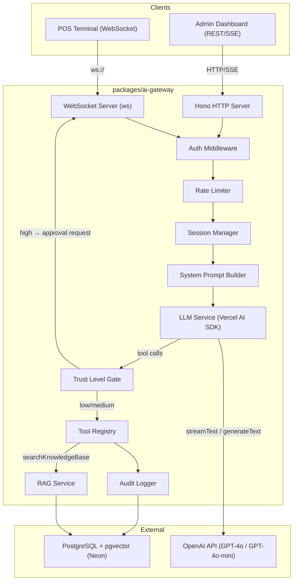
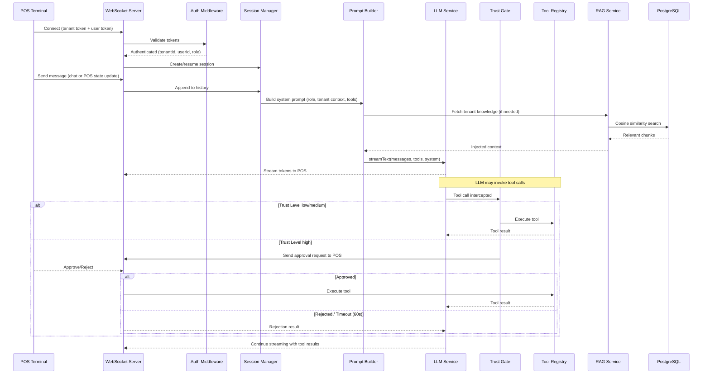
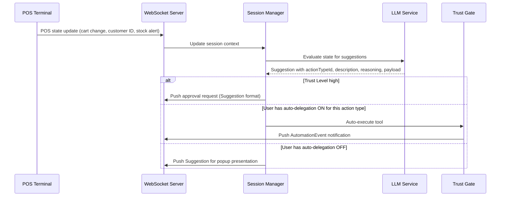

# Design Document: AI Gateway Backend

## Overview

The AI Gateway Backend is a Node.js/TypeScript service (`packages/ai-gateway/`)
that provides the server-side AI engine for the AI Sidekick feature. The
frontend already has a complete client-side layer (provider, suggestion popup,
delegation toggles, capabilities panel) but no real AI backend — this service
fills that gap.

The gateway receives WebSocket connections from POS terminals and REST requests
from the admin dashboard, orchestrates LLM calls via the Vercel AI SDK (OpenAI
GPT-4o primary, GPT-4o-mini fallback), executes tools through a structured
registry, retrieves venue-specific knowledge via RAG (pgvector), and pushes
real-time suggestions to connected clients. All operations are tenant-isolated
and audit-logged.

### Key Design Decisions

1. **Hono + ws dual-server**: Hono handles REST/SSE for admin dashboard; a
   standalone `ws` WebSocket server handles POS terminal connections. Both share
   middleware for auth and tenant resolution.
2. **Vercel AI SDK for LLM orchestration**: The `ai` package provides streaming,
   tool calling, and provider abstraction. Tool definitions use the SDK's
   `tool()` helper with Zod schemas.
3. **In-memory session store with TTL**: Conversation history is kept in a
   `Map<sessionId, Session>` with configurable token limits and 5-minute
   reconnect windows. No external session store needed at this scale.
4. **pgvector on Neon serverless**: Document embeddings stored in PostgreSQL
   with the `pgvector` extension. Cosine similarity search for RAG.
   Tenant-scoped via `tenant_id` column.
5. **Tool trust level enforcement at the gateway layer**: The gateway intercepts
   tool calls from the LLM, checks trust level, and gates high-risk tools behind
   WebSocket approval requests before execution.
6. **Message format compatibility**: All WebSocket messages (Suggestion,
   AutomationEvent, approval requests) use the exact type shapes defined in the
   frontend's `types.ts` to ensure zero-transformation interop.

## Architecture



### Data Flow: POS Terminal Chat



### Data Flow: Proactive Suggestion Push



## Components and Interfaces

### 1. WebSocket Server

Manages persistent connections from POS terminals. Each connection is
authenticated and bound to a session.

```typescript
// WebSocket message types (client → server)
interface WSClientMessage {
  type:
    | "chat"
    | "pos-state-update"
    | "approve"
    | "reject"
    | "dismiss"
    | "delegation-change";
  payload: Record<string, unknown>;
  requestId?: string; // correlates approval responses to pending requests
}

// WebSocket message types (server → client)
interface WSServerMessage {
  type:
    | "token"
    | "suggestion"
    | "approval-request"
    | "automation-event"
    | "error"
    | "stream-end";
  payload: Record<string, unknown>;
  requestId?: string;
}
```

Connection handshake: `ws://host:port/ws?tenantToken=<token>&userToken=<token>`

### 2. Hono HTTP Server (Admin API)

REST endpoints for admin dashboard interactions.

```typescript
// Routes
POST / api / admin / chat; // Send chat message, returns SSE stream
POST / api / admin / chat / sync; // Send chat message, returns full JSON response
POST / api / knowledge / ingest; // Ingest document into knowledge base
GET / api / knowledge / search; // Search knowledge base
GET / api / health; // Health check

// Auth header: Authorization: Bearer <tenantToken>:<userToken>
```

### 3. Auth Middleware

Shared authentication logic for both WebSocket and HTTP.

```typescript
interface AuthContext {
  tenantId: string;
  userId: string;
  role: "cashier" | "admin";
}

interface AuthMiddleware {
  /** Validate tokens and return auth context. Throws on failure. */
  authenticate(tenantToken: string, userToken: string): Promise<AuthContext>;
}
```

### 4. Session Manager

Manages per-terminal conversation sessions with token-limited history.

```typescript
interface Session {
  id: string;
  tenantId: string;
  userId: string;
  role: "cashier" | "admin";
  messages: CoreMessage[]; // Vercel AI SDK message format
  createdAt: number;
  lastActivityAt: number;
  /** Pending high-trust approval requests */
  pendingApprovals: Map<string, PendingApproval>;
  /** User's delegation preferences (synced from client) */
  delegationPreferences: Map<string, boolean>;
}

interface PendingApproval {
  requestId: string;
  toolName: string;
  toolArgs: Record<string, unknown>;
  resolve: (approved: boolean) => void;
  timeoutId: ReturnType<typeof setTimeout>;
}

interface SessionManager {
  create(auth: AuthContext): Session;
  get(sessionId: string): Session | undefined;
  resume(sessionId: string): Session | undefined;
  destroy(sessionId: string): void;
  /** Summarize old messages when token limit exceeded */
  trimHistory(session: Session, maxTokens: number): Promise<void>;
  /** Clean up expired sessions */
  cleanup(): void;
}
```

### 5. LLM Service

Wraps the Vercel AI SDK for streaming and tool-calling interactions.

```typescript
import { streamText, generateText, tool } from "ai";
import { openai } from "@ai-sdk/openai";

interface LLMService {
  /** Stream a response with tool calling support */
  stream(params: {
    messages: CoreMessage[];
    system: string;
    tools: Record<string, CoreTool>;
    onToolCall: (toolCall: ToolCallPart) => Promise<unknown>;
  }): AsyncIterable<TextStreamPart>;

  /** Generate a full response (used for summarization, admin sync) */
  generate(params: {
    messages: CoreMessage[];
    system: string;
    tools?: Record<string, CoreTool>;
  }): Promise<GenerateTextResult>;

  /** Generate embeddings for RAG */
  embed(text: string): Promise<number[]>;
}
```

Primary model: `openai("gpt-4o")`. Fallback: `openai("gpt-4o-mini")` on error or
30s timeout.

### 6. Tool Registry

Central registry mapping tool names to implementations, schemas, and trust
levels.

```typescript
interface ToolDefinition {
  name: string;
  description: string;
  parameters: z.ZodSchema; // Zod schema for input validation
  trustLevel: TrustLevel; // "low" | "medium" | "high"
  roles: ("cashier" | "admin")[]; // Which roles can use this tool
  handler: (args: unknown, ctx: ToolContext) => Promise<unknown>;
}

interface ToolContext {
  tenantId: string;
  userId: string;
  role: "cashier" | "admin";
  sessionId: string;
}

interface ToolRegistry {
  register(definition: ToolDefinition): void;
  get(name: string): ToolDefinition | undefined;
  /** Get tools available for a specific role */
  getForRole(role: "cashier" | "admin"): ToolDefinition[];
  /** Convert to Vercel AI SDK tool format */
  toAITools(role: "cashier" | "admin"): Record<string, CoreTool>;
  /** Validate args against schema, returns parsed args or throws */
  validateArgs(name: string, args: unknown): unknown;
}
```

#### Tool Catalog

| Category  | Tool Name             | Trust Level | Roles          | Description                         |
| --------- | --------------------- | ----------- | -------------- | ----------------------------------- |
| POS       | `mergeCarts`          | medium      | cashier        | Combine duplicate cart sessions     |
| POS       | `applyPromoCode`      | low         | cashier        | Apply promo code to cart            |
| POS       | `applyMemberDiscount` | medium      | cashier        | Apply loyalty tier discount         |
| POS       | `holdCart`            | low         | cashier        | Put cart on hold                    |
| POS       | `resumeCart`          | low         | cashier        | Resume a held cart                  |
| POS       | `processRefund`       | high        | cashier        | Initiate refund                     |
| POS       | `voidTransaction`     | high        | cashier        | Void entire transaction             |
| POS       | `assignSeat`          | medium      | cashier        | Auto-assign best seat               |
| Customer  | `lookupCustomer`      | low         | cashier, admin | Search customer by name/email/phone |
| Customer  | `getCustomerHistory`  | low         | cashier, admin | Get customer transaction history    |
| Customer  | `getLoyaltyStatus`    | low         | cashier, admin | Get loyalty tier and points         |
| Inventory | `checkStock`          | low         | cashier, admin | Check item availability             |
| Inventory | `getEventDetails`     | low         | cashier, admin | Get event info                      |
| Inventory | `suggestUpsell`       | low         | cashier        | Suggest complementary items         |
| Admin     | `createCoupon`        | medium      | admin          | Create promotional coupon           |
| Admin     | `createEvent`         | medium      | admin          | Create new event                    |
| Admin     | `updatePricing`       | high        | admin          | Update item pricing                 |
| Admin     | `getAnalytics`        | low         | admin          | Query analytics data                |
| External  | `getWeather`          | low         | cashier, admin | Current weather for venue           |
| External  | `getSeasonalTrends`   | low         | admin          | Seasonal trend data                 |
| External  | `getLocalEvents`      | low         | admin          | Nearby events                       |
| External  | `getHolidayCalendar`  | low         | cashier, admin | Upcoming holidays                   |
| Knowledge | `searchKnowledgeBase` | low         | cashier, admin | Semantic search venue docs          |
| Knowledge | `getVenueInfo`        | low         | cashier, admin | Get venue configuration             |

### 7. Trust Level Gate

Intercepts tool calls from the LLM and enforces trust level policies.

```typescript
interface TrustGate {
  /**
   * Process a tool call. For low/medium tools, executes immediately.
   * For high-trust tools, sends approval request and waits.
   */
  processToolCall(
    toolName: string,
    args: unknown,
    session: Session,
    sendToClient: (msg: WSServerMessage) => void,
  ): Promise<unknown>;
}
```

### 8. System Prompt Builder

Constructs role-specific, tenant-aware system prompts.

```typescript
interface PromptBuilder {
  build(params: {
    role: "cashier" | "admin";
    tenantId: string;
    availableTools: ToolDefinition[];
    tenantContext?: string; // RAG-retrieved venue info
    cartContext?: Record<string, unknown>; // Current POS state
  }): string;
}
```

### 9. RAG Service

Manages document ingestion, embedding, and semantic search.

```typescript
interface DocumentChunk {
  id: string;
  tenantId: string;
  content: string;
  embedding: number[]; // 1536-dim OpenAI embedding
  metadata: {
    sourceDocument: string;
    chunkIndex: number;
    category: string; // "policy" | "event" | "sop" | "faq"
  };
  createdAt: Date;
}

interface RAGService {
  /** Ingest a document: split, embed, store */
  ingest(
    tenantId: string,
    content: string,
    metadata: { sourceDocument: string; category: string },
  ): Promise<void>;
  /** Semantic search within a tenant's knowledge base */
  search(
    tenantId: string,
    query: string,
    topK?: number,
  ): Promise<DocumentChunk[]>;
}
```

### 10. Rate Limiter

Per-tenant sliding window rate limiting.

```typescript
interface RateLimiterConfig {
  llmCallsPerMinute: number; // default: 30
  toolExecutionsPerMinute: number; // default: 60
  wsMessagesPerMinute: number; // default: 120
}

interface RateLimiter {
  /** Returns true if the request is allowed, false if rate limited */
  check(tenantId: string, category: "llm" | "tool" | "ws"): boolean;
  /** Get remaining quota for a tenant */
  remaining(tenantId: string, category: "llm" | "tool" | "ws"): number;
}
```

### 11. Audit Logger

Append-only, tenant-scoped audit trail for all tool executions.

```typescript
interface AuditEntry {
  id: string;
  tenantId: string;
  userId: string;
  toolName: string;
  inputParams: Record<string, unknown>; // PII redacted
  result: "success" | "failed" | "rejected";
  errorMessage?: string;
  timestamp: Date;
}

interface AuditLogger {
  log(entry: Omit<AuditEntry, "id" | "timestamp">): Promise<void>;
  query(
    tenantId: string,
    filters?: { toolName?: string; userId?: string; from?: Date; to?: Date },
  ): Promise<AuditEntry[]>;
}
```

## Data Models

### PostgreSQL Schema

```sql
-- Enable pgvector extension
CREATE EXTENSION IF NOT EXISTS vector;

-- Knowledge base document chunks
CREATE TABLE knowledge_chunks (
  id            UUID PRIMARY KEY DEFAULT gen_random_uuid(),
  tenant_id     TEXT NOT NULL,
  content       TEXT NOT NULL,
  embedding     vector(1536) NOT NULL,
  source_document TEXT NOT NULL,
  chunk_index   INTEGER NOT NULL,
  category      TEXT NOT NULL CHECK (category IN ('policy', 'event', 'sop', 'faq')),
  created_at    TIMESTAMPTZ NOT NULL DEFAULT NOW(),

  CONSTRAINT idx_knowledge_tenant UNIQUE (tenant_id, source_document, chunk_index)
);

-- Index for cosine similarity search scoped by tenant
CREATE INDEX idx_knowledge_embedding ON knowledge_chunks
  USING ivfflat (embedding vector_cosine_ops) WITH (lists = 100);

CREATE INDEX idx_knowledge_tenant_id ON knowledge_chunks (tenant_id);

-- Audit log
CREATE TABLE audit_log (
  id            UUID PRIMARY KEY DEFAULT gen_random_uuid(),
  tenant_id     TEXT NOT NULL,
  user_id       TEXT NOT NULL,
  tool_name     TEXT NOT NULL,
  input_params  JSONB NOT NULL,       -- PII redacted
  result        TEXT NOT NULL CHECK (result IN ('success', 'failed', 'rejected')),
  error_message TEXT,
  created_at    TIMESTAMPTZ NOT NULL DEFAULT NOW()
);

CREATE INDEX idx_audit_tenant ON audit_log (tenant_id, created_at DESC);
CREATE INDEX idx_audit_tool ON audit_log (tenant_id, tool_name);

-- Rate limiting state (in-memory preferred, DB fallback for persistence)
CREATE TABLE rate_limits (
  tenant_id     TEXT NOT NULL,
  category      TEXT NOT NULL CHECK (category IN ('llm', 'tool', 'ws')),
  window_start  TIMESTAMPTZ NOT NULL,
  request_count INTEGER NOT NULL DEFAULT 0,
  PRIMARY KEY (tenant_id, category, window_start)
);
```

### In-Memory Data Structures

```typescript
// Session store (Map<sessionId, Session>)
// Key: `${tenantId}:${userId}:${terminalId}`
// TTL: 5 minutes after disconnect for reconnection, cleared on logout

// Rate limiter (Map<tenantId, SlidingWindowCounter>)
// Sliding window counters per category, reset every minute

// WebSocket connection map (Map<sessionId, WebSocket>)
// Maps session IDs to active WebSocket connections for message routing
```

### WebSocket Protocol Messages

```typescript
// Client → Server
type ClientMessage =
  | { type: "chat"; payload: { message: string } }
  | {
      type: "pos-state-update";
      payload: { cart?: unknown; customer?: unknown; alerts?: unknown[] };
    }
  | { type: "approve"; payload: { requestId: string } }
  | { type: "reject"; payload: { requestId: string } }
  | { type: "dismiss"; payload: { suggestionId: string } }
  | {
      type: "delegation-change";
      payload: { actionTypeId: string; enabled: boolean };
    };

// Server → Client
type ServerMessage =
  | { type: "token"; payload: { content: string; done: boolean } }
  | { type: "suggestion"; payload: Suggestion } // matches frontend Suggestion type
  | { type: "approval-request"; payload: Suggestion & { requestId: string } }
  | { type: "automation-event"; payload: AutomationEvent } // matches frontend AutomationEvent type
  | { type: "error"; payload: { code: string; message: string } }
  | { type: "stream-end"; payload: { messageId: string } }
  | { type: "rate-limited"; payload: { retryAfterMs: number } };
```

### Environment Variables

| Variable              | Required | Description                                             |
| --------------------- | -------- | ------------------------------------------------------- |
| `OPENAI_API_KEY`      | Yes      | OpenAI API key for LLM and embeddings                   |
| `DATABASE_URL`        | Yes      | PostgreSQL connection string (Neon)                     |
| `WS_PORT`             | No       | WebSocket server port (default: 3001)                   |
| `HTTP_PORT`           | No       | HTTP server port (default: 3000)                        |
| `RATE_LIMIT_LLM`      | No       | LLM calls per tenant per minute (default: 30)           |
| `RATE_LIMIT_TOOL`     | No       | Tool executions per tenant per minute (default: 60)     |
| `RATE_LIMIT_WS`       | No       | WebSocket messages per tenant per minute (default: 120) |
| `MAX_HISTORY_TOKENS`  | No       | Max conversation history tokens (default: 4000)         |
| `APPROVAL_TIMEOUT_MS` | No       | High-trust approval timeout (default: 60000)            |

## Correctness Properties

_A property is a characteristic or behavior that should hold true across all
valid executions of a system — essentially, a formal statement about what the
system should do. Properties serve as the bridge between human-readable
specifications and machine-verifiable correctness guarantees._

### Property 1: Configuration loading validates required environment variables

_For any_ subset of the required environment variables (`OPENAI_API_KEY`,
`DATABASE_URL`), if any required variable is missing the configuration loader
shall throw a descriptive error naming the missing variable; if all required
variables are present the loader shall return a valid configuration object with
the correct values.

**Validates: Requirements 1.2, 1.3**

### Property 2: Tool registry schema invariant

_For any_ tool definition in the Tool Registry, the definition shall have a
non-empty `name`, a non-empty `description`, a valid Zod parameter schema, a
`trustLevel` that is one of `"low"`, `"medium"`, or `"high"`, a non-empty
`roles` array, and an async `handler` function.

**Validates: Requirements 3.1**

### Property 3: Tool input validation gates execution

_For any_ tool invocation with arguments that do not conform to the tool's
parameter schema, the Tool Registry shall reject the invocation with a
structured error describing the invalid parameters, and the tool's handler
function shall not be called. For any invocation with valid arguments, the
handler shall be called with the parsed arguments.

**Validates: Requirements 3.8, 3.9**

### Property 4: LLM tool call dispatch

_For any_ tool call emitted by the LLM, if the tool name exists in the Tool
Registry the gateway shall execute the tool and return the result to the LLM; if
the tool name does not exist, the gateway shall return an error result
indicating the tool is unavailable.

**Validates: Requirements 2.5, 2.6**

### Property 5: LLM fallback on primary provider failure

_For any_ LLM request where the primary provider (GPT-4o) returns an error or
exceeds the 30-second timeout, the gateway shall retry the request exactly once
using the fallback provider (GPT-4o-mini) and return its result.

**Validates: Requirements 2.3**

### Property 6: Streaming delivers incremental tokens

_For any_ LLM response containing more than one token, the WebSocket client
shall receive multiple `token` messages rather than a single bulk message, and
the concatenation of all token payloads shall equal the full response text.

**Validates: Requirements 2.4**

### Property 7: Trust level gate enforcement

_For any_ tool call where the tool's trust level is `"high"`, the gateway shall
send an approval request to the client and wait; if the client approves, the
tool shall be executed and the result returned; if the client rejects (or the
60-second timeout elapses), a rejection result shall be returned to the LLM
without executing the tool.

**Validates: Requirements 4.1, 4.3, 4.4, 4.5**

### Property 8: WebSocket authentication

_For any_ WebSocket connection attempt, if the provided tenant token and user
token are valid the connection shall be established and an authenticated session
created; if either token is invalid the connection shall be closed with status
code 4001 and a descriptive error message.

**Validates: Requirements 5.2, 5.3**

### Property 9: Session reconnection within window

_For any_ WebSocket connection that drops unexpectedly, the associated session
shall be preserved for 5 minutes; if the same terminal reconnects within that
window the session (including conversation history) shall be resumed; after the
window expires the session shall be destroyed.

**Validates: Requirements 5.6**

### Property 10: System prompt role-based scoping

_For any_ role (`"cashier"` or `"admin"`) and tenant combination, the
constructed system prompt shall contain role-appropriate behavioral instructions
and shall list only the tools available to that role. A cashier prompt shall
include POS/customer tools and exclude admin-only tools; an admin prompt shall
include admin/analytics tools and exclude cashier-only tools.

**Validates: Requirements 7.1, 7.2, 7.3**

### Property 11: Conversation history respects token limit

_For any_ session where the accumulated conversation history exceeds the
configured token limit, the messages sent to the LLM shall contain a summary of
older messages plus recent messages, and the total token count shall not exceed
the limit.

**Validates: Requirements 8.2, 8.3**

### Property 12: Session cleared on logout

_For any_ active session, when the user logs out or the session expires, the
conversation history shall be empty and the session resources shall be released.

**Validates: Requirements 8.4**

### Property 13: Session tenant isolation

_For any_ two sessions belonging to different tenants, the conversation history,
pending approvals, and delegation preferences of one session shall not be
accessible from the other session.

**Validates: Requirements 8.5**

### Property 14: Knowledge base document ingestion round-trip

_For any_ document chunk ingested into the knowledge base for a given tenant,
searching the knowledge base with the chunk's original text content shall return
that chunk among the top-k results.

**Validates: Requirements 9.7**

### Property 15: Knowledge base tenant isolation

_For any_ two distinct tenant identifiers, documents ingested for one tenant
shall never appear in search results for the other tenant, regardless of query
similarity.

**Validates: Requirements 9.4**

### Property 16: Document ingestion produces chunks with embeddings

_For any_ document ingested into the knowledge base, the document shall be split
into chunks, each chunk shall have a 1536-dimensional embedding vector, and the
number of stored chunks shall be at least 1.

**Validates: Requirements 9.2, 9.6**

### Property 17: Rate limiter enforces per-tenant thresholds

_For any_ tenant, after the tenant has made exactly N requests in a category
(where N equals the configured limit for that category), the next request in
that category shall be rejected; requests from other tenants shall not be
affected.

**Validates: Requirements 10.4, 10.5**

### Property 18: Audit log records every tool execution with tenant scope

_For any_ tool execution (successful, failed, or rejected), an audit entry shall
be created containing the tenant identifier, user identifier, tool name,
redacted input parameters, result status, and timestamp. Audit entries shall
only be queryable by the tenant that owns them.

**Validates: Requirements 10.6, 10.7**

### Property 19: Suggestion format compatibility with frontend types

_For any_ suggestion pushed to a POS terminal via WebSocket, the message payload
shall conform to the frontend `Suggestion` interface: containing `id` (string),
`actionTypeId` (string referencing a registered action type), `description`
(string), `reasoning` (string), `payload` (object), and `createdAt` (number).

**Validates: Requirements 11.2, 11.3**

### Property 20: Suggestion routing respects delegation and trust level

_For any_ generated suggestion, if the tool's trust level is `"high"` the
suggestion shall always be sent as an approval request regardless of delegation
preferences; otherwise, if the user has auto-delegation enabled for that action
type the tool shall be executed directly and an `AutomationEvent` notification
sent; if delegation is disabled a `Suggestion` shall be pushed for popup
presentation.

**Validates: Requirements 11.4, 11.5**

### Property 21: Tool error handling and audit logging

_For any_ tool handler that throws an error during execution, the gateway shall
catch the error, return a structured error result to the LLM (not crash), and
the corresponding audit log entry shall contain the error details with result
status `"failed"`.

**Validates: Requirements 12.2, 12.3**

### Property 22: REST API authentication enforcement

_For any_ REST API request, if the Authorization header contains valid tenant
and admin tokens the request shall be processed; if authentication fails the
response shall be HTTP 401 with a structured error body.

**Validates: Requirements 6.3, 6.4**

### Property 23: Admin chat uses admin-scoped prompt and tools

_For any_ admin chat message processed via the REST API, the LLM call shall use
an admin-scoped system prompt and only admin-available tools from the Tool
Registry.

**Validates: Requirements 6.2**

## Error Handling

### LLM Provider Failures

- **Primary timeout/error**: If GPT-4o fails or times out after 30 seconds, the
  gateway retries once with GPT-4o-mini. The retry uses the same messages and
  tools.
- **Total LLM failure**: If both primary and fallback fail, the gateway sends a
  structured error message to the client:
  `{ type: "error", payload: { code: "LLM_UNAVAILABLE", message: "AI service is temporarily unavailable. Please try again." } }`.
- **Partial stream failure**: If a stream breaks mid-response, the gateway sends
  a `stream-end` message with an error flag so the client can display what was
  received.

### Tool Execution Failures

- **Handler throws**: The error is caught, a structured error result
  (`{ error: true, message: "..." }`) is returned to the LLM for continued
  reasoning, and the audit log records the failure.
- **Validation failure**: Invalid arguments produce a descriptive error without
  invoking the handler. The LLM receives the validation errors and can retry
  with corrected arguments.
- **Timeout**: Tool handlers have a 30-second execution timeout. On timeout, the
  tool returns an error result.

### WebSocket Failures

- **Connection drop**: Session is preserved for 5 minutes. The client can
  reconnect and resume. After 5 minutes, the session is destroyed.
- **Invalid message format**: The server sends an error message and continues
  (does not close the connection).
- **Rate limited**: The server sends a `rate-limited` message with
  `retryAfterMs` and drops the message.

### Database Failures

- **Connection lost**: The gateway attempts reconnection with exponential
  backoff (1s, 2s, 4s, 8s, max 30s). During outage, RAG queries return empty
  results and audit logging is buffered in memory (flushed on reconnect).
- **Query failure**: Individual query failures are caught and return empty/error
  results. The service continues operating.

### Authentication Failures

- **WebSocket**: Connection closed with code 4001 and descriptive reason.
- **REST API**: HTTP 401 with
  `{ error: "UNAUTHORIZED", message: "Invalid or missing authentication tokens" }`.

### Graceful Shutdown

- On SIGTERM: stop accepting new connections, send close frames to all WebSocket
  clients, wait up to 10 seconds for in-flight requests to complete, flush
  buffered audit logs, then exit with code 0.

## Testing Strategy

### Property-Based Testing

Use **fast-check** as the property-based testing library with **vitest** as the
test runner. Each correctness property maps to a single property-based test with
a minimum of 100 iterations.

Each test must be tagged with a comment referencing the design property:

```
// Feature: ai-gateway-backend, Property {N}: {property title}
```

#### Key Generators

```typescript
// Arbitrary tool definition
arbitraryToolDefinition(): fc.Arbitrary<ToolDefinition>

// Arbitrary tool registry with 1-30 tools
arbitraryToolRegistry(): fc.Arbitrary<ToolDefinition[]>

// Arbitrary valid/invalid tool arguments for a given schema
arbitraryValidArgs(schema: z.ZodSchema): fc.Arbitrary<unknown>
arbitraryInvalidArgs(schema: z.ZodSchema): fc.Arbitrary<unknown>

// Arbitrary tenant/user identifiers
arbitraryTenantId(): fc.Arbitrary<string>
arbitraryUserId(): fc.Arbitrary<string>

// Arbitrary auth context
arbitraryAuthContext(): fc.Arbitrary<AuthContext>

// Arbitrary session with message history
arbitrarySession(): fc.Arbitrary<Session>

// Arbitrary document content for RAG ingestion
arbitraryDocument(): fc.Arbitrary<{ content: string; metadata: { sourceDocument: string; category: string } }>

// Arbitrary Suggestion matching frontend type
arbitrarySuggestion(registry: ToolDefinition[]): fc.Arbitrary<Suggestion>

// Arbitrary environment variable sets (complete and partial)
arbitraryEnvConfig(): fc.Arbitrary<Record<string, string>>

// Arbitrary WebSocket client messages
arbitraryClientMessage(): fc.Arbitrary<ClientMessage>
```

### Unit Testing

Unit tests complement property tests for specific examples, edge cases, and
integration points:

- **Startup**: Server starts on configured ports, health endpoint returns 200,
  missing env vars produce descriptive errors
- **Tool catalog**: All 24 tools are registered, high-trust tools are correctly
  identified (`processRefund`, `voidTransaction`, `updatePricing`)
- **WebSocket lifecycle**: Connection, authentication, message exchange,
  disconnection, reconnection within window
- **Admin API**: Chat endpoint returns SSE stream, auth failure returns 401,
  ingest endpoint accepts documents
- **Graceful shutdown**: SIGTERM triggers orderly shutdown within 10 seconds
- **Database reconnection**: Exponential backoff on connection loss, degraded
  mode without RAG

### Test Organization

```
packages/ai-gateway/
├── src/
│   ├── config.ts
│   ├── server.ts
│   ├── ws-server.ts
│   ├── auth.ts
│   ├── session-manager.ts
│   ├── llm-service.ts
│   ├── tool-registry.ts
│   ├── trust-gate.ts
│   ├── prompt-builder.ts
│   ├── rag-service.ts
│   ├── rate-limiter.ts
│   ├── audit-logger.ts
│   ├── tools/
│   │   ├── pos-tools.ts
│   │   ├── customer-tools.ts
│   │   ├── inventory-tools.ts
│   │   ├── admin-tools.ts
│   │   ├── external-tools.ts
│   │   └── knowledge-tools.ts
│   └── index.ts
├── __tests__/
│   ├── config.property.test.ts          # Property 1
│   ├── tool-registry.property.test.ts   # Properties 2, 3, 4
│   ├── llm-service.property.test.ts     # Properties 5, 6
│   ├── trust-gate.property.test.ts      # Property 7
│   ├── ws-auth.property.test.ts         # Property 8
│   ├── session-manager.property.test.ts # Properties 9, 11, 12, 13
│   ├── prompt-builder.property.test.ts  # Properties 10, 23
│   ├── rag-service.property.test.ts     # Properties 14, 15, 16
│   ├── rate-limiter.property.test.ts    # Property 17
│   ├── audit-logger.property.test.ts    # Property 18
│   ├── suggestion.property.test.ts      # Properties 19, 20
│   ├── error-handling.property.test.ts  # Property 21
│   ├── rest-api.property.test.ts        # Property 22
│   └── integration.test.ts             # Unit + edge case tests
├── package.json
├── tsconfig.json
├── tsup.config.ts
└── vitest.config.ts
```
