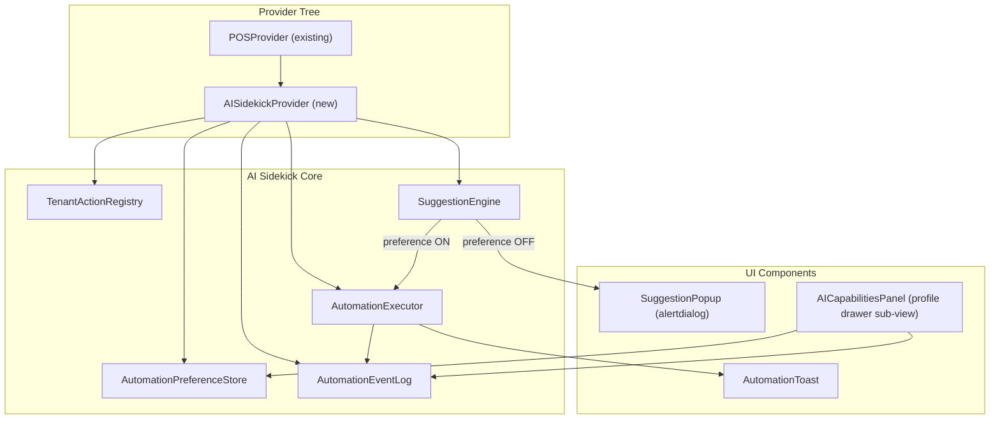
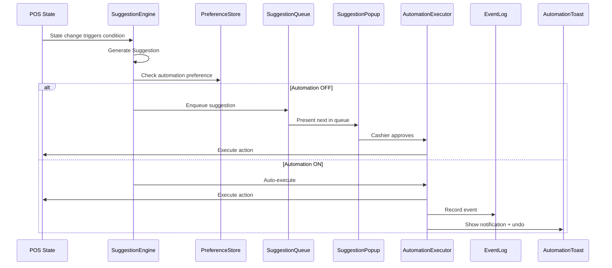

# Design Document: AI Sidekick Automation

## Overview

The AI Sidekick Automation feature adds a progressive trust model to the MNGO
POS terminal. It allows the AI engine to surface contextual action suggestions
to cashiers, who can approve or dismiss them individually. Each suggestion
includes an opt-in toggle that lets the cashier delegate that action type to the
AI for automatic execution in the future. A dedicated AI Capabilities settings
panel in the profile drawer provides full visibility and control over all
automation preferences.

The system is multi-tenant: each tenant defines its own set of available action
types via a `TenantActionRegistry`, and automation preferences are scoped per
cashier per tenant. All automated actions are logged for review and support undo
within a short window.

### Key Design Decisions

1. **Separate Context Provider**: `AISidekickProvider` is a dedicated React
   context nested inside `POSProvider`, keeping AI state decoupled from core POS
   state while still accessing tenant/cashier info.
2. **Local Storage Persistence**: Automation preferences use `localStorage` with
   composite keys (`ai-prefs:{tenantId}:{cashierId}`) for offline-first,
   session-persistent storage.
3. **Queue-Based Suggestion Presentation**: Suggestions are queued and presented
   one at a time to avoid overwhelming the cashier during fast-paced operations.
4. **Toast + Undo Pattern**: Automated actions show non-blocking toast
   notifications with a 5-second undo window, following established POS UI
   patterns.
5. **Trust Level Gating**: High-risk action types require explicit confirmation
   before automation can be enabled, preventing accidental delegation of
   sensitive operations.

## Architecture

The feature introduces a new vertical slice alongside the existing POS
architecture:



### Data Flow



## Components and Interfaces

### 1. TenantActionRegistry

Defines available action types per tenant. Loaded on POS initialization from
tenant configuration.

```typescript
interface ActionTypeDefinition {
  id: string; // e.g. "merge-carts", "apply-promo"
  displayName: string; // Human-readable name
  description: string; // What this action does
  icon: string; // Lucide icon name
  trustLevel: TrustLevel; // "low" | "medium" | "high"
  defaultAutomation: boolean; // Default preference for new cashiers
}

type TrustLevel = "low" | "medium" | "high";

interface TenantActionRegistry {
  tenantId: string;
  actionTypes: ActionTypeDefinition[];
}
```

### 2. AutomationPreferenceStore

Manages per-cashier, per-tenant automation preferences in localStorage.

```typescript
interface AutomationPreference {
  actionTypeId: string;
  enabled: boolean;
  updatedAt: number; // Unix timestamp
}

interface AutomationPreferenceStore {
  /** Load preferences for a cashier+tenant pair */
  load(cashierId: string, tenantId: string): AutomationPreference[];
  /** Save a single preference */
  save(cashierId: string, tenantId: string, pref: AutomationPreference): void;
  /** Bulk disable all preferences */
  disableAll(cashierId: string, tenantId: string): void;
  /** Check if a specific action type is automated */
  isAutomated(actionTypeId: string): boolean;
}
```

localStorage key format: `ai-prefs:{tenantId}:{cashierId}`

### 3. SuggestionEngine

Generates suggestions when triggering conditions are detected in POS state.

```typescript
interface Suggestion {
  id: string; // Unique suggestion instance ID
  actionTypeId: string; // References ActionTypeDefinition.id
  description: string; // What the AI proposes
  reasoning: string; // Why the AI suggests this
  payload: Record<string, unknown>; // Action-specific data
  createdAt: number;
}

interface SuggestionQueue {
  items: Suggestion[];
  current: Suggestion | null;
  enqueue(suggestion: Suggestion): void;
  dequeue(): Suggestion | null;
  clear(): void;
}
```

### 4. AutomationExecutor

Executes approved or automated actions against POS state.

```typescript
interface ExecutionResult {
  success: boolean;
  error?: string;
  undoAction?: () => void; // Reversal function for undo
}

interface AutomationExecutor {
  execute(suggestion: Suggestion): Promise<ExecutionResult>;
  undo(suggestionId: string): Promise<boolean>;
}
```

### 5. AutomationEventLog

Session-scoped log of automated actions.

```typescript
interface AutomationEvent {
  id: string;
  actionTypeId: string;
  summary: string;
  timestamp: number;
  status: "success" | "failed" | "undone";
  payload?: Record<string, unknown>;
  reasoning?: string;
}

interface AutomationEventLog {
  entries: AutomationEvent[];
  add(event: AutomationEvent): void;
  getRecent(count: number): AutomationEvent[];
  clear(): void;
}
```

### 6. AISidekickProvider & useAISidekick Hook

```typescript
interface AISidekickContextValue {
  // Registry
  registry: TenantActionRegistry | null;

  // Suggestion queue
  suggestionQueue: Suggestion[];
  currentSuggestion: Suggestion | null;

  // Preferences
  preferences: Map<string, boolean>;
  isAutomated(actionTypeId: string): boolean;
  togglePreference(actionTypeId: string, enabled: boolean): void;
  disableAllPreferences(): void;
  automatedCount: number;
  totalActionTypes: number;

  // Actions
  approveSuggestion(suggestionId: string): void;
  dismissSuggestion(suggestionId: string): void;
  undoAutomation(eventId: string): void;

  // Event log
  eventLog: AutomationEvent[];
  recentEvents: AutomationEvent[];
}
```

### 7. UI Components

#### SuggestionPopup

- Rendered as a floating dialog with `role="alertdialog"` and `aria-label`
- Focus trapped: auto-focuses approve button on mount
- Keyboard: Tab cycles controls, Enter/Space activates, Escape dismisses
- Contains: description, action type name, reasoning, approve/dismiss buttons,
  opt-in toggle
- Opt-in toggle labeled: "Allow AI Sidekick to handle {actionTypeName}
  automatically"
- High trust-level warning modal on toggle enable

#### AutomationToast

- Non-blocking toast notification at bottom of screen
- Shows: action type name, summary, undo button
- Auto-dismisses after 5 seconds
- Undo button reverses the action if pressed within window

#### AICapabilitiesPanel

- Sub-view in profile drawer, accessed via "AI Capabilities" menu row with
  Sparkles icon
- Groups action types by trust level (Low → Medium → High)
- Each row: icon, display name, description, trust level badge, toggle switch
- Summary count: "X of Y automations active"
- "Disable All Automations" button
- "Recent Activity" section showing last 20 event log entries
- Tapping an entry expands to show full details (payload summary, reasoning)

## Data Models

### ActionTypeDefinition (Tenant Configuration)

| Field               | Type         | Description                              |
| ------------------- | ------------ | ---------------------------------------- |
| `id`                | `string`     | Unique identifier (e.g. `"merge-carts"`) |
| `displayName`       | `string`     | Human-readable label                     |
| `description`       | `string`     | What the action does                     |
| `icon`              | `string`     | Lucide icon name                         |
| `trustLevel`        | `TrustLevel` | `"low"` \| `"medium"` \| `"high"`        |
| `defaultAutomation` | `boolean`    | Default preference for new cashiers      |

### AutomationPreference (localStorage)

| Field          | Type      | Description                          |
| -------------- | --------- | ------------------------------------ |
| `actionTypeId` | `string`  | References `ActionTypeDefinition.id` |
| `enabled`      | `boolean` | Whether automation is active         |
| `updatedAt`    | `number`  | Unix timestamp of last change        |

Storage key: `ai-prefs:{tenantId}:{cashierId}` Value: JSON array of
`AutomationPreference` objects.

### Suggestion (Runtime)

| Field          | Type                      | Description                |
| -------------- | ------------------------- | -------------------------- |
| `id`           | `string`                  | Unique instance ID         |
| `actionTypeId` | `string`                  | Which action type this is  |
| `description`  | `string`                  | What the AI proposes to do |
| `reasoning`    | `string`                  | Why the AI suggests this   |
| `payload`      | `Record<string, unknown>` | Action-specific data       |
| `createdAt`    | `number`                  | Timestamp                  |

### AutomationEvent (Session Memory)

| Field          | Type                                    | Description                    |
| -------------- | --------------------------------------- | ------------------------------ |
| `id`           | `string`                                | Unique event ID                |
| `actionTypeId` | `string`                                | Which action type was executed |
| `summary`      | `string`                                | Human-readable summary         |
| `timestamp`    | `number`                                | When it happened               |
| `status`       | `"success"` \| `"failed"` \| `"undone"` | Outcome                        |
| `payload`      | `Record<string, unknown>`               | Optional action data           |
| `reasoning`    | `string`                                | Optional AI reasoning          |

## Correctness Properties

_A property is a characteristic or behavior that should hold true across all
valid executions of a system — essentially, a formal statement about what the
system should do. Properties serve as the bridge between human-readable
specifications and machine-verifiable correctness guarantees._

### Property 1: Registry schema invariant

_For any_ `ActionTypeDefinition` in a `TenantActionRegistry`, the object shall
have a non-empty `id`, `displayName`, `description`, `icon`, a `trustLevel` that
is one of `"low"`, `"medium"`, or `"high"`, and a boolean `defaultAutomation`
value.

**Validates: Requirements 1.1, 1.4**

### Property 2: Suggestion schema invariant

_For any_ `Suggestion` generated by the `SuggestionEngine`, the object shall
contain a non-empty `id`, a valid `actionTypeId` that exists in the current
`TenantActionRegistry`, a non-empty `description`, a non-empty `reasoning`, and
a `payload` object.

**Validates: Requirements 2.1**

### Property 3: Suggestion routing by automation preference

_For any_ generated `Suggestion`, if the `AutomationPreference` for its
`actionTypeId` is disabled then the suggestion shall be routed to the
`SuggestionQueue` for popup presentation, and if the preference is enabled then
the suggestion shall be routed to the `AutomationExecutor` for automatic
execution.

**Validates: Requirements 2.2, 4.1**

### Property 4: Approve executes and removes suggestion

_For any_ `Suggestion` presented in a `SuggestionPopup`, when the cashier
approves it, the action shall be executed and the suggestion shall be removed
from the queue (queue length decreases by one).

**Validates: Requirements 2.4**

### Property 5: Dismiss discards without execution

_For any_ `Suggestion` presented in a `SuggestionPopup`, when the cashier
dismisses it, the action shall not be executed and the suggestion shall be
removed from the queue.

**Validates: Requirements 2.5**

### Property 6: Queue presents one suggestion at a time

_For any_ list of simultaneously generated suggestions, the `SuggestionQueue`
shall have at most one `current` suggestion at any time, and the total queue
length shall equal the number of enqueued suggestions minus those already
presented.

**Validates: Requirements 2.6**

### Property 7: Preference toggle persistence round-trip

_For any_ `actionTypeId`, `cashierId`, and `tenantId`, toggling an
`AutomationPreference` to a value (enabled or disabled) and then loading
preferences for the same cashier+tenant pair shall return the updated value for
that action type.

**Validates: Requirements 3.2, 5.4, 6.2, 6.3**

### Property 8: High trust-level toggle requires confirmation

_For any_ `ActionTypeDefinition` with `trustLevel` equal to `"high"`, enabling
the automation opt-in toggle shall trigger a warning/confirmation step before
the preference is persisted.

**Validates: Requirements 3.4**

### Property 9: Opt-in toggle independence from approve/dismiss

_For any_ `Suggestion` in a `SuggestionPopup` where the cashier enables the
opt-in toggle, the current suggestion shall still require an explicit approve or
dismiss action — the toggle alone shall not execute or discard the suggestion.

**Validates: Requirements 3.5**

### Property 10: Auto-execution toast contains required information

_For any_ automatically executed `Suggestion`, the resulting toast notification
shall contain the `ActionTypeDefinition.displayName`, a summary of the action,
and an undo control.

**Validates: Requirements 4.2, 4.3**

### Property 11: Undo reverses auto-executed action

_For any_ automatically executed `Suggestion` where the undo action is invoked
within the 5-second window, the system state shall be restored to its
pre-execution state and the corresponding `AutomationEvent` status shall be set
to `"undone"`.

**Validates: Requirements 4.4**

### Property 12: AI Capabilities Panel displays tenant action types grouped by trust level

_For any_ `TenantActionRegistry`, the `AICapabilitiesPanel` shall display
exactly the action types from that registry, grouped into sections by
`trustLevel`, with each action type appearing exactly once.

**Validates: Requirements 1.5, 5.2**

### Property 13: Automation summary count accuracy

_For any_ set of `AutomationPreference` records and a `TenantActionRegistry`,
the displayed summary count shall equal the number of preferences with
`enabled === true` for action types that exist in the current registry, out of
the total number of action types in the registry.

**Validates: Requirements 5.5**

### Property 14: Disable all sets every preference to disabled

_For any_ set of `AutomationPreference` records (with any mix of
enabled/disabled), invoking `disableAll` shall result in all preferences being
set to `enabled === false`.

**Validates: Requirements 5.7**

### Property 15: Preference storage tenant isolation

_For any_ two distinct `tenantId` values and a shared `cashierId`, saving
preferences for one tenant shall not affect the preferences loaded for the other
tenant. The localStorage key shall contain both the `cashierId` and `tenantId`.

**Validates: Requirements 6.1, 6.5, 10.1**

### Property 16: Tenant switch reloads registry and preferences

_For any_ tenant switch from `tenantA` to `tenantB`, after the switch the loaded
`TenantActionRegistry` shall correspond to `tenantB` and the loaded
`AutomationPreference` records shall be scoped to `tenantB`.

**Validates: Requirements 1.2, 10.2**

### Property 17: Stale preferences are ignored

_For any_ set of saved `AutomationPreference` records where some `actionTypeId`
values do not exist in the current `TenantActionRegistry`, those stale
preferences shall not appear in the loaded preferences and shall not influence
suggestion routing.

**Validates: Requirements 10.4**

### Property 18: Event log records all auto-executed actions

_For any_ automatically executed `Suggestion`, the `AutomationEventLog` shall
contain an entry with the matching `actionTypeId`, a non-empty `summary`, a
valid `timestamp`, and a `status` of `"success"` or `"failed"`.

**Validates: Requirements 7.1**

### Property 19: Recent activity displays at most 20 entries

_For any_ `AutomationEventLog` with N entries, the "Recent Activity" section
shall display exactly `min(N, 20)` entries, ordered by most recent first.

**Validates: Requirements 7.2**

### Property 20: Event log cleared on logout

_For any_ `AutomationEventLog` with entries, after a logout event the log shall
contain zero entries.

**Validates: Requirements 7.5**

### Property 21: Suggestion popup focus management

_For any_ `SuggestionPopup` that becomes visible, the approve button shall
receive focus on mount.

**Validates: Requirements 8.1**

### Property 22: Escape key dismisses suggestion without execution

_For any_ visible `SuggestionPopup`, pressing the Escape key shall dismiss the
suggestion without executing the action, equivalent to pressing the dismiss
button.

**Validates: Requirements 8.3**

### Property 23: Suggestion popup ARIA attributes

_For any_ `SuggestionPopup`, the root element shall have `role="alertdialog"`
and an `aria-label` that includes the action type display name. The opt-in
toggle shall have an accessible label that includes the
`ActionTypeDefinition.displayName`.

**Validates: Requirements 8.4, 8.5**

## Error Handling

### Registry Loading Failures

- If the `TenantActionRegistry` cannot be loaded (network error, malformed
  data), the `AISidekickProvider` falls back to an empty registry. No
  suggestions are generated, and the AI Capabilities Panel shows an empty state
  with a retry option.

### Preference Store Failures

- If `localStorage` is unavailable or corrupted, the `AutomationPreferenceStore`
  falls back to the `defaultAutomation` values from the `TenantActionRegistry`.
  A console warning is logged.
- If parsing stored JSON fails, the store treats it as empty and re-initializes
  from defaults.

### Auto-Execution Failures

- If `AutomationExecutor.execute()` throws or returns `{ success: false }`, the
  suggestion is re-routed to the `SuggestionQueue` for manual presentation via
  `SuggestionPopup`, with the error message included as additional context.
- The `AutomationEventLog` records the event with `status: "failed"`.

### Undo Failures

- If the undo action fails (e.g., the reversed state is no longer valid), a
  toast error is shown and the event log entry remains as `"success"` (not
  changed to `"undone"`).

### Stale Data

- Preferences referencing action type IDs not in the current registry are
  silently ignored during load. They are not deleted from storage (the tenant
  config may be temporarily incomplete).

### Context Misuse

- `useAISidekick()` called outside `AISidekickProvider` throws:
  `"useAISidekick must be used within <AISidekickProvider>"`.

## Testing Strategy

### Property-Based Testing

Use **fast-check** as the property-based testing library (already compatible
with the Vite + React Testing Library setup).

Each correctness property from the design document maps to a single
property-based test. Tests should run a minimum of 100 iterations each.

Each test must be tagged with a comment referencing the design property:

```
// Feature: ai-sidekick-automation, Property {N}: {property title}
```

Key generators needed:

- `arbitraryActionType()` — generates random `ActionTypeDefinition` objects with
  valid trust levels
- `arbitraryRegistry(tenantId)` — generates a `TenantActionRegistry` with 1–20
  random action types
- `arbitrarySuggestion(registry)` — generates a `Suggestion` referencing a valid
  action type from the registry
- `arbitraryPreferences(registry)` — generates a set of `AutomationPreference`
  records for a registry
- `arbitraryCashierId()` / `arbitraryTenantId()` — generate random identifier
  strings

### Unit Testing

Unit tests complement property tests for specific examples, edge cases, and
integration points:

- **Edge cases**: Empty registry fallback, localStorage unavailable, stale
  preference cleanup, auto-execution failure fallback
- **UI examples**: Popup renders with correct ARIA attributes, keyboard
  navigation order (Tab cycle), toast auto-dismiss timing, profile drawer menu
  row presence
- **Integration**: `AISidekickProvider` nested inside `POSProvider` can access
  tenant info, `useAISidekick` throws outside provider, preference changes
  propagate to suggestion routing in real-time
- **Accessibility**: Focus trap in popup, screen reader announcements,
  keyboard-only operation

### Test Organization

```
apps/vite-template/src/
├── contexts/
│   └── ai-sidekick/
│       ├── __tests__/
│       │   ├── preference-store.property.test.ts   # Properties 7, 14, 15, 17
│       │   ├── suggestion-engine.property.test.ts   # Properties 2, 3, 6
│       │   ├── automation-executor.property.test.ts  # Properties 11, 18
│       │   ├── event-log.property.test.ts            # Properties 19, 20
│       │   ├── registry.property.test.ts             # Properties 1, 12, 16
│       │   └── integration.test.tsx                   # Unit + edge case tests
│       └── ...
├── components/
│   └── ai-sidekick/
│       └── __tests__/
│           ├── suggestion-popup.property.test.tsx    # Properties 4, 5, 9, 21, 22, 23
│           ├── automation-toast.property.test.tsx     # Property 10
│           ├── capabilities-panel.property.test.tsx   # Properties 8, 13
│           └── accessibility.test.tsx                 # Unit tests for a11y
```
