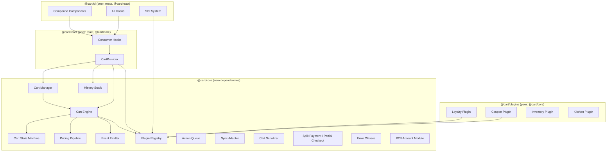

# Design Document: Cart Package Refactor

## Overview

This design covers the refactoring of the `@cart/*` package suite (`@cart/core`,
`@cart/react`, `@cart/ui`, `@cart/plugins`) into a production-grade, publishable
npm package suite for enterprise POS systems. The refactor addresses critical
bugs in the current implementation — missing state machine enforcement,
unguarded transitions, and absent event-driven reactivity — while introducing
new capabilities: formal finite state machine, multi-cart session management,
undo/redo history, offline action queue, split payment, partial checkout, B2B
account support, real-time sync, and a plugin architecture with loyalty and
coupon plugins.

The existing codebase already has the correct package structure and many of the
core modules (engine, pipeline, serialization, manager, history, queue, sync,
plugins, payment, slots). The refactor focuses on:

1. Adding a formal state machine with enforced transition guards to the engine
   (currently missing — the engine has no status checks before mutations)
2. Adding an event emitter system for reactive state change notifications
3. Extending the `Customer` type with `tier`, `loyaltyPoints`, and `preferences`
   fields
4. Adding B2B account support with credit limits and contract pricing
5. Upgrading error classes to extend a base `CartError` with a `code` property
6. Enhancing the coupon plugin to support synchronous validation, discount
   application, and removal
7. Enhancing the loyalty plugin to compute earned points via `afterCalculate`
   hooks
8. Adding `splitCart` to the cart manager
9. Ensuring all public APIs have multiline JSDoc documentation

## Architecture

The system follows a layered, framework-agnostic architecture with React
bindings as a separate package. All state is immutable — every mutation returns
a new object.



### Key Architectural Decisions

1. **Immutable state**: Every engine function returns a new `Cart` object. This
   enables undo/redo via snapshot stacking and simplifies sync conflict
   resolution.

2. **State machine as a guard layer**: The state machine is implemented as a
   validation layer inside the engine functions, not as a separate orchestrator.
   Each mutation function checks the current cart status against the allowed
   transition/operation map before proceeding. This keeps the API surface
   unchanged while adding enforcement.

3. **Event emitter as a side-channel**: The event emitter is synchronous and
   fires after each successful mutation. It does not affect the return value of
   engine functions — it is a notification mechanism for UI and external
   systems.

4. **Plugin hooks are synchronous**: Plugin lifecycle hooks are invoked
   synchronously in registration order. Async operations (e.g., coupon
   validation against a remote API) are handled by the plugin internally via
   fire-and-forget patterns or by exposing async methods on the plugin instance.

5. **B2B as an optional overlay**: B2B account support is implemented as an
   optional module that can be loaded into the cart via `loadB2BAccount`. It
   does not change the core `Cart` type — it stores account data in
   `cart.metadata.b2bAccount` and uses `beforeAddItem` hooks for credit limit
   enforcement.

## Components and Interfaces

### 1. Cart State Machine (`@cart/core`)

The state machine enforces valid lifecycle transitions. It is not a standalone
class — it is a set of constants and guard functions used by the engine.

```typescript
/**
 * Map of allowed state transitions.
 * Key is the current status, value is the set of valid target statuses.
 */
const TRANSITION_MAP: Record<CartStatus, Set<CartStatus>> = {
  active: new Set(["held", "locked", "completed"]),
  held: new Set(["active"]),
  locked: new Set(["active", "completed"]),
  completed: new Set(),
};

/**
 * Validate that a state transition is allowed.
 *
 * @param from - The current cart status.
 * @param to - The requested target status.
 * @throws {InvalidTransitionError} If the transition is not in the allowed map.
 */
function validateTransition(from: CartStatus, to: CartStatus): void;

/**
 * Guard that rejects all item mutations when the cart is locked.
 *
 * @param cart - The cart to check.
 * @throws {CartLockedError} If cart.status is "locked".
 */
function assertNotLocked(cart: Cart): void;

/**
 * Guard that rejects all operations when the cart is completed.
 *
 * @param cart - The cart to check.
 * @throws {CartCompletedError} If cart.status is "completed".
 */
function assertNotCompleted(cart: Cart): void;
```

/\*\*

- Transition the cart to a new status.
-
- @param cart - The current cart.
- @param to - The target status.
- @returns A new Cart with the updated status and updatedAt timestamp.
- @throws {InvalidTransitionError} If the transition is disallowed.
- @throws {CartCompletedError} If the cart is already completed. \*/ function
  transitionStatus(cart: Cart, to: CartStatus): Cart;

````

### 2. Event Emitter (`@cart/core`)

```typescript
/**
 * Named event types emitted by the cart engine.
 */
type CartEventType =
  | "item:added"
  | "item:removed"
  | "item:updated"
  | "status:changed"
  | "customer:changed"
  | "discount:changed"
  | "pricing:recalculated"
  | "*";

/**
 * Payload map for each event type.
 */
interface CartEventPayloads {
  "item:added": { item: CartItem };
  "item:removed": { itemId: string };
  "item:updated": { itemId: string; changes: Partial<CartItemUpdate> };
  "status:changed": { previous: CartStatus; current: CartStatus };
  "customer:changed": { previous?: Customer; current?: Customer };
  "discount:changed": { discounts: DiscountDescriptor[] };
  "pricing:recalculated": { pricing: PricingSnapshot };
  "*": { type: CartEventType; payload: unknown };
}

/**
 * Event listener callback type.
 */
type CartEventListener<T extends CartEventType> =
  (payload: CartEventPayloads[T]) => void;

/**
 * The event emitter interface.
 */
interface CartEventEmitter {
  /**
   * Subscribe to a named event channel.
   *
   * @param event - The event type to listen for, or "*" for all events.
   * @param listener - The callback to invoke when the event fires.
   * @returns An unsubscribe function.
   */
  on<T extends CartEventType>(
    event: T,
    listener: CartEventListener<T>,
  ): () => void;

  /**
   * Emit an event to all registered listeners.
   * Listeners are invoked synchronously in subscription order.
   * Wildcard subscribers receive all events.
   *
   * @param event - The event type to emit.
   * @param payload - The event payload.
   */
  emit<T extends CartEventType>(
    event: T,
    payload: CartEventPayloads[T],
  ): void;
}

/**
 * Create a new event emitter instance.
 *
 * @returns A CartEventEmitter with no subscribers.
 */
function createEventEmitter(): CartEventEmitter;
````

### 3. Cart Engine (enhanced) (`@cart/core`)

The existing engine functions (`addItem`, `updateItem`, `removeItem`,
`applyDiscount`, `applyCoupon`, `removeCoupon`, `attachCustomer`,
`detachCustomer`, `clearCart`) are enhanced with:

- State machine guards at the top of each function
- Event emission after each successful mutation
- Plugin hook invocation at lifecycle points

```typescript
/**
 * Add an item to the cart.
 * Rejects if cart is locked (CartLockedError) or completed (CartCompletedError).
 * Invokes beforeAddItem/afterAddItem plugin hooks.
 * Emits "item:added" and "pricing:recalculated" events.
 *
 * @param cart - The current cart state (not mutated).
 * @param item - The new item to add.
 * @param config - The resolved configuration.
 * @param context - Optional engine context with emitter and registry.
 * @returns A new Cart with the item added and pricing recalculated.
 * @throws {CartLockedError} If the cart status is "locked".
 * @throws {CartCompletedError} If the cart status is "completed".
 */
function addItem(
  cart: Cart,
  item: NewCartItem,
  config: CartConfig,
  context?: EngineContext,
): Cart;

/**
 * Clear all items from the cart.
 * Rejects if cart is locked (CartLockedError) or completed (CartCompletedError).
 *
 * @param cart - The current cart state.
 * @param config - The resolved configuration.
 * @param context - Optional engine context.
 * @returns A new Cart with empty items and zeroed pricing.
 * @throws {CartLockedError} If the cart status is "locked".
 * @throws {CartCompletedError} If the cart status is "completed".
 */
function clearCart(
  cart: Cart,
  config: CartConfig,
  context?: EngineContext,
): Cart;

/**
 * Lock the cart for checkout.
 * Only allowed from "active" status.
 *
 * @param cart - The current cart state.
 * @returns A new Cart with status "locked".
 * @throws {InvalidTransitionError} If current status is not "active".
 */
function lockCart(cart: Cart): Cart;

/**
 * Unlock the cart back to active.
 * Only allowed from "locked" status.
 *
 * @param cart - The current cart state.
 * @returns A new Cart with status "active".
 * @throws {InvalidTransitionError} If current status is not "locked".
 */
function unlockCart(cart: Cart): Cart;

/**
 * Complete the cart (checkout finished).
 * Allowed from "active" or "locked" status.
 *
 * @param cart - The current cart state.
 * @returns A new Cart with status "completed".
 * @throws {InvalidTransitionError} If transition is not allowed.
 * @throws {CartCompletedError} If already completed.
 */
function completeCart(cart: Cart): Cart;
```

### 4. Engine Context

```typescript
/**
 * Optional context passed to engine functions to enable
 * event emission and plugin hook invocation.
 */
interface EngineContext {
  /**
   * The event emitter for broadcasting state changes.
   */
  emitter?: CartEventEmitter;

  /**
   * The plugin registry for invoking lifecycle hooks.
   */
  registry?: PluginRegistry;
}
```

### 5. Cart Manager (enhanced) (`@cart/core`)

```typescript
/**
 * Split items from a cart into a new cart.
 *
 * @param state - The current manager state.
 * @param cartId - The source cart ID.
 * @param itemIds - The item IDs to move to the new cart.
 * @param channel - The channel for the new cart.
 * @param config - Optional config overrides.
 * @returns Updated manager state with the new cart set as active.
 * @throws {CartNotFoundError} If the source cart does not exist.
 */
function splitCart(
  state: CartManagerState,
  cartId: string,
  itemIds: string[],
  channel: Channel,
  config?: Partial<CartConfig>,
): CartManagerState;

/**
 * Duplicate a cart with a new ID.
 *
 * @param state - The current manager state.
 * @param cartId - The cart ID to duplicate.
 * @param channel - The channel for the new cart.
 * @param config - Optional config overrides.
 * @returns Updated manager state with the duplicate set as active.
 * @throws {CartNotFoundError} If the source cart does not exist.
 */
function duplicateCart(
  state: CartManagerState,
  cartId: string,
  channel: Channel,
  config?: Partial<CartConfig>,
): CartManagerState;
```

### 6. Plugin System (`@cart/core`)

```typescript
/**
 * Lifecycle hooks that plugins can implement.
 */
interface PluginHooks {
  /**
   * Called before an item is added to the cart.
   * Can throw to reject the addition.
   *
   * @param cart - The current cart state.
   * @param item - The item about to be added.
   * @param context - The engine context.
   */
  beforeAddItem?: (
    cart: Cart,
    item: NewCartItem,
    context: CartEngineContext,
  ) => void;

  /**
   * Called after an item is added to the cart.
   *
   * @param cart - The updated cart state.
   * @param item - The added item.
   * @param context - The engine context.
   */
  afterAddItem?: (
    cart: Cart,
    item: CartItem,
    context: CartEngineContext,
  ) => void;

  /**
   * Called before an item is removed.
   *
   * @param cart - The current cart state.
   * @param itemId - The ID of the item to remove.
   * @param context - The engine context.
   */
  beforeRemoveItem?: (
    cart: Cart,
    itemId: string,
    context: CartEngineContext,
  ) => void;

  /**
   * Called after an item is removed.
   *
   * @param cart - The updated cart state.
   * @param itemId - The removed item ID.
   * @param context - The engine context.
   */
  afterRemoveItem?: (
    cart: Cart,
    itemId: string,
    context: CartEngineContext,
  ) => void;

  /**
   * Called before pricing calculation.
   *
   * @param cart - The current cart state.
   * @param context - The engine context.
   */
  beforeCalculate?: (cart: Cart, context: CartEngineContext) => void;

  /**
   * Called after pricing calculation.
   *
   * @param cart - The updated cart state with new pricing.
   * @param context - The engine context.
   */
  afterCalculate?: (cart: Cart, context: CartEngineContext) => void;

  /**
   * Called before a status change.
   *
   * @param cart - The current cart state.
   * @param newStatus - The target status.
   * @param context - The engine context.
   */
  beforeStatusChange?: (
    cart: Cart,
    newStatus: CartStatus,
    context: CartEngineContext,
  ) => void;

  /**
   * Called after a status change.
   *
   * @param cart - The updated cart state.
   * @param previousStatus - The previous status.
   * @param context - The engine context.
   */
  afterStatusChange?: (
    cart: Cart,
    previousStatus: CartStatus,
    context: CartEngineContext,
  ) => void;
}
```

### 7. B2B Account Module (`@cart/core`)

```typescript
/**
 * B2B account data structure.
 */
interface B2BAccount {
  /** Unique account identifier. */
  id: string;

  /** Company display name. */
  companyName: string;

  /** Reference to the active contract. */
  contractId: string;

  /** Maximum credit allowed for this account. */
  creditLimit: number;

  /** Credit already consumed. */
  creditUsed: number;

  /** Product IDs this account is allowed to purchase. */
  assignedProducts: string[];

  /** Product ID to override price mapping. */
  pricingOverrides: Record<string, number>;

  /** Arbitrary metadata. */
  metadata: Record<string, unknown>;
}

/**
 * Load a B2B account into the cart.
 * Stores the account in cart.metadata.b2bAccount and
 * filters available products to assignedProducts.
 *
 * @param cart - The current cart state.
 * @param account - The B2B account to load.
 * @param config - The resolved configuration.
 * @returns A new Cart with B2B account loaded and pricing recalculated.
 */
function loadB2BAccount(
  cart: Cart,
  account: B2BAccount,
  config: CartConfig,
): Cart;

/**
 * Check if adding an item would exceed the B2B credit limit.
 *
 * @param cart - The current cart state.
 * @param itemTotal - The total cost of the item to add.
 * @throws {CreditLimitExceededError} If the addition would exceed the limit.
 */
function assertCreditLimit(cart: Cart, itemTotal: number): void;
```

### 8. Loyalty Plugin (`@cart/plugins`)

```typescript
/**
 * Configuration for the loyalty plugin.
 */
interface LoyaltyPluginConfig {
  /** Points earned per currency unit of subtotal. */
  pointsPerUnit: number;

  /** Monetary value of one redeemed point. */
  redemptionRate: number;
}

/**
 * Create a loyalty plugin that earns and redeems points.
 * Registers an afterCalculate hook that computes earned points
 * and a pricing step that applies redemption discounts.
 *
 * @param config - The loyalty plugin configuration.
 * @returns A CartPlugin ready for registration.
 */
function createLoyaltyPlugin(config: LoyaltyPluginConfig): CartPlugin;
```

### 9. Coupon Plugin (`@cart/plugins`)

```typescript
/**
 * Result of coupon validation.
 */
interface CouponResult {
  /** Whether the coupon code is valid. */
  valid: boolean;

  /** Discount amount if valid. */
  discount: number;

  /** Human-readable message. */
  message?: string;
}

/**
 * Configuration for the coupon plugin.
 */
interface CouponPluginConfig {
  /**
   * Validation function called when a coupon is applied.
   *
   * @param code - The coupon code to validate.
   * @returns The validation result.
   */
  validateFn: (code: string) => Promise<CouponResult>;
}

/**
 * Create a coupon plugin that validates and applies promotional codes.
 * On valid coupon: adds a discount descriptor and triggers recalculation.
 * On invalid coupon: rejects with the validation message.
 * On removal: removes the discount descriptor and triggers recalculation.
 *
 * @param config - The coupon plugin configuration.
 * @returns A CartPlugin ready for registration.
 */
function createCouponPlugin(config: CouponPluginConfig): CartPlugin;
```

### 10. React Bindings (`@cart/react`)

```typescript
/**
 * Props for the CartProvider component.
 */
interface CartProviderProps {
  /** The sales channel. Defaults to "pos". */
  channel?: Channel;

  /** Optional config overrides merged on top of the channel preset. */
  config?: Partial<CartConfig>;

  /** Optional array of plugins to register. */
  plugins?: CartPlugin[];

  /** Optional sync adapter for real-time sync. */
  syncAdapter?: SyncAdapter;

  /** React children. */
  children: ReactNode;
}

/**
 * Root provider that initializes the cart engine subsystems.
 * Initializes: CartConfig, PricingPipeline, PluginRegistry,
 * CartManager, HistoryStack, EventEmitter.
 * Cleans up all subscriptions on unmount.
 *
 * @param props - The provider props.
 * @returns A React element wrapping children in cart context.
 */
function CartProvider(props: CartProviderProps): ReactElement;

/**
 * Hook returning the full active cart state.
 *
 * @returns The current Cart object.
 * @throws If called outside CartProvider.
 */
function useCart(): Cart;

/**
 * Hook returning only the items array.
 * Re-renders only when items change.
 *
 * @returns The cart items array.
 */
function useCartItems(): CartItem[];

/**
 * Hook returning only the pricing snapshot.
 * Re-renders only when pricing changes.
 *
 * @returns The current PricingSnapshot.
 */
function useCartPricing(): PricingSnapshot;

/**
 * Hook returning cart mutation functions.
 *
 * @returns An object with addItem, updateItem, removeItem,
 *          applyDiscount, applyCoupon, removeCoupon,
 *          attachCustomer, detachCustomer, clearCart,
 *          lockCart, unlockCart, completeCart, undo, redo.
 */
function useCartActions(): CartActions;

/**
 * Hook returning multi-cart session management functions.
 *
 * @returns An object with createCart, switchCart, holdCart,
 *          resumeCart, mergeCarts, splitCart, duplicateCart,
 *          deleteCart, expireStaleCarts.
 */
function useCartManager(): CartManagerActions;
```

### 11. UI Compound Components (`@cart/ui`)

```typescript
/**
 * Cart compound component namespace.
 * All sub-components are accessed via dot notation: Cart.Root, Cart.Header, etc.
 */
const Cart: {
  Root: FC<CartRootProps>;
  Header: FC<CartHeaderProps>;
  Items: FC<CartItemsProps>;
  Item: FC<CartItemProps> & {
    Image: FC<ItemImageProps>;
    Info: FC;
    Modifiers: FC<ItemModifiersProps>;
    Quantity: FC;
    Price: FC;
    Actions: FC;
  };
  Summary: FC<CartSummaryProps>;
  Footer: FC<CartFooterProps>;
  Modifiers: FC<CartModifiersProps>;
  Messages: FC<CartMessagesProps>;
  Customer: FC<CartCustomerProps>;
  Coupon: FC<CartCouponProps>;
  HoldBanner: FC<CartHoldBannerProps>;
  Empty: FC<CartEmptyProps>;
  SessionSelector: FC<CartSessionSelectorProps>;
};

/**
 * CartSlot renders content registered at a named extension point.
 *
 * @param props.name - The slot name to render.
 * @returns The registered content or null.
 */
function CartSlot(props: { name: string }): ReactElement | null;
```

## Data Models

### Cart (enhanced)

```typescript
/**
 * Lifecycle status of a cart.
 * Governed by the Cart State Machine transition map.
 */
type CartStatus = "active" | "held" | "locked" | "completed";

/**
 * Sales channel identifier.
 * Determines default configuration presets.
 */
type Channel = "pos" | "ecommerce" | "food" | "custom";

/**
 * The top-level cart aggregate.
 * Immutable — every mutation returns a new instance.
 */
interface Cart {
  /** Unique cart identifier (UUID). */
  id: string;

  /** The sales channel this cart belongs to. */
  channel: Channel;

  /** Ordered list of items in the cart. */
  items: CartItem[];

  /** ISO 4217 currency code. */
  currency: string;

  /** Aggregate pricing snapshot. */
  pricing: PricingSnapshot;

  /** Optional customer associated with this cart. */
  customer?: Customer;

  /** Discounts applied to this cart. */
  discounts: DiscountDescriptor[];

  /** Arbitrary key-value metadata. */
  metadata: Record<string, unknown>;

  /** Current lifecycle status. */
  status: CartStatus;

  /** Unix epoch ms when created. */
  createdAt: number;

  /** Unix epoch ms of last mutation. */
  updatedAt: number;
}
```

### CartItem

```typescript
/**
 * A fully resolved line item within a Cart.
 */
interface CartItem {
  /** Unique identifier generated by the engine. */
  id: string;

  /** Reference to the external product catalog entry. */
  productId: string;

  /** Human-readable product name. */
  name: string;

  /** Stock-keeping unit code. */
  sku: string;

  /** Number of units in the cart. */
  quantity: number;

  /** Price per single unit before modifiers and discounts. */
  unitPrice: number;

  /** Modifier groups attached to this item. */
  modifiers: Modifier[];

  /** Free-text notes for this item. */
  notes: string;

  /** Computed pricing breakdown for this line item. */
  pricing: ItemPricing;

  /** Arbitrary metadata. */
  metadata: Record<string, unknown>;
}
```

### Customer (enhanced)

```typescript
/**
 * Customer information associated with a cart.
 * Enhanced with tier, loyaltyPoints, and preferences
 * to support loyalty and personalization features.
 */
interface Customer {
  /** Unique customer identifier. */
  id: string;

  /** Customer display name. */
  name: string;

  /** Customer email address. */
  email?: string;

  /** Customer phone number. */
  phone?: string;

  /** Membership tier (e.g., "gold", "silver", "bronze"). */
  tier?: string;

  /** Current loyalty points balance. */
  loyaltyPoints?: number;

  /** Customer preferences for personalization. */
  preferences?: Record<string, unknown>;

  /** Arbitrary metadata. */
  metadata?: Record<string, unknown>;
}
```

### B2BAccount

```typescript
/**
 * Business-to-business account with contract pricing,
 * credit limits, and assigned product catalogs.
 */
interface B2BAccount {
  /** Unique account identifier. */
  id: string;

  /** Company display name. */
  companyName: string;

  /** Reference to the active contract. */
  contractId: string;

  /** Maximum credit allowed. */
  creditLimit: number;

  /** Credit already consumed. */
  creditUsed: number;

  /** Product IDs this account can purchase. */
  assignedProducts: string[];

  /** Product ID → override price mapping. */
  pricingOverrides: Record<string, number>;

  /** Arbitrary metadata. */
  metadata: Record<string, unknown>;
}
```

### PricingSnapshot

```typescript
/**
 * Aggregate pricing breakdown for a cart.
 * Produced by the pricing pipeline after each mutation.
 */
interface PricingSnapshot {
  /** Sum of all item line totals before discounts. */
  subtotal: number;

  /** Total discount amount applied. */
  discount: number;

  /** Total tax amount. */
  tax: number;

  /** Service charge amount. */
  service: number;

  /** Final total: subtotal - discount + tax + service (after rounding). */
  total: number;
}
```

### CartConfig

```typescript
/**
 * Configuration governing cart behavior for a session.
 */
interface CartConfig {
  /** ISO 4217 currency code. */
  currency: string;

  /** Tax mode: "exclusive" (added on top) or "inclusive" (included in price). */
  taxMode: "inclusive" | "exclusive";

  /** Tax rate as decimal fraction (e.g. 0.05 for 5%). */
  taxRate: number;

  /** Whether negative quantities are allowed. */
  allowNegativeQty: boolean;

  /** Rounding strategy: "floor", "ceil", or "round". */
  rounding: "floor" | "ceil" | "round";

  /** Feature flags. */
  features: CartFeatures;
}

/**
 * Feature flags for optional cart capabilities.
 */
interface CartFeatures {
  /** Whether item modifiers are supported. */
  modifiers: boolean;

  /** Whether discounts are enabled. */
  discounts: boolean;

  /** Whether free-text notes are supported. */
  notes: boolean;

  /** Whether split payment is enabled. */
  splitPayment: boolean;
}
```

### Error Classes

```typescript
/**
 * Base error class for all cart errors.
 * Provides a machine-readable `code` property.
 */
class CartError extends Error {
  /** Machine-readable error identifier. */
  readonly code: string;

  /**
   * @param code - Machine-readable error code.
   * @param message - Human-readable error message.
   */
  constructor(code: string, message: string);
}

/**
 * Thrown when a disallowed state transition is requested.
 */
class InvalidTransitionError extends CartError {
  /**
   * @param from - The current cart status.
   * @param to - The requested target status.
   */
  constructor(from: CartStatus, to: CartStatus);
}

/**
 * Thrown when a mutation is attempted on a locked cart.
 */
class CartLockedError extends CartError {
  /**
   * @param cartId - The locked cart's ID.
   * @param operation - The rejected operation name.
   */
  constructor(cartId: string, operation: string);
}

/**
 * Thrown when any operation is attempted on a completed cart.
 */
class CartCompletedError extends CartError {
  /**
   * @param cartId - The completed cart's ID.
   * @param operation - The rejected operation name.
   */
  constructor(cartId: string, operation: string);
}

/**
 * Thrown when a cart ID is not found in the manager.
 */
class CartNotFoundError extends CartError {
  /**
   * @param cartId - The missing cart ID.
   */
  constructor(cartId: string);
}

/**
 * Thrown when deserialization receives malformed JSON.
 */
class DeserializationError extends CartError {
  /**
   * @param detail - The underlying parse error detail.
   */
  constructor(detail: string);
}

/**
 * Thrown when deserialized JSON does not conform to the Cart schema.
 */
class SchemaValidationError extends CartError {
  /**
   * @param violations - List of specific schema violations.
   */
  constructor(violations: string[]);
}

/**
 * Thrown when split payment is disabled in config.
 */
class SplitPaymentDisabledError extends CartError {
  constructor();
}

/**
 * Thrown when split payment allocations don't sum to the cart total.
 */
class SplitPaymentMismatchError extends CartError {
  /**
   * @param expected - The cart total.
   * @param actual - The sum of allocations.
   */
  constructor(expected: number, actual: number);
}

/**
 * Thrown when partial checkout references a non-existent item.
 */
class PartialCheckoutError extends CartError {
  /**
   * @param itemIds - The invalid item IDs.
   */
  constructor(itemIds: string[]);
}

/**
 * Thrown when a duplicate plugin ID is registered.
 */
class DuplicatePluginError extends CartError {
  /**
   * @param pluginId - The duplicate plugin ID.
   */
  constructor(pluginId: string);
}

/**
 * Thrown when a B2B item addition would exceed the credit limit.
 */
class CreditLimitExceededError extends CartError {
  /**
   * @param currentBalance - The remaining credit.
   * @param attemptedAmount - The cost of the attempted addition.
   */
  constructor(currentBalance: number, attemptedAmount: number);
}
```

### HistoryState

```typescript
/**
 * Undo/redo history state.
 * Maintains bounded stacks of cart snapshots.
 */
interface HistoryState {
  /** Stack of previous cart states (most recent last). */
  undoStack: Cart[];

  /** Stack of undone cart states (most recent last). */
  redoStack: Cart[];

  /** Maximum number of snapshots to retain. */
  maxDepth: number;
}
```

### ActionQueueState

```typescript
/**
 * A queued cart mutation action.
 */
interface QueuedAction {
  /** Unique action identifier. */
  id: string;

  /** The action type (e.g., "addItem", "removeItem"). */
  type: string;

  /** The action payload. */
  payload: unknown;

  /** Unix epoch ms when the action was enqueued. */
  timestamp: number;

  /** Number of failed replay attempts. */
  retryCount: number;
}

/**
 * Offline action queue state.
 */
interface ActionQueueState {
  /** Pending actions in FIFO order. */
  queue: QueuedAction[];

  /** Actions that exceeded max retries. */
  deadLetter: QueuedAction[];
}
```

### SyncEvent

```typescript
/**
 * A synchronization event for real-time cart sync.
 */
interface SyncEvent {
  /** The cart ID this event applies to. */
  cartId: string;

  /** The change delta. */
  delta: SyncDelta;

  /** Unix epoch ms timestamp for conflict resolution. */
  timestamp: number;

  /** The device ID that originated this event. */
  deviceId: string;
}

/**
 * Sync adapter interface for pluggable transport.
 */
interface SyncAdapter {
  /**
   * Send a sync event to remote peers.
   *
   * @param event - The sync event to send.
   */
  send(event: SyncEvent): Promise<void>;

  /**
   * Register a handler for incoming sync events.
   *
   * @param handler - Callback invoked on each received event.
   */
  onReceive(handler: (event: SyncEvent) => void): void;

  /**
   * Disconnect and clean up resources.
   */
  disconnect(): void;
}
```
