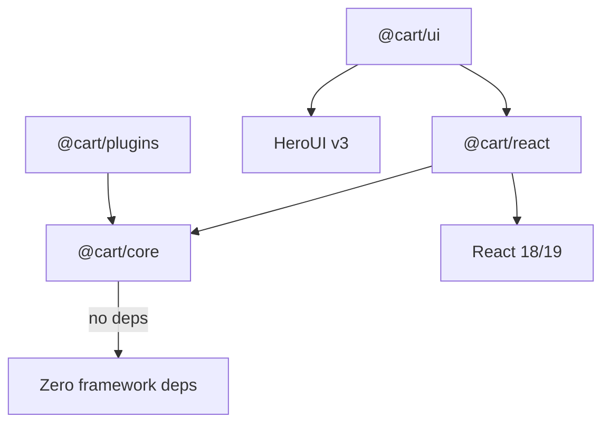
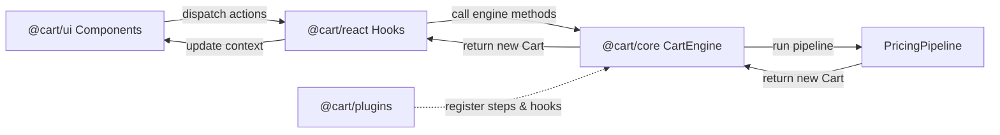
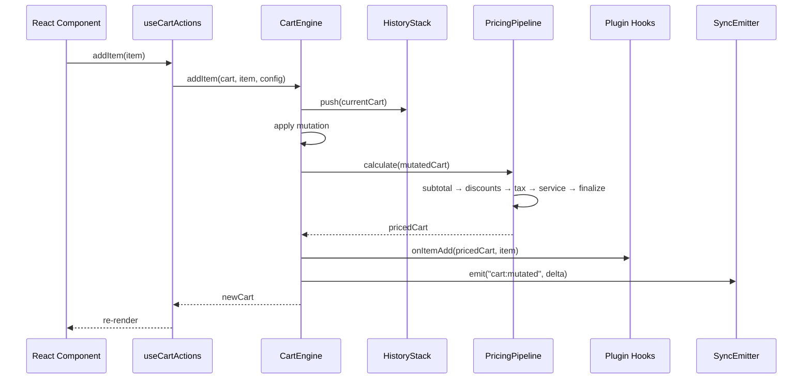
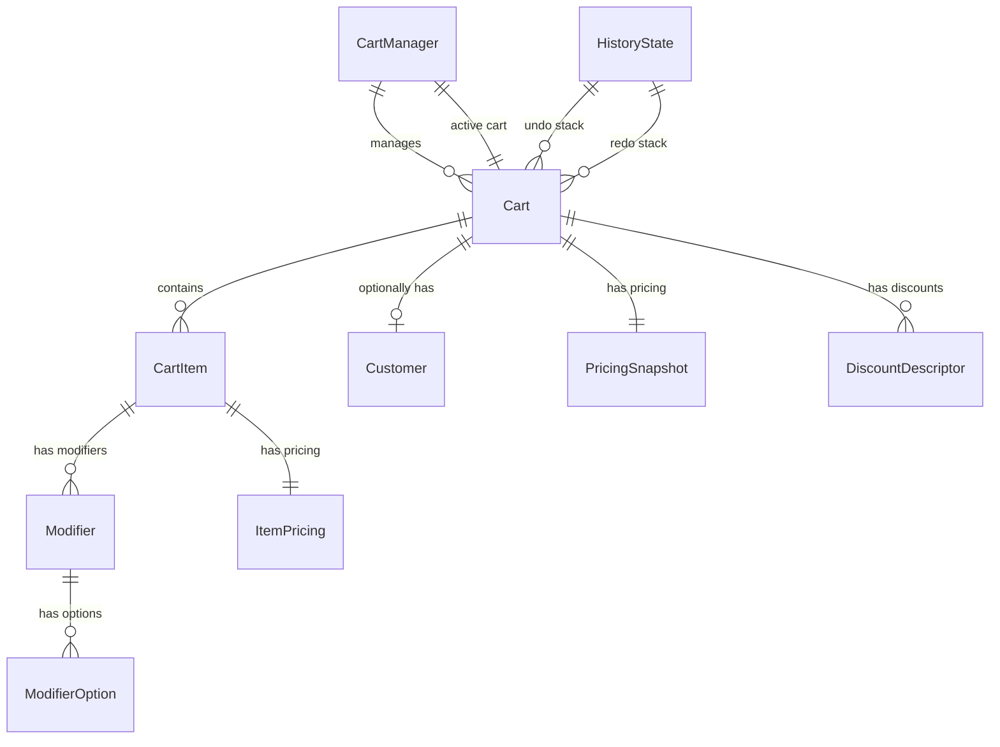
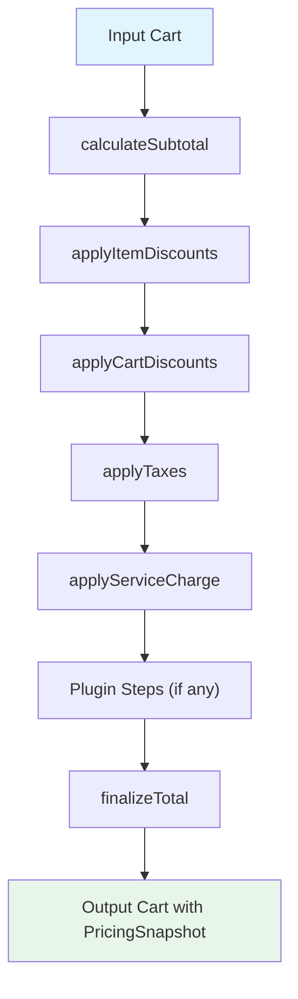

# Design Document: Composable Cart Engine

## Overview

The Composable Cart Engine is a headless, framework-agnostic transaction engine
distributed across four packages within the monorepo under `packages/cart/`. The
architecture follows a layered design where a pure-logic core (`@cart/core`)
handles all state mutations and pricing calculations, a React binding layer
(`@cart/react`) provides hooks and context, a UI layer (`@cart/ui`) offers
composable compound components built on HeroUI, and an optional plugin package
(`@cart/plugins`) ships pre-built extensions.

All cart state is immutable — every mutation returns a new `Cart` object.
Pricing is computed through a composable pipeline of pure functions, making the
system deterministic and testable. The engine supports multi-cart sessions,
undo/redo via a history stack, offline operation with an action queue, split
payments, partial checkout, and real-time sync via event-based deltas.

### Design Decisions

1. **Immutable state** — Every engine operation returns a new `Cart` object
   rather than mutating in place. This simplifies undo/redo, enables structural
   sharing, and makes the system predictable.
2. **Pipeline-based pricing** — Pricing is a sequence of pure `(Cart) => Cart`
   functions. Plugins inject steps into this pipeline, so pricing logic is open
   for extension without modifying core code.
3. **@cart scope** — The cart packages use a dedicated `@cart` scope to keep
   them self-contained and independently publishable, separate from the existing
   `@abdokouta` workspace packages.
4. **tsup + vitest** — Follows the existing monorepo conventions: `tsup` for
   building, `vitest` for testing, TypeScript strict mode.

## Architecture

### Package Dependency Graph



### High-Level Data Flow



### Cart Mutation Lifecycle



## Components and Interfaces

### Package: `@cart/core` (`packages/cart/core/`)

The core package is a pure TypeScript library with zero runtime dependencies. It
exports:

#### CartEngine (stateless function collection)

The engine is a collection of pure functions — not a class. Each function takes
a `Cart` (and optionally `CartConfig`) and returns a new `Cart`.

```typescript
// Core engine functions
function createCart(channel: Channel, config?: Partial<CartConfig>): Cart;
function addItem(cart: Cart, item: NewCartItem, config: CartConfig): Cart;
function updateItem(
  cart: Cart,
  itemId: string,
  update: Partial<CartItemUpdate>,
  config: CartConfig,
): Cart;
function removeItem(cart: Cart, itemId: string, config: CartConfig): Cart;
function applyDiscount(
  cart: Cart,
  discount: DiscountDescriptor,
  config: CartConfig,
): Cart;
function applyCoupon(cart: Cart, couponCode: string, config: CartConfig): Cart;
function attachCustomer(cart: Cart, customer: Customer): Cart;
function calculate(
  cart: Cart,
  pipeline: PricingPipeline,
  config: CartConfig,
): Cart;
function serialize(cart: Cart): string;
function deserialize(json: string): Cart;
```

#### PricingPipeline

```typescript
type PricingStep = (cart: Cart, config: CartConfig) => Cart;

interface PricingPipeline {
  steps: PricingStep[];
  execute(cart: Cart, config: CartConfig): Cart;
}

function createPipeline(steps?: PricingStep[]): PricingPipeline;
function insertStep(
  pipeline: PricingPipeline,
  step: PricingStep,
  position?: number,
): PricingPipeline;

// Built-in steps
const calculateSubtotal: PricingStep;
const applyItemDiscounts: PricingStep;
const applyCartDiscounts: PricingStep;
const applyTaxes: PricingStep;
const applyServiceCharge: PricingStep;
const finalizeTotal: PricingStep;
```

#### CartManager

```typescript
interface CartManagerState {
  carts: Cart[];
  activeCartId: string;
}

function createCartManager(
  channel: Channel,
  config?: Partial<CartConfig>,
): CartManagerState;
function managerCreateCart(
  state: CartManagerState,
  channel: Channel,
  config?: Partial<CartConfig>,
): CartManagerState;
function switchCart(state: CartManagerState, cartId: string): CartManagerState;
function deleteCart(
  state: CartManagerState,
  cartId: string,
  channel: Channel,
  config?: Partial<CartConfig>,
): CartManagerState;
function holdCart(state: CartManagerState): CartManagerState;
function resumeCart(state: CartManagerState, cartId: string): CartManagerState;
```

#### HistoryStack

```typescript
interface HistoryState {
  undoStack: Cart[];
  redoStack: Cart[];
  maxDepth: number;
}

function createHistory(maxDepth?: number): HistoryState;
function pushHistory(history: HistoryState, cart: Cart): HistoryState;
function undo(
  history: HistoryState,
  currentCart: Cart,
): { history: HistoryState; cart: Cart };
function redo(
  history: HistoryState,
  currentCart: Cart,
): { history: HistoryState; cart: Cart };
```

#### ActionQueue (offline support)

```typescript
interface QueuedAction {
  id: string;
  type: string;
  payload: unknown;
  timestamp: number;
  retries: number;
  status: "pending" | "failed";
}

interface ActionQueueState {
  actions: QueuedAction[];
}

function createActionQueue(): ActionQueueState;
function enqueue(
  queue: ActionQueueState,
  action: Omit<QueuedAction, "id" | "retries" | "status">,
): ActionQueueState;
function dequeue(queue: ActionQueueState): {
  queue: ActionQueueState;
  action: QueuedAction | undefined;
};
function markFailed(
  queue: ActionQueueState,
  actionId: string,
): ActionQueueState;
function persistQueue(queue: ActionQueueState): string;
function restoreQueue(json: string): ActionQueueState;
```

#### Plugin System

```typescript
interface CartPlugin {
  name: string;
  pricingSteps?: PricingStep[];
  hooks?: {
    onItemAdd?: (cart: Cart, item: CartItem) => void;
    onItemRemove?: (cart: Cart, itemId: string) => void;
    onCheckout?: (cart: Cart) => void;
  };
  extendActions?: (engine: CartEngineContext) => Record<string, Function>;
}

interface CartEngineContext {
  calculate: (cart: Cart) => Cart;
  config: CartConfig;
}

interface PluginRegistry {
  plugins: CartPlugin[];
  pricingSteps: PricingStep[];
  hooks: ResolvedHooks;
  actions: Record<string, Function>;
}

function createPluginRegistry(): PluginRegistry;
function registerPlugin(
  registry: PluginRegistry,
  plugin: CartPlugin,
  context: CartEngineContext,
): PluginRegistry;
```

#### Split Payment & Partial Checkout

```typescript
interface PaymentAllocation {
  method: string;
  amount: number;
}

interface SplitPaymentResult {
  success: boolean;
  allocations: PaymentAllocation[];
  error?: string;
}

function validateSplitPayment(
  cart: Cart,
  allocations: PaymentAllocation[],
  config: CartConfig,
): SplitPaymentResult;

interface PartialCheckoutResult {
  checkout: Cart;
  remaining: Cart;
}

function partialCheckout(
  cart: Cart,
  itemIds: string[],
  pipeline: PricingPipeline,
  config: CartConfig,
): PartialCheckoutResult;
```

#### Sync

```typescript
interface SyncEvent {
  cartId: string;
  type: string;
  delta: unknown;
  timestamp: number;
  deviceId: string;
}

interface SyncAdapter {
  send(event: SyncEvent): Promise<void>;
  onReceive(handler: (event: SyncEvent) => void): void;
  disconnect(): void;
}

function applySyncDelta(cart: Cart, event: SyncEvent, config: CartConfig): Cart;
function resolveConflict(local: SyncEvent, remote: SyncEvent): SyncEvent; // last-writer-wins
```

### Package: `@cart/react` (`packages/cart/react/`)

```typescript
// Context & Provider
interface CartProviderProps {
  config?: Partial<CartConfig>;
  channel?: Channel;
  plugins?: CartPlugin[];
  syncAdapter?: SyncAdapter;
  children: React.ReactNode;
}

function CartProvider(props: CartProviderProps): JSX.Element;

// Hooks
function useCart(): Cart;
function useCartItems(): CartItem[];
function useCartPricing(): PricingSnapshot;
function useCartActions(): {
  addItem: (item: NewCartItem) => void;
  updateItem: (itemId: string, update: Partial<CartItemUpdate>) => void;
  removeItem: (itemId: string) => void;
  applyDiscount: (discount: DiscountDescriptor) => void;
  applyCoupon: (code: string) => void;
  attachCustomer: (customer: Customer) => void;
  undo: () => void;
  redo: () => void;
};
function useCartManager(): {
  carts: Cart[];
  activeCartId: string;
  createCart: () => void;
  switchCart: (id: string) => void;
  deleteCart: (id: string) => void;
  holdCart: () => void;
  resumeCart: (id: string) => void;
};
```

### Package: `@cart/ui` (`packages/cart/ui/`)

Compound component API built on HeroUI and Tailwind CSS v4:

```typescript
// Compound component namespace
const Cart: {
  Root: React.FC<{
    layout: "pos" | "ecommerce" | "food";
    density: "compact" | "comfy";
    children: React.ReactNode;
  }>;
  Header: React.FC<{
    title?: string;
    showCustomer?: boolean;
    meta?: Record<string, string>;
  }>;
  Items: React.FC<{
    virtualize?: boolean;
    virtualizeThreshold?: number;
    children?: React.ReactNode;
  }>;
  Item: React.FC<{ item: CartItem; children?: React.ReactNode }> & {
    Image: React.FC<{ src?: string; alt?: string }>;
    Info: React.FC;
    Modifiers: React.FC<{ mode?: "inline" | "modal" }>;
    Quantity: React.FC;
    Price: React.FC;
    Actions: React.FC;
  };
  Summary: React.FC;
  Footer: React.FC<{ actions?: FooterAction[] }>;
  Modifiers: React.FC<{ mode: "inline" | "modal"; modifiers: Modifier[] }>;
};
```

### Package: `@cart/plugins` (`packages/cart/plugins/`)

Pre-built plugins shipped as named exports:

```typescript
// Loyalty plugin
function createLoyaltyPlugin(config: {
  pointsPerUnit: number;
  redemptionRate: number;
}): CartPlugin;

// Coupon validation plugin
function createCouponPlugin(config: {
  validateFn: (code: string) => Promise<CouponResult>;
}): CartPlugin;

// Inventory validation plugin
function createInventoryPlugin(config: {
  checkStock: (productId: string, qty: number) => Promise<boolean>;
}): CartPlugin;

// Kitchen routing plugin (food channel)
function createKitchenPlugin(config: {
  sendToKitchen: (cart: Cart) => Promise<void>;
}): CartPlugin;
```

## Data Models

### Core Types

```typescript
// ─── Channel ───────────────────────────────────────────────────────
type Channel = "pos" | "ecommerce" | "food" | "custom";

// ─── Cart Configuration ────────────────────────────────────────────
interface CartConfig {
  currency: string;
  taxMode: "inclusive" | "exclusive";
  taxRate: number;
  allowNegativeQty: boolean;
  rounding: "floor" | "ceil" | "round";
  features: {
    modifiers: boolean;
    discounts: boolean;
    notes: boolean;
    splitPayment: boolean;
  };
}

// Channel presets
const CHANNEL_PRESETS: Record<Channel, CartConfig> = {
  pos: {
    currency: "USD",
    taxMode: "exclusive",
    taxRate: 0.05,
    allowNegativeQty: false,
    rounding: "round",
    features: {
      modifiers: false,
      discounts: true,
      notes: true,
      splitPayment: true,
    },
  },
  ecommerce: {
    currency: "USD",
    taxMode: "exclusive",
    taxRate: 0.05,
    allowNegativeQty: false,
    rounding: "round",
    features: {
      modifiers: false,
      discounts: true,
      notes: false,
      splitPayment: false,
    },
  },
  food: {
    currency: "USD",
    taxMode: "inclusive",
    taxRate: 0.05,
    allowNegativeQty: false,
    rounding: "round",
    features: {
      modifiers: true,
      discounts: true,
      notes: true,
      splitPayment: true,
    },
  },
  custom: {
    currency: "USD",
    taxMode: "exclusive",
    taxRate: 0,
    allowNegativeQty: false,
    rounding: "round",
    features: {
      modifiers: true,
      discounts: true,
      notes: true,
      splitPayment: true,
    },
  },
};

// ─── Modifier ──────────────────────────────────────────────────────
interface ModifierOption {
  id: string;
  name: string;
  price: number;
  selected: boolean;
}

interface Modifier {
  id: string;
  name: string;
  type: "single" | "multiple";
  options: ModifierOption[];
}

// ─── Pricing ───────────────────────────────────────────────────────
interface ItemPricing {
  lineTotal: number; // qty * unitPrice + modifier prices
  discount: number; // item-level discount amount
  tax: number; // item-level tax amount
}

interface PricingSnapshot {
  subtotal: number;
  discount: number;
  tax: number;
  service: number;
  total: number; // subtotal - discount + tax + service
}

// ─── Customer ──────────────────────────────────────────────────────
interface Customer {
  id: string;
  name: string;
  email?: string;
  phone?: string;
  metadata?: Record<string, unknown>;
}

// ─── Cart Item ─────────────────────────────────────────────────────
interface CartItem {
  id: string;
  productId: string;
  name: string;
  sku: string;
  quantity: number;
  unitPrice: number;
  modifiers: Modifier[];
  notes: string;
  pricing: ItemPricing;
  metadata: Record<string, unknown>;
}

// Input type for adding items (pricing is computed, id is generated)
interface NewCartItem {
  productId: string;
  name: string;
  sku: string;
  quantity: number;
  unitPrice: number;
  modifiers?: Modifier[];
  notes?: string;
  metadata?: Record<string, unknown>;
}

// Input type for updating items
interface CartItemUpdate {
  quantity: number;
  modifiers: Modifier[];
  notes: string;
  metadata: Record<string, unknown>;
}

// ─── Discount ──────────────────────────────────────────────────────
type DiscountType = "percentage" | "fixed";

interface DiscountDescriptor {
  id: string;
  type: DiscountType;
  value: number; // percentage (0-100) or fixed amount
  scope: "cart" | "item";
  itemId?: string; // required when scope is "item"
  label?: string;
}

// ─── Cart ──────────────────────────────────────────────────────────
type CartStatus = "active" | "held" | "completed";

interface Cart {
  id: string;
  channel: Channel;
  items: CartItem[];
  currency: string;
  pricing: PricingSnapshot;
  customer?: Customer;
  discounts: DiscountDescriptor[];
  metadata: Record<string, unknown>;
  status: CartStatus;
  createdAt: number;
  updatedAt: number;
}
```

### State Relationships



### Pricing Pipeline Flow



### Algorithm: calculateSubtotal

```
for each item in cart.items:
  modifierTotal = sum of (option.price for option in item.modifiers where option.selected)
  item.pricing.lineTotal = item.quantity * item.unitPrice + modifierTotal
cart.pricing.subtotal = sum of (item.pricing.lineTotal for item in cart.items)
```

### Algorithm: applyTaxes

```
if config.taxMode == "exclusive":
  cart.pricing.tax = cart.pricing.subtotal * config.taxRate
  // tax is added on top — total increases
elif config.taxMode == "inclusive":
  cart.pricing.tax = cart.pricing.subtotal - (cart.pricing.subtotal / (1 + config.taxRate))
  // tax is extracted — total stays the same
```

### Algorithm: finalizeTotal

```
rawTotal = cart.pricing.subtotal - cart.pricing.discount + cart.pricing.tax + cart.pricing.service
cart.pricing.total = applyRounding(rawTotal, config.rounding)

function applyRounding(value, strategy):
  match strategy:
    "floor" → Math.floor(value * 100) / 100
    "ceil"  → Math.ceil(value * 100) / 100
    "round" → Math.round(value * 100) / 100
```

### Algorithm: Conflict Resolution (last-writer-wins)

```
function resolveConflict(local: SyncEvent, remote: SyncEvent):
  if remote.timestamp >= local.timestamp:
    return remote
  else:
    return local
```

## Correctness Properties

_A property is a characteristic or behavior that should hold true across all
valid executions of a system — essentially, a formal statement about what the
system should do. Properties serve as the bridge between human-readable
specifications and machine-verifiable correctness guarantees._

### Property 1: Pricing total invariant

_For any_ Cart that has been processed through the PricingPipeline, the
`PricingSnapshot.total` (before rounding) SHALL equal
`subtotal - discount + tax + service`.

**Validates: Requirements 1.5**

### Property 2: Adding an item grows the cart

_For any_ Cart and any valid `NewCartItem` whose `productId` does not already
exist in the cart, calling `addItem` SHALL result in the cart's `items` array
length increasing by one, and the new item SHALL be present in the resulting
cart.

**Validates: Requirements 2.1**

### Property 3: Duplicate productId merges quantity

_For any_ Cart containing an item with `productId` P and quantity Q, calling
`addItem` with a `NewCartItem` having the same `productId` P and quantity N
SHALL result in the existing item's quantity becoming Q + N, with no change in
the `items` array length.

**Validates: Requirements 2.2**

### Property 4: Remove item shrinks the cart

_For any_ Cart containing an item with id X, calling `removeItem(X)` SHALL
result in the cart's `items` array length decreasing by one, and no item with id
X SHALL remain.

**Validates: Requirements 2.4**

### Property 5: Update item applies changes

_For any_ Cart containing an item with id X, calling
`updateItem(X, { quantity: N })` SHALL result in the matching item's quantity
being N, and pricing SHALL be recalculated.

**Validates: Requirements 2.3**

### Property 6: Discount application recalculates pricing

_For any_ Cart with a positive subtotal and any valid `DiscountDescriptor`,
calling `applyDiscount` SHALL result in the cart's `pricing.discount` being
greater than or equal to zero, and the total invariant (Property 1) SHALL still
hold.

**Validates: Requirements 2.6, 2.7**

### Property 7: Serialization round-trip

_For any_ valid Cart object, `deserialize(serialize(cart))` SHALL produce a Cart
that is deeply equal to the original.

**Validates: Requirements 2.10, 2.11, 12.1, 12.2, 12.3**

### Property 8: Pricing pipeline idempotence

_For any_ valid Cart, executing the PricingPipeline twice —
`calculate(calculate(cart))` — SHALL produce a `PricingSnapshot` identical to
executing it once — `calculate(cart)`.

**Validates: Requirements 3.5**

### Property 9: Subtotal formula correctness

_For any_ Cart with items, the `calculateSubtotal` step SHALL set
`pricing.subtotal` equal to the sum of
`(item.quantity * item.unitPrice + sum of selected modifier option prices)` for
each item.

**Validates: Requirements 3.6**

### Property 10: Tax mode correctness

_For any_ Cart with a positive subtotal: when `taxMode` is `"exclusive"`, the
resulting `pricing.tax` SHALL equal `subtotal * taxRate` (tax added on top);
when `taxMode` is `"inclusive"`, the resulting `pricing.total` SHALL equal the
subtotal (tax extracted, total unchanged).

**Validates: Requirements 3.7, 3.8**

### Property 11: Rounding strategy application

_For any_ Cart after `finalizeTotal`, the `pricing.total` SHALL be a value with
at most 2 decimal places, and SHALL equal the result of applying the configured
rounding strategy (`Math.floor`, `Math.ceil`, or `Math.round` at 2 decimal
precision) to the raw total.

**Validates: Requirements 3.9**

### Property 12: Plugin pricing steps are included in pipeline

_For any_ `CartPlugin` with `pricingSteps`, after registration the pipeline
SHALL contain those steps, and executing the pipeline SHALL invoke them.

**Validates: Requirements 3.3, 4.4**

### Property 13: Plugin hooks are invoked on corresponding operations

_For any_ registered `CartPlugin` with lifecycle hooks, calling `addItem` SHALL
invoke `onItemAdd`, calling `removeItem` SHALL invoke `onItemRemove`, and
initiating checkout SHALL invoke `onCheckout`.

**Validates: Requirements 4.5, 4.6, 4.7**

### Property 14: Channel config resolution

_For any_ `Channel` value and any partial `CartConfig` override, creating a cart
SHALL produce a config that equals the channel preset merged with the overrides
(overrides take precedence).

**Validates: Requirements 5.3, 5.4**

### Property 15: Negative quantity rejection

_For any_ Cart where `config.allowNegativeQty` is `false`, calling `updateItem`
with a quantity less than zero SHALL be rejected and the cart SHALL remain
unchanged.

**Validates: Requirements 5.5**

### Property 16: Modifiers ignored when feature disabled

_For any_ Cart where `config.features.modifiers` is `false`, calling `addItem`
with a `NewCartItem` that has modifiers SHALL result in the stored item having
an empty modifiers array.

**Validates: Requirements 5.6**

### Property 17: CartManager state consistency

_For any_ sequence of `createCart`, `switchCart`, and `deleteCart` operations on
a `CartManagerState`, the `activeCartId` SHALL always reference a cart that
exists in the `carts` array, and all cart ids SHALL be unique.

**Validates: Requirements 6.2, 6.3, 6.4**

### Property 18: Hold and resume round-trip

_For any_ CartManager with an active cart, calling `holdCart` followed by
`resumeCart` with the held cart's id SHALL restore that cart to `"active"`
status and set it as the active cart.

**Validates: Requirements 6.6, 6.7**

### Property 19: Undo/redo round-trip

_For any_ Cart and any sequence of N mutation operations, performing N
consecutive `undo` calls SHALL restore the Cart to its initial state before the
first mutation.

**Validates: Requirements 7.8**

### Property 20: Mutation after undo clears redo stack

_For any_ Cart where `undo` has been called at least once (redo stack is
non-empty), performing a new mutation SHALL clear the redo stack entirely.

**Validates: Requirements 7.5**

### Property 21: Offline queue preserves operation order

_For any_ sequence of mutations performed while offline, the `ActionQueue` SHALL
contain those mutations in the same order they were performed, and replaying the
queue SHALL apply them in FIFO order.

**Validates: Requirements 8.1, 8.2**

### Property 22: Action queue persistence round-trip

_For any_ `ActionQueueState`, `restoreQueue(persistQueue(queue))` SHALL produce
an `ActionQueueState` deeply equal to the original.

**Validates: Requirements 8.5**

### Property 23: Split payment validation

_For any_ Cart with a computed total T and any array of `PaymentAllocation`
objects, `validateSplitPayment` SHALL return success if and only if the sum of
allocation amounts equals T. When the sum does not equal T, the error SHALL
contain the correct remaining balance (T - sum).

**Validates: Requirements 9.2, 9.3**

### Property 24: Partial checkout total invariant

_For any_ Cart and any non-empty subset of item ids, after `partialCheckout` the
sum of the checkout cart's `pricing.total` and the remaining cart's
`pricing.total` SHALL equal the original cart's `pricing.total`.

**Validates: Requirements 10.4**

### Property 25: Partial checkout partitions items correctly

_For any_ Cart and any subset of item ids S, after `partialCheckout(cart, S)`
the checkout cart SHALL contain exactly the items in S, and the remaining cart
SHALL contain exactly the items NOT in S.

**Validates: Requirements 10.1, 10.2**

### Property 26: Sync conflict resolution is last-writer-wins

_For any_ two `SyncEvent` objects targeting the same CartItem, `resolveConflict`
SHALL return the event with the later (or equal) timestamp.

**Validates: Requirements 11.3**

### Property 27: Cart Summary renders all pricing fields

_For any_ `PricingSnapshot`, the `Cart.Summary` component's rendered output
SHALL contain the subtotal, discount, tax, service charge, and total values.

**Validates: Requirements 14.5**

## Error Handling

### Core Engine Errors

| Error Type                  | Condition                                                       | Behavior                                                               |
| --------------------------- | --------------------------------------------------------------- | ---------------------------------------------------------------------- |
| `ItemNotFoundError`         | `updateItem` or `removeItem` with non-existent id               | Return cart unchanged (no-op for remove per Req 2.5); throw for update |
| `InvalidQuantityError`      | `updateItem` sets quantity < 0 when `allowNegativeQty` is false | Reject mutation, return cart unchanged                                 |
| `DeserializationError`      | `deserialize` receives invalid JSON                             | Return descriptive parse error with position info                      |
| `SchemaValidationError`     | `deserialize` receives valid JSON but invalid Cart schema       | Return descriptive validation error listing missing/invalid fields     |
| `SplitPaymentDisabledError` | `splitPayment` called when `features.splitPayment` is false     | Return configuration error                                             |
| `SplitPaymentMismatchError` | Payment allocations don't sum to cart total                     | Return error with remaining balance                                    |
| `PartialCheckoutError`      | `partialCheckout` called with non-existent item id              | Return error identifying the invalid item id                           |
| `CartNotFoundError`         | `switchCart` or `resumeCart` with non-existent cart id          | Throw descriptive error                                                |

### Plugin Error Isolation

Per Requirement 4.8, all plugin hook invocations are wrapped in try-catch:

```typescript
function invokeHook(hook: Function | undefined, ...args: unknown[]): void {
  if (!hook) return;
  try {
    hook(...args);
  } catch (error) {
    console.warn(`[CartEngine] Plugin hook error:`, error);
    // Continue operation — never interrupt the cart transaction
  }
}
```

### Offline Error Handling

- Failed queue replay actions are retried up to 3 times with exponential backoff
  (1s, 2s, 4s)
- After 3 failures, the action is marked as `"failed"` in the queue and an
  `"action:failed"` event is emitted
- The queue continues processing remaining actions — one failure doesn't block
  the rest

### React Hook Errors

All hooks (`useCart`, `useCartItems`, `useCartPricing`, `useCartActions`) throw
a descriptive error when called outside `CartProvider`:

```typescript
throw new Error(
  "[CartEngine] useCart must be used within a <CartProvider>. Wrap your component tree with <CartProvider>.",
);
```

## Testing Strategy

### Testing Framework

- **Test runner**: `vitest` (already used in the monorepo, see
  `packages/application/package.json`)
- **Property-based testing**: `fast-check` — the standard PBT library for
  TypeScript/JavaScript
- **React testing**: `@testing-library/react` for hook and component tests
- **Minimum iterations**: Each property-based test MUST run at least 100
  iterations

### Dual Testing Approach

The testing strategy uses both unit tests and property-based tests:

- **Unit tests** cover specific examples, edge cases, error conditions, and
  integration points
- **Property-based tests** cover universal properties across randomly generated
  inputs
- Together they provide comprehensive coverage — unit tests catch concrete bugs,
  property tests verify general correctness

### Property-Based Test Configuration

Each property-based test MUST:

1. Use `fast-check` arbitraries to generate random Cart, CartItem, and config
   inputs
2. Run a minimum of 100 iterations (`{ numRuns: 100 }`)
3. Reference the design document property with a tag comment

Tag format:
`Feature: composable-cart-engine, Property {number}: {property_text}`

Example:

```typescript
// Feature: composable-cart-engine, Property 1: Pricing total invariant
test.prop([cartArbitrary, configArbitrary], { numRuns: 100 })(
  "pricing total equals subtotal - discount + tax + service",
  (cart, config) => {
    const result = calculate(cart, createPipeline(), config);
    const { subtotal, discount, tax, service, total } = result.pricing;
    expect(total).toBeCloseTo(subtotal - discount + tax + service, 2);
  },
);
```

### Test Organization by Package

**`@cart/core`** (highest coverage priority):

- Property tests for Properties 1–26
- Unit tests for edge cases: empty cart operations, invalid inputs, boundary
  conditions
- Unit tests for each built-in pricing step in isolation
- Unit tests for serialization error cases (invalid JSON, invalid schema)

**`@cart/react`**:

- Unit tests for hook behavior within CartProvider
- Unit tests for hook error when used outside CartProvider (Req 13.7)
- Integration tests for action dispatch → state update cycle

**`@cart/ui`**:

- Property test for Property 27 (Summary renders all pricing fields)
- Unit/snapshot tests for component rendering with various props
- Unit tests for compound component composition

**`@cart/plugins`**:

- Unit tests for each pre-built plugin (loyalty, coupon, inventory, kitchen)
- Integration tests verifying plugins work correctly when registered with the
  engine

### Custom Arbitraries (fast-check)

The test suite MUST define reusable arbitraries for generating random test data:

- `cartItemArbitrary` — generates valid `CartItem` objects with random fields
- `modifierArbitrary` — generates valid `Modifier` objects with random options
- `cartArbitrary` — generates valid `Cart` objects with random items and pricing
- `configArbitrary` — generates valid `CartConfig` with random settings
- `discountArbitrary` — generates valid `DiscountDescriptor` objects
- `paymentAllocationArbitrary` — generates valid `PaymentAllocation` arrays
- `syncEventArbitrary` — generates valid `SyncEvent` objects

Each property-based test MUST be implemented by a SINGLE property-based test
function — no splitting a property across multiple test cases.
