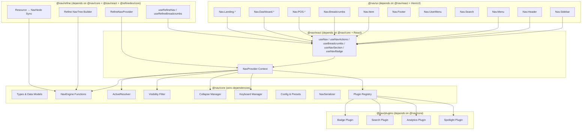
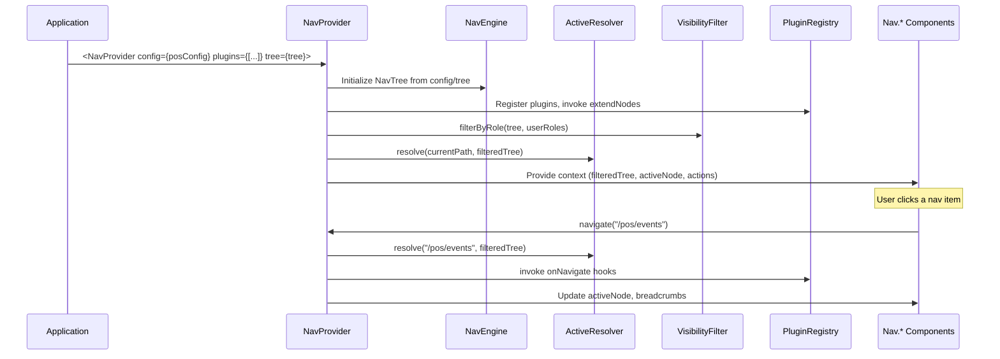

# Design Document: Composable Navigation System

## Overview

The composable navigation system is a headless, framework-agnostic navigation
engine split into five packages (`@nav/core`, `@nav/react`, `@nav/ui`,
`@nav/plugins`, `@nav/refine`) following the established `@cart/*` architecture.
The core engine manages immutable navigation trees, active state resolution,
breadcrumb generation, role-based visibility filtering, collapse state
management, keyboard navigation, context-based configuration, plugin
extensibility, and serialization. The React layer provides context providers and
hooks. The UI layer provides compound components built on HeroUI v3. The plugins
layer provides optional extensions (badges, search, analytics, spotlight). The
Refine adapter (`@nav/refine`) bridges `@refinedev/core` resources, menu items,
breadcrumbs, auth identity, and routing into the `@nav/core` NavTree — making
the system 100% Refine-compatible while remaining fully usable without Refine.

The system powers all navigation surfaces across the MNGO platform: POS terminal
header/sidebar/spotlight, dashboard sidebar/breadcrumbs, landing page sticky
headers/footers, admin settings panels, and ecommerce storefronts.

### Key Design Decisions

1. **Immutable state** — All NavTree mutations return new instances, enabling
   predictable state management and easy undo/redo integration.
2. **Functional engine** — The core engine is a collection of pure functions (no
   classes), matching the `@cart/core` pattern. This makes testing trivial and
   tree-shaking effective.
3. **Context presets** — Each navigation context (POS, dashboard, landing, etc.)
   has a default configuration preset that can be overridden, reducing
   boilerplate.
4. **Compound components** — The UI layer uses the `Nav.*` compound component
   pattern (like `Cart.*`), giving consumers full control over composition.
5. **Plugin isolation** — Plugins can inject nodes, badges, shortcuts, and hooks
   without modifying core code. Plugin errors are caught and logged, never
   interrupting navigation.
6. **Refine adapter** — `@nav/refine` is an optional package that auto-populates
   NavTrees from Refine's `useMenu()`, `useBreadcrumb()`, `useGetIdentity()`,
   and resource definitions. The nav system works standalone without Refine; the
   adapter is a drop-in bridge.

## Architecture



### Data Flow



## Components and Interfaces

### @nav/core — Public API Surface

```typescript
// ─── Tree Construction ─────────────────────────────────────────
function createNavTree(
  context: NavContext,
  config?: Partial<NavConfig>,
): NavTree;
function addSection(tree: NavTree, section: NavSectionDef): NavTree;
function addNode(
  tree: NavTree,
  sectionId: string,
  node: NavNodeDef,
  parentId?: string,
): NavTree;
function removeNode(tree: NavTree, nodeId: string): NavTree;
function moveNode(
  tree: NavTree,
  nodeId: string,
  newParentId: string | null,
  newSectionId?: string,
): NavTree;

// ─── Active State Resolution ───────────────────────────────────
function resolve(
  tree: NavTree,
  path: string,
  strategy?: MatchStrategy,
): ResolveResult;

// ─── Breadcrumb Generation ─────────────────────────────────────
function generateBreadcrumbs(
  tree: NavTree,
  nodeId: string | null,
): BreadcrumbTrail;

// ─── Visibility Filtering ──────────────────────────────────────
function filterByRole(
  tree: NavTree,
  roles: ReadonlySet<string>,
  userContext?: unknown,
): NavTree;

// ─── Collapse State ────────────────────────────────────────────
function createCollapseState(
  tree: NavTree,
  defaultCollapsed: boolean,
): CollapseState;
function toggleCollapse(state: CollapseState, nodeId: string): CollapseState;
function setCollapsed(
  state: CollapseState,
  nodeId: string,
  collapsed: boolean,
): CollapseState;
function collapseAll(state: CollapseState): CollapseState;
function expandToNode(
  state: CollapseState,
  tree: NavTree,
  nodeId: string,
): CollapseState;

// ─── Keyboard Navigation ──────────────────────────────────────
function createKeyboardBindings(config: NavConfig): KeyboardBindings;
function registerShortcut(
  bindings: KeyboardBindings,
  shortcut: string,
  target: string | NavAction,
): KeyboardBindings;
function resolveKeyEvent(
  bindings: KeyboardBindings,
  event: KeyDescriptor,
): string | NavAction | null;

// ─── Configuration ─────────────────────────────────────────────
function resolveNavConfig(
  context: NavContext,
  overrides?: Partial<NavConfig>,
): NavConfig;
const NAV_CONTEXT_PRESETS: Record<NavContext, NavConfig>;

// ─── Serialization ─────────────────────────────────────────────
function serialize(tree: NavTree): string;
function deserialize(json: string): NavTree;

// ─── Plugin System ─────────────────────────────────────────────
function createPluginRegistry(): NavPluginRegistry;
function registerPlugin(
  registry: NavPluginRegistry,
  plugin: NavPlugin,
): NavPluginRegistry;
function applyPluginNodes(registry: NavPluginRegistry, tree: NavTree): NavTree;
function applyPluginBadges(registry: NavPluginRegistry, tree: NavTree): NavTree;
function invokePluginHook(
  registry: NavPluginRegistry,
  hook: keyof NavPluginHooks,
  ...args: unknown[]
): void;
```

### @nav/react — Hooks & Provider

```typescript
// ─── Provider ──────────────────────────────────────────────────
function NavProvider(props: NavProviderProps): JSX.Element;

// ─── Consumer Hooks ────────────────────────────────────────────
function useNav(): { tree: NavTree; activeNode: NavNode | null };
function useNavActions(): NavActions;
function useBreadcrumbs(): BreadcrumbTrail;
function useNavSection(sectionId: string): NavNode[];
function useNavBadge(nodeId: string): BadgeConfig | null;
```

### @nav/ui — Compound Components

```typescript
// ─── Generic Components ────────────────────────────────────────
Nav.Sidebar; // Vertical nav panel (collapsed/expanded)
Nav.Header; // Horizontal top bar (left/center/right slots)
Nav.Menu; // Nested menu list from a NavSection
Nav.Item; // Single nav item with sub-composables:
Nav.Item.Icon;
Nav.Item.Label;
Nav.Item.Badge;
Nav.Item.Shortcut;
Nav.Item.Children;
Nav.Breadcrumbs; // Horizontal breadcrumb trail
Nav.Footer; // Footer with grouped link columns
Nav.UserMenu; // User avatar dropdown
Nav.Search; // Search input filtering NavNodes

// ─── POS-Specific ──────────────────────────────────────────────
Nav.POS.Header; // POS header layout with all slots
Nav.POS.Sidebar; // POS category sidebar
Nav.POS.Spotlight; // Full-screen command palette
Nav.POS.UserMenu; // User profile drawer with stack nav

// ─── Dashboard-Specific ────────────────────────────────────────
Nav.Dashboard.Layout; // Dashboard shell (sidebar + header + content)
Nav.Dashboard.Sidebar; // Multi-section sidebar with collapse
Nav.Dashboard.Breadcrumbs; // Dashboard breadcrumbs
Nav.Dashboard.SettingsNav; // Settings panel navigation

// ─── Landing-Specific ──────────────────────────────────────────
Nav.Landing.Header; // Sticky header with responsive hamburger
Nav.Landing.MobileDrawer; // Mobile slide-in menu
Nav.Landing.Footer; // Footer with link columns + legal bar
```

### @nav/plugins — Plugin Factories

```typescript
function createBadgePlugin(config: BadgePluginConfig): NavPlugin;
function createSearchPlugin(config: SearchPluginConfig): NavPlugin;
function createAnalyticsPlugin(config: AnalyticsPluginConfig): NavPlugin;
function createSpotlightPlugin(config: SpotlightPluginConfig): NavPlugin;
```

### @nav/refine — Refine.dev Adapter (`packages/nav/refine/`)

The Refine adapter bridges `@refinedev/core` into the `@nav/core` NavTree
system. It reads Refine's resource definitions, menu items, breadcrumbs, auth
identity, and routing to auto-populate and sync NavTrees. The nav system works
fully without this package — it's an optional drop-in for Refine-based apps.

```typescript
// ─── NavTree Builder from Refine Resources ─────────────────────
/**
 * Build a NavTree from Refine resource definitions.
 * Maps each resource to a NavNode with path, label, icon, and
 * children derived from resource.meta.
 */
function buildNavTreeFromResources(
  resources: RefineResource[],
  context: NavContext,
  config?: Partial<NavConfig>,
): NavTree;

/**
 * Sync a NavTree with Refine's useMenu() output.
 * Merges Refine menu items into an existing NavTree, adding
 * missing nodes and updating labels/icons from resource meta.
 */
function syncWithRefineMenu(
  tree: NavTree,
  menuItems: RefineMenuItem[],
  sectionId?: string,
): NavTree;

/**
 * Convert Refine's useBreadcrumb() output to a BreadcrumbTrail.
 * Maps Refine breadcrumb items to BreadcrumbEntry objects
 * compatible with @nav/core.
 */
function refineBreadcrumbsToTrail(
  breadcrumbs: RefineBreadcrumbItem[],
): BreadcrumbTrail;

// ─── Refine-Aware Provider ─────────────────────────────────────
/**
 * Drop-in replacement for NavProvider that auto-populates the
 * NavTree from Refine resources and keeps it in sync.
 * Must be rendered inside Refine's <Refine> component.
 *
 * Internally uses:
 * - useMenu() to get menu items
 * - useBreadcrumb() to generate breadcrumbs
 * - useGetIdentity() to populate user menu
 * - usePermissions() to drive role-based visibility
 * - useRouterContext() to resolve active state
 */
interface RefineNavProviderProps {
  /** Navigation context (determines preset) */
  context?: NavContext;
  /** Config overrides on top of context preset */
  config?: Partial<NavConfig>;
  /** Additional plugins */
  plugins?: NavPlugin[];
  /** Extra NavTree nodes to merge alongside Refine resources */
  extraTree?: NavTree;
  /** Section id for Refine-generated nodes (default: "main") */
  resourceSection?: string;
  /** Children */
  children: React.ReactNode;
}

function RefineNavProvider(props: RefineNavProviderProps): JSX.Element;

// ─── Refine-Aware Hooks ────────────────────────────────────────
/**
 * Like useNav() but auto-synced with Refine's resource/menu state.
 * Returns the NavTree populated from Refine resources + any extra nodes.
 */
function useRefineNav(): { tree: NavTree; activeNode: NavNode | null };

/**
 * Like useBreadcrumbs() but uses Refine's useBreadcrumb() under
 * the hood, converting to BreadcrumbTrail format.
 */
function useRefineBreadcrumbs(): BreadcrumbTrail;

/**
 * Returns the current user identity from Refine's useGetIdentity()
 * formatted for Nav.UserMenu consumption.
 */
function useRefineUserIdentity(): {
  name: string;
  avatar?: string;
  role?: string;
} | null;

// ─── Refine Type Adapters ──────────────────────────────────────
/** Maps a Refine resource to a NavNodeDef */
interface RefineResource {
  name: string;
  meta?: {
    label?: string;
    icon?: React.ReactNode;
    parent?: string;
    hide?: boolean;
    canDelete?: boolean;
    [key: string]: unknown;
  };
  list?: string;
  create?: string;
  edit?: string;
  show?: string;
}

/** Refine menu item from useMenu() */
interface RefineMenuItem {
  key: string;
  label: string;
  route?: string;
  icon?: React.ReactNode;
  children?: RefineMenuItem[];
}

/** Refine breadcrumb item from useBreadcrumb() */
interface RefineBreadcrumbItem {
  label: string;
  href?: string;
  icon?: React.ReactNode;
}
```

## Data Models

### Core Types (`@nav/core`)

```typescript
/** Navigation context identifiers */
type NavContext = "pos" | "dashboard" | "landing" | "ecommerce" | "admin";

/** Matching strategies for active state resolution */
type MatchStrategy = "exact" | "prefix" | "pattern";

/** Badge display types */
type BadgeType = "count" | "dot" | "text";

/** Badge visual variants */
type BadgeVariant = "default" | "success" | "warning" | "danger";

/** Visibility rule types */
type VisibilityRuleType = "roles" | "permissions" | "custom" | "public";

/** Navigation actions for keyboard bindings */
type NavAction =
  | "navigate"
  | "toggle"
  | "expand"
  | "collapse"
  | "search"
  | "spotlight";

// ─── Badge Configuration ───────────────────────────────────────

interface BadgeConfig {
  /** Badge display type */
  type: BadgeType;
  /** Numeric count or text label */
  value: number | string;
  /** Visual variant */
  variant: BadgeVariant;
  /** Maximum count before showing "N+" (count type only) */
  max: number | null;
}

// ─── Visibility Rules ──────────────────────────────────────────

interface RolesVisibilityRule {
  type: "roles";
  roles: readonly string[];
}

interface PermissionsVisibilityRule {
  type: "permissions";
  permissions: readonly string[];
}

interface CustomVisibilityRule {
  type: "custom";
  predicate: (userContext: unknown) => boolean;
}

interface PublicVisibilityRule {
  type: "public";
}

type VisibilityRule =
  | RolesVisibilityRule
  | PermissionsVisibilityRule
  | CustomVisibilityRule
  | PublicVisibilityRule;

// ─── Navigation Node ───────────────────────────────────────────

interface NavNode {
  /** Unique identifier within the NavTree */
  id: string;
  /** Display label */
  label: string;
  /** Route path (null for non-navigable group nodes) */
  path: string | null;
  /** Icon identifier (e.g., lucide icon name) */
  icon: string | null;
  /** Child navigation nodes */
  children: readonly NavNode[];
  /** Section this node belongs to */
  section: string;
  /** Sort order within parent (ascending) */
  order: number;
  /** Visibility rule (null = public) */
  visibility: VisibilityRule | null;
  /** Badge configuration (null = no badge) */
  badge: BadgeConfig | null;
  /** Whether the node is disabled */
  disabled: boolean;
  /** Custom matching strategy override */
  matchStrategy?: MatchStrategy;
  /** Arbitrary metadata */
  metadata: Readonly<Record<string, unknown>>;
}

/** Input type for creating a new NavNode (id auto-generated if omitted) */
interface NavNodeDef {
  id?: string;
  label: string;
  path?: string | null;
  icon?: string | null;
  children?: NavNodeDef[];
  section?: string;
  order?: number;
  visibility?: VisibilityRule | null;
  badge?: BadgeConfig | null;
  disabled?: boolean;
  matchStrategy?: MatchStrategy;
  metadata?: Record<string, unknown>;
}

// ─── Navigation Section ────────────────────────────────────────

interface NavSection {
  /** Unique section identifier */
  id: string;
  /** Optional display label (null for unlabeled sections) */
  label: string | null;
  /** Nodes in this section */
  nodes: readonly NavNode[];
  /** Sort order among sections (ascending) */
  order: number;
}

interface NavSectionDef {
  id: string;
  label?: string | null;
  nodes?: NavNodeDef[];
  order?: number;
}

// ─── Navigation Tree ───────────────────────────────────────────

interface NavTree {
  /** Unique tree identifier */
  id: string;
  /** Navigation context this tree belongs to */
  context: NavContext;
  /** Ordered sections containing navigation nodes */
  sections: readonly NavSection[];
  /** Arbitrary metadata */
  metadata: Readonly<Record<string, unknown>>;
  /** Schema version for serialization compatibility */
  version: number;
}

// ─── Resolve Result ────────────────────────────────────────────

interface ResolveResult {
  /** The matched active node, or null */
  node: NavNode | null;
  /** Ancestor chain from root to active node (for auto-expand) */
  ancestors: readonly NavNode[];
}

// ─── Breadcrumb Trail ──────────────────────────────────────────

interface BreadcrumbEntry {
  /** Node id */
  id: string;
  /** Display label */
  label: string;
  /** Navigable path */
  path: string | null;
}

type BreadcrumbTrail = readonly BreadcrumbEntry[];

// ─── Collapse State ────────────────────────────────────────────

type CollapseState = Readonly<Record<string, boolean>>;

// ─── Keyboard Bindings ─────────────────────────────────────────

interface KeyDescriptor {
  key: string;
  ctrl?: boolean;
  meta?: boolean;
  shift?: boolean;
  alt?: boolean;
}

type KeyboardBindings = Readonly<Record<string, string | NavAction>>;

// ─── Configuration ─────────────────────────────────────────────

interface NavFeatures {
  badges: boolean;
  search: boolean;
  roleFiltering: boolean;
  shortcuts: boolean;
  typeahead: boolean;
}

interface NavConfig {
  context: NavContext;
  defaultCollapsed: boolean;
  keyboardEnabled: boolean;
  stickyHeader: boolean;
  collapsibleSidebar: boolean;
  breadcrumbsEnabled: boolean;
  maxDepth: number;
  features: NavFeatures;
}

// ─── Plugin System ─────────────────────────────────────────────

interface NavPluginHooks {
  onNavigate?: (node: NavNode) => void;
  onExpand?: (nodeId: string) => void;
  onCollapse?: (nodeId: string) => void;
  onSearch?: (query: string) => void;
}

interface NavPlugin {
  /** Plugin name (required, unique) */
  name: string;
  /** Modify or inject nodes during tree construction */
  extendNodes?: (tree: NavTree) => NavTree;
  /** Provide badge updates by node id */
  badges?: () => Record<string, BadgeConfig>;
  /** Lifecycle hooks */
  hooks?: NavPluginHooks;
  /** Keyboard shortcuts to merge */
  shortcuts?: Record<string, string | NavAction>;
}

interface NavPluginRegistry {
  plugins: readonly NavPlugin[];
}

// ─── Errors ────────────────────────────────────────────────────

class NavDeserializationError extends Error {
  constructor(message: string);
}

class NavSchemaValidationError extends Error {
  constructor(message: string);
}

class DuplicateNodeError extends Error {
  constructor(nodeId: string);
}
```

### React Types (`@nav/react`)

```typescript
interface NavProviderProps {
  /** Navigation configuration */
  config: NavConfig;
  /** Optional pre-built NavTree */
  tree?: NavTree;
  /** Plugins to register */
  plugins?: NavPlugin[];
  /** User roles for visibility filtering */
  roles?: ReadonlySet<string>;
  /** User context for custom visibility rules */
  userContext?: unknown;
  /** Current route path (or auto-detected from router) */
  currentPath?: string;
  /** Children */
  children: React.ReactNode;
}

interface NavActions {
  navigate: (path: string) => void;
  toggleCollapse: (nodeId: string) => void;
  expandToNode: (nodeId: string) => void;
  collapseAll: () => void;
  registerShortcut: (shortcut: string, target: string | NavAction) => void;
}
```

## Correctness Properties

_A property is a characteristic or behavior that should hold true across all
valid executions of a system — essentially, a formal statement about what the
system should do. Properties serve as the bridge between human-readable
specifications and machine-verifiable correctness guarantees._

### Property 1: NavTree node id uniqueness

_For any_ NavTree produced by any sequence of `addNode` operations, all NavNode
ids within the tree shall be unique — no two nodes share the same id.

**Validates: Requirements 1.5**

### Property 2: NavSection ordering

_For any_ NavSection within a NavTree, the nodes shall be ordered by their
`order` field in ascending sequence.

**Validates: Requirements 1.6**

### Property 3: addNode placement

_For any_ NavTree, section id, NavNodeDef, and optional parent id: if a parent
id is provided, the new node shall appear as a child of that parent; if no
parent id is provided, the new node shall appear at the root level of the
specified section.

**Validates: Requirements 2.2, 2.3**

### Property 4: addSection inclusion

_For any_ NavTree and NavSectionDef, calling `addSection` shall produce a new
NavTree that contains the added section.

**Validates: Requirements 2.4**

### Property 5: removeNode cascading deletion

_For any_ NavTree and any node id present in the tree, calling `removeNode`
shall produce a new NavTree where neither the target node nor any of its
descendants are present.

**Validates: Requirements 2.5**

### Property 6: moveNode relocation

_For any_ NavTree, node id, and valid new parent id, calling `moveNode` shall
produce a new NavTree where the node (with its entire subtree intact) appears as
a child of the new parent and no longer appears at its original location.

**Validates: Requirements 2.6**

### Property 7: Immutability of all operations

_For any_ NavTree and any mutation operation (addNode, removeNode, moveNode,
addSection, filterByRole), the original NavTree instance shall remain unchanged
after the operation returns.

**Validates: Requirements 2.9, 5.6**

### Property 8: Active resolution uniqueness and longest match

_For any_ NavTree and any route path, the `resolve` function shall return at
most one active NavNode, and that node shall be the one whose path is the
longest prefix match (with exact matches preferred over prefix matches).

**Validates: Requirements 3.1, 3.3, 3.6**

### Property 9: Strategy-aware resolution

_For any_ NavNode with a custom `matchStrategy` override, the `resolve` function
shall use the specified strategy for that node instead of the default strategy.

**Validates: Requirements 3.4, 3.5**

### Property 10: Ancestor chain completeness

_For any_ resolved active NavNode, the `resolve` function shall return the full
ancestor chain from the root to the active node, enabling auto-expansion of
collapsed parents.

**Validates: Requirements 3.7**

### Property 11: Breadcrumb depth invariant

_For any_ active NavNode at depth D in the NavTree, `generateBreadcrumbs` shall
return a BreadcrumbTrail containing exactly D+1 entries, each with a label and
path, ordered from root to the active node.

**Validates: Requirements 4.1, 4.4, 4.5**

### Property 12: Role-based filtering correctness

_For any_ NavTree and set of user roles, `filterByRole` shall return a new
NavTree containing only NavNodes whose VisibilityRule is satisfied by the
provided roles, with filtered-out parents cascading removal to all descendants.

**Validates: Requirements 5.1, 5.2**

### Property 13: Visible parent with no visible children

_For any_ NavTree where a parent NavNode is visible but all its children are
filtered out, `filterByRole` shall retain the parent with an empty children
array.

**Validates: Requirements 5.3**

### Property 14: Empty roles yields only public nodes

_For any_ NavTree, calling `filterByRole` with an empty roles set shall return a
tree containing only NavNodes with "public" visibility or no VisibilityRule
(null).

**Validates: Requirements 5.7**

### Property 15: Toggle collapse round-trip

_For any_ CollapseState and any NavNode id, applying `toggleCollapse` twice to
the same node shall restore the original collapsed state for that node.

**Validates: Requirements 6.2, 6.7**

### Property 16: collapseAll sets all to collapsed

_For any_ CollapseState, calling `collapseAll` shall set every entry to
collapsed (true).

**Validates: Requirements 6.4**

### Property 17: expandToNode expands ancestor chain

_For any_ NavTree, CollapseState, and target NavNode id, calling `expandToNode`
shall set all ancestor nodes of the target to expanded (false) so the target
becomes visible.

**Validates: Requirements 6.5**

### Property 18: Keyboard shortcut registration round-trip

_For any_ KeyboardBindings, shortcut string, and target (NavNode id or
NavAction), registering the shortcut and then resolving a matching key event
shall return the registered target.

**Validates: Requirements 7.2, 7.3**

### Property 19: List navigation focus ordering

_For any_ ordered list of visible NavNodes, ArrowDown from position i shall move
focus to position i+1 (clamped), ArrowUp from position i shall move to i-1
(clamped), Home shall move to position 0, and End shall move to the last
position.

**Validates: Requirements 7.4, 7.7, 7.8**

### Property 20: Typeahead search

_For any_ list of visible NavNodes and any prefix string, typeahead shall return
the first NavNode whose label starts with the typed characters
(case-insensitive).

**Validates: Requirements 7.9**

### Property 21: Context config preset application

_For any_ NavContext, creating a NavTree shall apply the corresponding default
NavConfig preset. When explicit overrides are provided, the resulting config
shall be the preset merged with the overrides (overrides win).

**Validates: Requirements 8.3, 8.4**

### Property 22: Plugin node extension

_For any_ NavPluginRegistry containing plugins with `extendNodes`, calling
`applyPluginNodes` shall invoke each plugin's `extendNodes` function and the
resulting tree shall contain the nodes injected by the plugins.

**Validates: Requirements 9.3**

### Property 23: Plugin badge application

_For any_ NavPluginRegistry containing plugins with `badges`, calling
`applyPluginBadges` shall update the BadgeConfig on matching NavNodes according
to the plugin's badge function output.

**Validates: Requirements 9.4**

### Property 24: Plugin shortcut merging (existing wins)

_For any_ NavPluginRegistry and existing KeyboardBindings, merging plugin
shortcuts shall add new bindings but preserve existing bindings when conflicts
occur.

**Validates: Requirements 9.6, 9.8**

### Property 25: Serialization round-trip

_For any_ valid NavTree (with no "custom" VisibilityRules),
`deserialize(serialize(tree))` shall produce a NavTree equivalent to the
original.

**Validates: Requirements 10.3**

### Property 26: Custom visibility rules excluded from serialization

_For any_ NavTree containing NavNodes with "custom" VisibilityRules, serializing
and then deserializing shall convert those rules to "public" VisibilityRules.

**Validates: Requirements 10.6**

### Property 27: createNavTree returns empty tree for context

_For any_ NavContext value, `createNavTree` shall return a new NavTree with that
context, an empty sections array, and the correct version number.

**Validates: Requirements 2.1**

## Error Handling

### @nav/core Errors

| Error Class                | Trigger                                                               | Behavior                                                   |
| -------------------------- | --------------------------------------------------------------------- | ---------------------------------------------------------- |
| `DuplicateNodeError`       | `addNode` called with an id that already exists in the tree           | Returns error with the duplicate node id                   |
| `NavDeserializationError`  | `deserialize` called with invalid JSON                                | Wraps the native parse error with a descriptive message    |
| `NavSchemaValidationError` | `deserialize` called with JSON that doesn't conform to NavTree schema | Collects all violations and reports them in a single error |

### @nav/core Edge Cases

| Scenario                                        | Behavior                                                        |
| ----------------------------------------------- | --------------------------------------------------------------- |
| `removeNode` with non-existent id               | Returns the NavTree unchanged (no error)                        |
| `resolve` with no matching path                 | Returns `{ node: null, ancestors: [] }`                         |
| `generateBreadcrumbs` with null                 | Returns empty `BreadcrumbTrail`                                 |
| `filterByRole` with empty roles                 | Returns tree with only public/null-visibility nodes             |
| CollapseState lookup for missing node id        | Falls back to `NavConfig.defaultCollapsed`                      |
| Plugin hook throws an error                     | Caught, logged as warning, navigation continues                 |
| Plugin shortcut conflicts with existing binding | Existing binding preserved, warning logged                      |
| `serialize` with custom VisibilityRules         | Custom predicates excluded, restored as "public" on deserialize |

### @nav/react Errors

| Error                     | Trigger                                         | Behavior                                                             |
| ------------------------- | ----------------------------------------------- | -------------------------------------------------------------------- |
| `NavProviderMissingError` | Any `useNav*` hook called outside `NavProvider` | Throws descriptive error: "useNav must be used within a NavProvider" |

## Testing Strategy

### Dual Testing Approach

The navigation system uses both unit tests and property-based tests for
comprehensive coverage:

- **Unit tests** — Verify specific examples, edge cases, error conditions, and
  React component behavior
- **Property tests** — Verify universal properties across randomly generated
  inputs using `fast-check`

### Property-Based Testing Configuration

- **Library**: `fast-check` (already used in `@cart/core` and `@cart/plugins`)
- **Minimum iterations**: 100 per property test
- **Tag format**:
  `Feature: composable-navigation, Property {number}: {property_text}`
- **Each correctness property is implemented by a single property-based test**

### Test Distribution by Package

**@nav/core** (property tests + unit tests)

- Property tests for all 27 correctness properties above
- Unit tests for error conditions (DuplicateNodeError, deserialization errors,
  schema validation)
- Unit tests for edge cases (removeNode with non-existent id, resolve with no
  match, null breadcrumbs)
- Unit tests for context preset values (POS, dashboard, landing specific
  defaults)
- Environment: Node.js (vitest, `environment: "node"`)

**@nav/react** (unit tests + integration tests)

- Unit tests for hook behavior (useNav, useNavActions, useBreadcrumbs,
  useNavSection, useNavBadge)
- Unit tests for provider initialization and plugin registration
- Unit tests for error throwing when hooks used outside provider
- Integration tests for route change → active node re-resolution
- Environment: jsdom (vitest + @testing-library/react)

**@nav/ui** (unit tests + integration tests)

- Unit tests for component rendering (Nav.Sidebar, Nav.Header, Nav.Menu, etc.)
- Integration tests for ARIA attributes (role, aria-current, aria-expanded)
- Integration tests for compound component composition
- Integration tests for POS, Dashboard, and Landing specific components
- Environment: jsdom (vitest + @testing-library/react)

**@nav/plugins** (property tests + unit tests)

- Property tests for plugin node extension and badge application
- Unit tests for plugin factory functions
- Unit tests for error isolation (plugin hook throws)
- Environment: Node.js (vitest, `environment: "node"`)

**@nav/refine** (unit tests + integration tests)

- Unit tests for `buildNavTreeFromResources` (resource → NavNode mapping)
- Unit tests for `syncWithRefineMenu` (menu item merging)
- Unit tests for `refineBreadcrumbsToTrail` (breadcrumb conversion)
- Integration tests for `RefineNavProvider` (auto-population from Refine
  context)
- Integration tests for `useRefineNav`, `useRefineBreadcrumbs`,
  `useRefineUserIdentity`
- Environment: jsdom (vitest + @testing-library/react, mocked @refinedev/core
  hooks)

### Custom Generators (fast-check)

The following custom `fast-check` arbitraries will be needed for property tests:

- `arbNavContext` — generates random NavContext values
- `arbBadgeConfig` — generates random BadgeConfig objects
- `arbVisibilityRule` — generates random VisibilityRule (excluding "custom" for
  serialization tests)
- `arbNavNodeDef` — generates random NavNodeDef with configurable max depth
- `arbNavSectionDef` — generates random NavSectionDef with random nodes
- `arbNavTree` — generates random NavTree with sections and nodes (configurable
  depth/breadth)
- `arbCollapseState` — generates random CollapseState records
- `arbKeyboardBindings` — generates random KeyboardBindings maps
- `arbNavConfig` — generates random NavConfig with valid feature flags
- `arbRoleSet` — generates random sets of role strings
