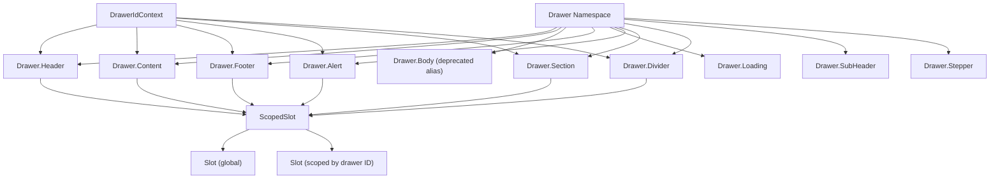

# Design Document: Drawer Composite Improvements

## Overview

This design covers eight improvements to the Drawer composite component system
at `packages/ui/src/components/drawer-stack/`. The changes span renaming, new
sub-components, loading states, layout enhancements, slot additions, and scoped
slot names. All changes are additive and backward-compatible.

Key changes:

1. Rename `DrawerBody` → `DrawerContent` (with deprecated alias)
2. New `DrawerLoading` component (spinner / skeleton / overlay variants)
3. `isLoading` prop on `DrawerFooter` (disables actions, shows spinner)
4. `isLoading` prop on `DrawerHeader` (spinner next to title, controls stay
   interactive)
5. `startContent` / `endContent` props on `DrawerFooter` (flexible action
   layout)
6. New `DrawerAlert` component (info / success / warning / danger banners)
7. Slot positions on `DrawerSection` and `DrawerDivider`
8. Drawer-ID-scoped slot names (`drawer.<id>.<component>.<position>`)

## Architecture

All changes live within the existing `packages/ui/src/components/drawer-stack/`
module and follow its established patterns:

```
drawer-stack/
├── components/
│   ├── drawer/                  # Composite namespace (Drawer.*)
│   ├── drawer-body/             # → renamed to drawer-content/
│   ├── drawer-content/          # NEW — renamed from drawer-body
│   ├── drawer-header/           # MODIFIED — add isLoading
│   ├── drawer-footer/           # MODIFIED — add isLoading, startContent, endContent
│   ├── drawer-loading/          # NEW — loading overlay/skeleton/spinner
│   ├── drawer-alert/            # NEW — inline alert banners
│   ├── drawer-section/          # MODIFIED — add slot positions
│   ├── drawer-divider/          # MODIFIED — add slot positions
│   └── scoped-slot/             # NEW — helper for dual global+scoped slot rendering
├── constants/
│   └── slot-positions/          # MODIFIED — add CONTENT, ALERT, SECTION, DIVIDER keys
├── contexts/
│   └── drawer-id/               # NEW — provides current drawer config.id to children
├── interfaces/
│   ├── drawer-header/           # MODIFIED — add isLoading
│   ├── drawer-footer/           # NEW — extract DrawerFooterProps interface
│   ├── drawer-loading/          # NEW — DrawerLoadingProps
│   └── drawer-alert/            # NEW — DrawerAlertProps
└── index.ts                     # MODIFIED — update barrel exports
```

### Design Decisions

1. **DrawerIdContext over extending DrawerPositionContext**: A new
   `DrawerIdContext` is introduced rather than adding `drawerId` to
   `DrawerPositionValue`. This keeps concerns separated — position data stays
   pure, and drawer ID is independently consumable. The context is provided by
   `DesktopPanel` and `MobilePanel` alongside the existing
   `DrawerPositionContext.Provider`.

2. **ScopedSlot helper component**: Rather than modifying the `Slot` component
   itself (which is used across the entire app), a `ScopedSlot` wrapper renders
   both the global slot and the scoped slot side-by-side. This avoids coupling
   the generic slot system to drawer-specific logic.

3. **Deprecated aliases via re-export**: `DrawerBody` remains as a re-export of
   `DrawerContent`, and `DRAWER_SLOTS.BODY` remains as a reference to the same
   strings as `DRAWER_SLOTS.CONTENT`. No runtime deprecation warnings — just
   JSDoc `@deprecated` tags.



## Components and Interfaces

### 1. DrawerContent (renamed from DrawerBody)

**File**: `components/drawer-content/drawer-content.component.tsx`

The component is functionally identical to the current `DrawerBody`. The old
`drawer-body/` directory re-exports from `drawer-content/` for backward
compatibility.

```tsx
// drawer-content.component.tsx
export interface DrawerContentProps {
  children: React.ReactNode;
  className?: string;
  padding?: "none" | "compact" | "default" | "spacious";
}

export function DrawerContent({
  children,
  className,
  padding = "default",
}: DrawerContentProps): React.JSX.Element;
```

**Barrel re-export** in `drawer-body/`:

```tsx
/** @deprecated Use DrawerContent instead. */
export { DrawerContent as DrawerBody } from "../drawer-content";
export type { DrawerContentProps as DrawerBodyProps } from "../drawer-content";
```

### 2. DrawerLoading

**File**: `components/drawer-loading/drawer-loading.component.tsx`

```tsx
export type DrawerLoadingVariant = "spinner" | "skeleton" | "overlay";

export interface DrawerLoadingProps {
  /** Whether the loading state is active. */
  isLoading: boolean;
  /** Visual variant. @default "spinner" */
  variant?: DrawerLoadingVariant;
  /** Optional text label shown with spinner/overlay variants. */
  label?: string;
  /** Number of skeleton lines for the "skeleton" variant. @default 5 */
  lines?: number;
  /** Additional CSS class names. */
  className?: string;
  /** Content to render behind the overlay (only used with "overlay" variant). */
  children?: React.ReactNode;
}

export function DrawerLoading(
  props: DrawerLoadingProps,
): React.JSX.Element | null;
```

Rendering logic:

- `isLoading === false` → returns `null` (or just `children` for overlay
  variant)
- `variant === "spinner"` → centered spinner + optional label
- `variant === "skeleton"` → animated pulse lines (configurable count)
- `variant === "overlay"` → renders `children` with a semi-transparent overlay +
  centered spinner on top

### 3. DrawerHeader (modified)

**Added prop**: `isLoading?: boolean`

When `isLoading` is true:

- A small spinner (16×16 animated SVG) renders adjacent to the title text
- Close button and back button remain fully interactive (no pointer-events
  changes)
- No `aria-busy` on header — the header is not "busy", it's informational

### 4. DrawerFooter (modified)

**Added props**:

```tsx
export interface DrawerFooterProps {
  children: React.ReactNode;
  className?: string;
  variant?: "default" | "raised" | "transparent";
  /** When true, disables actions and shows a loading spinner. */
  isLoading?: boolean;
  /** Content rendered on the left side of the footer. */
  startContent?: React.ReactNode;
  /** Content rendered on the right side of the footer. */
  endContent?: React.ReactNode;
}
```

Layout logic:

- When `startContent` or `endContent` is provided, the footer uses
  `justify-between` with three zones: start | center (children) | end
- When neither is provided, the current layout (flex row with gap) is preserved
- When `isLoading` is true: `pointer-events-none`, `opacity-50` on the action
  container, a small spinner rendered, and `aria-busy="true"` on the footer root

### 5. DrawerAlert

**File**: `components/drawer-alert/drawer-alert.component.tsx`

```tsx
export type DrawerAlertVariant = "info" | "success" | "warning" | "danger";

export interface DrawerAlertProps {
  /** Color scheme and icon. */
  variant: DrawerAlertVariant;
  /** Optional bold title above children. */
  title?: string;
  /** Alert body content. */
  children: React.ReactNode;
  /** Whether to show a dismiss button. @default false */
  dismissible?: boolean;
  /** Called when dismiss button is clicked. */
  onDismiss?: () => void;
  /** Additional CSS class names. */
  className?: string;
}

export function DrawerAlert(props: DrawerAlertProps): React.JSX.Element;
```

Each variant maps to a color scheme and default icon:

- `info` → blue, ℹ️ circle icon
- `success` → green, ✓ check circle icon
- `warning` → amber, ⚠ triangle icon
- `danger` → red, ✕ x-circle icon

Renders `ScopedSlot` at `drawer.alert.before` and `drawer.alert.after`
positions.

### 6. ScopedSlot Helper

**File**: `components/scoped-slot/scoped-slot.component.tsx`

```tsx
export interface ScopedSlotProps {
  /** The global slot name (e.g., "drawer.header.before"). */
  name: string;
}

export function ScopedSlot({ name }: ScopedSlotProps): React.JSX.Element;
```

Internally:

1. Reads `drawerId` from `DrawerIdContext`
2. Renders `<Slot name={name} />` (global)
3. If `drawerId` exists, also renders
   `<Slot name={buildScopedName(name, drawerId)} />` (scoped)

The scoped name is built by inserting the drawer ID after `"drawer."`:

- Global: `drawer.header.before`
- Scoped: `drawer.checkout.header.before`

### 7. DrawerIdContext

**File**: `contexts/drawer-id/drawer-id.context.ts`

```tsx
export const DrawerIdContext = createContext<string | null>(null);
```

Provided by `DesktopPanel` and `MobilePanel` in `DrawerContainer`, wrapping the
existing `DrawerPositionContext.Provider`:

```tsx
<DrawerIdContext.Provider value={entry.config.id}>
  <DrawerPositionContext.Provider value={{ index, stackSize, isActive }}>
    {entry.component}
  </DrawerPositionContext.Provider>
</DrawerIdContext.Provider>
```

### 8. useDrawerId Hook

**File**: `hooks/use-drawer-id/use-drawer-id.hook.ts`

```tsx
export function useDrawerId(): string | null {
  return useContext(DrawerIdContext);
}
```

### 9. Updated DRAWER_SLOTS Constant

```tsx
export const DRAWER_SLOTS = {
  HEADER: {
    /* unchanged */
  },
  SUB_HEADER: {
    /* unchanged */
  },
  CONTENT: {
    BEFORE: "drawer.content.before",
    AFTER: "drawer.content.after",
  },
  /** @deprecated Use CONTENT instead. */
  BODY: {
    BEFORE: "drawer.content.before",
    AFTER: "drawer.content.after",
  },
  FOOTER: {
    /* unchanged */
  },
  STEPPER: {
    /* unchanged */
  },
  CONTAINER: {
    /* unchanged */
  },
  ALERT: {
    BEFORE: "drawer.alert.before",
    AFTER: "drawer.alert.after",
  },
  SECTION: {
    BEFORE: "drawer.section.before",
    AFTER: "drawer.section.after",
    BEFORE_TITLE: "drawer.section.before-title",
    AFTER_TITLE: "drawer.section.after-title",
  },
  DIVIDER: {
    BEFORE: "drawer.divider.before",
    AFTER: "drawer.divider.after",
  },
} as const;
```

### 10. Updated Drawer Namespace

```tsx
export const Drawer = {
  Header: DrawerHeader,
  SubHeader: DrawerSubHeader,
  Content: DrawerContent,
  /** @deprecated Use Drawer.Content instead. */
  Body: DrawerContent,
  Footer: DrawerFooter,
  Loading: DrawerLoading,
  Alert: DrawerAlert,
  Stepper: DrawerStepper,
  Section: DrawerSection,
  Divider: DrawerDivider,
} as const;
```

## Data Models

### New Interfaces

| Interface            | File                         | Purpose                                                            |
| -------------------- | ---------------------------- | ------------------------------------------------------------------ |
| `DrawerContentProps` | `interfaces/drawer-content/` | Props for renamed body component (same shape as `DrawerBodyProps`) |
| `DrawerLoadingProps` | `interfaces/drawer-loading/` | Props for loading component                                        |
| `DrawerAlertProps`   | `interfaces/drawer-alert/`   | Props for alert component                                          |
| `DrawerFooterProps`  | (updated in component file)  | Extended with `isLoading`, `startContent`, `endContent`            |
| `DrawerHeaderProps`  | (updated in interface file)  | Extended with `isLoading`                                          |

### Modified Types

| Type                  | Change                                                                               |
| --------------------- | ------------------------------------------------------------------------------------ |
| `DrawerPositionValue` | No change — drawer ID is in a separate context                                       |
| `DRAWER_SLOTS`        | Added `CONTENT`, `ALERT`, `SECTION`, `DIVIDER` keys; `BODY` kept as deprecated alias |

### Scoped Slot Name Format

```
Global:  drawer.<component>.<position>
Scoped:  drawer.<drawerId>.<component>.<position>
```

The `buildScopedSlotName` utility function:

```tsx
function buildScopedSlotName(globalName: string, drawerId: string): string {
  // "drawer.header.before" → "drawer.checkout.header.before"
  return globalName.replace(/^drawer\./, `drawer.${drawerId}.`);
}
```

## Correctness Properties

_A property is a characteristic or behavior that should hold true across all
valid executions of a system — essentially, a formal statement about what the
system should do. Properties serve as the bridge between human-readable
specifications and machine-verifiable correctness guarantees._

### Property 1: DrawerContent padding mapping

_For any_ valid padding value in `["none", "compact", "default", "spacious"]`
and _for any_ className string, `DrawerContent` should render with the correct
CSS padding class from the padding map and include the provided className.

**Validates: Requirements 1.4**

### Property 2: DrawerLoading spinner label rendering

_For any_ non-empty string label, when `isLoading` is `true` and `variant` is
`"spinner"`, the `DrawerLoading` component should render a spinner element and
the label text should be present in the rendered output.

**Validates: Requirements 2.1, 2.5**

### Property 3: DrawerLoading skeleton line count

_For any_ positive integer `n` (1–20), when `isLoading` is `true` and `variant`
is `"skeleton"` with `lines={n}`, the `DrawerLoading` component should render
exactly `n` skeleton line elements.

**Validates: Requirements 2.2**

### Property 4: DrawerLoading off-state renders nothing

_For any_ variant value in `["spinner", "skeleton", "overlay"]` and _for any_
label string, when `isLoading` is `false`, the `DrawerLoading` component should
not render any loading UI (no spinner, no skeleton lines, no overlay).

**Validates: Requirements 2.4**

### Property 5: DrawerFooter aria-busy reflects loading state

_For any_ children content, when `isLoading` is `true`, the `DrawerFooter`
container element should have `aria-busy="true"`. When `isLoading` is `false` or
not provided, `aria-busy` should not be present.

**Validates: Requirements 3.3, 3.4**

### Property 6: DrawerHeader loading spinner adjacent to title

_For any_ non-empty title string, when `isLoading` is `true`, the `DrawerHeader`
component should render both the title text and a spinner element. When
`isLoading` is `false`, no spinner should be present.

**Validates: Requirements 4.1, 4.3**

### Property 7: DrawerAlert variant color and icon mapping

_For any_ variant in `["info", "success", "warning", "danger"]`, the
`DrawerAlert` component should render with the color scheme and icon
corresponding to that variant, and each variant should produce a distinct visual
treatment.

**Validates: Requirements 6.1, 6.2**

### Property 8: DrawerAlert title rendering

_For any_ non-empty title string and _for any_ variant, when a `title` prop is
provided, the `DrawerAlert` component should render the title text in a
bold-styled element above the children content.

**Validates: Requirements 6.3**

### Property 9: Scoped slot name builder

_For any_ global slot name matching the pattern `drawer.<component>.<position>`
and _for any_ non-empty drawer ID string, `buildScopedSlotName` should produce a
string matching `drawer.<drawerId>.<component>.<position>`.

**Validates: Requirements 8.2**

### Property 10: Slot scoping correctness

_For any_ drawer ID, content registered at a global slot name should render in
all drawer instances, content registered at a scoped slot name should render
only in the drawer with the matching ID, and when both global and scoped content
are registered at the same position, both should render in the matching drawer.

**Validates: Requirements 8.1, 8.3, 8.4, 8.5**

## Error Handling

| Scenario                                                       | Handling                                                                                |
| -------------------------------------------------------------- | --------------------------------------------------------------------------------------- |
| `DrawerLoading` with `isLoading=false`                         | Returns `null` (spinner/skeleton) or just `children` (overlay). No error.               |
| `DrawerLoading` with invalid `variant`                         | TypeScript prevents this at compile time. At runtime, falls back to spinner.            |
| `DrawerLoading` with `lines <= 0`                              | Clamp to minimum of 1 line.                                                             |
| `DrawerAlert` with missing `onDismiss` when `dismissible=true` | Dismiss button renders but click is a no-op. No error thrown.                           |
| `DrawerFooter` with `isLoading=true` and no children           | Renders spinner only, no layout issues.                                                 |
| `DrawerFooter` with `startContent` only (no `endContent`)      | Renders start zone + children zone. No justify-between — uses `justify-start` with gap. |
| `DrawerFooter` with `endContent` only (no `startContent`)      | Renders children zone + end zone with `justify-end` or `ml-auto` on end.                |
| `ScopedSlot` with no `DrawerIdContext`                         | Only renders the global slot. Scoped slot is skipped. No error.                         |
| `buildScopedSlotName` with empty drawer ID                     | Returns the global name unchanged.                                                      |
| `DRAWER_SLOTS.BODY` usage after rename                         | Works identically — same string values as `CONTENT`.                                    |

## Testing Strategy

### Unit Tests (Example-Based)

Unit tests cover structural checks, specific behaviors, and integration points:

- **Namespace structure**: Verify `Drawer.Content`, `Drawer.Body`,
  `Drawer.Loading`, `Drawer.Alert` exist and reference correct components
- **Barrel exports**: Verify `DrawerBody` re-export, `DrawerLoading` export,
  `DrawerAlert` export
- **DRAWER_SLOTS constants**: Verify `CONTENT`, `BODY` (alias), `ALERT`,
  `SECTION`, `DIVIDER` keys and values
- **DrawerFooter layout**: Test `startContent`/`endContent` rendering positions
  and `justify-between` class
- **DrawerFooter isLoading**: Test `pointer-events-none`, `opacity` reduction,
  spinner presence
- **DrawerHeader isLoading**: Test close/back buttons remain interactive during
  loading
- **DrawerAlert dismiss**: Test `dismissible` flag, `onDismiss` callback
  invocation
- **DrawerSection/DrawerDivider slots**: Test slot content injection at all
  positions
- **Scoped slot isolation**: Test that scoped content only renders in matching
  drawer

### Property-Based Tests

Property-based tests use `fast-check` (already available in the project's test
toolchain) to verify universal properties across generated inputs. Each test
runs a minimum of 100 iterations.

| Property    | Test Description                                                             | Tag                                                                                                  |
| ----------- | ---------------------------------------------------------------------------- | ---------------------------------------------------------------------------------------------------- |
| Property 1  | Generate random padding values and classNames, verify CSS output             | `Feature: drawer-composite-improvements, Property 1: DrawerContent padding mapping`                  |
| Property 2  | Generate random label strings, verify spinner + label rendering              | `Feature: drawer-composite-improvements, Property 2: DrawerLoading spinner label rendering`          |
| Property 3  | Generate random line counts (1–20), verify skeleton line count               | `Feature: drawer-composite-improvements, Property 3: DrawerLoading skeleton line count`              |
| Property 4  | Generate random variants, verify no loading UI when isLoading=false          | `Feature: drawer-composite-improvements, Property 4: DrawerLoading off-state renders nothing`        |
| Property 5  | Generate random children, verify aria-busy attribute                         | `Feature: drawer-composite-improvements, Property 5: DrawerFooter aria-busy reflects loading state`  |
| Property 6  | Generate random title strings, verify spinner presence/absence               | `Feature: drawer-composite-improvements, Property 6: DrawerHeader loading spinner adjacent to title` |
| Property 7  | Generate random variants, verify color/icon mapping                          | `Feature: drawer-composite-improvements, Property 7: DrawerAlert variant color and icon mapping`     |
| Property 8  | Generate random title strings and variants, verify bold title                | `Feature: drawer-composite-improvements, Property 8: DrawerAlert title rendering`                    |
| Property 9  | Generate random drawer IDs and slot names, verify name transformation        | `Feature: drawer-composite-improvements, Property 9: Scoped slot name builder`                       |
| Property 10 | Generate random drawer IDs, register global+scoped content, verify rendering | `Feature: drawer-composite-improvements, Property 10: Slot scoping correctness`                      |

### Test Configuration

- **Library**: `fast-check` for property-based testing, `vitest` +
  `@testing-library/react` for unit tests
- **Minimum iterations**: 100 per property test
- **Test location**: `packages/ui/src/components/drawer-stack/__tests__/`
