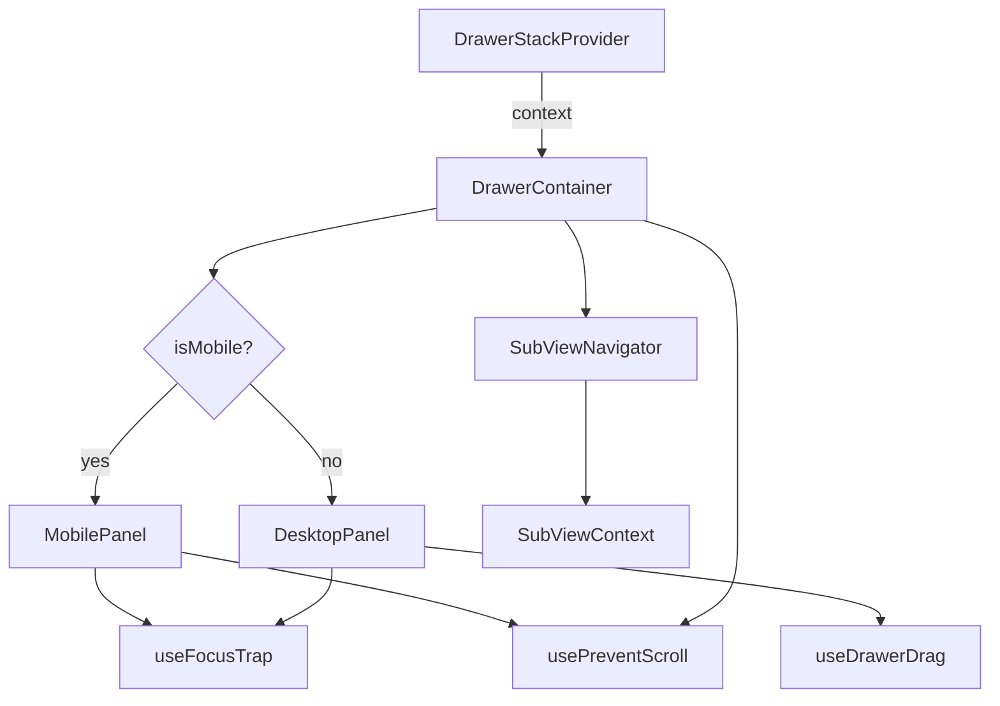

# Design Document: drawer-stack-critical-fixes

## Overview

This design addresses 7 bugs in the drawer-stack system at
`packages/ui/src/components/drawer-stack/`. The fixes span across the
SubViewNavigator component, useFocusTrap hook, useDrawerDrag hook,
usePreventScroll hook, MobilePanel/DrawerContainer components, and the Escape
key handler. Each fix is scoped to a specific file with minimal blast radius.

### Files Affected

| Bug                       | File(s)                                                     | Change Type                                 |
| ------------------------- | ----------------------------------------------------------- | ------------------------------------------- |
| Req 1: SubView animations | `sub-view-navigator.component.tsx`                          | Replace CSS classes with inline transitions |
| Req 2: Focus restoration  | `use-focus-trap.hook.ts`                                    | Add unmount focus restoration               |
| Req 3: Drag dismiss guard | `use-drawer-drag.hook.ts`, `drawer-container.component.tsx` | Change dismiss to call-first pattern        |
| Req 4: Scroll lock state  | `use-prevent-scroll.hook.ts`                                | Move module-level state to shared singleton |
| Req 5: Listener cleanup   | `use-drawer-drag.hook.ts`                                   | Add AbortController for transitionend       |
| Req 6: Defensive wrapper  | `drawer-container.component.tsx`                            | Add null checks + dev warning               |
| Req 7: Escape key nesting | `drawer-container.component.tsx`                            | Check `defaultPrevented`                    |

## Architecture

The drawer-stack system follows a layered architecture:



All 7 fixes are leaf-level changes — none alter the provider/context
architecture or the reducer logic. The fixes touch hooks and components that sit
at the edges of the system.

## Components and Interfaces

### Fix 1: SubViewNavigator — Inline CSS Transitions

**Current bug:** The component references CSS class names
`animate-slide-in-right` and `animate-slide-in-left` that don't exist in the
project's Tailwind config, resulting in no visible animation.

**Fix:** Replace the class-based animation with inline `style` props using
`transform` and `transition`.

**Implementation detail:**

In `sub-view-navigator.component.tsx`, replace the `animClass` string logic with
an inline style object:

```typescript
// Current (broken):
const animClass = animating
  ? direction === "forward"
    ? "animate-slide-in-right"
    : "animate-slide-in-left"
  : "";

// Fixed:
const animStyle: React.CSSProperties = animating
  ? {
      transform:
        direction === "forward" ? "translateX(100%)" : "translateX(-100%)",
      transition: `transform ${DRAWER_DEFAULTS.ANIMATION_DURATION_MS}ms cubic-bezier(0.32, 0.72, 0, 1)`,
    }
  : {};
```

The component needs a two-phase approach: mount with the offset transform, then
on the next frame remove it to trigger the slide-in. This requires a
`useEffect` + `requestAnimationFrame` pattern:

```typescript
const [animStyle, setAnimStyle] = useState<React.CSSProperties>({});

useEffect(() => {
  if (!animating) {
    setAnimStyle({});
    return;
  }
  // Phase 1: set starting position (off-screen)
  const startX = direction === "forward" ? "100%" : "-100%";
  setAnimStyle({ transform: `translateX(${startX})` });

  // Phase 2: animate to final position on next frame
  const raf = requestAnimationFrame(() => {
    setAnimStyle({
      transform: "translateX(0)",
      transition: `transform ${DRAWER_DEFAULTS.ANIMATION_DURATION_MS}ms cubic-bezier(0.32, 0.72, 0, 1)`,
    });
  });
  return () => cancelAnimationFrame(raf);
}, [animating, direction]);
```

Apply the style to the view container div instead of the class:

```tsx
<div className="flex-1 overflow-hidden" style={animStyle}>
  {views[currentView]}
</div>
```

### Fix 2: useFocusTrap — Focus Restoration on Unmount

**Current bug:** The hook stores `previouslyFocusedRef` on activation but never
restores focus when the hook deactivates or unmounts. The `DrawerContainer` has
a separate focus restoration mechanism using `triggerRef`, but it only fires
when `isOpen` becomes false and `visual.every(v => v.isLeaving)` — which misses
the case of popping a single drawer from a multi-drawer stack.

**Fix:** Add a cleanup return in the auto-focus `useEffect` that restores focus
to `previouslyFocusedRef.current`.

**Implementation detail:**

In `use-focus-trap.hook.ts`, modify the auto-focus effect:

```typescript
// Auto-focus first element on activation + restore on deactivation
useEffect(() => {
  if (!isActive || !enabled) return;
  previouslyFocusedRef.current = document.activeElement as HTMLElement;
  const timer = requestAnimationFrame(() => {
    const focusable = getFocusableElements();
    if (focusable.length > 0) {
      focusable[0].focus();
    } else {
      containerRef.current?.focus();
    }
  });
  return () => {
    cancelAnimationFrame(timer);
    // Restore focus to the element that was focused before this trap activated
    const prev = previouslyFocusedRef.current;
    if (
      prev &&
      typeof prev.focus === "function" &&
      document.body.contains(prev)
    ) {
      prev.focus();
    }
    previouslyFocusedRef.current = null;
  };
}, [isActive, enabled, getFocusableElements]);
```

The `document.body.contains(prev)` check handles the edge case where the trigger
element was removed from the DOM before the drawer closed (Req 2.3).

### Fix 3: useDrawerDrag — Respect onBeforeClose Guard

**Current bug:** In `onPointerUp`, when `shouldDismiss` is true, the hook first
animates the panel to `translateX(100%)` and then calls `onDismiss()` inside a
`transitionend` listener. If `onDismiss` triggers `operations.pop()` which calls
`onBeforeClose` and the guard returns `false`, the panel is already visually
off-screen.

**Fix:** Invert the order — call `onDismiss` first (which is
`operations.pop()`), and only animate off-screen if the pop actually succeeds.
Since `pop()` is async (it awaits `onBeforeClose`), the hook needs to accept an
async `onDismiss` and await it.

**Implementation detail:**

1. Change the `UseDrawerDragOptions` interface to accept an async dismiss:

```typescript
export interface UseDrawerDragOptions {
  enabled: boolean;
  onDismiss: () => void | Promise<void>;
}
```

2. In `use-drawer-drag.hook.ts`, modify the `onPointerUp` handler:

```typescript
const onPointerUp = useCallback(
  async (e: React.PointerEvent) => {
    if (!isDragging.current) return;
    isDragging.current = false;
    const el = dragRef.current;
    if (!el || !isActive.current) {
      isActive.current = false;
      return;
    }
    isActive.current = false;
    try {
      el.releasePointerCapture(e.pointerId);
    } catch {}

    const width = el.offsetWidth;
    const shouldDismiss =
      Math.abs(currentOffset.current) > width * DISMISS_FRACTION ||
      Math.abs(velocity.current) > VELOCITY_THRESHOLD;

    if (shouldDismiss) {
      // Snapshot stack length before calling onDismiss
      // onDismiss calls operations.pop() which checks onBeforeClose
      const stackBefore = el
        .closest("[data-drawer-active]")
        ?.getAttribute("data-drawer-active");

      // Call onDismiss first — this checks onBeforeClose
      await onDismiss();

      // Check if the element is still in the DOM (pop succeeded)
      if (!document.body.contains(el)) {
        // Already removed by React, no animation needed
        el.style.transition = "";
        el.style.transform = "";
      } else {
        // Pop was blocked — snap back
        el.style.transition = `transform ${SNAP_BACK_MS}ms ${EASE_CURVE}`;
        el.style.transform = "";
        // cleanup handled by AbortController (Fix 5)
      }
    } else {
      // Snap back
      el.style.transition = `transform ${SNAP_BACK_MS}ms ${EASE_CURVE}`;
      el.style.transform = "";
    }
    currentOffset.current = 0;
    velocity.current = 0;
  },
  [onDismiss],
);
```

However, there's a subtlety: `operations.pop()` is async and dispatches after
the await. The DOM won't update synchronously. A cleaner approach is to have
`onDismiss` return a boolean indicating whether the dismiss was allowed:

**Revised approach:** Change the `onDismiss` prop in `DrawerContainer` to pass a
callback that returns whether the pop succeeded. The `DrawerStackProvider.pop()`
already returns void but we can check the stack length before/after.

Actually, the simplest approach: the `DrawerContainer` already has access to
`operations.pop()`. We change the `onDismiss` callback passed to `DesktopPanel`
to be an async function that calls `pop()` and returns whether it succeeded by
comparing stack lengths:

In `drawer-container.component.tsx`, change the `onDismiss` prop for
DesktopPanel:

```typescript
onDismiss={async () => {
  const before = stack.length;
  await operations.pop();
  // If stack length didn't change, the pop was blocked
  // The useDrawerDrag hook will check if element is still mounted
}}
```

And in `useDrawerDrag`, after calling `await onDismiss()`, check if the
element's `data-drawer-active` attribute changed or if the element is still in
the DOM. The simplest reliable check: after the async pop, use a microtask to
check if the panel element still has `data-drawer-active="true"`:

```typescript
if (shouldDismiss) {
  await onDismiss();
  // After pop resolves, check if we're still mounted (pop was blocked)
  await new Promise((r) => requestAnimationFrame(r));
  if (
    el.getAttribute("data-drawer-active") === "true" ||
    !document.body.contains(el)
  ) {
    // Pop was blocked or element removed — snap back or do nothing
    if (document.body.contains(el)) {
      el.style.transition = `transform ${SNAP_BACK_MS}ms ${EASE_CURVE}`;
      el.style.transform = "";
    }
  }
}
```

**Simplest correct approach:** Make `onDismiss` return a `Promise<boolean>`:

In `DrawerContainer`, wrap the pop call:

```typescript
const handleDismiss = useCallback(async (): Promise<boolean> => {
  const lengthBefore = stack.length;
  await operations.pop();
  return stackRef.current.length < lengthBefore;
}, [stack.length, operations]);
```

Wait — `DrawerContainer` doesn't have a `stackRef`. But `operations.pop()` is
already async and only dispatches POP if the guard allows. We need a way to know
if it succeeded.

**Final approach:** The cleanest fix is to make `operations.pop()` return
`Promise<boolean>` from the provider, then thread that through:

1. In `DrawerStackProvider`, change `pop` to return `Promise<boolean>`:

```typescript
const pop = useCallback(async (): Promise<boolean> => {
  const current = stackRef.current;
  if (current.length === 0) return false;
  const top = current[current.length - 1];
  const guard = top.config.onBeforeClose;
  if (guard) {
    try {
      const allowed = await guard();
      if (!allowed) return false;
    } catch {
      return false;
    }
  }
  dispatch({ type: "POP" });
  return true;
}, []);
```

2. Update `StackOperations.pop` signature: `pop: () => Promise<boolean>`

3. In `useDrawerDrag`, use the return value:

```typescript
if (shouldDismiss) {
  const dismissed = await onDismiss();
  if (dismissed && el) {
    el.style.transition = `transform ${SNAP_BACK_MS}ms ${EASE_CURVE}`;
    el.style.transform = "translateX(100%)";
    // transitionend cleanup via AbortController
  } else if (el) {
    // Snap back
    el.style.transition = `transform ${SNAP_BACK_MS}ms ${EASE_CURVE}`;
    el.style.transform = "";
  }
}
```

4. Update `UseDrawerDragOptions`:

```typescript
onDismiss: () => Promise<boolean> | boolean;
```

### Fix 4: usePreventScroll — Instance-Safe Shared State

**Current bug:** The hook uses module-level `let` variables (`lockCount`,
`savedScrollY`, `savedBodyStyles`, `cleanupFns`). If the module is loaded in
multiple bundle chunks (e.g., code-splitting), each chunk gets its own copy of
these variables, causing lock count mismatches and scroll restoration failures.

**Fix:** Move the shared state to a singleton attached to `window` (or
`document.body` dataset), ensuring all instances share the same lock counter.

**Implementation detail:**

Replace the module-level variables with a shared singleton:

```typescript
const SCROLL_LOCK_KEY = "__drawerStackScrollLock";

interface ScrollLockState {
  lockCount: number;
  savedScrollY: number;
  savedBodyStyles: Partial<CSSStyleDeclaration> | null;
  cleanupFns: Array<() => void>;
}

function getSharedState(): ScrollLockState {
  const win = window as unknown as Record<string, unknown>;
  if (!win[SCROLL_LOCK_KEY]) {
    win[SCROLL_LOCK_KEY] = {
      lockCount: 0,
      savedScrollY: 0,
      savedBodyStyles: null,
      cleanupFns: [],
    };
  }
  return win[SCROLL_LOCK_KEY] as ScrollLockState;
}
```

Then replace all references to `lockCount`, `savedScrollY`, etc. with
`getSharedState().lockCount`, etc. throughout the hook and its helper functions.

### Fix 5: useDrawerDrag — AbortController for transitionend Cleanup

**Current bug:** The `onPointerUp` handler adds `transitionend` listeners with
`{ once: true }` but has no cleanup path if the component unmounts before the
transition completes. This leaks listeners and can cause errors when the
callback references stale refs.

**Fix:** Use an `AbortController` to manage `transitionend` listeners, and abort
it on unmount.

**Implementation detail:**

```typescript
export function useDrawerDrag({
  enabled,
  onDismiss,
}: UseDrawerDragOptions): UseDrawerDragReturn {
  const dragRef = useRef<HTMLDivElement>(null);
  const abortRef = useRef<AbortController | null>(null);
  // ... existing refs ...

  // Cleanup on unmount
  useEffect(() => {
    return () => {
      abortRef.current?.abort();
      abortRef.current = null;
    };
  }, []);

  const onPointerUp = useCallback(
    async (e: React.PointerEvent) => {
      // ... existing logic ...

      // Before adding any transitionend listener, abort previous
      abortRef.current?.abort();
      abortRef.current = new AbortController();
      const { signal } = abortRef.current;

      if (shouldDismiss) {
        // ... dismiss logic ...
        el.addEventListener(
          "transitionend",
          () => {
            el.style.transition = "";
            el.style.transform = "";
            // ...
          },
          { once: true, signal },
        );
      } else {
        el.addEventListener(
          "transitionend",
          () => {
            el.style.transition = "";
          },
          { once: true, signal },
        );
      }
    },
    [onDismiss],
  );

  // ...
}
```

The `{ once: true, signal }` combination means: the listener auto-removes after
firing (normal case), OR is removed when the AbortController aborts (unmount
case). No double-removal occurs because `once: true` already removed it if it
fired.

### Fix 6: MobilePanel — Defensive Wrapper Access

**Current bug:** `MobilePanel.onPointerMove`, `MobilePanel.onPointerUp`, and
`DrawerContainer`'s Vaul-style background scale effect all call
`document.querySelector("[data-drawer-wrapper]")` and immediately access
properties on the result without null checks. If the consumer forgets to add
`data-drawer-wrapper`, this throws.

**Fix:** Add null guards at every `querySelector` call site, and add a
`console.warn` in development mode.

**Implementation detail:**

Create a shared helper function within `drawer-container.component.tsx`:

```typescript
function getDrawerWrapper(): HTMLElement | null {
  const wrapper = document.querySelector(
    "[data-drawer-wrapper]",
  ) as HTMLElement | null;
  if (!wrapper && process.env.NODE_ENV !== "production") {
    console.warn(
      "[DrawerStack] No element with `data-drawer-wrapper` attribute found. " +
        "Add `data-drawer-wrapper` to your app wrapper element to enable background scaling on mobile.",
    );
  }
  return wrapper;
}
```

Replace all `document.querySelector("[data-drawer-wrapper]") as HTMLElement`
calls with `getDrawerWrapper()`, and guard all property accesses with
`if (wrapper) { ... }`.

The warning should only log once per session to avoid console spam. Use a
module-level flag:

```typescript
let wrapperWarned = false;
function getDrawerWrapper(): HTMLElement | null {
  const wrapper = document.querySelector(
    "[data-drawer-wrapper]",
  ) as HTMLElement | null;
  if (!wrapper && !wrapperWarned && process.env.NODE_ENV !== "production") {
    wrapperWarned = true;
    console.warn(
      "[DrawerStack] No element with `data-drawer-wrapper` attribute found. " +
        "Add `data-drawer-wrapper` to your app wrapper element to enable background scaling on mobile.",
    );
  }
  return wrapper;
}
```

### Fix 7: Escape Key — Respect Nested Event Handling

**Current bug:** The DrawerContainer's Escape key handler uses
`window.addEventListener("keydown", h, true)` (capture phase) and calls
`e.preventDefault()` + `e.stopPropagation()` + `operations.pop()` without
checking if another handler (e.g., a modal inside the drawer) already handled
the event.

**Fix:** Check `event.defaultPrevented` at the top of the handler. If true, bail
out without calling `pop()` or `stopPropagation()`.

**Implementation detail:**

In `drawer-container.component.tsx`, modify the ESC handler:

```typescript
useEffect(() => {
  if (!isOpen) return;
  const h = (e: KeyboardEvent) => {
    if (e.key !== "Escape") return;
    if (e.defaultPrevented) return; // ← New: respect nested handlers
    if (activeDrawer?.config.closeOnEscape === false) return;
    e.preventDefault();
    e.stopPropagation();
    operations.pop();
  };
  window.addEventListener("keydown", h, true); // Keep capture phase
  return () => window.removeEventListener("keydown", h, true);
}, [isOpen, activeDrawer, operations]);
```

The capture phase listener is preserved (Req 7.3) so the drawer stack still has
priority ordering within itself. The `defaultPrevented` check allows nested
components (modals, dropdowns) to call `e.preventDefault()` in their own
handlers first.

## Data Models

No data model changes are required. All fixes operate on existing interfaces
(`DrawerConfig`, `DrawerEntry`, `StackOperations`, `UseDrawerDragOptions`).

The only interface change is:

```typescript
// StackOperations.pop — return type changes from void to Promise<boolean>
pop: () => Promise<boolean>;

// UseDrawerDragOptions.onDismiss — return type changes
onDismiss: () => Promise<boolean> | boolean;
```

These are backward-compatible since existing callers that ignore the return
value continue to work.

## Correctness Properties

_A property is a characteristic or behavior that should hold true across all
valid executions of a system — essentially, a formal statement about what the
system should do. Properties serve as the bridge between human-readable
specifications and machine-verifiable correctness guarantees._

### Property 1: SubViewNavigator inline transition direction

_For any_ SubViewNavigator with a set of views and a sequence of goTo/goBack
operations, the view container's inline style SHALL reflect the correct
animation direction (translateX with positive offset for forward, negative for
back) during transitions, and SHALL have no transform applied when no transition
is in progress.

**Validates: Requirements 1.1, 1.2, 1.4**

### Property 2: Focus trap round-trip restoration

_For any_ focusable DOM element that has focus when a focus trap activates,
deactivating or unmounting the focus trap SHALL restore focus to that element,
provided it is still present in the DOM.

**Validates: Requirements 2.1, 2.2**

### Property 3: Drag dismiss respects onBeforeClose guard

_For any_ drag gesture that exceeds the dismiss threshold on a DesktopPanel
whose drawer has an `onBeforeClose` guard that returns `false`, the panel SHALL
snap back to its original position and SHALL never have its transform set to
`translateX(100%)`.

**Validates: Requirements 3.1, 3.2**

### Property 4: Scroll lock round-trip

_For any_ sequence of scroll lock acquisitions and releases across one or more
usePreventScroll instances, the document body's scroll styles SHALL be applied
when the first lock is acquired and SHALL be fully restored to their original
values when the last lock is released.

**Validates: Requirements 4.3, 4.4**

### Property 5: Escape key respects defaultPrevented

_For any_ Escape key event dispatched while a drawer is open, if
`event.defaultPrevented` is `true` at the time the DrawerContainer's handler
fires, the handler SHALL not call `operations.pop()` and SHALL not call
`event.stopPropagation()`.

**Validates: Requirements 7.1, 7.2**

## Error Handling

| Scenario                                                             | Handling                                                                                         |
| -------------------------------------------------------------------- | ------------------------------------------------------------------------------------------------ |
| `onBeforeClose` throws an exception                                  | `pop()` returns `false`, drawer stays open (existing behavior preserved)                         |
| `onBeforeClose` returns a rejected Promise                           | Same as throw — `pop()` returns `false`                                                          |
| Previously focused element removed from DOM before focus restoration | `document.body.contains()` check skips restoration silently (Req 2.3)                            |
| `data-drawer-wrapper` element missing                                | All scaling operations skipped; `console.warn` in dev mode, once per session (Req 6.1, 6.2, 6.3) |
| Component unmounts during drag animation                             | `AbortController.abort()` removes pending `transitionend` listeners (Req 5.1)                    |
| `setPointerCapture` / `releasePointerCapture` throws                 | Existing try/catch blocks preserved                                                              |
| Multiple bundle chunks load `usePreventScroll`                       | Shared `window` singleton ensures consistent lock count (Req 4.2)                                |

## Testing Strategy

### Unit Tests (Example-Based)

| Test                                                                                          | Validates |
| --------------------------------------------------------------------------------------------- | --------- |
| SubViewNavigator does not use `animate-slide-in-right` or `animate-slide-in-left` class names | Req 1.3   |
| useDrawerDrag clears inline styles after snap-back transitionend                              | Req 3.3   |
| usePreventScroll does not use module-level variables                                          | Req 4.1   |
| usePreventScroll shared state is accessible from two independent imports                      | Req 4.2   |
| useDrawerDrag uses AbortController for transitionend listeners                                | Req 5.2   |
| useDrawerDrag transitionend fires normally without double-removal errors                      | Req 5.3   |
| useDrawerDrag cleans up transitionend listeners on unmount during animation                   | Req 5.1   |
| MobilePanel logs console.warn in dev mode when wrapper is missing                             | Req 6.2   |
| MobilePanel does not throw when wrapper is missing                                            | Req 6.1   |
| DrawerContainer does not throw when wrapper is missing on mobile                              | Req 6.3   |
| DrawerContainer Escape handler uses capture phase                                             | Req 7.3   |
| useFocusTrap skips restoration when trigger element is removed from DOM                       | Req 2.3   |

### Property-Based Tests

Property-based testing library: **fast-check** (already standard for
TypeScript/React projects).

Each property test runs a minimum of 100 iterations and is tagged with the
corresponding design property.

| Property Test                                | Tag                                              | Min Iterations |
| -------------------------------------------- | ------------------------------------------------ | -------------- |
| SubViewNavigator inline transition direction | Feature: drawer-stack-critical-fixes, Property 1 | 100            |
| Focus trap round-trip restoration            | Feature: drawer-stack-critical-fixes, Property 2 | 100            |
| Drag dismiss respects onBeforeClose guard    | Feature: drawer-stack-critical-fixes, Property 3 | 100            |
| Scroll lock round-trip                       | Feature: drawer-stack-critical-fixes, Property 4 | 100            |
| Escape key respects defaultPrevented         | Feature: drawer-stack-critical-fixes, Property 5 | 100            |

### Test Environment

- **JSDOM** for DOM simulation (focus, element queries, event dispatch)
- **React Testing Library** for component rendering
- **fast-check** for property-based test generation
- Mock `requestAnimationFrame` with synchronous execution for animation tests
- Mock `window.matchMedia` for mobile/desktop viewport switching
