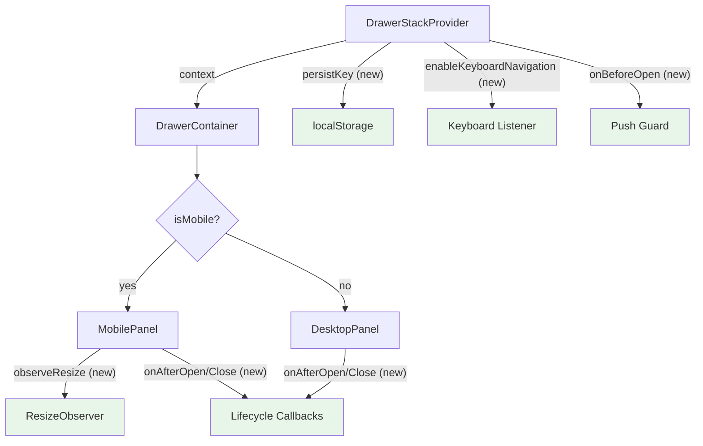

# Design Document: drawer-stack-enhancements

## Overview

This design covers four enhancement features for the drawer stack system at
`packages/ui/src/components/drawer-stack/`: lifecycle hooks (`onBeforeOpen`,
`onAfterOpen`, `onAfterClose`), optional stack persistence via `localStorage`,
keyboard navigation between stacked drawers, and a `ResizeObserver` integration
for mobile bottom sheets with dynamic content. All features are opt-in
extensions to existing interfaces (`DrawerConfig`, `DrawerStackProvider`) and do
not break current consumers.

### Files Affected

| Feature                    | File(s)                                                                                  | Change Type                                    |
| -------------------------- | ---------------------------------------------------------------------------------------- | ---------------------------------------------- |
| Req 1: onBeforeOpen        | `drawer-config.interface.ts`, `drawer-stack.provider.tsx`                                | Add callback to config, async guard in push    |
| Req 2: onAfterOpen         | `drawer-config.interface.ts`, `drawer-container.component.tsx`                           | Add callback to config, transitionend trigger  |
| Req 3: onAfterClose        | `drawer-config.interface.ts`, `drawer-container.component.tsx`                           | Add callback to config, exit timer trigger     |
| Req 4: Stack Persistence   | `drawer-stack.provider.tsx`                                                              | Add persistKey/onRestore props, localStorage   |
| Req 5: Keyboard Navigation | `drawer-stack.provider.tsx`, `drawer-container.component.tsx`, `drawer-stack.context.ts` | Add provider prop, keydown listener, context   |
| Req 6: Resize Observer     | `drawer-config.interface.ts`, `drawer-container.component.tsx`                           | Add config flag, ResizeObserver in MobilePanel |

## Architecture

The enhancements integrate into the existing layered architecture without
changing the core reducer or context shape:



Key design decisions:

- **onBeforeOpen** lives in the provider's `push` method (pre-dispatch guard),
  mirroring the existing `onBeforeClose` pattern in `pop`.
- **onAfterOpen/onAfterClose** live in `DrawerContainer` because they depend on
  animation completion, which is managed by the visual entry lifecycle.
- **Persistence** lives in the provider via a `useEffect` that serializes on
  stack changes, keeping the reducer pure.
- **Keyboard navigation** is a `useEffect` in `DrawerContainer` that listens for
  key combos and calls `operations.bringToTop`. The `enableKeyboardNavigation`
  flag is threaded through context.
- **ResizeObserver** is scoped to `MobilePanel` only, attached via a `useEffect`
  when `observeResize` is true.

## Components and Interfaces

### Feature 1: onBeforeOpen Lifecycle Hook

**Interface change** in `drawer-config.interface.ts`:

```typescript
export interface DrawerConfig<TId extends string = string> {
  // ... existing fields ...

  /**
   * Called before the drawer is pushed onto the stack.
   * Return `true` to allow the push, or `false` to cancel it.
   * If the function returns a `Promise`, the push waits for resolution.
   * If the callback throws or the Promise rejects, the push is cancelled.
   */
  onBeforeOpen?: () => boolean | Promise<boolean>;
}
```

**Provider change** in `drawer-stack.provider.tsx`:

The `push` method becomes async and checks the guard before dispatching:

```typescript
const push = useCallback(async (config: DrawerConfig, component: ReactNode) => {
  // Check onBeforeOpen guard
  if (config.onBeforeOpen) {
    try {
      const allowed = await config.onBeforeOpen();
      if (!allowed) return;
    } catch {
      // If the guard throws, treat as "don't open"
      return;
    }
  }

  const entry: DrawerEntry = {
    instanceId: crypto.randomUUID(),
    config,
    component,
    triggerElement: document.activeElement,
  };
  dispatch({ type: "PUSH", entry });
}, []);
```

The `StackOperations.push` signature changes to return `void | Promise<void>`
(backward-compatible since callers that don't await still work).

### Feature 2: onAfterOpen Lifecycle Hook

**Interface change** in `drawer-config.interface.ts`:

```typescript
export interface DrawerConfig<TId extends string = string> {
  // ... existing fields ...

  /**
   * Called after the drawer's enter animation completes.
   * Useful for analytics, data fetching, or coordinating with other UI.
   * Invoked exactly once per push. Not invoked on singleton re-activation.
   */
  onAfterOpen?: () => void;
}
```

**Container change** in `drawer-container.component.tsx`:

In both `DesktopPanel` and `MobilePanel`, after the enter animation completes
(when `entered` becomes `true`), invoke the callback. Use a ref to track whether
it has already been called for this instance:

```typescript
// Inside DesktopPanel / MobilePanel
const afterOpenCalledRef = useRef(false);

useEffect(() => {
  if (entered && !isLeaving && !afterOpenCalledRef.current) {
    afterOpenCalledRef.current = true;
    entry.config.onAfterOpen?.();
  }
}, [entered, isLeaving, entry.config]);
```

The `afterOpenCalledRef` ensures the callback fires exactly once, even if
`entered` toggles due to re-renders. For singleton re-activation (where the
existing entry is moved to top without creating a new component instance), the
ref remains `true` from the first push, so the callback is not re-invoked.

### Feature 3: onAfterClose Lifecycle Hook

**Interface change** in `drawer-config.interface.ts`:

```typescript
export interface DrawerConfig<TId extends string = string> {
  // ... existing fields ...

  /**
   * Called after the drawer's exit animation completes and the entry
   * is removed from the visual state. Useful for cleanup or external state updates.
   * Invoked exactly once per drawer removal.
   */
  onAfterClose?: () => void;
}
```

**Container change** in `drawer-container.component.tsx`:

The existing exit timer in the `useEffect` that syncs visual entries already
fires when a drawer leaves the stack. We invoke `onAfterClose` inside that timer
callback, right before purging the visual entry:

```typescript
// In the visual sync useEffect, where exit timers are created:
if (!stillInStack && !ve.isLeaving) {
  next.push({ entry: ve.entry, isLeaving: true });
  const id = ve.entry.instanceId;
  if (!exitTimers.current.has(id)) {
    const closeCb = ve.entry.config.onAfterClose;
    exitTimers.current.set(
      id,
      setTimeout(() => {
        exitTimers.current.delete(id);
        closeCb?.(); // Invoke after exit animation duration
        setVisual((v) => v.filter((x) => x.entry.instanceId !== id));
      }, 550),
    );
  }
}
```

When `clear` is called, all drawers transition to `isLeaving: true`
simultaneously, and each gets its own exit timer. Each timer invokes its
respective `onAfterClose` independently.

### Feature 4: Stack Persistence via Browser Storage

**Provider props change** in `drawer-stack.provider.tsx`:

```typescript
export interface DrawerStackProviderProps {
  children: ReactNode;
  /** Key for localStorage persistence. Omit to disable persistence. */
  persistKey?: string;
  /** Called on mount with persisted drawer IDs. Consumer re-pushes drawers. */
  onRestore?: (ids: string[]) => void;
  /** Enable Ctrl+Tab keyboard navigation between drawers. */
  enableKeyboardNavigation?: boolean;
}
```

**Serialization format:**

Only serializable, non-function fields from `DrawerConfig` are persisted:

```typescript
interface PersistedDrawerState {
  id: string;
  width?: number | string;
  closeOnEscape?: boolean;
  singleton?: boolean;
  metadata?: Record<string, unknown>;
  observeResize?: boolean;
}
```

**Persistence effect** (write on stack change):

```typescript
useEffect(() => {
  if (!persistKey) return;
  try {
    const serializable: PersistedDrawerState[] = stack.map((entry) => ({
      id: entry.config.id,
      width: entry.config.width,
      closeOnEscape: entry.config.closeOnEscape,
      singleton: entry.config.singleton,
      metadata: entry.config.metadata,
      observeResize: entry.config.observeResize,
    }));
    localStorage.setItem(persistKey, JSON.stringify(serializable));
  } catch (err) {
    if (process.env.NODE_ENV !== "production") {
      console.warn("[DrawerStack] Failed to persist stack state:", err);
    }
  }
}, [stack, persistKey]);
```

**Restore effect** (read on mount):

```typescript
useEffect(() => {
  if (!persistKey) return;
  try {
    const raw = localStorage.getItem(persistKey);
    if (!raw) return;
    const persisted: PersistedDrawerState[] = JSON.parse(raw);
    const ids = persisted.map((p) => p.id);
    if (ids.length > 0 && onRestore) {
      onRestore(ids);
    }
  } catch (err) {
    if (process.env.NODE_ENV !== "production") {
      console.warn("[DrawerStack] Failed to restore persisted state:", err);
    }
  }
  // Only run on mount
  // eslint-disable-next-line react-hooks/exhaustive-deps
}, []);
```

When `onRestore` is not provided, the persisted data is read but discarded (no
drawers are pushed). The consumer is responsible for calling `operations.push()`
inside `onRestore` to rebuild the stack.

### Feature 5: Keyboard Navigation Between Stacked Drawers

**Context change:** The `enableKeyboardNavigation` flag needs to reach
`DrawerContainer`. We extend the context value:

```typescript
export interface DrawerStackContextValue<TId extends string = string> {
  // ... existing fields ...
  /** Whether keyboard navigation between drawers is enabled. */
  enableKeyboardNavigation: boolean;
}
```

**Provider threading:**

```typescript
const value = useMemo<DrawerStackContextValue>(
  () => ({
    stack,
    isOpen: stack.length > 0,
    activeDrawer: stack.length > 0 ? stack[stack.length - 1] : undefined,
    operations: {
      push,
      pop,
      replace,
      update,
      clear,
      popTo,
      forcePop,
      bringToTop,
    },
    enableKeyboardNavigation: enableKeyboardNavigation ?? false,
  }),
  [
    stack,
    push,
    pop,
    replace,
    update,
    clear,
    popTo,
    forcePop,
    bringToTop,
    enableKeyboardNavigation,
  ],
);
```

**Keyboard listener** in `drawer-container.component.tsx`:

```typescript
useEffect(() => {
  if (!enableKeyboardNavigation || !isOpen || stack.length < 2) return;

  const handler = (e: KeyboardEvent) => {
    // Ctrl+Tab / Ctrl+Shift+Tab — cycle drawers
    if (e.ctrlKey && e.key === "Tab") {
      e.preventDefault();
      e.stopPropagation();
      const currentTopId = stack[stack.length - 1].config.id;
      const currentIdx = stack.findIndex((s) => s.config.id === currentTopId);

      if (e.shiftKey) {
        // Previous: wrap to end if at start
        const prevIdx = currentIdx === 0 ? stack.length - 1 : currentIdx - 1;
        operations.bringToTop(stack[prevIdx].config.id);
      } else {
        // Next: wrap to start if at end — bring the one below top to top
        // Since bringToTop moves to end, we cycle by bringing the bottom-most
        const nextIdx = currentIdx <= 0 ? stack.length - 2 : currentIdx - 1;
        operations.bringToTop(stack[nextIdx].config.id);
      }
      return;
    }

    // Ctrl+1..9 — direct access
    if (e.ctrlKey && e.key >= "1" && e.key <= "9") {
      e.preventDefault();
      const pos = parseInt(e.key, 10); // 1-based
      if (pos <= stack.length) {
        operations.bringToTop(stack[pos - 1].config.id);
      }
      return;
    }
  };

  window.addEventListener("keydown", handler, true);
  return () => window.removeEventListener("keydown", handler, true);
}, [enableKeyboardNavigation, isOpen, stack, operations]);
```

The cycling logic: `Ctrl+Tab` brings the drawer one position below the current
top to the top. Since `bringToTop` moves the target to the end of the array,
this effectively rotates the stack. `Ctrl+Shift+Tab` reverses the direction.
When the bottom-most drawer is active (after cycling), `Ctrl+Shift+Tab` wraps to
the original top.

### Feature 6: Drawer Content Resize Observer for Mobile Bottom Sheets

**Interface change** in `drawer-config.interface.ts`:

```typescript
export interface DrawerConfig<TId extends string = string> {
  // ... existing fields ...

  /**
   * When true and rendered as a mobile bottom sheet, attaches a ResizeObserver
   * to the content container to toggle overflow-y based on content height.
   * No-op on desktop panels. Defaults to false.
   */
  observeResize?: boolean;
}
```

**MobilePanel change** in `drawer-container.component.tsx`:

```typescript
// Inside MobilePanel
const contentRef = useRef<HTMLDivElement>(null);

useEffect(() => {
  if (!entry.config.observeResize || !contentRef.current) return;

  const el = contentRef.current;
  const observer = new ResizeObserver((entries) => {
    for (const obs of entries) {
      const contentHeight = obs.target.scrollHeight;
      const availableHeight = el.clientHeight;
      el.style.overflowY = contentHeight > availableHeight ? "auto" : "hidden";
    }
  });

  observer.observe(el);
  return () => observer.disconnect();
}, [entry.config.observeResize]);
```

The content container div gets the ref:

```tsx
<div ref={contentRef} className="flex-1 min-h-0 overflow-hidden">
  {entry.component}
</div>
```

On desktop panels, the `observeResize` flag is ignored — `DesktopPanel` does not
attach any `ResizeObserver` regardless of the config value, since desktop panels
are already full-height with scrollable content areas.

## Data Models

### DrawerConfig (extended)

```typescript
export interface DrawerConfig<TId extends string = string> {
  id: TId;
  width?: number | string;
  closeOnEscape?: boolean;
  singleton?: boolean;
  metadata?: Record<string, unknown>;
  onBeforeClose?: () => boolean | Promise<boolean>;
  // New fields:
  onBeforeOpen?: () => boolean | Promise<boolean>;
  onAfterOpen?: () => void;
  onAfterClose?: () => void;
  observeResize?: boolean;
}
```

### DrawerStackProviderProps (extended)

```typescript
export interface DrawerStackProviderProps {
  children: ReactNode;
  // New fields:
  persistKey?: string;
  onRestore?: (ids: string[]) => void;
  enableKeyboardNavigation?: boolean;
}
```

### DrawerStackContextValue (extended)

```typescript
export interface DrawerStackContextValue<TId extends string = string> {
  stack: ReadonlyArray<DrawerEntry<TId>>;
  isOpen: boolean;
  activeDrawer: DrawerEntry<TId> | undefined;
  operations: StackOperations<TId>;
  // New field:
  enableKeyboardNavigation: boolean;
}
```

### PersistedDrawerState (new)

```typescript
interface PersistedDrawerState {
  id: string;
  width?: number | string;
  closeOnEscape?: boolean;
  singleton?: boolean;
  metadata?: Record<string, unknown>;
  observeResize?: boolean;
}
```

All changes are additive — existing consumers that don't use the new fields
continue to work without modification.

## Correctness Properties

_A property is a characteristic or behavior that should hold true across all
valid executions of a system — essentially, a formal statement about what the
system should do. Properties serve as the bridge between human-readable
specifications and machine-verifiable correctness guarantees._

### Property 1: onBeforeOpen guard controls push outcome

_For any_ `DrawerConfig` with an `onBeforeOpen` callback (sync or async), the
drawer SHALL be added to the stack if and only if the callback returns `true`.
If the callback returns `false`, throws, or the returned Promise rejects, the
stack SHALL remain unchanged.

**Validates: Requirements 1.2, 1.3, 1.4, 1.5, 1.6**

### Property 2: onAfterOpen fires exactly once after enter animation

_For any_ drawer with an `onAfterOpen` callback, the callback SHALL be invoked
exactly once after the drawer's enter animation completes. For any subsequent
singleton re-activation of the same drawer, the callback SHALL NOT be invoked
again.

**Validates: Requirements 2.2, 2.4, 2.5**

### Property 3: onAfterClose fires exactly once per removal

_For any_ set of N drawers in the stack where each has an `onAfterClose`
callback, removing K drawers (via `pop`, `popTo`, or `clear`) SHALL result in
exactly K invocations of `onAfterClose`, one per removed drawer, after each
drawer's exit animation completes.

**Validates: Requirements 3.2, 3.4, 3.5**

### Property 4: Persistence round-trip preserves drawer IDs

_For any_ sequence of stack operations (push, pop, replace, clear) performed
while `persistKey` is set, the value stored in `localStorage[persistKey]` SHALL
contain exactly the IDs of the current stack entries. When the provider remounts
with the same `persistKey` and an `onRestore` callback, the callback SHALL
receive the same array of IDs that were persisted.

**Validates: Requirements 4.2, 4.5**

### Property 5: Keyboard cycling is bidirectional and wraps

_For any_ stack of N drawers (N ≥ 2) with `enableKeyboardNavigation` enabled,
pressing `Ctrl+Tab` K times followed by `Ctrl+Shift+Tab` K times SHALL return
the same drawer to the top position. Additionally, pressing `Ctrl+Tab` N times
SHALL cycle through all drawers and return to the original top drawer.

**Validates: Requirements 5.3, 5.4**

### Property 6: Ctrl+number direct access

_For any_ stack of N drawers with `enableKeyboardNavigation` enabled and any
integer K where 1 ≤ K ≤ 9, pressing `Ctrl+K` SHALL bring the drawer at 1-based
position K to the top if K ≤ N, and SHALL be a no-op if K > N.

**Validates: Requirements 5.5**

### Property 7: Mobile overflow-y reflects content height

_For any_ mobile bottom sheet drawer with `observeResize` enabled, the content
container's `overflow-y` SHALL be `"auto"` when the content's scroll height
exceeds the container's client height, and SHALL be `"hidden"` when the content
fits within the container.

**Validates: Requirements 6.3, 6.4**

## Error Handling

| Scenario                                            | Handling                                                                          |
| --------------------------------------------------- | --------------------------------------------------------------------------------- |
| `onBeforeOpen` throws or returns rejected Promise   | Push is cancelled, stack unchanged, error swallowed silently (Req 1.6)            |
| `onBeforeOpen` returns a long-running Promise       | Push awaits resolution; UI remains responsive since dispatch hasn't fired yet     |
| `onAfterOpen` throws                                | Error propagates to React error boundary; does not affect stack state             |
| `onAfterClose` throws                               | Error propagates to React error boundary; visual entry is still purged            |
| `localStorage.setItem` throws (quota exceeded)      | Warning logged in dev mode, persistence silently skipped (Req 4.8)                |
| `localStorage.getItem` throws (private browsing)    | Warning logged in dev mode, empty stack on mount (Req 4.8)                        |
| Persisted JSON is malformed                         | `JSON.parse` throws, caught by try/catch, warning logged, empty stack (Req 4.8)   |
| `onRestore` not provided but persisted state exists | Persisted data discarded, empty stack (Req 4.6)                                   |
| `Ctrl+Tab` pressed with 0 or 1 drawers              | Keypress ignored, no-op (Req 5.8)                                                 |
| `Ctrl+5` pressed with only 3 drawers                | Keypress ignored, no-op (Req 5.5)                                                 |
| `ResizeObserver` not available in browser           | Feature degrades gracefully — no observer attached, content uses default overflow |
| Drawer removed while ResizeObserver is active       | Observer disconnected in useEffect cleanup (Req 6.6)                              |

## Testing Strategy

### Unit Tests (Example-Based)

| Test                                                                        | Validates              |
| --------------------------------------------------------------------------- | ---------------------- |
| DrawerConfig accepts onBeforeOpen, onAfterOpen, onAfterClose, observeResize | Req 1.1, 2.1, 3.1, 6.1 |
| Push without onBeforeOpen adds drawer immediately                           | Req 1.7                |
| Push with onBeforeOpen returning true adds drawer                           | Req 1.4                |
| Push with onBeforeOpen returning false does not add drawer                  | Req 1.3                |
| Push with onBeforeOpen throwing does not add drawer                         | Req 1.6                |
| No onAfterOpen callback — enter animation completes without error           | Req 2.3                |
| Singleton re-activation does not invoke onAfterOpen again                   | Req 2.5                |
| No onAfterClose callback — exit completes without error                     | Req 3.3                |
| DrawerStackProvider accepts persistKey and onRestore props                  | Req 4.1, 4.4           |
| Mount with persistKey reads from localStorage                               | Req 4.3                |
| Mount without onRestore discards persisted state                            | Req 4.6                |
| Mount without persistKey does not touch localStorage                        | Req 4.7                |
| localStorage error logs warning and starts with empty stack                 | Req 4.8                |
| enableKeyboardNavigation defaults to false, no extra listeners              | Req 5.1, 5.7           |
| Ctrl+Tab with 2+ drawers activates keyboard cycling                         | Req 5.2                |
| Keyboard navigation animates with standard timing                           | Req 5.6                |
| Ctrl+Tab with fewer than 2 drawers is no-op                                 | Req 5.8                |
| observeResize on desktop does not attach ResizeObserver                     | Req 6.5                |
| observeResize attaches ResizeObserver on mobile                             | Req 6.2                |
| ResizeObserver disconnected on drawer removal                               | Req 6.6                |
| No observeResize — no ResizeObserver attached                               | Req 6.7                |

### Property-Based Tests

Property-based testing library: **fast-check** (standard for TypeScript/React
projects).

Each property test runs a minimum of 100 iterations and is tagged with the
corresponding design property.

| Property Test                                  | Tag                                            | Min Iterations |
| ---------------------------------------------- | ---------------------------------------------- | -------------- |
| onBeforeOpen guard controls push outcome       | Feature: drawer-stack-enhancements, Property 1 | 100            |
| onAfterOpen fires exactly once after animation | Feature: drawer-stack-enhancements, Property 2 | 100            |
| onAfterClose fires exactly once per removal    | Feature: drawer-stack-enhancements, Property 3 | 100            |
| Persistence round-trip preserves drawer IDs    | Feature: drawer-stack-enhancements, Property 4 | 100            |
| Keyboard cycling is bidirectional and wraps    | Feature: drawer-stack-enhancements, Property 5 | 100            |
| Ctrl+number direct access                      | Feature: drawer-stack-enhancements, Property 6 | 100            |
| Mobile overflow-y reflects content height      | Feature: drawer-stack-enhancements, Property 7 | 100            |

### Test Environment

- **JSDOM** for DOM simulation (focus, element queries, event dispatch,
  localStorage)
- **React Testing Library** for component rendering
- **fast-check** for property-based test generation
- Mock `requestAnimationFrame` with synchronous execution for animation tests
- Mock `window.matchMedia` for mobile/desktop viewport switching
- Mock `ResizeObserver` for resize detection tests
- Mock `localStorage` for persistence tests (including error simulation)
