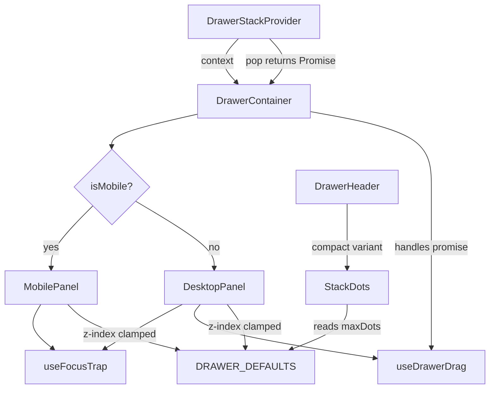

# Design Document: drawer-stack-hardening

## Overview

This design covers 6 hardening improvements to the drawer stack system at
`packages/ui/src/components/drawer-stack/`. Each improvement targets a specific
robustness gap: a hardcoded counter threshold in StackDots, missing horizontal
scroll detection in drag handling, unbounded z-index calculation, inconsistent
subtitle visibility in compact headers, focus trap portal limitations, and a
misleading `pop()` return type.

### Files Affected

| Requirement                        | File(s)                                                                                        | Change Type                        |
| ---------------------------------- | ---------------------------------------------------------------------------------------------- | ---------------------------------- |
| Req 1: Configurable StackDots      | `stack-dots.component.tsx`, `drawer-defaults.constant.ts`                                      | Add prop + move constant           |
| Req 2: Horizontal scroll detection | `use-drawer-drag.hook.ts`, `drawer-container.component.tsx`                                    | Add scrollWidth check              |
| Req 3: Z-index safeguard           | `drawer-defaults.constant.ts`, `drawer-container.component.tsx`                                | Add MAX_STACK_DEPTH + clamp        |
| Req 4: Compact subtitle visibility | `drawer-header.component.tsx`                                                                  | Fix conditional rendering          |
| Req 5: Focus trap portal support   | `use-focus-trap.hook.ts`                                                                       | Add portalContainers param + JSDoc |
| Req 6: Async pop() return type     | `stack-operations.interface.ts`, `drawer-stack.provider.tsx`, `drawer-container.component.tsx` | Change signature + handle promises |

## Architecture

The drawer-stack system's layered architecture remains unchanged. All 6
improvements are leaf-level changes to existing components, hooks, constants,
and interfaces.



## Components and Interfaces

### Improvement 1: Configurable StackDots Counter Threshold

**Current issue:** `MAX_DOTS` is a hardcoded `const MAX_DOTS = 5` inside
`stack-dots.component.tsx`. Consumers cannot customize when the component
switches from dots to counter mode.

**Fix:** Move `MAX_DOTS` to `DRAWER_DEFAULTS`, add an optional `maxDots` prop to
`StackDots`.

**Implementation:**

1. In `drawer-defaults.constant.ts`, add `MAX_DOTS: 5` to the `DRAWER_DEFAULTS`
   object.

2. In `stack-dots.component.tsx`:

```typescript
interface StackDotsProps {
  stackSize: number;
  index: number;
  variant: "hero" | "surface";
  /** Override the default threshold for switching to counter mode. */
  maxDots?: number;
}

export function StackDots({
  stackSize,
  index,
  variant,
  maxDots,
}: StackDotsProps): React.JSX.Element {
  const threshold = maxDots ?? DRAWER_DEFAULTS.MAX_DOTS;

  if (stackSize > threshold) {
    // ... counter mode (unchanged)
  }
  // ... dots mode (unchanged)
}
```

Remove the local `const MAX_DOTS = 5` and import `DRAWER_DEFAULTS` from
`@drawer/constants`.

### Improvement 2: Horizontal Scroll Detection in Drag Handler

**Current issue:** Both `useDrawerDrag` (desktop) and `MobilePanel` (mobile)
check for vertical scroll (`scrollHeight > clientHeight && scrollTop > 0`) but
ignore horizontal scroll. Dragging inside a horizontally scrollable carousel or
wide table triggers drag-to-dismiss instead of scrolling.

**Fix:** Add a horizontal scroll check alongside the existing vertical one. If a
horizontally scrollable ancestor has `scrollLeft > 0`, cancel drag initiation.

**Implementation:**

Create a shared utility `hasScrollableAncestor` in a new file or extend the
existing `get-scroll-parent` util:

```typescript
/**
 * Check if any ancestor up to `root` is horizontally scrollable and scrolled.
 * Returns true if drag should be cancelled.
 */
function hasHorizontalScrollAncestor(
  target: HTMLElement,
  root: HTMLElement | null,
): boolean {
  let el: HTMLElement | null = target;
  while (el && el !== root) {
    if (el.scrollWidth > el.clientWidth && el.scrollLeft > 0) {
      return true;
    }
    el = el.parentElement;
  }
  return false;
}
```

In `use-drawer-drag.hook.ts`, add the check in `onPointerDown` after the
existing vertical scroll check:

```typescript
// Existing vertical scroll check
let el: HTMLElement | null = target;
while (el && el !== dragRef.current) {
  const style = window.getComputedStyle(el);
  if (
    /(auto|scroll)/.test(style.overflow + style.overflowX + style.overflowY) &&
    el.scrollHeight > el.clientHeight
  )
    return;
  // NEW: horizontal scroll check
  if (el.scrollWidth > el.clientWidth && el.scrollLeft > 0) return;
  el = el.parentElement;
}
```

In `MobilePanel`'s `onPointerDown`, add the same horizontal scroll check in the
ancestor walk loop:

```typescript
let el = target;
while (el && el !== panelRef.current) {
  if (el.scrollHeight > el.clientHeight && el.scrollTop > 0) return;
  // NEW: horizontal scroll check
  if (el.scrollWidth > el.clientWidth && el.scrollLeft > 0) return;
  el = el.parentElement as HTMLElement;
}
```

The condition `scrollLeft > 0` means: if the user has already scrolled
horizontally, they're interacting with the scrollable content, so don't hijack
the gesture. If `scrollLeft === 0`, the user is at the left edge and a rightward
drag can still initiate dismiss.

### Improvement 3: Z-Index Calculation Safeguard

**Current issue:** The z-index is computed as
`DRAWER_DEFAULTS.BASE_Z_INDEX + index * DRAWER_DEFAULTS.Z_INDEX_STEP` with no
upper bound. At extreme stack depths (theoretical), this could exceed the
browser max of `2147483647`.

**Fix:** Add `MAX_STACK_DEPTH` to `DRAWER_DEFAULTS`, clamp z-index, and log a
warning when the limit is exceeded.

**Implementation:**

1. In `drawer-defaults.constant.ts`:

```typescript
export const DRAWER_DEFAULTS = {
  // ... existing fields ...
  MAX_DOTS: 5,
  /** Maximum recommended stack depth before z-index clamping kicks in. */
  MAX_STACK_DEPTH: 100,
} as const;
```

2. Create a shared z-index computation helper (can live in utils or inline):

```typescript
const MAX_Z_INDEX = 2147483647;

function computeZIndex(index: number): number {
  const raw =
    DRAWER_DEFAULTS.BASE_Z_INDEX + index * DRAWER_DEFAULTS.Z_INDEX_STEP;
  return Math.min(raw, MAX_Z_INDEX);
}
```

3. In `drawer-container.component.tsx`, replace all inline z-index calculations
   in both `DesktopPanel` and `MobilePanel`:

```typescript
// Before:
const z = DRAWER_DEFAULTS.BASE_Z_INDEX + index * DRAWER_DEFAULTS.Z_INDEX_STEP;
// After:
const z = computeZIndex(index);
```

4. In `DrawerStackProvider.push()`, add a warning when stack depth exceeds
   `MAX_STACK_DEPTH`:

```typescript
const push = useCallback((config: DrawerConfig, component: ReactNode) => {
  if (
    stackRef.current.length >= DRAWER_DEFAULTS.MAX_STACK_DEPTH &&
    process.env.NODE_ENV !== "production"
  ) {
    console.warn(
      `[DrawerStack] Stack depth (${stackRef.current.length + 1}) exceeds MAX_STACK_DEPTH (${DRAWER_DEFAULTS.MAX_STACK_DEPTH}). ` +
        `Z-index values will be clamped. Consider reducing stack depth.`,
    );
  }
  const entry: DrawerEntry = {
    instanceId: crypto.randomUUID(),
    config,
    component,
    triggerElement: document.activeElement,
  };
  dispatch({ type: "PUSH", entry });
}, []);
```

The push is never blocked — the warning is advisory only, and z-index clamping
handles the rendering.

### Improvement 4: Consistent Subtitle Visibility in Compact DrawerHeader

**Current issue:** In the compact variant, the subtitle is conditionally
rendered with `{subtitle && !pills && (...)}` on desktop, which hides the
subtitle whenever pills are present. On mobile, the subtitle is rendered in a
separate `md:hidden` span, but only when `subtitle` is truthy — and it's placed
outside the pills conditional, so it shows regardless of pills. However, the
desktop inline subtitle (`hidden md:inline`) is gated by `!pills`, creating
inconsistency.

**Fix:** On mobile, always show subtitle when provided (already works). On
desktop, hide subtitle only when pills are present (preserve current behavior).
The issue is the mobile subtitle span is gated by `{subtitle && (...)}` but
placed after the pills block with a condition `{subtitle && !pills && (...)}` —
the mobile span only renders when `!pills` too because of the outer conditional
structure.

Looking at the actual code more carefully:

```tsx
{
  /* Desktop subtitle — only when no pills */
}
{
  subtitle && !pills && (
    <span className="hidden md:inline text-[10px] ...">{subtitle}</span>
  );
}
```

```tsx
{
  /* Mobile subtitle — always when subtitle exists */
}
{
  subtitle && <span className="md:hidden text-[10px] ...">{subtitle}</span>;
}
```

Wait — the mobile subtitle span IS outside the `!pills` check. But looking at
the actual code, the mobile subtitle is rendered after the `min-w-0` flex div,
and it's only gated by `{subtitle && (...)}`. So mobile already shows subtitle
regardless of pills. The issue is that the mobile subtitle span has
`text-ellipsis overflow-hidden` but the desktop one inside the flex div is gated
by `!pills`.

The actual fix needed per the requirements:

- Mobile: always show subtitle (already works ✓)
- Desktop with pills: hide subtitle (already works ✓)
- Desktop without pills: show subtitle (already works ✓)

Re-reading the requirement more carefully: "I want to see the subtitle
regardless of whether pills are present" on mobile. Let me re-check the code...

The mobile subtitle `{subtitle && (...)}` with class `md:hidden` renders on
mobile regardless of pills — this is correct. But wait, there's a second
subtitle rendering inside the `min-w-0` flex div:

```tsx
{
  subtitle && !pills && (
    <span className="hidden md:inline ...">{subtitle}</span>
  );
}
```

This only renders on desktop (`hidden md:inline`) and only when no pills. So the
current behavior is:

- Mobile + pills: subtitle shown via the `md:hidden` span ✓
- Mobile + no pills: subtitle shown via the `md:hidden` span ✓
- Desktop + pills: subtitle hidden ✓
- Desktop + no pills: subtitle shown via `hidden md:inline` span ✓

Actually, looking again at the code structure — the mobile subtitle span
`{subtitle && (...)}` is OUTSIDE the `min-w-0` flex container. But it's only
rendered when `subtitle` is truthy. Let me trace through the exact JSX...

The issue is actually that the mobile subtitle span is rendered with
`shrink min-w-0` and `text-ellipsis overflow-hidden`, but when pills ARE
present, the subtitle text still shows on mobile. However, looking at the
requirement again: "THE DrawerHeader SHALL display the subtitle text when a
subtitle prop is provided, regardless of whether pills are also provided" — this
suggests the current code might NOT show subtitle on mobile when pills are
present.

Let me re-read the compact variant code block carefully. The mobile subtitle
block is:

```tsx
{
  subtitle && (
    <span className="md:hidden text-[10px] text-muted font-bold whitespace-nowrap text-ellipsis overflow-hidden shrink min-w-0">
      {subtitle}
    </span>
  );
}
```

This IS outside the pills conditional and IS gated only by `subtitle`. So it
DOES render on mobile when pills are present. But wait — this span is placed
AFTER the `Slot` for `AFTER_TITLE`. Let me check if there's a layout issue where
the subtitle gets pushed off-screen by pills.

Actually, the real bug might be more subtle. The pills are rendered inside the
`min-w-0` flex div with `hidden md:flex` — so pills are hidden on mobile. And
the subtitle inside that div is `{subtitle && !pills && (...)}` with
`hidden md:inline` — hidden on mobile. The mobile subtitle is the separate span
below.

So the current behavior on mobile is: pills hidden, subtitle shown. That seems
correct already.

Re-reading the requirement one more time: "I want to see the subtitle regardless
of whether pills are present, so that I have consistent access to contextual
information across breakpoints."

The key phrase is "across breakpoints." The inconsistency is that on desktop,
when pills are present, the subtitle disappears entirely. The requirement says:

- Mobile: always show subtitle ✓ (already works)
- Desktop + pills: hide subtitle ✓ (requirement 4.2 says this is desired)
- Desktop + no pills: show subtitle ✓ (already works)

So all three acceptance criteria are already met? Let me re-read...

Requirement 4.1: "on mobile viewports, THE DrawerHeader SHALL display the
subtitle text when a subtitle prop is provided, regardless of whether pills are
also provided."

Requirement 4.2: "on desktop viewports with pills present, THE DrawerHeader
SHALL hide the subtitle text."

Requirement 4.3: "on desktop viewports without pills, THE DrawerHeader SHALL
display the subtitle text."

Looking at the code again very carefully — the mobile subtitle span:

```tsx
{subtitle && (
  <span className="md:hidden ...">
```

This renders when `subtitle` is truthy, visible only below `md` breakpoint. This
is correct for 4.1.

But wait — I need to check if there's a `!pills` guard I'm missing. Let me look
at the full compact variant JSX flow...

Actually, I see the issue now. In the current code, the subtitle inside the flex
container is:

```tsx
{
  subtitle && !pills && (
    <span className="hidden md:inline text-[10px] text-muted font-bold whitespace-nowrap shrink-0">
      {subtitle}
    </span>
  );
}
```

And the mobile subtitle OUTSIDE the flex container is:

```tsx
{
  subtitle && (
    <span className="md:hidden text-[10px] text-muted font-bold whitespace-nowrap text-ellipsis overflow-hidden shrink min-w-0">
      {subtitle}
    </span>
  );
}
```

So the mobile subtitle renders regardless of pills. The requirements match the
current code. But the requirement exists as a "hardening" item, which suggests
the current code might have a subtle bug or the requirement is documenting
desired behavior that should be explicitly tested.

Looking more carefully at the JSX, I notice the mobile subtitle span is placed
between `<Slot name={DRAWER_SLOTS.HEADER.AFTER_TITLE} />` and `{actions}`. But
the pills block inside the flex div uses `hidden md:flex` — so pills are
desktop-only. On mobile, the flex div shows only the title. The subtitle shows
via the separate mobile span.

The actual bug: when `pills` is provided (even as an empty array or truthy
value), the desktop subtitle `{subtitle && !pills && (...)}` is hidden. But
`pills` could be `[]` (empty array), which is truthy in JS, so the subtitle
would be hidden on desktop even with no actual pills. This is a minor edge case.

The fix should ensure:

1. Mobile always shows subtitle (already works, but let's make it explicit)
2. Desktop hides subtitle only when pills array is non-empty (not just truthy)

```tsx
// Fix: check pills.length instead of just pills
{
  subtitle && !(pills && pills.length > 0) && (
    <span className="hidden md:inline ...">{subtitle}</span>
  );
}
```

This is a minor but real fix — an empty `pills={[]}` prop would incorrectly hide
the desktop subtitle.

### Improvement 5: Focus Trap Portal Support

**Current issue:** `useFocusTrap` only queries focusable elements within
`containerRef.current`. Elements rendered via React portals (e.g., tooltips,
dropdowns inside a drawer) are outside the container DOM and escape the trap.

**Fix:** Add an optional `portalContainers` parameter and a `@remarks` JSDoc
section documenting the limitation.

**Implementation:**

```typescript
/**
 * Trap keyboard focus within a container element.
 *
 * @remarks
 * Focus trapping only applies to DOM elements within the container ref.
 * Elements rendered via React portals outside the container are not included
 * by default. Use the `portalContainers` parameter to include additional
 * DOM nodes in the focusable element query.
 *
 * @param isActive - Whether this drawer is the topmost (active) one.
 * @param enabled - Master toggle (false disables the trap entirely).
 * @param portalContainers - Additional DOM containers to include in focus cycling.
 * @returns A ref to attach to the container element.
 */
export function useFocusTrap<T extends HTMLElement = HTMLDivElement>(
  isActive: boolean,
  enabled = true,
  portalContainers?: React.RefObject<HTMLElement | null>[],
) {
  const containerRef = useRef<T>(null);
  const previouslyFocusedRef = useRef<HTMLElement | null>(null);

  const getFocusableElements = useCallback((): HTMLElement[] => {
    const containers: (HTMLElement | null)[] = [containerRef.current];
    if (portalContainers) {
      for (const ref of portalContainers) {
        if (ref.current) containers.push(ref.current);
      }
    }

    const elements: HTMLElement[] = [];
    for (const container of containers) {
      if (!container) continue;
      const found = container.querySelectorAll<HTMLElement>(FOCUSABLE_SELECTOR);
      elements.push(
        ...Array.from(found).filter(
          (el) =>
            !el.hasAttribute("disabled") && el.tabIndex !== -1 && isVisible(el),
        ),
      );
    }
    return elements;
  }, [portalContainers]);

  // ... rest of hook unchanged (Tab trap + auto-focus effects)
}
```

The `getFocusableElements` function now queries all containers. The
Tab/Shift+Tab handler and auto-focus effect already use
`getFocusableElements()`, so they automatically pick up portal elements.

The `containerRef.current?.contains(active)` check in the Tab handler needs
updating to check all containers:

```typescript
const isInAnyContainer = (el: HTMLElement): boolean => {
  if (containerRef.current?.contains(el)) return true;
  if (portalContainers) {
    for (const ref of portalContainers) {
      if (ref.current?.contains(el)) return true;
    }
  }
  return false;
};

// In the Tab handler:
if (e.shiftKey) {
  if (active === first || !isInAnyContainer(active)) {
    e.preventDefault();
    last.focus();
  }
} else {
  if (active === last || !isInAnyContainer(active)) {
    e.preventDefault();
    first.focus();
  }
}
```

### Improvement 6: Explicit Async Return Type for pop()

**Current issue:** `StackOperations.pop` is typed as `pop: () => void` but the
implementation in `DrawerStackProvider` is `async` (it awaits `onBeforeClose`).
Callers that don't handle the returned promise risk unhandled rejections.
Internal call sites (backdrop click, Escape key, drag dismiss, mobile swipe) all
call `operations.pop()` without `.catch()` or `void` operator.

**Fix:** Change the interface to `pop: () => Promise<void>`, and handle the
promise at all internal call sites.

**Implementation:**

1. In `stack-operations.interface.ts`:

```typescript
/**
 * Remove the topmost drawer from the stack.
 * If the drawer has an `onBeforeClose` guard, it is awaited first.
 * No-op if the stack is empty.
 */
pop: () => Promise<void>;
```

2. The provider implementation already returns a promise (it's `async`), so no
   change needed there.

3. In `drawer-container.component.tsx`, handle the promise at all internal call
   sites:

```typescript
// Backdrop click handler
onClick={() => void operations.pop()}

// ESC key handler
void operations.pop();

// DesktopPanel onDismiss
onDismiss={() => void operations.pop()}

// MobilePanel onDismiss
onDismiss={() => void operations.pop()}
```

The `void` operator explicitly discards the promise, signaling intent and
preventing unhandled rejection warnings. The `onBeforeClose` guard's error
handling is already in the provider's `pop()` implementation (catch block
returns early).

## Data Models

No new data models. Interface changes:

```typescript
// DRAWER_DEFAULTS — new fields
export const DRAWER_DEFAULTS = {
  // ... existing ...
  MAX_DOTS: 5,
  MAX_STACK_DEPTH: 100,
} as const;

// StackDots — new optional prop
interface StackDotsProps {
  stackSize: number;
  index: number;
  variant: "hero" | "surface";
  maxDots?: number; // NEW
}

// StackOperations — pop return type change
pop: () => Promise<void>; // was () => void

// useFocusTrap — new optional parameter
function useFocusTrap<T extends HTMLElement>(
  isActive: boolean,
  enabled?: boolean,
  portalContainers?: React.RefObject<HTMLElement | null>[], // NEW
): React.RefObject<T>;
```

All changes are backward-compatible. Existing callers that ignore `pop()`'s
return value continue to work (the `void` operator is only needed at internal
call sites to satisfy linting).

## Correctness Properties

_A property is a characteristic or behavior that should hold true across all
valid executions of a system — essentially, a formal statement about what the
system should do. Properties serve as the bridge between human-readable
specifications and machine-verifiable correctness guarantees._

### Property 1: StackDots threshold determines rendering mode

_For any_ `maxDots` value (positive integer) and any `stackSize` (positive
integer), the StackDots component SHALL render individual dot indicators when
`stackSize <= maxDots` and a numeric counter badge when `stackSize > maxDots`.

**Validates: Requirements 1.1, 1.4, 1.5**

### Property 2: Horizontal scroll detection blocks drag initiation

_For any_ DOM hierarchy where a pointer-down target has an ancestor with
`scrollWidth > clientWidth`, the drag handler SHALL cancel drag initiation if
and only if that ancestor's `scrollLeft` is greater than `0`.

**Validates: Requirements 2.1, 2.2, 2.3**

### Property 3: Z-index clamping

_For any_ stack index, the computed z-index value SHALL equal
`min(BASE_Z_INDEX + index * Z_INDEX_STEP, 2147483647)`, ensuring it never
exceeds the browser maximum.

**Validates: Requirements 3.2, 3.4**

### Property 4: Mobile compact subtitle visibility

_For any_ compact DrawerHeader rendered at a mobile viewport with a non-empty
subtitle prop, the subtitle text SHALL be visible in the DOM regardless of
whether a `pills` prop is provided.

**Validates: Requirements 4.1**

### Property 5: Focus trap includes portal containers

_For any_ set of portal container refs provided to `useFocusTrap`, the combined
focusable element set SHALL include all focusable elements from both the main
container and every portal container, and Tab/Shift+Tab SHALL cycle through the
entire combined set.

**Validates: Requirements 5.3, 5.4**

### Property 6: Async pop guard sequencing

_For any_ `onBeforeClose` guard (sync or async, returning true or false),
calling `pop()` SHALL await the guard's result before dispatching the POP
action, and SHALL not dispatch POP when the guard returns `false`.

**Validates: Requirements 6.2**

## Error Handling

| Scenario                                          | Handling                                                                                 |
| ------------------------------------------------- | ---------------------------------------------------------------------------------------- |
| `maxDots` prop is `0` or negative                 | Treat as 0 — always show counter mode (natural behavior of `stackSize > 0`)              |
| `portalContainers` ref is null at query time      | Skip that container in the focusable element query                                       |
| Stack depth exceeds `MAX_STACK_DEPTH`             | `console.warn` in dev mode; push still succeeds with clamped z-index                     |
| Z-index exceeds `2147483647`                      | Clamped to `2147483647`                                                                  |
| `onBeforeClose` throws                            | `pop()` resolves without dispatching POP (existing behavior preserved)                   |
| `onBeforeClose` returns rejected Promise          | Same as throw — `pop()` resolves without dispatching POP                                 |
| `pills` is empty array `[]`                       | Treated as "no pills" — subtitle shown on desktop (fix for truthy empty array edge case) |
| Internal `pop()` call sites (backdrop, ESC, drag) | Promise handled via `void` operator to prevent unhandled rejections                      |

## Testing Strategy

### Unit Tests (Example-Based)

| Test                                                                      | Validates |
| ------------------------------------------------------------------------- | --------- |
| StackDots uses DRAWER_DEFAULTS.MAX_DOTS when no maxDots prop provided     | Req 1.2   |
| DRAWER_DEFAULTS.MAX_DOTS equals 5                                         | Req 1.3   |
| DRAWER_DEFAULTS.MAX_STACK_DEPTH exists and is a number                    | Req 3.1   |
| Push beyond MAX_STACK_DEPTH logs console.warn in dev mode                 | Req 3.3   |
| Desktop compact header hides subtitle when pills are present              | Req 4.2   |
| Desktop compact header shows subtitle when no pills                       | Req 4.3   |
| useFocusTrap source contains @remarks JSDoc                               | Req 5.1   |
| useFocusTrap accepts portalContainers parameter without error             | Req 5.2   |
| pop() return type is Promise<void> (TypeScript compilation check)         | Req 6.1   |
| Backdrop click handler handles pop() promise (no unhandled rejection)     | Req 6.3   |
| Escape key handler handles pop() promise (no unhandled rejection)         | Req 6.4   |
| Drag-to-dismiss handler handles pop() promise (no unhandled rejection)    | Req 6.5   |
| Mobile swipe handler handles pop() promise (no unhandled rejection)       | Req 6.6   |
| Both desktop and mobile drag handlers include horizontal scroll detection | Req 2.4   |

### Property-Based Tests

Property-based testing library: **fast-check** (standard for TypeScript/React
projects).

Each property test runs a minimum of 100 iterations and is tagged with the
corresponding design property.

| Property Test                                 | Tag                                         | Min Iterations |
| --------------------------------------------- | ------------------------------------------- | -------------- |
| StackDots threshold determines rendering mode | Feature: drawer-stack-hardening, Property 1 | 100            |
| Horizontal scroll detection blocks drag       | Feature: drawer-stack-hardening, Property 2 | 100            |
| Z-index clamping                              | Feature: drawer-stack-hardening, Property 3 | 100            |
| Mobile compact subtitle visibility            | Feature: drawer-stack-hardening, Property 4 | 100            |
| Focus trap includes portal containers         | Feature: drawer-stack-hardening, Property 5 | 100            |
| Async pop guard sequencing                    | Feature: drawer-stack-hardening, Property 6 | 100            |

### Test Environment

- **JSDOM** for DOM simulation (focus, element queries, scroll properties, event
  dispatch)
- **React Testing Library** for component rendering
- **fast-check** for property-based test generation
- Mock `requestAnimationFrame` with synchronous execution for animation tests
- Mock `window.matchMedia` for mobile/desktop viewport switching
- Mock `crypto.randomUUID` for deterministic drawer instance IDs
