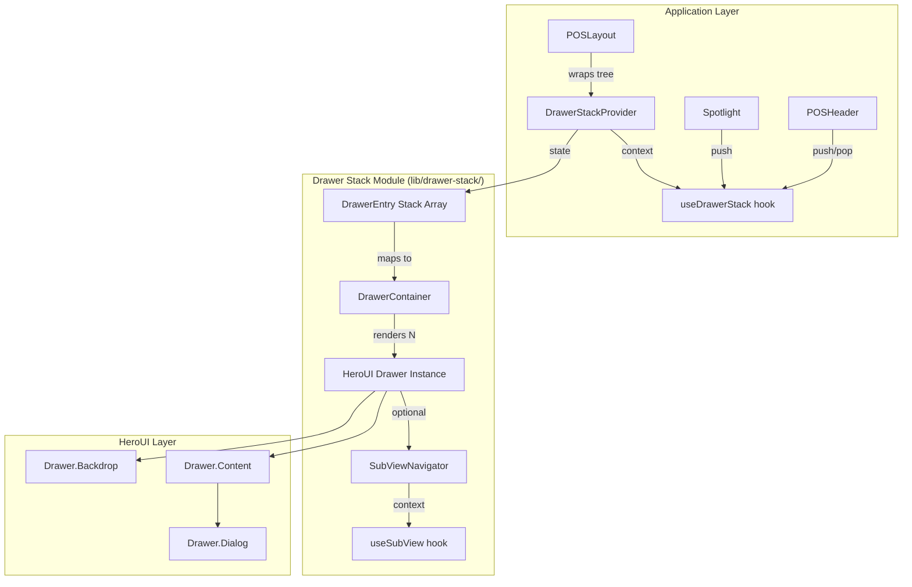
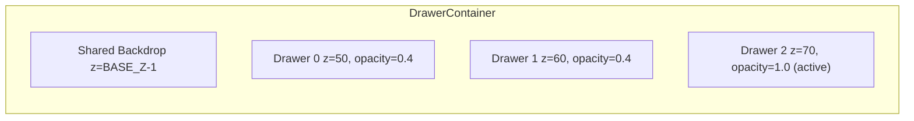

# Design Document: Drawer Stack System

## Overview

The Drawer Stack System replaces the current fragmented drawer management in the
POS layout — 4+ boolean flags (`shiftOpen`, `notifOpen`, `profileOpen`,
`aiChatOpen`), two incompatible drawer implementations (HeroUI `<Drawer>` and
custom `<DrawerOverlay>`), and hand-rolled sub-view navigation in
`ProfileDrawer` — with a single stack-based context built on HeroUI Drawer v3.

The system lives at `apps/vite-template/src/lib/drawer-stack/` and exports a
provider, a container renderer, a sub-view navigator, hooks, and all TypeScript
types from a barrel `index.ts`. It has zero application-specific imports, making
it extractable to `@abdokouta/react-drawers`.

### Key Design Decisions

1. **Stack as single source of truth**: A `DrawerEntry[]` array replaces all
   boolean open/close flags. The stack order determines z-index layering,
   backdrop behavior, and Escape key routing.
2. **HeroUI Drawer under the hood**: Every rendered drawer uses HeroUI's
   `<Drawer>` compound components (`Drawer`, `Drawer.Backdrop`,
   `Drawer.Content`, `Drawer.Dialog`, `Drawer.CloseTrigger`, `Drawer.Body`,
   `Drawer.Footer`), ensuring consistent styling and accessibility (focus trap,
   `role="dialog"`, `aria-modal`).
3. **Sub-view navigation is opt-in**: Drawers that need internal screen
   navigation (like ProfileDrawer) wrap their content in `<SubViewNavigator>`
   and use the `useSubView` hook. Simple drawers ignore it entirely.
4. **Singleton mode for migration**: A `singleton` flag on `DrawerConfig`
   prevents duplicate entries, enabling incremental migration where legacy
   boolean-driven drawers coexist with stack-managed ones.

## Architecture



### Data Flow

1. Consumer calls `push(config, Component)` via `useDrawerStack()`.
2. `DrawerStackProvider` appends a `DrawerEntry` to the stack array (React
   state).
3. `DrawerContainer` re-renders, mapping each entry to a `<Drawer isOpen>` with
   computed z-index (`BASE_Z + index * Z_STEP`).
4. The topmost drawer receives full opacity; lower drawers get dimmed via an
   opacity transition.
5. A single backdrop renders behind the entire stack. Clicking it calls
   `clear()`. Pressing Escape calls `pop()` (or `goBack()` if sub-views are
   active).
6. When the stack empties, the backdrop animates out and body scroll is
   restored.

## Components and Interfaces

### Module File Structure

```
apps/vite-template/src/lib/drawer-stack/
├── index.ts                  # Barrel export
├── types.ts                  # All TypeScript types/interfaces
├── drawer-stack-provider.tsx # Context provider + stack state + operations
├── drawer-container.tsx      # Renders stack entries as HeroUI Drawers
├── sub-view-navigator.tsx    # Internal sub-view stack for a single drawer
├── use-drawer-stack.ts       # Consumer hook (reads context)
├── use-sub-view.ts           # Sub-view consumer hook
└── constants.ts              # Z-index base, animation durations, default width
```

### Component Responsibilities

#### `DrawerStackProvider`

- Holds `DrawerEntry[]` state via `useReducer`
- Exposes `StackOperations` and read-only stack state via React context
- Handles Escape key listener at the provider level (delegates to sub-view if
  active)
- Manages body scroll lock when stack is non-empty

#### `DrawerContainer`

- Reads stack from context
- Maps each `DrawerEntry` to a HeroUI `<Drawer>` with:
  - `placement="right"`
  - `isOpen={true}` (entries only exist while open)
  - Computed `z-index` and opacity
  - Width from `DrawerConfig`
- Renders a single shared backdrop behind the stack
- Handles open/close animations via HeroUI's built-in motion

#### `SubViewNavigator`

- Wraps drawer body content
- Maintains an internal `viewId[]` stack via `useState`
- Provides `useSubView` context with `goTo`, `goBack`, `currentView`,
  `canGoBack`
- Renders animated transitions (slide-in-from-right / slide-in-from-left)
  between views
- Intercepts Escape key when sub-view depth > 1 to call `goBack` instead of
  `pop`

### Hook APIs

#### `useDrawerStack<TId extends string = string>()`

```typescript
function useDrawerStack<TId extends string = string>(): {
  // State
  stack: ReadonlyArray<DrawerEntry<TId>>;
  isOpen: boolean;
  activeDrawer: DrawerEntry<TId> | undefined;

  // Operations
  push: (config: DrawerConfig<TId>, component: React.ReactNode) => void;
  pop: () => void;
  replace: (config: DrawerConfig<TId>, component: React.ReactNode) => void;
  clear: () => void;
  popTo: (id: TId) => void;
};
```

#### `useSubView<TView extends string = string>()`

```typescript
function useSubView<TView extends string = string>(): {
  currentView: TView;
  viewHistory: ReadonlyArray<TView>;
  canGoBack: boolean;
  goTo: (viewId: TView) => void;
  goBack: () => void;
};
```

## Data Models

### Core Types (`types.ts`)

```typescript
/** Configuration for a single drawer entry */
export interface DrawerConfig<TId extends string = string> {
  /** Unique identifier for this drawer */
  id: TId;
  /** Width as pixels (number) or CSS value (string). Default: 480 */
  width?: number | string;
  /** Whether Escape key closes this drawer. Default: true */
  closeOnEscape?: boolean;
  /** Singleton mode — if true, pushing a duplicate id brings existing to top. Default: false */
  singleton?: boolean;
  /** Arbitrary metadata consumers can attach */
  metadata?: Record<string, unknown>;
}

/** A single entry in the drawer stack */
export interface DrawerEntry<TId extends string = string> {
  /** Unique instance key (uuid) for React key and internal tracking */
  instanceId: string;
  /** The drawer config */
  config: DrawerConfig<TId>;
  /** The React node to render inside the drawer */
  component: React.ReactNode;
  /** The element that triggered this drawer (for focus restoration) */
  triggerElement: Element | null;
}

/** Stack operations exposed via context */
export interface StackOperations<TId extends string = string> {
  push: (config: DrawerConfig<TId>, component: React.ReactNode) => void;
  pop: () => void;
  replace: (config: DrawerConfig<TId>, component: React.ReactNode) => void;
  clear: () => void;
  popTo: (id: TId) => void;
}

/** Full context value */
export interface DrawerStackContextValue<TId extends string = string> {
  stack: ReadonlyArray<DrawerEntry<TId>>;
  isOpen: boolean;
  activeDrawer: DrawerEntry<TId> | undefined;
  operations: StackOperations<TId>;
}

/** Sub-view navigator props */
export interface SubViewNavigatorProps<TView extends string = string> {
  /** Initial view id shown when the drawer opens */
  initialView: TView;
  /** Map of view ids to React nodes */
  views: Record<TView, React.ReactNode>;
  /** Optional callback when view changes */
  onViewChange?: (viewId: TView) => void;
}

/** Sub-view context value */
export interface SubViewContextValue<TView extends string = string> {
  currentView: TView;
  viewHistory: ReadonlyArray<TView>;
  canGoBack: boolean;
  goTo: (viewId: TView) => void;
  goBack: () => void;
}
```

### Constants (`constants.ts`)

```typescript
export const DRAWER_DEFAULTS = {
  WIDTH: 480,
  BASE_Z_INDEX: 50,
  Z_INDEX_STEP: 10,
  ANIMATION_DURATION_MS: 250,
  DIMMED_OPACITY: 0.4,
  CLOSE_ON_ESCAPE: true,
} as const;
```

### State Management

The provider uses `useReducer` with the following action types:

```typescript
type StackAction<TId extends string = string> =
  | { type: "PUSH"; entry: DrawerEntry<TId> }
  | { type: "POP" }
  | { type: "REPLACE"; entry: DrawerEntry<TId> }
  | { type: "CLEAR" }
  | { type: "POP_TO"; id: TId }
  | { type: "BRING_TO_TOP"; id: TId };
```

The reducer is a pure function:

- `PUSH`: appends entry (or delegates to `BRING_TO_TOP` if singleton + existing)
- `POP`: removes last element
- `REPLACE`: removes last, appends new (single state update)
- `CLEAR`: returns empty array
- `POP_TO`: finds index of matching id, slices to `index + 1` (no-op if not
  found)
- `BRING_TO_TOP`: removes entry at matching index, appends it to end

### Rendering Model



Each drawer's z-index: `BASE_Z_INDEX + (index * Z_INDEX_STEP)` Each drawer's
opacity: `index === stack.length - 1 ? 1.0 : DIMMED_OPACITY`
