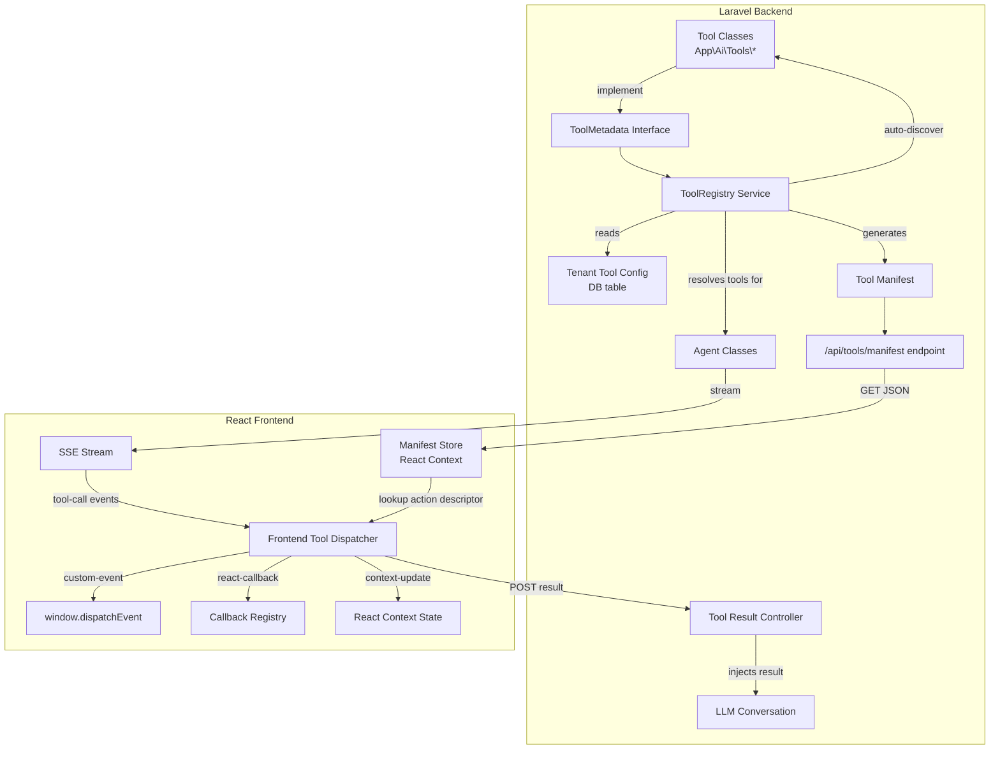
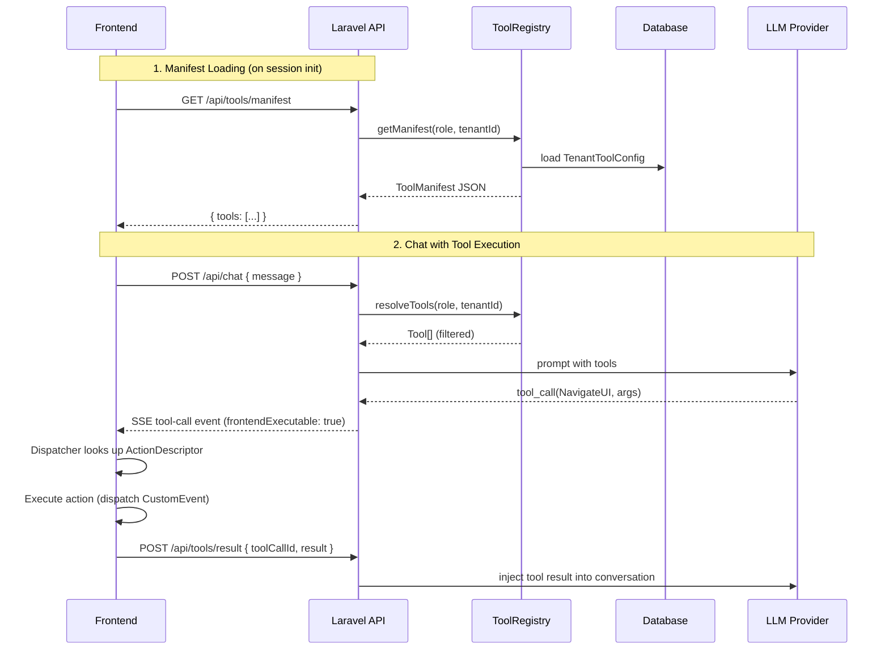

# Design Document: Dynamic AI Tool System

## Overview

The Dynamic AI Tool System replaces the current multi-file, hardcoded tool
registration pattern with a declarative, metadata-driven architecture. Today,
adding a frontend-executable tool requires changes in at least 4 places:

1. The PHP tool class (`App\Ai\Tools\*`)
2. The agent's `tools()` array (e.g., `CashierAgent::tools()`)
3. The frontend `FRONTEND_TOOL_NAMES` set in `frontend-tools.ts`
4. The `executeFrontendToolAction` switch statement in
   `frontend-tool-executor.ts`
5. The `TrustGate` static arrays for trust levels and frontend-executable flags

The new system introduces a `ToolMetadata` interface on PHP tool classes that
self-declares execution context, trust level, and an `ActionDescriptor` for
frontend tools. A `ToolRegistry` service auto-discovers these classes, resolves
per-role and per-tenant tool sets, and exposes a Tool Manifest API. The frontend
consumes this manifest to dynamically dispatch tool actions without hardcoded
switch statements.

### Design Goals

- Single-file tool definition: all metadata lives in the tool class
- Zero-registration discovery: new tools are available immediately
- Per-tenant configurability: enable/disable tools without code changes
- Backward compatibility: existing tools work during incremental migration
- Type-safe contracts: shared schemas between backend manifest and frontend
  dispatcher

## Architecture

### High-Level Architecture



### Component Interaction Flow



### Key Design Decisions

1. **Interface-based metadata over annotations/attributes**: PHP 8 attributes
   could work, but an interface with methods is more testable, IDE-friendly, and
   consistent with Laravel AI SDK's existing `Tool` interface pattern.

2. **Manifest served via dedicated endpoint (not inlined in SSE)**: The manifest
   is relatively static per session. Serving it once via REST avoids bloating
   every SSE stream and allows frontend caching.

3. **Three action types (custom-event, react-callback, context-update)**: These
   cover the three existing frontend tool patterns observed in the codebase.
   `custom-event` maps to `window.dispatchEvent` (used by NavigateUI,
   ToggleDarkMode). `react-callback` maps to registered callbacks (used by
   StartWalkthrough, HighlightElement). `context-update` enables future tools
   that set React state directly.

4. **Database-backed tenant config over config files**: Tenant tool
   configuration needs to be updatable at runtime without deployments, so a
   database table is the right choice.

5. **10-second timeout for frontend tool results**: Balances responsiveness with
   allowing time for UI animations (walkthroughs, navigation transitions).

## Components and Interfaces

### Backend Components

#### 1. `HasToolMetadata` Interface

```php
<?php

namespace App\Ai\Contracts;

interface HasToolMetadata
{
    /**
     * Execution context: 'server' or 'frontend'.
     */
    public function executionContext(): string;

    /**
     * Trust level: 'low', 'medium', or 'high'.
     */
    public function trustLevel(): string;

    /**
     * Action descriptor for frontend tools. Null for server-only tools.
     *
     * @return array{type: string, target: string, argMapping?: array<string, string>}|null
     */
    public function actionDescriptor(): ?array;
}
```

#### 2. `ToolRegistry` Service

```php
<?php

namespace App\Ai\Services;

use App\Ai\Contracts\HasToolMetadata;
use Laravel\Ai\Contracts\Tool;

class ToolRegistry
{
    /** @var array<string, Tool> Discovered tools indexed by class name */
    private array $tools = [];

    /** @var bool Whether discovery has run */
    private bool $discovered = false;

    /**
     * Auto-discover all Tool implementations in App\Ai\Tools namespace.
     */
    public function discover(): void;

    /**
     * Resolve tools for a given role and tenant.
     *
     * @return Tool[]
     */
    public function resolveForAgent(string $role, string $tenantId): array;

    /**
     * Generate the tool manifest for a role/tenant combination.
     *
     * @return array{tools: array<int, array{name: string, executionContext: string, schema: array, actionDescriptor: ?array}>}
     */
    public function getManifest(string $role, string $tenantId): array;

    /**
     * Get metadata for a tool. Returns defaults if tool doesn't implement HasToolMetadata.
     *
     * @return array{executionContext: string, trustLevel: string, actionDescriptor: ?array}
     */
    public function getMetadata(Tool $tool): array;
}
```

#### 3. `ToolManifestController`

```php
<?php

namespace App\Http\Controllers;

class ToolManifestController extends Controller
{
    /**
     * GET /api/tools/manifest
     * Returns the tool manifest for the authenticated user's role and tenant.
     */
    public function index(Request $request): JsonResponse;
}
```

#### 4. `ToolResultController`

```php
<?php

namespace App\Http\Controllers;

class ToolResultController extends Controller
{
    /**
     * POST /api/tools/result
     * Receives frontend tool execution results and injects them into the LLM conversation.
     */
    public function store(Request $request): JsonResponse;
}
```

### Frontend Components

#### 5. `ToolManifestProvider` (React Context)

```typescript
// apps/vite-template/src/contexts/ai-sidekick/tool-manifest-provider.tsx

interface ToolDescriptor {
  name: string;
  executionContext: "server" | "frontend";
  trustLevel: "low" | "medium" | "high";
  schema: Record<string, unknown>;
  actionDescriptor?: ActionDescriptor;
}

interface ActionDescriptor {
  type: "custom-event" | "react-callback" | "context-update";
  target: string;
  argMapping?: Record<string, string>;
}

interface ToolManifest {
  tools: ToolDescriptor[];
}

interface ToolManifestContextValue {
  manifest: ToolManifest | null;
  isFrontendTool(toolName: string): boolean;
  getActionDescriptor(toolName: string): ActionDescriptor | undefined;
  loading: boolean;
  error: string | null;
  refresh(): Promise<void>;
}
```

#### 6. `FrontendToolDispatcher` (replaces hardcoded executor)

```typescript
// apps/vite-template/src/contexts/ai-sidekick/frontend-tool-dispatcher.ts

interface ToolExecutionResult {
  toolCallId: string;
  success: boolean;
  message: string;
  data?: unknown;
}

interface CallbackRegistry {
  register(key: string, callback: (...args: unknown[]) => unknown): void;
  unregister(key: string): void;
  get(key: string): ((...args: unknown[]) => unknown) | undefined;
}

/**
 * Dispatches frontend tool calls based on ActionDescriptor from the manifest.
 * Replaces the hardcoded switch statement in frontend-tool-executor.ts.
 */
function dispatchFrontendTool(
  toolCallId: string,
  toolName: string,
  args: Record<string, unknown>,
  actionDescriptor: ActionDescriptor,
  callbackRegistry: CallbackRegistry,
  contextUpdater: (key: string, value: unknown) => void,
): ToolExecutionResult;
```

#### 7. `CallbackRegistry` (for react-callback action type)

```typescript
// apps/vite-template/src/contexts/ai-sidekick/callback-registry.ts

/**
 * Registry for React callbacks that frontend tools can invoke.
 * Components register callbacks on mount and unregister on unmount.
 */
class CallbackRegistryImpl implements CallbackRegistry {
  private callbacks: Map<string, (...args: unknown[]) => unknown>;

  register(key: string, callback: (...args: unknown[]) => unknown): void;
  unregister(key: string): void;
  get(key: string): ((...args: unknown[]) => unknown) | undefined;
  has(key: string): boolean;
}
```

## Data Models

### Backend Data Models

#### `tenant_tool_configs` Table

| Column     | Type        | Description                                 |
| ---------- | ----------- | ------------------------------------------- |
| id         | bigint (PK) | Auto-increment primary key                  |
| tenant_id  | string      | Tenant identifier (indexed)                 |
| tool_name  | string      | Tool class name (e.g., "NavigateUI")        |
| enabled    | boolean     | Whether the tool is enabled for this tenant |
| created_at | timestamp   | Record creation time                        |
| updated_at | timestamp   | Last modification time                      |

Unique constraint on `(tenant_id, tool_name)`.

#### `TenantToolConfig` Eloquent Model

```php
<?php

namespace App\Models;

use Illuminate\Database\Eloquent\Model;

class TenantToolConfig extends Model
{
    protected $fillable = ['tenant_id', 'tool_name', 'enabled'];

    protected $casts = ['enabled' => 'boolean'];

    /**
     * Get disabled tool names for a tenant.
     *
     * @return string[]
     */
    public static function disabledToolsFor(string $tenantId): array;
}
```

#### Tool Metadata Shape (returned by `HasToolMetadata`)

```php
[
    'executionContext' => 'frontend',       // 'server' | 'frontend'
    'trustLevel'      => 'low',            // 'low' | 'medium' | 'high'
    'actionDescriptor' => [
        'type'       => 'custom-event',    // 'custom-event' | 'react-callback' | 'context-update'
        'target'     => 'ai-navigate-ui',  // event name, callback key, or context key
        'argMapping' => [                  // optional: maps tool schema fields to action params
            'drawer'  => 'drawer',
            'section' => 'section',
        ],
    ],
]
```

### Frontend Data Models

#### Tool Manifest API Response

```json
{
  "tools": [
    {
      "name": "NavigateUI",
      "executionContext": "frontend",
      "trustLevel": "low",
      "schema": {
        "drawer": { "type": "string", "required": true },
        "section": { "type": "string", "required": false }
      },
      "actionDescriptor": {
        "type": "custom-event",
        "target": "ai-navigate-ui",
        "argMapping": {
          "drawer": "drawer",
          "section": "section",
          "element": "element"
        }
      }
    },
    {
      "name": "StartWalkthrough",
      "executionContext": "frontend",
      "trustLevel": "low",
      "schema": {
        "steps": { "type": "array", "required": true }
      },
      "actionDescriptor": {
        "type": "react-callback",
        "target": "startWalkthrough",
        "argMapping": {
          "steps": "steps"
        }
      }
    },
    {
      "name": "LookupCustomer",
      "executionContext": "server",
      "trustLevel": "low",
      "schema": {
        "query": { "type": "string", "required": true }
      }
    }
  ]
}
```

#### Tool Result Payload (POST /api/tools/result)

```json
{
  "toolCallId": "tool-abc123",
  "success": true,
  "message": "Navigated to profile → hardware.",
  "data": {
    "drawer": "profile",
    "section": "hardware"
  }
}
```

### Role-to-Tool Mapping

The `ToolRegistry` uses a role map configuration to determine which tools are
available per role. This replaces the manual `tools()` arrays in agent classes.

```php
// config/tools.php
return [
    'roles' => [
        'cashier' => [
            'ApplyPromoCode', 'ApplyDiscount', 'LookupCustomer', 'CheckStock',
            'HoldCart', 'ResumeCart', 'MergeCarts', 'AssignSeat',
            'NavigateUI', 'StartWalkthrough', 'ToggleDarkMode', 'HighlightElement',
            'SearchKnowledgeBase', 'GetVenueInfo',
        ],
        'supervisor' => [
            'ApplyPromoCode', 'ApplyDiscount', 'LookupCustomer', 'CheckStock',
            'HoldCart', 'ResumeCart', 'MergeCarts', 'AssignSeat',
            'NavigateUI', 'StartWalkthrough', 'ToggleDarkMode', 'HighlightElement',
            'SearchKnowledgeBase', 'GetVenueInfo',
            'ProcessRefund', 'VoidTransaction', 'ManageStaff', 'ViewAnalytics',
        ],
        'admin' => '*', // all tools
    ],
];
```

## Correctness Properties

_A property is a characteristic or behavior that should hold true across all
valid executions of a system — essentially, a formal statement about what the
system should do. Properties serve as the bridge between human-readable
specifications and machine-verifiable correctness guarantees._

### Property 1: Metadata Validation and Defaults

_For any_ tool class, if it implements `HasToolMetadata` and declares
`executionContext` as `"frontend"`, then `actionDescriptor()` must return a
non-null value with valid `type`, `target`, and optional `argMapping`.
Conversely, _for any_ tool class that does not implement `HasToolMetadata`, the
registry must return default metadata with `executionContext = "server"` and
`trustLevel = "low"`.

**Validates: Requirements 1.1, 1.3, 1.4**

### Property 2: Tool Resolution Filtering

_For any_ role, tenant ID, and tenant tool configuration, the set of tools
returned by `resolveForAgent(role, tenantId)` must equal the intersection of the
role's allowed tools and the tenant's enabled tools. When no `TenantToolConfig`
exists for the tenant, all role-allowed tools must be returned.

**Validates: Requirements 2.2, 3.2, 5.2, 5.3**

### Property 3: Manifest Structure Integrity

_For any_ set of resolved tools, the generated Tool Manifest must be a valid
JSON object containing a `tools` array where each entry includes `name`
(string), `executionContext` ("server" | "frontend"), `trustLevel` ("low" |
"medium" | "high"), and `schema` (object). Frontend tools must additionally
include a valid `actionDescriptor`.

**Validates: Requirements 3.1, 7.1**

### Property 4: Dispatcher Action Routing

_For any_ valid `ActionDescriptor` with type `"custom-event"`, the dispatcher
must call `window.dispatchEvent` with a `CustomEvent` whose `type` equals the
descriptor's `target` and whose `detail` contains the mapped arguments. _For
any_ descriptor with type `"react-callback"`, the dispatcher must invoke the
callback registered under the `target` key with the mapped arguments. _For any_
descriptor with type `"context-update"`, the dispatcher must call the context
updater with the `target` key and mapped arguments.

**Validates: Requirements 4.1, 4.2, 7.2, 7.3, 7.4**

### Property 5: Unknown Tool Passthrough

_For any_ tool call event where the tool name is not present in the loaded Tool
Manifest, the Frontend Tool Dispatcher must not execute any frontend action and
must treat the tool as server-only.

**Validates: Requirements 4.3**

### Property 6: Dispatcher Error Structure

_For any_ frontend tool execution that fails (unregistered callback, missing
target element, invalid action type), the dispatcher must return a result object
with `success = false` and a non-empty `message` string describing the failure.

**Validates: Requirements 4.4, 7.5**

### Property 7: Tool Result Payload Structure

_For any_ tool execution result sent back to the backend, the payload must
include `toolCallId` (string), `success` (boolean), and `message` (string). The
optional `data` field, when present, must be a valid JSON-serializable object.

**Validates: Requirements 6.1, 6.2**

### Property 8: Tenant Config Round-Trip

_For any_ tenant ID and tool name, writing an enabled/disabled configuration and
then reading it back must return the same enabled state. Disabling a tool and
then resolving tools for that tenant must exclude the disabled tool.

**Validates: Requirements 5.1, 5.2**

### Property 9: Metadata Resolution Precedence

_For any_ tool that implements both `HasToolMetadata` and is listed in a legacy
agent `tools()` array, the `ToolRegistry` must use the metadata-declared values
(execution context, trust level, action descriptor) over the legacy hardcoded
values. _For any_ tool without `HasToolMetadata`, the registry must fall back to
the legacy registration.

**Validates: Requirements 8.1, 8.2**

### Property 10: Dual-Name Dispatch Compatibility

_For any_ frontend tool, the dispatcher must correctly handle both the
PascalCase name (e.g., `"NavigateUI"`) and the camelCase name (e.g.,
`"navigateUI"`) during the migration period, executing the same action for both.

**Validates: Requirements 8.3**

## Error Handling

### Backend Error Handling

| Scenario                                                                  | Handling                                 | HTTP Status                |
| ------------------------------------------------------------------------- | ---------------------------------------- | -------------------------- |
| Tool class has invalid metadata (e.g., frontend without ActionDescriptor) | Log warning, skip tool during discovery  | N/A (startup)              |
| Manifest requested for unknown role                                       | Return empty tools array                 | 200                        |
| Manifest requested without authentication                                 | Reject request                           | 401                        |
| Tool result received for unknown toolCallId                               | Log warning, return error                | 404                        |
| Tool result received after timeout (>10s)                                 | Log warning, accept but mark as late     | 200                        |
| TenantToolConfig DB query fails                                           | Fall back to default (all tools enabled) | N/A (graceful degradation) |
| Tool discovery finds duplicate tool names                                 | Log warning, last-discovered wins        | N/A (startup)              |

### Frontend Error Handling

| Scenario                                          | Handling                                                                                          |
| ------------------------------------------------- | ------------------------------------------------------------------------------------------------- |
| Manifest fetch fails (network error)              | Retry with exponential backoff (3 attempts), fall back to legacy `FRONTEND_TOOL_NAMES`            |
| ActionDescriptor references unregistered callback | Return `{ success: false, message: "Callback 'X' not registered" }`, send error result to backend |
| ActionDescriptor has unknown action type          | Return `{ success: false, message: "Unknown action type 'X'" }`, send error result to backend     |
| CustomEvent dispatch target element not found     | Return success (event dispatched regardless; listener absence is not an error)                    |
| Context update key not found                      | Return `{ success: false, message: "Context key 'X' not found" }`                                 |
| Tool result POST to backend fails                 | Retry once, then log error locally; backend timeout will handle it                                |
| Manifest response has invalid JSON                | Fall back to legacy tool set, log error                                                           |

### Timeout Handling

The backend tracks pending frontend tool calls with a 10-second timeout:

1. When a tool call is sent to the frontend via SSE, the backend starts a timer.
2. If the frontend sends a result via `POST /api/tools/result` within 10
   seconds, the result is injected into the LLM conversation.
3. If no result arrives within 10 seconds, the backend injects a timeout error:
   `{ success: false, message: "Frontend tool execution timed out after 10 seconds" }`.
4. Late results (arriving after timeout) are logged but not injected into the
   conversation.

## Testing Strategy

### Unit Tests (Example-Based)

- **Manifest endpoint**: Verify the `/api/tools/manifest` endpoint returns 200
  with valid JSON for authenticated requests (Req 3.3)
- **Auto-discovery integration**: Verify `ToolRegistry::discover()` finds all
  tool classes in the namespace (Req 2.1, 2.4)
- **Timeout behavior**: Simulate a tool call without result, verify timeout
  error after 10 seconds (Req 6.4)
- **Manifest freshness**: Change a tenant config, request manifest, verify it
  reflects the change (Req 3.4, 5.4)
- **Tool result injection**: Send a tool result via POST, verify it's injected
  into conversation context (Req 6.3)

### Property-Based Tests

Property-based tests will use **fast-check** (TypeScript, frontend) and
**PHPUnit with data providers** (PHP, backend) to validate universal properties
across generated inputs. Each property test runs a minimum of 100 iterations.

| Property                               | Test Location                                | Library                | What's Generated                                                                              |
| -------------------------------------- | -------------------------------------------- | ---------------------- | --------------------------------------------------------------------------------------------- |
| Property 1: Metadata Validation        | `tests/Unit/ToolMetadataTest.php`            | PHPUnit data providers | Random tool metadata with varying executionContext, trustLevel, actionDescriptor combinations |
| Property 2: Tool Resolution Filtering  | `tests/Unit/ToolRegistryTest.php`            | PHPUnit data providers | Random role-tool maps, tenant configs, verify intersection logic                              |
| Property 3: Manifest Structure         | `tests/Unit/ToolManifestTest.php`            | PHPUnit data providers | Random tool sets, verify manifest JSON structure                                              |
| Property 4: Dispatcher Action Routing  | `__tests__/frontend-tool-dispatcher.test.ts` | fast-check             | Random ActionDescriptors with all three types, random args, verify correct dispatch           |
| Property 5: Unknown Tool Passthrough   | `__tests__/frontend-tool-dispatcher.test.ts` | fast-check             | Random tool names not in manifest, verify no execution                                        |
| Property 6: Dispatcher Error Structure | `__tests__/frontend-tool-dispatcher.test.ts` | fast-check             | Random failure scenarios, verify error result shape                                           |
| Property 7: Tool Result Payload        | `__tests__/frontend-tool-dispatcher.test.ts` | fast-check             | Random tool results, verify payload structure                                                 |
| Property 8: Tenant Config Round-Trip   | `tests/Unit/TenantToolConfigTest.php`        | PHPUnit data providers | Random tenant/tool/enabled combinations                                                       |
| Property 9: Metadata Precedence        | `tests/Unit/ToolRegistryTest.php`            | PHPUnit data providers | Tools with and without metadata, verify precedence                                            |
| Property 10: Dual-Name Compatibility   | `__tests__/frontend-tool-dispatcher.test.ts` | fast-check             | Random tool names in PascalCase and camelCase, verify same behavior                           |

### Integration Tests

- **End-to-end tool flow**: Send a chat message that triggers a frontend tool,
  verify SSE event contains `frontendExecutable: true` and correct
  ActionDescriptor, send result back, verify conversation continues.
- **Tenant config propagation**: Create tenant config, request manifest, verify
  filtering. Update config, request again, verify change.
- **Backward compatibility**: Mix of migrated and legacy tools, verify all
  resolve correctly through both paths.

### Test Tagging Convention

Each property-based test must include a comment referencing the design property:

```typescript
// Feature: dynamic-ai-tool-system, Property 4: Dispatcher Action Routing
```

```php
// Feature: dynamic-ai-tool-system, Property 2: Tool Resolution Filtering
```
