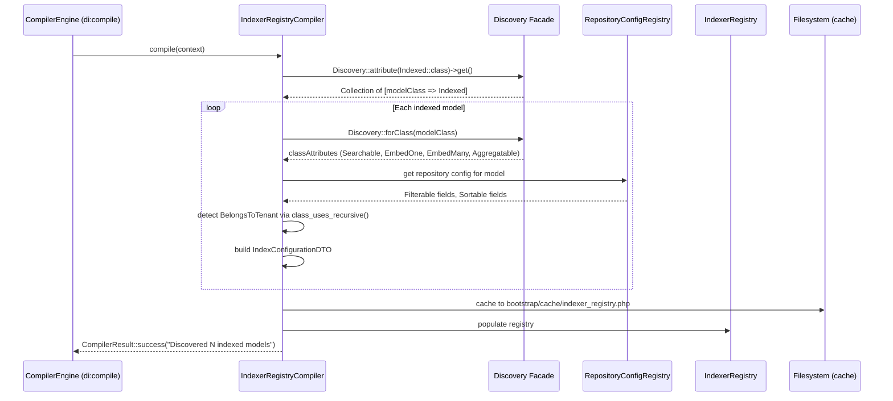
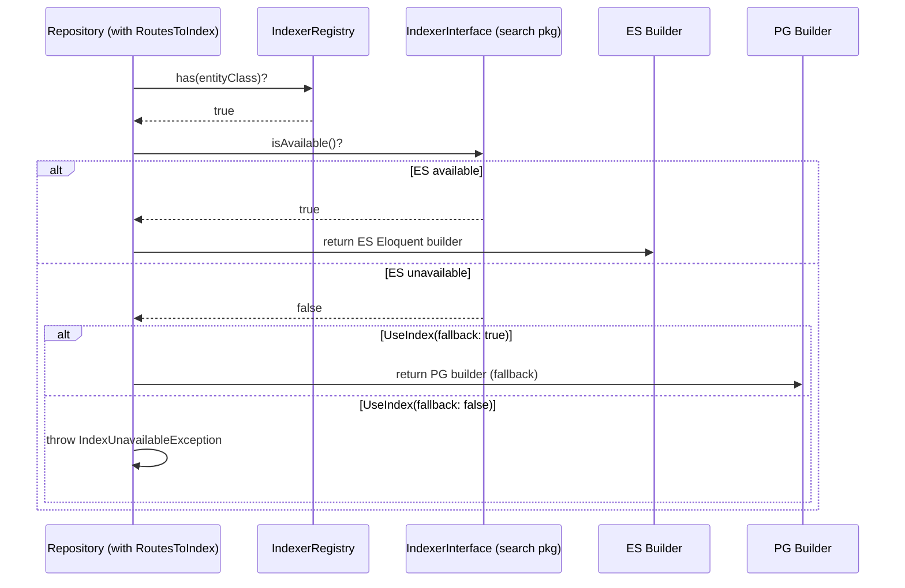

# Design Document — Framework Indexer Sub-Package

## Overview

The `framework/src/Indexer/` sub-package provides the pure PHP foundation layer
for all indexing operations in the Pixielity monorepo. It lives at
`packages/framework/src/Indexer/` under the namespace `Pixielity\Indexer`,
following the same structural pattern as `Aop/`, `Compiler/`, `Event/`, and
other framework sub-packages.

This sub-package owns the attribute definitions, contracts, traits, enums,
events, DTOs, and compile-time registry that the `search` package and
`reporting` package build on top of. It has **zero Elasticsearch dependency** —
all ES-specific implementations live in the search package
(`pixielity/laravel-search`).

### Key Design Decisions

1. **Pure PHP Foundation** — No ES client, no Scout, no external search
   dependencies. This package defines _what_ indexing means (contracts,
   attributes, DTOs) while the search package defines _how_ it's done (ES
   client, query DSL, document persistence).

2. **Zero Field Duplication** — `#[Searchable]`, `#[Filterable]`, `#[Sortable]`
   stay in the CRUD package. The `IndexerRegistry` reads them via Discovery at
   compile time and merges them into `IndexConfigurationDTO`. The `#[Indexed]`
   attribute only carries ES-specific config (analyzer, synonyms, typo
   tolerance, geo field, etc.).

3. **Compile-Time Registry** — `IndexerRegistryCompiler`
   (`#[AsCompiler(priority: 25)]`) discovers all `#[Indexed]` models, merges
   with CRUD attributes, detects tenant scoping from `BelongsToTenant` trait,
   and caches into `IndexerRegistry`. Zero runtime Discovery calls per request.

4. **Tenant Auto-Detection** — Tenant scoping is detected at compile time by
   checking `class_uses_recursive()` for `BelongsToTenant`. No `tenantScoped`
   parameter on `#[Indexed]`. The search package's bootstrapper uses this flag
   for index-per-tenant strategy.

5. **ElasticLens Patterns Adapted** — `Indexable` trait (model concern),
   `RoutesToIndex` trait (repository concern), observer chain registration,
   `excludeIndex()` override, `toIndexableArray()` document building — all
   adapted from ElasticLens to use Pixielity attributes and Discovery instead of
   config-based field maps.

6. **Interface-First** — `IndexerInterface`, `IndexManagerInterface`,
   `RecordBuilderInterface` define the API. `#[Bind]` on each interface points
   to the search package's implementation. The framework sub-package never
   imports ES classes.

## Architecture

```mermaid
graph TB
    subgraph "Framework Indexer Sub-Package (this spec)"
        IA["#[Indexed]"]
        E1["#[EmbedOne]"]
        EM["#[EmbedMany]"]
        AG["#[Aggregatable]"]
        UI["#[UseIndex]"]

        II[IndexerInterface]
        IMI[IndexManagerInterface]
        RBI[RecordBuilderInterface]

        IX[Indexable Trait]
        RTI[RoutesToIndex Trait]

        IR[IndexerRegistry]
        IRC[IndexerRegistryCompiler]
        DTO[IndexConfigurationDTO]

        ATE[AggregationType Enum]
        ISE[IndexStatus Enum]
        BSE[BuildState Enum]

        DIE[DocumentIndexed Event]
        IUE[IndexUnavailableException]
    end

    subgraph "CRUD Package (existing)"
        SA["#[Searchable]"]
        FA["#[Filterable]"]
        SOA["#[Sortable]"]
        RCR[RepositoryConfigRegistry]
    end

    subgraph "Search Package (separate spec)"
        SI[SearchIndexer]
        SIM[SearchIndexManager]
        SRB[SearchRecordBuilder]
    end

    subgraph "Reporting Package (separate spec)"
        RP[ReportingAggregator]
    end

    subgraph "Compiler System"
        CE[CompilerEngine]
    end

    IRC -->|discovers| IA
    IRC -->|reads via Discovery| SA
    IRC -->|reads via Discovery| FA
    IRC -->|reads via Discovery| SOA
    IRC -->|reads embeds| E1
    IRC -->|reads embeds| EM
    IRC -->|reads aggregations| AG
    IRC -->|populates| IR
    IR -->|stores| DTO

    CE -->|orchestrates| IRC

    IX -->|delegates to| II
    IX -->|delegates to| RBI
    RTI -->|reads config| IR
    RTI -->|reads| UI
    RTI -->|throws| IUE

    II -.->|implemented by| SI
    IMI -.->|implemented by| SIM
    RBI -.->|implemented by| SRB

    AG -.->|consumed by| RP
    ATE -.->|used by| RP
    DIE -.->|dispatched by| SRB
```



### Compile-Time Flow



### Runtime Read Routing Flow



## Components and Interfaces

### Attributes

#### `#[Indexed]` — ES Opt-In Marker (Model Class)

```php
#[Attribute(Attribute::TARGET_CLASS)]
final readonly class Indexed
{
    public const ATTR_LABEL = 'label';
    public const ATTR_GEO_FIELD = 'geoField';
    public const ATTR_RANKING_RULES = 'rankingRules';
    public const ATTR_SYNONYMS = 'synonyms';
    public const ATTR_STOP_WORDS = 'stopWords';
    public const ATTR_DISPLAYED_ATTRIBUTES = 'displayedAttributes';
    public const ATTR_DISTINCT_ATTRIBUTE = 'distinctAttribute';
    public const ATTR_TYPO_TOLERANCE = 'typoTolerance';
    public const ATTR_ANALYZER = 'analyzer';

    public function __construct(
        public string $label = '',
        public ?string $geoField = null,
        public ?array $rankingRules = null,
        public array $synonyms = [],
        public array $stopWords = [],
        public ?array $displayedAttributes = null,
        public ?string $distinctAttribute = null,
        public bool $typoTolerance = true,
        public ?string $analyzer = null,
    ) {}
}
```

Does NOT accept `searchableFields`, `filterableAttributes`,
`sortableAttributes`, or `tenantScoped`. Those are read from existing CRUD
attributes and `BelongsToTenant` trait detection.

#### `#[EmbedOne]` — Single Embedded Relationship

```php
#[Attribute(Attribute::TARGET_CLASS | Attribute::IS_REPEATABLE)]
final readonly class EmbedOne
{
    public const ATTR_FIELD = 'field';
    public const ATTR_RELATION = 'relation';
    public const ATTR_FIELDS = 'fields';

    public function __construct(
        public string $field,
        public string $relation,
        public array $fields = [],
    ) {}
}
```

#### `#[EmbedMany]` — Collection Embedded Relationship

```php
#[Attribute(Attribute::TARGET_CLASS | Attribute::IS_REPEATABLE)]
final readonly class EmbedMany
{
    public const ATTR_FIELD = 'field';
    public const ATTR_RELATION = 'relation';
    public const ATTR_FIELDS = 'fields';
    public const ATTR_LIMIT = 'limit';
    public const ATTR_ORDER_BY = 'orderBy';

    public function __construct(
        public string $field,
        public string $relation,
        public array $fields = [],
        public ?int $limit = null,
        public ?string $orderBy = null,
    ) {}
}
```

#### `#[Aggregatable]` — Aggregation Field Declaration

```php
#[Attribute(Attribute::TARGET_CLASS)]
final readonly class Aggregatable
{
    public const ATTR_FIELDS = 'fields';

    /**
     * @param array<string, AggregationType|array<AggregationType>> $fields
     */
    public function __construct(
        public array $fields,
    ) {}
}
```

#### `#[UseIndex]` — Repository Index Routing Marker

```php
#[Attribute(Attribute::TARGET_CLASS)]
final readonly class UseIndex
{
    public const ATTR_FALLBACK = 'fallback';

    public function __construct(
        public bool $fallback = true,
    ) {}
}
```

### Contracts

All interfaces use `#[Bind]` on the interface pointing to the search package's
implementation.

#### `IndexerInterface`

```php
#[Bind('Pixielity\Search\Services\SearchIndexer')]
interface IndexerInterface
{
    public function index(object $model): void;
    public function remove(object $model): void;
    public function flush(string $entityClass): void;
    public function rebuild(string $entityClass, ?callable $progress = null): void;
}
```

#### `IndexManagerInterface`

```php
#[Bind('Pixielity\Search\Services\SearchIndexManager')]
interface IndexManagerInterface
{
    public function createIndex(string $entityClass, ?int $tenantKey = null): void;
    public function deleteIndex(string $entityClass, ?int $tenantKey = null): void;
    public function rebuildIndex(string $entityClass, ?int $tenantKey = null, ?callable $progress = null): void;
    public function flushIndex(string $entityClass, ?int $tenantKey = null): void;
    public function getIndexStatus(string $entityClass, ?int $tenantKey = null): IndexStatusDTO;
    public function resolveIndexName(string $entityClass, ?int $tenantKey = null): string;
}
```

#### `RecordBuilderInterface`

```php
#[Bind('Pixielity\Search\Services\SearchRecordBuilder')]
interface RecordBuilderInterface
{
    public function build(string $entityClass, int|string $id): array;
    public function map(object $model, array $config): ?array;
    public function dryRun(string $entityClass, int|string $id): array;
}
```

### Enums

#### `AggregationType`

```php
enum AggregationType: string
{
    use Enum;

    #[Label('Terms')]
    #[Description('Bucket aggregation by unique values.')]
    case TERMS = 'terms';

    #[Label('Sum')]
    #[Description('Metric aggregation: sum of numeric values.')]
    case SUM = 'sum';

    #[Label('Average')]
    #[Description('Metric aggregation: average of numeric values.')]
    case AVG = 'avg';

    #[Label('Minimum')]
    #[Description('Metric aggregation: minimum numeric value.')]
    case MIN = 'min';

    #[Label('Maximum')]
    #[Description('Metric aggregation: maximum numeric value.')]
    case MAX = 'max';

    #[Label('Date Histogram')]
    #[Description('Bucket aggregation by date intervals.')]
    case DATE_HISTOGRAM = 'date_histogram';

    #[Label('Range')]
    #[Description('Bucket aggregation by numeric ranges.')]
    case RANGE = 'range';

    #[Label('Geo Distance')]
    #[Description('Bucket aggregation by geographic distance.')]
    case GEO = 'geo_distance';

    #[Label('Cardinality')]
    #[Description('Metric aggregation: approximate distinct count.')]
    case CARDINALITY = 'cardinality';

    #[Label('Percentiles')]
    #[Description('Metric aggregation: percentile distribution.')]
    case PERCENTILES = 'percentiles';

    public function isNumeric(): bool
    {
        return match ($this) {
            self::SUM, self::AVG, self::MIN, self::MAX, self::PERCENTILES => true,
            default => false,
        };
    }
}
```

#### `IndexStatus`

```php
enum IndexStatus: string
{
    use Enum;

    #[Label('Green')]
    #[Description('Index is healthy — all shards assigned.')]
    case GREEN = 'green';

    #[Label('Yellow')]
    #[Description('Index is degraded — replica shards unassigned.')]
    case YELLOW = 'yellow';

    #[Label('Red')]
    #[Description('Index is unhealthy — primary shards unassigned.')]
    case RED = 'red';

    #[Label('Unknown')]
    #[Description('Index health could not be determined.')]
    case UNKNOWN = 'unknown';

    public function isHealthy(): bool
    {
        return $this === self::GREEN;
    }

    public function isDegraded(): bool
    {
        return $this === self::YELLOW;
    }

    public function isUnhealthy(): bool
    {
        return match ($this) {
            self::RED, self::UNKNOWN => true,
            default => false,
        };
    }
}
```

#### `BuildState`

```php
enum BuildState: string
{
    use Enum;

    #[Label('Pending')]
    #[Description('Document indexing is queued and awaiting processing.')]
    case PENDING = 'pending';

    #[Label('Building')]
    #[Description('Document is currently being indexed.')]
    case BUILDING = 'building';

    #[Label('Completed')]
    #[Description('Document was indexed successfully.')]
    case COMPLETED = 'completed';

    #[Label('Failed')]
    #[Description('Document indexing failed.')]
    case FAILED = 'failed';

    #[Label('Skipped')]
    #[Description('Document was excluded from indexing.')]
    case SKIPPED = 'skipped';

    public function isTerminal(): bool
    {
        return match ($this) {
            self::COMPLETED, self::FAILED, self::SKIPPED => true,
            default => false,
        };
    }

    public function isActive(): bool
    {
        return match ($this) {
            self::PENDING, self::BUILDING => true,
            default => false,
        };
    }
}
```

### Traits (Concerns)

#### `Indexable` — Model Concern

Applied to models that are opted into ES indexing. Provides document building,
index management delegation, and automatic observer registration.

```php
trait Indexable
{
    public static function bootIndexable(): void
    {
        // Registers saved/deleted observers that dispatch to IndexerInterface
        // via the container. Adapted from ElasticLens ObserverRegistry pattern.
    }

    public function toIndexableArray(): array
    {
        // 1. Read #[Searchable] fields from Discovery::forClass(static::class)
        // 2. Extract model attribute values for searchable fields
        // 3. Resolve #[EmbedOne] relationships → load related, extract declared fields
        // 4. Resolve #[EmbedMany] relationships → load collection (limit/orderBy), extract fields
        // 5. Return flat document array
    }

    public function buildIndex(): array
    {
        // Delegates to RecordBuilderInterface::build(static::class, $this->getKey())
    }

    public function removeIndex(): bool
    {
        // Delegates to IndexerInterface::remove($this)
    }

    public function excludeIndex(): bool
    {
        // Default: false. Override in model to conditionally exclude records.
        return false;
    }
}
```

#### `RoutesToIndex` — Repository Concern

Applied to repositories that should transparently route reads to ES when
available.

```php
trait RoutesToIndex
{
    public function query(): Builder
    {
        // 1. Check IndexerRegistry::has(entityClass)
        // 2. If indexed, check IndexerInterface availability
        // 3. If available → return ES Eloquent builder
        // 4. If unavailable:
        //    a. #[UseIndex(fallback: true)] → return PG builder
        //    b. #[UseIndex(fallback: false)] → throw IndexUnavailableException
    }
}
```

### Events

#### `DocumentIndexed`

```php
#[AsEvent]
final readonly class DocumentIndexed
{
    public function __construct(
        public string $modelClass,
        public int|string $recordId,
        public BuildState $buildState,
        public string $indexName,
    ) {}
}
```

### Exceptions

#### `IndexUnavailableException`

```php
class IndexUnavailableException extends \RuntimeException
{
    public function __construct(string $entityClass)
    {
        parent::__construct(
            "Elasticsearch index unavailable for {$entityClass} and fallback is disabled."
        );
    }
}
```

### Registry

#### `IndexerRegistry`

Bound as `#[Scoped]` for Octane-safe per-request isolation. Loaded from cache at
boot, populated by `IndexerRegistryCompiler` at compile time.

```php
#[Scoped]
class IndexerRegistry
{
    /** @var array<class-string, IndexConfigurationDTO> */
    private array $configs = [];

    public function get(string $modelClass): IndexConfigurationDTO { ... }
    public function all(): Collection { ... }
    public function has(string $modelClass): bool { ... }
    public function tenantScoped(): Collection { ... }
    public function register(string $modelClass, IndexConfigurationDTO $config): void { ... }
    public function loadFromCache(array $cached): void { ... }
}
```

### Compiler

#### `IndexerRegistryCompiler`

```php
#[AsCompiler(priority: 25, phase: CompilerPhase::REGISTRY)]
class IndexerRegistryCompiler implements CompilerInterface
{
    public function compile(CompilerContext $context): CompilerResult
    {
        // 1. Discovery::attribute(Indexed::class)->get()
        // 2. For each model: merge Searchable, Filterable, Sortable, EmbedOne, EmbedMany, Aggregatable
        // 3. Detect BelongsToTenant via class_uses_recursive()
        // 4. Build IndexConfigurationDTO per model
        // 5. Cache to bootstrap/cache/indexer_registry.php
        // 6. Return CompilerResult::success() or CompilerResult::skipped()
    }

    public function name(): string
    {
        return 'Indexer Registry';
    }
}
```

## Data Models

### `IndexConfigurationDTO`

```php
final readonly class IndexConfigurationDTO
{
    public function __construct(
        /** @var class-string The model class. */
        public string $modelClass,

        /** The resolved ES index name (derived from model table name). */
        public string $indexName,

        /** Human-readable entity label for API responses. */
        public string $label,

        /** @var array<string, string> Searchable field → condition map from #[Searchable]. */
        public array $searchableFields,

        /** @var array<string, array<string>|string> Filterable field → operators map from #[Filterable]. */
        public array $filterableFields,

        /** @var array<string>|string Sortable fields from #[Sortable]. */
        public array|string $sortableFields,

        /** @var array<EmbedOne> EmbedOne attribute instances. */
        public array $embedOneConfigs,

        /** @var array<EmbedMany> EmbedMany attribute instances. */
        public array $embedManyConfigs,

        /** @var array<string, AggregationType|array<AggregationType>> Field → aggregation type map. */
        public array $aggregatableFields,

        /** Whether the model uses BelongsToTenant trait. */
        public bool $isTenantScoped,

        /** Geo-coordinate field name. */
        public ?string $geoField,

        /** ES boosting/scoring configuration. */
        public ?array $rankingRules,

        /** Synonym mappings. */
        public array $synonyms,

        /** Stop word list. */
        public array $stopWords,

        /** Fields returned in search results (null = all). */
        public ?array $displayedAttributes,

        /** Deduplication field. */
        public ?string $distinctAttribute,

        /** Whether fuzzy matching is enabled. */
        public bool $typoTolerance,

        /** Custom ES analyzer name. */
        public ?string $analyzer,
    ) {}
}
```

### Package Structure

```
packages/framework/src/Indexer/
├── composer.json
├── module.json
├── src/
│   ├── Attributes/
│   │   ├── Indexed.php
│   │   ├── EmbedOne.php
│   │   ├── EmbedMany.php
│   │   ├── Aggregatable.php
│   │   └── UseIndex.php
│   ├── Compiler/
│   │   └── IndexerRegistryCompiler.php
│   ├── Concerns/
│   │   ├── Indexable.php
│   │   └── RoutesToIndex.php
│   ├── Contracts/
│   │   ├── IndexerInterface.php
│   │   ├── IndexManagerInterface.php
│   │   └── RecordBuilderInterface.php
│   ├── Data/
│   │   └── IndexConfigurationDTO.php
│   ├── Enums/
│   │   ├── AggregationType.php
│   │   ├── IndexStatus.php
│   │   └── BuildState.php
│   ├── Events/
│   │   └── DocumentIndexed.php
│   ├── Exceptions/
│   │   └── IndexUnavailableException.php
│   └── Registry/
│       └── IndexerRegistry.php
```

## Correctness Properties

_A property is a characteristic or behavior that should hold true across all
valid executions of a system — essentially, a formal statement about what the
system should do. Properties serve as the bridge between human-readable
specifications and machine-verifiable correctness guarantees._

### Property 1: Attribute construction round-trip

_For any_ valid parameter combination passed to any Indexer attribute
(`Indexed`, `EmbedOne`, `EmbedMany`, `Aggregatable`, `UseIndex`), constructing
the attribute and reading back all public properties should return values
identical to the input parameters. When constructed with no arguments (where
defaults exist), all properties should match their documented defaults.

**Validates: Requirements 1.1, 2.1, 2.2, 3.1, 3.4, 3.5, 4.1**

### Property 2: DTO and Event construction round-trip

_For any_ valid set of property values, constructing `IndexConfigurationDTO` or
`DocumentIndexed` and reading back all properties should return the original
values unchanged. This includes all scalar types, enum values, arrays, and
nullable fields.

**Validates: Requirements 11.2, 16.1**

### Property 3: All Indexer enum cases have Label and Description metadata

_For any_ case of `AggregationType`, `IndexStatus`, or `BuildState`, the case
should have both a `#[Label]` and a `#[Description]` attribute with non-empty
string values.

**Validates: Requirements 5.3, 6.3, 7.3**

### Property 4: AggregationType.isNumeric() correctly classifies cases

_For any_ `AggregationType` case, `isNumeric()` should return `true` if and only
if the case is one of `SUM`, `AVG`, `MIN`, `MAX`, or `PERCENTILES`.

**Validates: Requirements 5.4**

### Property 5: IndexStatus health categorization is mutually exclusive and exhaustive

_For any_ `IndexStatus` case, exactly one of `isHealthy()`, `isDegraded()`, or
`isUnhealthy()` should return `true`. The mapping should be: `GREEN` → healthy,
`YELLOW` → degraded, `RED`/`UNKNOWN` → unhealthy.

**Validates: Requirements 6.4**

### Property 6: BuildState terminal/active categorization is mutually exclusive and exhaustive

_For any_ `BuildState` case, exactly one of `isTerminal()` or `isActive()`
should return `true`. The mapping should be: `COMPLETED`/`FAILED`/`SKIPPED` →
terminal, `PENDING`/`BUILDING` → active.

**Validates: Requirements 7.4**

### Property 7: toIndexableArray() includes all searchable fields and resolved embeds

_For any_ model with `#[Searchable]` fields and `#[EmbedOne]`/`#[EmbedMany]`
declarations, calling `toIndexableArray()` should return an array that contains
keys for every searchable field and every declared embed field name.

**Validates: Requirements 12.1, 12.2**

### Property 8: EmbedMany respects limit constraint

_For any_ `#[EmbedMany]` declaration with a non-null `limit` of N, the embedded
array in the `toIndexableArray()` output should contain at most N items,
regardless of how many related records exist.

**Validates: Requirements 12.3**

### Property 9: IndexUnavailableException message contains entity class

_For any_ non-empty string used as the entity class name, constructing
`IndexUnavailableException` should produce a message that contains that string.

**Validates: Requirements 13.5, 17.2**

### Property 10: IndexerRegistry CRUD consistency

_For any_ set of `IndexConfigurationDTO` instances registered into
`IndexerRegistry`, `has()` should return `true` for every registered model class
and `false` for unregistered classes, `get()` should return the exact DTO that
was registered, `all()` should return all registered DTOs, and `tenantScoped()`
should return only DTOs where `isTenantScoped` is `true`.

**Validates: Requirements 14.6**

## Error Handling

| Scenario                                               | Behavior                                                          | Component                              |
| ------------------------------------------------------ | ----------------------------------------------------------------- | -------------------------------------- |
| ES unavailable, `#[UseIndex(fallback: true)]`          | Silently fall back to PostgreSQL builder                          | `RoutesToIndex`                        |
| ES unavailable, `#[UseIndex(fallback: false)]`         | Throw `IndexUnavailableException` with entity class in message    | `RoutesToIndex`                        |
| `IndexerRegistry::get()` called for unregistered model | Throw `\InvalidArgumentException`                                 | `IndexerRegistry`                      |
| No `#[Indexed]` models found during compilation        | Return `CompilerResult::skipped('No indexed models found')`       | `IndexerRegistryCompiler`              |
| `#[EmbedOne]` relation returns null                    | Include `null` or empty object for that embed field in document   | `Indexable::toIndexableArray()`        |
| `#[EmbedMany]` relation returns empty collection       | Include empty array for that embed field in document              | `Indexable::toIndexableArray()`        |
| Model's `excludeIndex()` returns `true`                | `RecordBuilderInterface::map()` returns `null`, record is skipped | `Indexable` / `RecordBuilderInterface` |
| Cache file missing at boot                             | `IndexerRegistry` falls back to runtime Discovery resolution      | `IndexerRegistry`                      |

## Testing Strategy

### Unit Tests (Example-Based)

Unit tests cover structural constraints, specific examples, and edge cases:

- **Attribute structure**: Verify `#[Indexed]`, `#[EmbedOne]`, `#[EmbedMany]`,
  `#[Aggregatable]`, `#[UseIndex]` have correct `Attribute::TARGET_CLASS`
  targets, `final readonly` modifiers, `IS_REPEATABLE` flags, and `ATTR_*`
  constants (Requirements 1.2–1.5, 2.3–2.5, 3.2–3.3, 3.6, 4.2–4.4)
- **Interface structure**: Verify `IndexerInterface`, `IndexManagerInterface`,
  `RecordBuilderInterface` define correct method signatures and have `#[Bind]`
  annotations (Requirements 8.1–8.4, 9.1–9.3, 10.1–10.3)
- **Enum cases**: Verify `AggregationType`, `IndexStatus`, `BuildState` have
  correct backing values and use `Enum` trait (Requirements 5.1–5.2, 6.1–6.2,
  7.1–7.2)
- **Event structure**: Verify `DocumentIndexed` is `final readonly` with
  `#[AsEvent]` and carries only scalar/enum properties (Requirements 11.1,
  11.3–11.4)
- **Compiler annotation**: Verify `IndexerRegistryCompiler` has
  `#[AsCompiler(priority: 25, phase: CompilerPhase::REGISTRY)]` and implements
  `CompilerInterface` (Requirements 15.1–15.2)
- **Compiler skip**: Verify `CompilerResult::skipped()` returned when no indexed
  models found (Requirement 15.5)
- **Exception hierarchy**: Verify `IndexUnavailableException` extends
  `\RuntimeException` (Requirement 17.1)

### Integration Tests

Integration tests cover component interactions with mocked dependencies:

- **Indexable trait observer registration**: Verify `bootIndexable()` registers
  `saved`/`deleted` model events (Requirement 12.5)
- **Indexable trait delegation**: Verify `buildIndex()` delegates to
  `RecordBuilderInterface::build()`, `removeIndex()` delegates to
  `IndexerInterface::remove()` (Requirement 12.4)
- **RoutesToIndex routing**: Mock `IndexerRegistry` and `IndexerInterface`,
  verify ES builder returned when available, PG builder on fallback, exception
  when fallback disabled (Requirements 13.1–13.5)
- **IndexerRegistryCompiler compilation**: Mock Discovery and
  RepositoryConfigRegistry, verify cache file written with correct merged
  configs (Requirements 15.3–15.4)
- **IndexerRegistry Discovery integration**: Mock Discovery facade, verify
  `#[Searchable]`, `#[Filterable]`, `#[Sortable]`, `#[EmbedOne]`,
  `#[EmbedMany]`, `#[Aggregatable]` are read correctly (Requirements 14.1–14.4)

### Property-Based Tests

Property-based tests use a PBT library (e.g., `eris/eris` or `innmind/black-box`
for PHP) with minimum 100 iterations per property. Each test references its
design document property.

| Property    | Test Description                                                                                       | Tag                                                                                                                      |
| ----------- | ------------------------------------------------------------------------------------------------------ | ------------------------------------------------------------------------------------------------------------------------ |
| Property 1  | Generate random valid parameters for each attribute, construct, verify all properties preserved        | `Feature: framework-indexer, Property 1: Attribute construction round-trip`                                              |
| Property 2  | Generate random DTO/Event property values, construct, verify all properties preserved                  | `Feature: framework-indexer, Property 2: DTO and Event construction round-trip`                                          |
| Property 3  | Iterate all cases of all three enums, verify Label and Description present                             | `Feature: framework-indexer, Property 3: All Indexer enum cases have Label and Description metadata`                     |
| Property 4  | For each AggregationType case, verify isNumeric() matches expected set                                 | `Feature: framework-indexer, Property 4: AggregationType.isNumeric() correctly classifies cases`                         |
| Property 5  | For each IndexStatus case, verify exactly one health category is true                                  | `Feature: framework-indexer, Property 5: IndexStatus health categorization is mutually exclusive and exhaustive`         |
| Property 6  | For each BuildState case, verify exactly one of isTerminal/isActive is true                            | `Feature: framework-indexer, Property 6: BuildState terminal/active categorization is mutually exclusive and exhaustive` |
| Property 7  | Generate random model configs with searchable fields and embeds, verify toIndexableArray() output keys | `Feature: framework-indexer, Property 7: toIndexableArray() includes all searchable fields and resolved embeds`          |
| Property 8  | Generate random EmbedMany configs with various limits, verify output array length ≤ limit              | `Feature: framework-indexer, Property 8: EmbedMany respects limit constraint`                                            |
| Property 9  | Generate random entity class strings, verify exception message contains the string                     | `Feature: framework-indexer, Property 9: IndexUnavailableException message contains entity class`                        |
| Property 10 | Generate random sets of IndexConfigurationDTOs, register, verify has/get/all/tenantScoped consistency  | `Feature: framework-indexer, Property 10: IndexerRegistry CRUD consistency`                                              |
