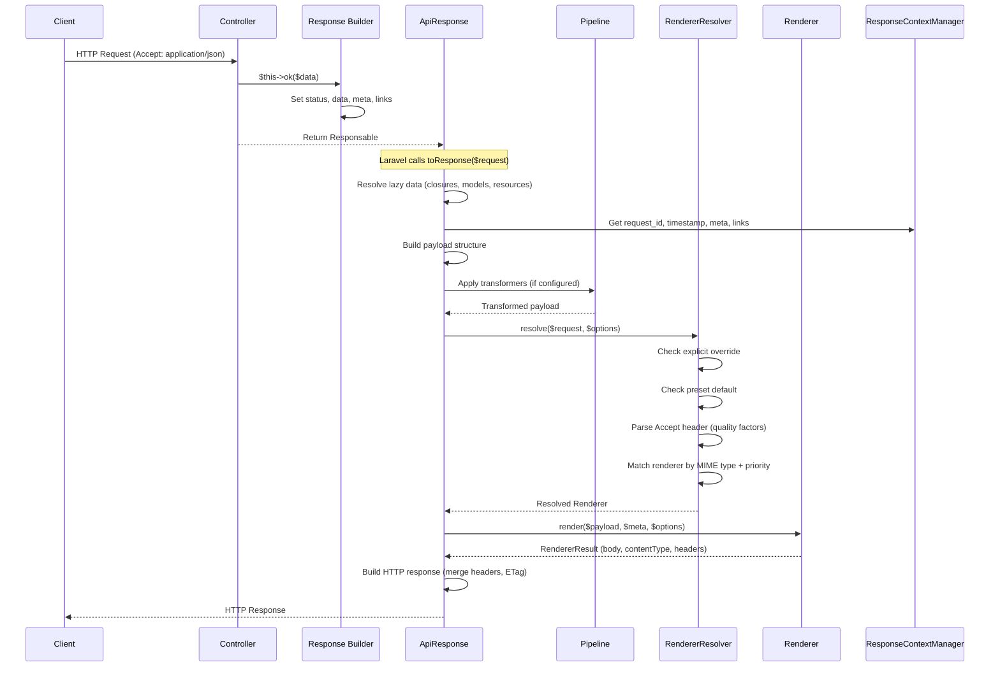
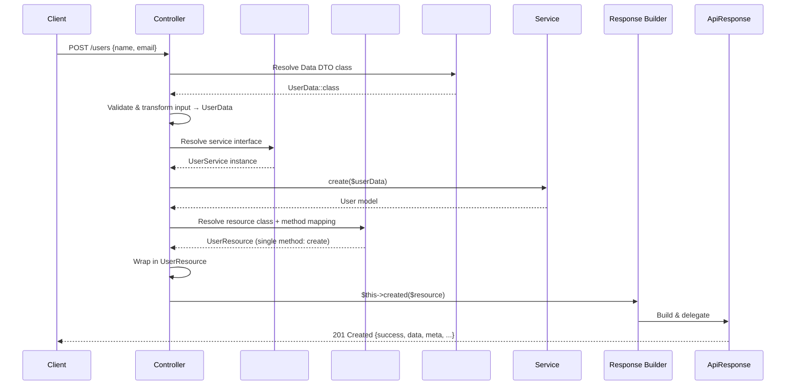
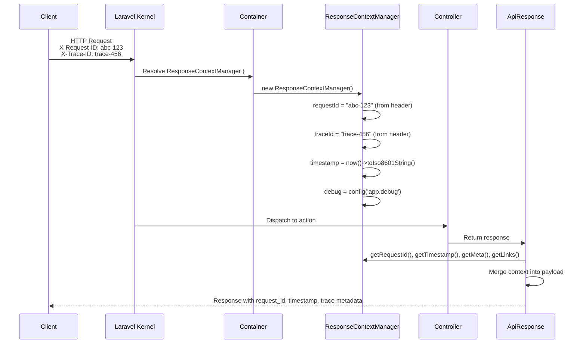

# Design Document: Framework Response Sub-Package

## Overview

The Framework Response sub-package (`packages/framework/src/Response/`) provides
a unified, fluent API response system for the Pixielity framework under
namespace `Pixielity\Response`. It replaces the legacy standalone Response
package (`.docs/Response/`) by integrating directly into the framework monorepo
as a sub-package following the same pattern as `Routing`, `Container`, etc.

The system follows a layered architecture:

1. **Builder Layer** — `Response` fluent builder collects response state
   (status, data, meta, links, headers, errors, ETag, preset, renderer, pipeline
   transformers).
2. **Response Layer** — `ApiResponse` implements Laravel's `Responsable`
   contract, resolves lazy data, builds the payload structure, applies pipeline
   transformers, delegates to the renderer, and returns a Symfony HTTP response.
3. **Rendering Layer** — `RendererResolver` performs content negotiation via
   Accept header parsing, resolving to a `Renderer` (JSON, XML, View, Stream)
   that produces a `RendererResult` value object.
4. **Context Layer** — `ResponseContextManager` provides request-scoped
   infrastructure metadata (request ID, trace ID, timestamp, API version, debug
   flag) automatically merged into every response.
5. **Preset Layer** — `ApiPreset`, `AdminPreset`, `MobilePreset` provide
   pre-configured defaults for different client types.
6. **Integration Layer** — `InteractsWithResponse` trait on the base
   `Controller`, plus `#[UseData]` and `#[UseResource]` attribute integration
   for CRUD response transformation.

All request-scoped components use `#[Scoped]` for Octane safety. Stateless
singletons use `#[Singleton]`. Renderers and presets are auto-discovered via
`#[AsRenderer]` and `#[AsPreset]` attributes.

## Architecture

### Component Relationship Diagram

```mermaid
graph TB
    %% ─────────────────────────────────────────────────────────
    %% Controller Layer
    %% The base Controller composes interaction traits that
    %% delegate to the Response sub-package, CRUD services,
    %% and auth/request helpers. #[UseService], #[UseData],
    %% and #[UseResource] attributes on concrete controllers
    %% drive automatic service resolution and response wrapping.
    %% ─────────────────────────────────────────────────────────
    subgraph "Controller Layer (Routing Package)"
        C["Controller<br/>(abstract base)"]
        IWR["InteractsWithResponse<br/>(trait — delegates to Facade)"]
        IWRes["InteractsWithResources<br/>(trait — resource/collection wrapping)"]
        IWS["InteractsWithServices<br/>(trait — #[UseService] resolution)"]
        IWP["InteractsWithPagination<br/>(trait — paginated responses)"]
        IWA["InteractsWithAuth<br/>(trait — user/role/permission)"]
        IWReq["InteractsWithRequest<br/>(trait — query/input helpers)"]
        IWB["InteractsWithBulkOperations<br/>(trait — bulk CRUD)"]
    end

    %% ─────────────────────────────────────────────────────────
    %% CRUD Attribute Layer
    %% These attributes live in the CRUD package but are read
    %% by the Controller/Response layer to auto-resolve DTOs,
    %% API Resources, and service interfaces.
    %% ─────────────────────────────────────────────────────────
    subgraph "CRUD Attributes (CRUD Package)"
        USD["#[UseService]<br/>(resolves service interface)"]
        UDD["#[UseData]<br/>(resolves Spatie Data DTO)"]
        URD["#[UseResource]<br/>(resolves API Resource class)"]
    end

    %% ─────────────────────────────────────────────────────────
    %% Builder Layer
    %% ResponseFactory is a singleton that creates fresh
    %% Response Builder instances. The Facade provides static
    %% access. Presets configure the builder with defaults.
    %% ─────────────────────────────────────────────────────────
    subgraph "Builder Layer (Response Sub-Package)"
        RFacade["Response Facade<br/>(static proxy → ResponseFactory)"]
        RF["ResponseFactory<br/>#[Singleton]"]
        RB["Response Builder<br/>#[Scoped] #[Bind]<br/>uses: HasLinks, HasMeta,<br/>HasPagination, ResolvesLazyData"]
    end

    %% ─────────────────────────────────────────────────────────
    %% Response Layer
    %% ApiResponse implements Responsable. It resolves lazy
    %% data, builds the payload, runs pipeline transformers,
    %% delegates to the renderer, and returns the HTTP response.
    %% ─────────────────────────────────────────────────────────
    subgraph "Response Layer (Response Sub-Package)"
        AR["ApiResponse<br/>#[Scoped] #[Bind]<br/>implements Responsable<br/>uses: HasLinks, HasMeta, ResolvesLazyData"]
        Pipeline["Laravel Pipeline<br/>(Illuminate\\Pipeline\\Pipeline)"]
    end

    %% ─────────────────────────────────────────────────────────
    %% Rendering Layer
    %% RendererResolver performs content negotiation via Accept
    %% header parsing. Each Renderer is auto-discovered via
    %% #[AsRenderer] and produces a RendererResult value object.
    %% ─────────────────────────────────────────────────────────
    subgraph "Rendering Layer (Response Sub-Package)"
        RR["DefaultRendererResolver<br/>#[Scoped] #[Bind]<br/>(Accept header negotiation)"]
        JR["JsonRenderer<br/>#[AsRenderer] priority: 50<br/>(application/json, */* fallback)"]
        XR["XmlRenderer<br/>#[AsRenderer] priority: 0<br/>(application/xml, text/xml)"]
        VR["ViewRenderer<br/>#[AsRenderer] priority: -10<br/>(text/html via Laravel View)"]
        SR["StreamRenderer<br/>#[AsRenderer] priority: -20<br/>(SSE, file streams)"]
        RResult["RendererResult<br/>(final readonly — body, contentType, headers)"]
    end

    %% ─────────────────────────────────────────────────────────
    %% Context Layer
    %% ResponseContextManager is request-scoped. It captures
    %% request ID, trace ID, timestamp, and debug flag at
    %% construction. Merged into every response automatically.
    %% ─────────────────────────────────────────────────────────
    subgraph "Context Layer (Response Sub-Package)"
        RCM["ResponseContextManager<br/>#[Scoped] #[Bind] #[Config]<br/>(request_id, trace_id, timestamp, debug)"]
    end

    %% ─────────────────────────────────────────────────────────
    %% Preset Layer
    %% Presets are singletons (no mutable state). Each provides
    %% default renderer, headers, meta, JSON flags, and debug
    %% settings for a specific client type.
    %% ─────────────────────────────────────────────────────────
    subgraph "Preset Layer (Response Sub-Package)"
        AP["ApiPreset<br/>#[Singleton] #[AsPreset]<br/>(strict headers, versioning)"]
        AdP["AdminPreset<br/>#[Singleton] #[AsPreset]<br/>(relaxed headers, debug on)"]
        MP["MobilePreset<br/>#[Singleton] #[AsPreset]<br/>(minimal headers, compact JSON)"]
    end

    %% ─────────────────────────────────────────────────────────
    %% Concern Traits (shared by Builder + ApiResponse)
    %% ─────────────────────────────────────────────────────────
    subgraph "Concerns (Shared Traits)"
        HL["HasLinks<br/>(HATEOAS link management)"]
        HM["HasMeta<br/>(metadata key-value pairs)"]
        HP["HasPagination<br/>(LengthAware + Cursor extraction)"]
        RLD["ResolvesLazyData<br/>(Closure, Model, Collection → array)"]
    end

    %% ═══════════════════════════════════════════════════════
    %% EDGES — Controller Layer
    %% ═══════════════════════════════════════════════════════
    C -->|"composes"| IWR
    C -->|"composes"| IWRes
    C -->|"composes"| IWS
    C -->|"composes"| IWP
    C -->|"composes"| IWA
    C -->|"composes"| IWReq
    C -->|"composes"| IWB

    %% ═══════════════════════════════════════════════════════
    %% EDGES — CRUD Attributes → Controller
    %% ═══════════════════════════════════════════════════════
    USD -.->|"read by InteractsWithServices"| IWS
    UDD -.->|"read for input/output DTO transform"| C
    URD -.->|"read for resource wrapping"| IWRes

    %% ═══════════════════════════════════════════════════════
    %% EDGES — Controller → Builder
    %% ═══════════════════════════════════════════════════════
    IWR -->|"$this->ok() delegates to"| RFacade
    RFacade -->|"proxies to"| RF
    RF -->|"creates fresh"| RB

    %% ═══════════════════════════════════════════════════════
    %% EDGES — Builder → Response
    %% ═══════════════════════════════════════════════════════
    RB -->|"toResponse() delegates to"| AR

    %% ═══════════════════════════════════════════════════════
    %% EDGES — ApiResponse internals
    %% ═══════════════════════════════════════════════════════
    AR -->|"applies transformers via"| Pipeline
    AR -->|"resolves renderer via"| RR
    AR -->|"merges context from"| RCM

    %% ═══════════════════════════════════════════════════════
    %% EDGES — Renderer Resolution
    %% ═══════════════════════════════════════════════════════
    RR -->|"selects"| JR
    RR -->|"selects"| XR
    RR -->|"selects"| VR
    RR -->|"selects"| SR
    JR -->|"produces"| RResult
    XR -->|"produces"| RResult
    VR -->|"produces"| RResult
    SR -->|"produces"| RResult

    %% ═══════════════════════════════════════════════════════
    %% EDGES — Presets → Factory
    %% ═══════════════════════════════════════════════════════
    RF -->|"api() uses"| AP
    RF -->|"admin() uses"| AdP
    RF -->|"mobile() uses"| MP

    %% ═══════════════════════════════════════════════════════
    %% EDGES — Concerns used by Builder + ApiResponse
    %% ═══════════════════════════════════════════════════════
    RB -.->|"uses trait"| HL
    RB -.->|"uses trait"| HM
    RB -.->|"uses trait"| HP
    RB -.->|"uses trait"| RLD
    AR -.->|"uses trait"| HL
    AR -.->|"uses trait"| HM
    AR -.->|"uses trait"| RLD
```



### Content Negotiation Flow



### Controller Integration Flow



### Request Lifecycle with ResponseContextManager



## Components and Interfaces

### Contracts

All contracts reside in the shared contracts package at
`Pixielity\Contracts\Framework\Response`. Each contract defines the public API
that the Response sub-package's concrete classes implement. The `#[Bind]`
attribute on each implementation points back to these contracts for automatic
container resolution.

#### ResponseBuilderInterface

The fluent builder contract. Every chainable method returns `static` for fluent
chaining. The builder implements `Responsable` so Laravel can auto-convert it to
an HTTP response when returned from a controller.

```php
<?php

declare(strict_types=1);

namespace Pixielity\Contracts\Framework\Response;

use Illuminate\Contracts\Support\Responsable;

/**
 * Contract for the fluent response builder.
 *
 * Defines the chainable API for constructing API responses. The builder
 * collects response state (status, data, meta, links, headers, errors,
 * ETag, preset, renderer, pipeline transformers) and delegates to
 * ApiResponse for final HTTP response generation.
 *
 * Implements Responsable so that returning a builder from a controller
 * automatically triggers toResponse() via Laravel's response pipeline.
 *
 * @template TData The type of data payload this builder carries.
 *
 * @see \Pixielity\Response\Builders\Response The concrete implementation.
 */
interface ResponseBuilder extends Responsable
{
    /**
     * Mark the response as a success response.
     *
     * Sets the success flag to true. This is the default state.
     *
     * @return static Fluent interface.
     */
    public function success(): static;

    /**
     * Mark the response as an error response.
     *
     * Sets the success flag to false.
     *
     * @return static Fluent interface.
     */
    public function error(): static;

    /**
     * Set a custom HTTP status code.
     *
     * @param  int    $status HTTP status code (100-599).
     * @return static Fluent interface.
     */
    public function status(int $status): static;

    /**
     * Create a 200 OK response.
     *
     * Sets status to 200, marks as success, and optionally assigns data.
     *
     * @param  mixed  $data Optional data payload.
     * @return static Fluent interface.
     */
    public function ok(mixed $data = null): static;

    /**
     * Create a 201 Created response.
     *
     * Sets status to 201, marks as success, and optionally assigns data.
     *
     * @param  mixed  $data Optional created resource data.
     * @return static Fluent interface.
     */
    public function created(mixed $data = null): static;

    /**
     * Create a 202 Accepted response.
     *
     * Sets status to 202, marks as success, and optionally assigns data.
     *
     * @param  mixed  $data Optional data payload.
     * @return static Fluent interface.
     */
    public function accepted(mixed $data = null): static;

    /**
     * Create a 204 No Content response.
     *
     * Sets status to 204, marks as success, and clears data.
     *
     * @return static Fluent interface.
     */
    public function noContent(): static;

    /**
     * Create a 400 Bad Request response.
     *
     * Sets status to 400, marks as error, and optionally sets message.
     *
     * @param  string|null $message Optional error message.
     * @return static      Fluent interface.
     */
    public function badRequest(?string $message = null): static;

    /**
     * Create a 401 Unauthorized response.
     *
     * Sets status to 401, marks as error, and optionally sets message.
     *
     * @param  string|null $message Optional error message.
     * @return static      Fluent interface.
     */
    public function unauthorized(?string $message = null): static;

    /**
     * Create a 403 Forbidden response.
     *
     * Sets status to 403, marks as error, and optionally sets message.
     *
     * @param  string|null $message Optional error message.
     * @return static      Fluent interface.
     */
    public function forbidden(?string $message = null): static;

    /**
     * Create a 404 Not Found response.
     *
     * Sets status to 404, marks as error, and optionally sets message.
     *
     * @param  string|null $message Optional error message.
     * @return static      Fluent interface.
     */
    public function notFound(?string $message = null): static;

    /**
     * Create a 409 Conflict response.
     *
     * Sets status to 409, marks as error, and optionally sets message.
     *
     * @param  string|null $message Optional error message.
     * @return static      Fluent interface.
     */
    public function conflict(?string $message = null): static;

    /**
     * Create a 422 Unprocessable Entity response.
     *
     * Sets status to 422, marks as error, and optionally sets
     * field-keyed validation errors and message.
     *
     * @param  array<string, array<string>>|null $errors  Validation errors keyed by field name.
     * @param  string|null                       $message Optional error message.
     * @return static                            Fluent interface.
     */
    public function unprocessable(?array $errors = null, ?string $message = null): static;

    /**
     * Create a 500 Internal Server Error response.
     *
     * Sets status to 500, marks as error, and optionally sets message.
     *
     * @param  string|null $message Optional error message.
     * @return static      Fluent interface.
     */
    public function serverError(?string $message = null): static;

    /**
     * Set the response data payload.
     *
     * Accepts various data types including Eloquent models, collections,
     * paginators, JSON resources, arrays, and closures for lazy loading.
     *
     * @param  TData|Closure $data The data payload (array, model, resource, or lazy closure).
     * @return static        Fluent interface.
     */
    public function data(mixed $data): static;

    /**
     * Set paginated data.
     *
     * Automatically extracts pagination metadata (current_page, last_page,
     * per_page, total) and HATEOAS navigation links (first, last, prev, next)
     * from the paginator instance.
     *
     * @param  LengthAwarePaginator|CursorPaginator $paginator The paginator instance.
     * @return static                               Fluent interface.
     */
    public function paginate(\Illuminate\Contracts\Pagination\LengthAwarePaginator|\Illuminate\Contracts\Pagination\CursorPaginator $paginator): static;

    /**
     * Set the human-readable response message.
     *
     * @param  string $message The response message.
     * @return static Fluent interface.
     */
    public function message(string $message): static;

    /**
     * Set validation errors.
     *
     * @param  array<string, array<string>> $errors Field-keyed validation errors.
     * @return static                       Fluent interface.
     */
    public function errors(array $errors): static;

    /**
     * Set response metadata.
     *
     * Metadata is merged into the 'meta' section of the response payload.
     *
     * @param  array<string, mixed> $meta Metadata key-value pairs.
     * @return static               Fluent interface.
     */
    public function meta(array $meta): static;

    /**
     * Add a HATEOAS link.
     *
     * Links are included in the 'links' section of the response payload.
     *
     * @param  string $rel    Link relation (e.g., 'self', 'edit', 'delete').
     * @param  string $href   Link URL.
     * @param  string $method HTTP method (GET, POST, PUT, DELETE, etc.).
     * @return static Fluent interface.
     */
    public function link(string $rel, string $href, string $method = 'GET'): static;

    /**
     * Add multiple HATEOAS links at once.
     *
     * @param  array<string, array{href: string, method?: string}> $links Links to add.
     * @return static                                              Fluent interface.
     */
    public function links(array $links): static;

    /**
     * Add a custom HTTP response header.
     *
     * @param  string $name  Header name.
     * @param  string $value Header value.
     * @return static Fluent interface.
     */
    public function header(string $name, string $value): static;

    /**
     * Add multiple custom HTTP response headers.
     *
     * @param  array<string, string> $headers Header name-value pairs.
     * @return static                Fluent interface.
     */
    public function headers(array $headers): static;

    /**
     * Set an explicit ETag value.
     *
     * Overrides the auto-generated MD5 hash of the data payload.
     *
     * @param  string $etag The ETag value.
     * @return static Fluent interface.
     */
    public function etag(string $etag): static;

    /**
     * Apply a response preset.
     *
     * Presets provide default renderer, headers, meta, JSON flags,
     * and debug settings for a specific client type (API, Admin, Mobile).
     *
     * @param  Preset $preset The preset to apply.
     * @return static Fluent interface.
     */
    public function preset(Preset $preset): static;

    /**
     * Override content negotiation with an explicit renderer.
     *
     * Bypasses Accept header parsing and preset defaults.
     *
     * @param  Renderer $renderer The renderer to use.
     * @return static   Fluent interface.
     */
    public function renderer(Renderer $renderer): static;

    /**
     * Add pipeline transformers.
     *
     * Transformers are applied to the payload array via Laravel's Pipeline
     * after the payload is built but before rendering.
     *
     * @param  array<class-string> $transformers Pipeline transformer class names.
     * @return static              Fluent interface.
     */
    public function through(array $transformers): static;

    /**
     * Enable performance metrics in the response.
     *
     * Includes execution_time and memory_usage in the 'debug' section
     * of the response payload.
     *
     * @return static Fluent interface.
     */
    public function metrics(): static;
}
```

#### ApiResponseInterface

The Responsable output class contract. ApiResponse is the final step before HTTP
output — it resolves lazy data, builds the payload, runs pipeline transformers,
delegates to the renderer, and returns a Symfony HTTP response.

```php
<?php

declare(strict_types=1);

namespace Pixielity\Contracts\Framework\Response;

use Illuminate\Contracts\Support\Responsable;

/**
 * Contract for the unified API response.
 *
 * ApiResponse is the bridge between the fluent builder and the HTTP layer.
 * It implements Responsable so Laravel calls toResponse($request) automatically.
 *
 * The toResponse() pipeline:
 *   1. Resolve lazy data (closures → concrete values, models → arrays)
 *   2. Build payload structure (success, message, timestamp, request_id, data, meta, links, errors, debug)
 *   3. Merge context from ResponseContextManager (request_id, trace_id, timestamp)
 *   4. Apply pipeline transformers via Laravel's Pipeline (if configured)
 *   5. Resolve renderer via RendererResolver (content negotiation)
 *   6. Render payload → RendererResult (body, contentType, headers)
 *   7. Build final HTTP response with merged headers and ETag
 *
 * @template TData The type of data payload.
 *
 * @see \Pixielity\Response\Http\ApiResponse The concrete implementation.
 */
interface ApiResponse extends Responsable
{
    /**
     * Mark as success response.
     *
     * Sets the success flag to true in the response payload.
     *
     * @return self Fluent interface.
     */
    public function success(): self;

    /**
     * Mark as error response.
     *
     * Sets the success flag to false in the response payload.
     *
     * @return self Fluent interface.
     */
    public function error(): self;

    /**
     * Set the HTTP status code.
     *
     * @param  int  $status HTTP status code (100-599).
     * @return self Fluent interface.
     */
    public function withStatus(int $status): self;

    /**
     * Set the human-readable response message.
     *
     * @param  string $message The response message.
     * @return self   Fluent interface.
     */
    public function withMessage(string $message): self;

    /**
     * Set the primary data payload.
     *
     * Accepts arrays, Eloquent models, JSON resources, or closures
     * for lazy loading. Lazy data is resolved in toResponse().
     *
     * @param  mixed $data The data payload.
     * @return self  Fluent interface.
     */
    public function withData(mixed $data): self;

    /**
     * Set response metadata.
     *
     * Merged into the 'meta' section of the response payload alongside
     * context metadata from ResponseContextManager.
     *
     * @param  array<string, mixed> $meta Metadata key-value pairs.
     * @return self                 Fluent interface.
     */
    public function withMeta(array $meta): self;

    /**
     * Add a HATEOAS link to the response.
     *
     * Merged into the 'links' section alongside context links.
     *
     * @param  string $rel    Link relation (e.g., 'self', 'edit', 'delete').
     * @param  string $href   Link URL.
     * @param  string $method HTTP method (default: GET).
     * @return self   Fluent interface.
     */
    public function withLink(string $rel, string $href, string $method = 'GET'): self;

    /**
     * Set validation errors.
     *
     * Included in the 'errors' section of the response payload.
     * Typically used with 422 Unprocessable Entity responses.
     *
     * @param  array<string, array<string>> $errors Field-keyed validation errors.
     * @return self                         Fluent interface.
     */
    public function withErrors(array $errors): self;

    /**
     * Add a custom HTTP response header.
     *
     * @param  string $name  Header name.
     * @param  string $value Header value.
     * @return self   Fluent interface.
     */
    public function withHeader(string $name, string $value): self;

    /**
     * Add multiple custom HTTP response headers.
     *
     * @param  array<string, string> $headers Header name-value pairs.
     * @return self                  Fluent interface.
     */
    public function withHeaders(array $headers): self;

    /**
     * Set an explicit ETag value.
     *
     * Overrides the auto-generated MD5 hash. Included as both a
     * payload field and an HTTP ETag header wrapped in double quotes.
     *
     * @param  string $etag The ETag value.
     * @return self   Fluent interface.
     */
    public function withETag(string $etag): self;

    /**
     * Apply a response preset.
     *
     * Provides default renderer, headers, meta, JSON flags, and
     * debug settings for a specific client type.
     *
     * @param  Preset $preset The preset to apply.
     * @return self   Fluent interface.
     */
    public function withPreset(Preset $preset): self;

    /**
     * Override content negotiation with an explicit renderer.
     *
     * Bypasses Accept header parsing and preset defaults.
     *
     * @param  Renderer $renderer The renderer to use.
     * @return self     Fluent interface.
     */
    public function withRenderer(Renderer $renderer): self;

    /**
     * Add pipeline transformers.
     *
     * Applied to the payload array via Laravel's Pipeline after
     * building but before rendering.
     *
     * @param  array<class-string> $transformers Pipeline transformer class names.
     * @return self                Fluent interface.
     */
    public function through(array $transformers): self;

    /**
     * Include performance metrics in the response.
     *
     * Adds execution_time and memory_usage to the 'debug' section.
     *
     * @param  bool $include Whether to include metrics (default: true).
     * @return self Fluent interface.
     */
    public function withMetrics(bool $include = true): self;
}
```

#### RendererInterface

Renderers are the pluggable content formatters. Each renderer knows how to
convert a payload array into a specific output format (JSON, XML, HTML, stream).
The `supports()` method enables content negotiation — the RendererResolver
checks each renderer against the client's Accept header.

```php
<?php

declare(strict_types=1);

namespace Pixielity\Contracts\Framework\Response;

/**
 * Contract for content renderers.
 *
 * A Renderer converts the response payload (PHP array) into a specific
 * output format (JSON string, XML document, HTML view, stream headers).
 * Renderers are auto-discovered via the #[AsRenderer] attribute and
 * registered with the RendererResolver for content negotiation.
 *
 * The RendererResolver selects the appropriate renderer by:
 *   1. Checking explicit override (builder called ->renderer($r))
 *   2. Checking preset default (e.g., ApiPreset → JsonRenderer)
 *   3. Parsing the Accept header and calling supports() on each renderer
 *   4. Falling back to JsonRenderer if nothing matches
 *
 * Priority determines preference when multiple renderers support the
 * same MIME type. Higher priority = preferred.
 *
 * @template TData The type of data this renderer can handle.
 *
 * @see \Pixielity\Response\Attributes\AsRenderer Discovery attribute.
 * @see \Pixielity\Response\Resolvers\DefaultRendererResolver Content negotiation.
 */
interface Renderer
{
    /**
     * Render data into the target format.
     *
     * @param  TData                $data    The full payload array (success, message, data, meta, links, etc.)
     * @param  array<string, mixed> $meta    Additional metadata from context/preset (for renderers that need it).
     * @param  array<string, mixed> $options Renderer-specific options (e.g., json_flags, pretty_print, view name).
     * @return RendererResult       Value object with the rendered body, content type, and extra headers.
     */
    public function render(mixed $data, array $meta, array $options): RendererResult;

    /**
     * Get the primary content type this renderer produces.
     *
     * @return string MIME type (e.g., 'application/json', 'application/xml', 'text/html').
     */
    public function contentType(): string;

    /**
     * Check if this renderer supports the given MIME type from the Accept header.
     *
     * @param  string $mimeType A single MIME type parsed from the Accept header.
     * @return bool   True if this renderer can handle the requested type.
     */
    public function supports(string $mimeType): bool;

    /**
     * Get renderer priority for content negotiation ordering.
     *
     * Higher values = preferred when multiple renderers match.
     * Convention: JSON=50, XML=0, View=-10, Stream=-20.
     *
     * @return int Priority value.
     */
    public function priority(): int;
}
```

#### RendererResolverInterface

The content negotiation engine. Resolves which renderer to use based on a strict
priority chain: explicit override → preset default → Accept header → JSON
fallback.

```php
<?php

declare(strict_types=1);

namespace Pixielity\Contracts\Framework\Response;

use Illuminate\Http\Request;

/**
 * Contract for content negotiation resolver.
 *
 * The RendererResolver is the central point for determining which
 * Renderer handles a given request. It maintains a priority-sorted
 * registry of renderers and resolves the best match using:
 *
 *   1. Explicit renderer override (builder called ->renderer($r))
 *   2. Preset default renderer (e.g., ApiPreset → JsonRenderer::class)
 *   3. Accept header content negotiation (parse quality factors, match MIME types)
 *   4. Fallback to JsonRenderer (always available as the default)
 *
 * Renderers are auto-registered via #[AsRenderer] discovery at boot time.
 * Custom renderers can also be registered manually via register().
 *
 * @see \Pixielity\Response\Resolvers\DefaultRendererResolver The concrete implementation.
 */
interface RendererResolver
{
    /**
     * Resolve the appropriate renderer for the given request.
     *
     * @param  Request              $request The current HTTP request (Accept header is read from this).
     * @param  array<string, mixed> $options Resolution options:
     *                                       - 'renderer': explicit Renderer override (highest priority)
     *                                       - 'preset': Preset instance for default renderer lookup
     * @return Renderer<mixed>      The resolved renderer instance.
     */
    public function resolve(Request $request, array $options = []): Renderer;

    /**
     * Register a custom renderer with the resolver.
     *
     * The renderer is inserted into the priority-sorted registry.
     * Renderers with higher priority() values are preferred during
     * Accept header matching.
     *
     * @param  Renderer<mixed> $renderer The renderer to register.
     * @return self            Fluent interface for chaining registrations.
     */
    public function register(Renderer $renderer): self;

    /**
     * Get all registered renderers, sorted by priority (descending).
     *
     * @return array<Renderer<mixed>> Priority-sorted renderer list.
     */
    public function getRenderers(): array;

    /**
     * Get the default renderer (JsonRenderer).
     *
     * Used as the ultimate fallback when no other renderer matches.
     *
     * @return Renderer<mixed> The default JSON renderer.
     */
    public function getDefaultRenderer(): Renderer;
}
```

#### PresetInterface

Presets encapsulate client-type-specific defaults. A preset tells the response
system: "for this type of client, use this renderer, these headers, this meta,
these JSON flags, and this debug setting." Presets are singletons because they
hold no mutable request state.

```php
<?php

declare(strict_types=1);

namespace Pixielity\Contracts\Framework\Response;

/**
 * Contract for response presets.
 *
 * A Preset provides pre-configured defaults for a specific client type
 * (API consumers, admin dashboards, mobile apps). The ResponseFactory
 * applies presets via api(), admin(), mobile() methods.
 *
 * Presets are auto-discovered via #[AsPreset] and registered as singletons
 * (they hold no mutable request state — only configuration).
 *
 * Built-in presets:
 *   - ApiPreset:    JSON, strict security headers, API versioning, compact output
 *   - AdminPreset:  JSON, relaxed headers, debug on in non-prod, pretty-printed
 *   - MobilePreset: JSON, minimal headers, 5min cache, compact output, no debug
 *
 * @see \Pixielity\Response\Attributes\AsPreset Discovery attribute.
 */
interface Preset
{
    /**
     * Get the unique preset identifier.
     *
     * @return string Preset name (e.g., 'api', 'admin', 'mobile').
     */
    public function getName(): string;

    /**
     * Get the default renderer class for this preset.
     *
     * @return class-string<Renderer<mixed>> Fully-qualified renderer class name.
     */
    public function getDefaultRenderer(): string;

    /**
     * Get default HTTP headers added to every response using this preset.
     *
     * @return array<string, string> Header name-value pairs.
     */
    public function getDefaultHeaders(): array;

    /**
     * Get default metadata merged into the 'meta' section of every response.
     *
     * @return array<string, mixed> Metadata key-value pairs.
     */
    public function getDefaultMeta(): array;

    /**
     * Get the API version string for this preset.
     *
     * @return string|null API version (e.g., 'v1') or null if not applicable.
     */
    public function getApiVersion(): ?string;

    /**
     * Check if debug info should be included in responses.
     *
     * @return bool True if debug section (execution_time, memory_usage) should be included.
     */
    public function isDebug(): bool;

    /**
     * Get JSON encoding flags for this preset.
     *
     * @return int Bitmask of JSON_* constants (e.g., JSON_UNESCAPED_SLASHES | JSON_PRETTY_PRINT).
     */
    public function getJsonFlags(): int;
}
```

#### ResponseContextInterface

Request-scoped infrastructure metadata. Created fresh per request (via
`#[Scoped]`), captures request ID, trace ID, timestamp, and debug flag at
construction. ApiResponse merges this context into every response payload
automatically — controllers never need to touch it.

```php
<?php

declare(strict_types=1);

namespace Pixielity\Contracts\Framework\Response;

/**
 * Contract for request-scoped response context.
 *
 * The ResponseContextManager captures infrastructure metadata at the
 * start of each request and makes it available to ApiResponse for
 * automatic inclusion in every response payload.
 *
 * Captured automatically:
 *   - request_id: from X-Request-ID header (or X-Amzn-RequestId, X-Correlation-ID, UUID fallback)
 *   - trace_id: from X-Trace-ID header (for distributed tracing)
 *   - api_version: from X-API-Version header
 *   - timestamp: ISO 8601 at construction time
 *   - debug: from config('app.debug') via #[Config]
 *
 * Controllers can also set custom context data via set()/merge() for
 * advanced use cases (e.g., adding tenant context, feature flags).
 *
 * @see \Pixielity\Response\Services\ResponseContextManager The concrete implementation.
 */
interface ResponseContext
{
    /**
     * Get the unique request identifier.
     *
     * Resolved from X-Request-ID, X-Amzn-RequestId, or X-Correlation-ID
     * header, falling back to a generated UUID v4.
     *
     * @return string UUID request identifier.
     */
    public function getRequestId(): string;

    /**
     * Get the distributed trace identifier.
     *
     * Captured from the X-Trace-ID header at request start.
     *
     * @return string|null Trace ID or null if not present.
     */
    public function getTraceId(): ?string;

    /**
     * Get the API version.
     *
     * Captured from the X-API-Version header at request start.
     *
     * @return string|null API version or null if not present.
     */
    public function getApiVersion(): ?string;

    /**
     * Get the response timestamp.
     *
     * Captured as ISO 8601 at construction time.
     *
     * @return string ISO 8601 timestamp.
     */
    public function getTimestamp(): string;

    /**
     * Check if debug mode is enabled.
     *
     * Read from config('app.debug') via #[Config] at construction.
     *
     * @return bool True if debug mode is enabled.
     */
    public function isDebug(): bool;

    /**
     * Get all custom metadata added via addMeta().
     *
     * @return array<string, mixed> Metadata key-value pairs.
     */
    public function getMeta(): array;

    /**
     * Get all global HATEOAS links.
     *
     * @return array<string, array{href: string, method?: string}> Link relation to href/method map.
     */
    public function getLinks(): array;

    /**
     * Set a custom context value.
     *
     * Used for advanced use cases like tenant context or feature flags.
     *
     * @param  string $key   The context key.
     * @param  mixed  $value The context value.
     * @return self   Fluent interface.
     */
    public function set(string $key, mixed $value): self;

    /**
     * Get a custom context value.
     *
     * @param  string $key     The context key.
     * @param  mixed  $default Default value if key not found.
     * @return mixed  The context value or default.
     */
    public function get(string $key, mixed $default = null): mixed;

    /**
     * Bulk merge custom context data.
     *
     * @param  array<string, mixed> $data Data to merge into context.
     * @return self                 Fluent interface.
     */
    public function merge(array $data): self;

    /**
     * Convert the full context to an array.
     *
     * Includes all auto-captured and custom data. Useful for
     * debugging and logging.
     *
     * @return array<string, mixed> Full context as array.
     */
    public function toArray(): array;
}
```

### Value Objects

#### RendererResult

Immutable value object produced by every Renderer. Contains the rendered body
string, the content type for the Content-Type header, and any additional headers
the renderer wants to add (e.g., charset, cache directives).

```php
<?php

declare(strict_types=1);

namespace Pixielity\Contracts\Framework\Response;

/**
 * Value object holding the output of a Renderer.
 *
 * After a Renderer processes the payload, it returns a RendererResult
 * containing the serialized body (JSON string, XML document, HTML markup),
 * the MIME content type, and any renderer-specific headers.
 *
 * ApiResponse uses this to build the final Symfony HTTP response:
 *   - body → response content
 *   - contentType → Content-Type header
 *   - headers → merged with preset headers, builder headers, and context headers
 *
 * Immutable via `final readonly` — once created, the result cannot be modified.
 *
 * @see \Pixielity\Contracts\Framework\Response\Renderer::render()
 */
final readonly class RendererResult
{
    /**
     * @param string               $body        The rendered body string (JSON, XML, HTML, etc.).
     * @param string               $contentType The MIME content type (e.g., 'application/json').
     * @param array<string, string> $headers     Additional response headers from the renderer
     *                                           (e.g., 'Content-Type: application/json; charset=utf-8').
     */
    public function __construct(
        public string $body,
        public string $contentType,
        public array $headers = [],
    ) {}
}
```

### Attributes

Discovery attributes that enable auto-registration of renderers and presets at
boot time. The service provider uses
`Discovery::attribute(AsRenderer::class)->get()` and
`Discovery::attribute(AsPreset::class)->get()` to find all annotated classes.

#### AsRenderer

Placed on Renderer implementations to enable discovery-based registration with
the RendererResolver. The optional `priority` parameter controls content
negotiation ordering (higher = preferred).

```php
<?php

declare(strict_types=1);

namespace Pixielity\Response\Attributes;

use Attribute;

/**
 * Marks a class as a discoverable Renderer for content negotiation.
 *
 * When the Response service provider boots, it discovers all classes
 * annotated with #[AsRenderer] and registers them with the
 * DefaultRendererResolver. The priority parameter controls which
 * renderer is preferred when multiple renderers support the same
 * MIME type from the Accept header.
 *
 * Priority conventions:
 *   - 50: JsonRenderer (highest — default fallback for APIs)
 *   -  0: XmlRenderer (normal)
 *   - -10: ViewRenderer (lower — HTML is rarely requested by API clients)
 *   - -20: StreamRenderer (lowest — only for explicit stream requests)
 *
 * Usage:
 *   #[AsRenderer(priority: 50)]
 *   class JsonRenderer implements Renderer { ... }
 *
 * @see \Pixielity\Contracts\Framework\Response\Renderer The contract renderers implement.
 * @see \Pixielity\Response\Resolvers\DefaultRendererResolver Where renderers are registered.
 */
#[Attribute(Attribute::TARGET_CLASS)]
final readonly class AsRenderer
{
    /**
     * @param int $priority Content negotiation priority (higher = preferred). Default: 0.
     */
    public function __construct(
        public int $priority = 0,
    ) {}
}
```

#### AsPreset

Placed on Preset implementations to enable discovery-based registration. The
optional `name` parameter provides a human-readable identifier; if omitted, the
class name is used.

```php
<?php

declare(strict_types=1);

namespace Pixielity\Response\Attributes;

use Attribute;

/**
 * Marks a class as a discoverable response Preset.
 *
 * When the Response service provider boots, it discovers all classes
 * annotated with #[AsPreset] and makes them available for resolution
 * by the ResponseFactory (api(), admin(), mobile() methods).
 *
 * The name parameter provides a human-readable identifier used for
 * config-based preset selection (e.g., config('response.default_preset')).
 *
 * Usage:
 *   #[AsPreset(name: 'api')]
 *   class ApiPreset implements Preset { ... }
 *
 * @see \Pixielity\Contracts\Framework\Response\Preset The contract presets implement.
 * @see \Pixielity\Response\Factories\ResponseFactory Where presets are used.
 */
#[Attribute(Attribute::TARGET_CLASS)]
final readonly class AsPreset
{
    /**
     * @param string|null $name Human-readable preset name (e.g., 'api', 'admin', 'mobile').
     *                          If null, the class short name is used.
     */
    public function __construct(
        public ?string $name = null,
    ) {}
}
```

### Builders

#### Response (Fluent Builder)

The main entry point for constructing responses. Controllers call
`$this->ok($data)` which flows through InteractsWithResponse → Response Facade →
ResponseFactory → this builder. The builder collects all response state, then
delegates to ApiResponse when Laravel calls `toResponse()`.

```php
<?php

declare(strict_types=1);

namespace Pixielity\Response\Builders;

use Illuminate\Container\Attributes\Scoped;
use Illuminate\Contracts\Pagination\CursorPaginator;
use Illuminate\Contracts\Pagination\LengthAwarePaginator;
use Illuminate\Support\Traits\Conditionable;
use Illuminate\Support\Traits\Macroable;
use Pixielity\Container\Attributes\Bind;
use Pixielity\Contracts\Framework\Response\Preset;
use Pixielity\Contracts\Framework\Response\Renderer;
use Pixielity\Contracts\Framework\Response\ResponseBuilder as ResponseBuilderContract;
use Pixielity\Response\Concerns\HasLinks;
use Pixielity\Response\Concerns\HasMeta;
use Pixielity\Response\Concerns\HasPagination;
use Pixielity\Response\Concerns\ResolvesLazyData;
use Pixielity\Response\Http\ApiResponse;
use Symfony\Component\HttpFoundation\Response as SymfonyResponse;

/**
 * Fluent response builder — the primary API for constructing responses.
 *
 * This class collects response state via chainable methods and delegates
 * to ApiResponse for final HTTP response generation. It implements
 * Responsable so Laravel auto-converts it when returned from controllers.
 *
 * The builder uses four concern traits:
 *   - HasLinks: HATEOAS link management (self, edit, delete, etc.)
 *   - HasMeta: Metadata key-value pairs (api_version, custom fields)
 *   - HasPagination: Auto-extraction from LengthAwarePaginator/CursorPaginator
 *   - ResolvesLazyData: Closure → value, Model → array, Resource → array
 *
 * #[Scoped] ensures a fresh builder per request for Octane safety.
 * #[Bind] maps the ResponseBuilder contract to this implementation.
 *
 * @template TData
 */
#[Scoped]
#[Bind(ResponseBuilderContract::class)]
class Response implements ResponseBuilderContract
{
    use Conditionable, HasLinks, HasMeta, HasPagination, Macroable, ResolvesLazyData;

    // ─── Internal State ──────────────────────────────────────
    // All mutable — collected during the fluent chain, consumed
    // once by toResponse() when Laravel renders the response.

    private bool $success = true;       // true = success response, false = error
    private int $status = 200;          // HTTP status code
    private ?string $message = null;    // Human-readable message (null = auto from status)
    private mixed $data = null;         // Primary payload (array, model, resource, closure)
    private ?array $errors = null;      // Validation errors for 422 responses
    private array $headers = [];        // Custom HTTP headers
    private ?string $etag = null;       // Explicit ETag (null = auto MD5)
    private array $pipeline = [];       // Pipeline transformer class names
    private ?Preset $preset = null;     // Client-type preset (API, Admin, Mobile)
    private ?Renderer $renderer = null; // Explicit renderer override
    private bool $metrics = false;      // Include debug section

    /**
     * Create a new builder instance.
     *
     * Static factory method for creating a fresh Response builder.
     *
     * @return static New Response builder instance.
     */
    public static function make(): static { /* ... */ }

    // ─── Status Methods ──────────────────────────────────────
    // success() and error() set the success flag.

    // ─── HTTP Status Code Methods ────────────────────────────
    // ok(), created(), accepted(), noContent(), badRequest(),
    // unauthorized(), forbidden(), notFound(), conflict(),
    // unprocessable(), serverError()
    // Each sets status code + success flag + optional data/message.

    // ─── Data Methods ────────────────────────────────────────
    // data(), paginate(), message(), errors()

    // ─── Meta/Links ──────────────────────────────────────────
    // meta(), link(), links() — delegated to HasMeta/HasLinks traits

    // ─── Headers ─────────────────────────────────────────────
    // header(), headers(), etag()

    // ─── Configuration ───────────────────────────────────────
    // preset(), renderer(), through(), metrics()

    /**
     * Convert the builder to an HTTP response.
     *
     * Called by Laravel when the builder is returned from a controller.
     * Resolves lazy data, transfers all state to ApiResponse, and
     * delegates the final rendering pipeline.
     */
    public function toResponse($request): SymfonyResponse
    {
        // 1. Resolve lazy data (closures, models, resources → arrays)
        // 2. Create ApiResponse via container (fresh #[Scoped] instance)
        // 3. Transfer all builder state to ApiResponse
        // 4. Delegate to ApiResponse::toResponse($request)
    }
}
```

### Http

#### ApiResponse

The final step before HTTP output. Receives state from the Response builder,
resolves lazy data, builds the canonical payload structure, runs pipeline
transformers, delegates to the renderer for content formatting, and returns a
Symfony HTTP response.

```php
<?php

declare(strict_types=1);

namespace Pixielity\Response\Http;

use Illuminate\Container\Attributes\Scoped;
use Illuminate\Pipeline\Pipeline;
use Pixielity\Container\Attributes\Bind;
use Pixielity\Contracts\Framework\Response\ApiResponse as ApiResponseContract;
use Pixielity\Contracts\Framework\Response\RendererResolver;
use Pixielity\Contracts\Framework\Response\ResponseContext;
use Pixielity\Response\Concerns\HasLinks;
use Pixielity\Response\Concerns\HasMeta;
use Pixielity\Response\Concerns\ResolvesLazyData;
use Symfony\Component\HttpFoundation\Response as SymfonyResponse;

/**
 * Unified API response implementing Laravel's Responsable contract.
 *
 * This is the ONLY class that produces HTTP responses in the framework.
 * It aggregates payload data, metadata, links, and headers, then
 * delegates formatting to the appropriate renderer via content negotiation.
 *
 * Architecture role:
 *   Response Builder → collects state
 *   ApiResponse → transforms state into HTTP response
 *   Renderer → formats payload into body string
 *
 * The toResponse() pipeline:
 *   1. Resolve lazy data (closures → values, models → arrays)
 *   2. Build payload structure (success, message, timestamp, request_id, ...)
 *   3. Merge context from ResponseContextManager (auto-injected metadata)
 *   4. Apply pipeline transformers via Laravel's Pipeline (if configured)
 *   5. Resolve renderer via RendererResolver (content negotiation)
 *   6. Render payload → RendererResult (body, contentType, headers)
 *   7. Build final HTTP response with merged headers and ETag
 *
 * #[Scoped] ensures a fresh instance per request for Octane safety.
 * #[Bind] maps the ApiResponse contract to this implementation.
 *
 * @template TData
 */
#[Scoped]
#[Bind(ApiResponseContract::class)]
class ApiResponse implements ApiResponseContract
{
    use HasLinks, HasMeta, ResolvesLazyData;

    /**
     * @param ResponseContext  $responseContext  Request-scoped context (request_id, trace_id, timestamp, debug).
     * @param Pipeline         $pipeline         Laravel's Pipeline for applying transformers to the payload.
     * @param RendererResolver $rendererResolver Content negotiation engine (Accept header → Renderer).
     */
    public function __construct(
        private readonly ResponseContext $responseContext,
        private readonly Pipeline $pipeline,
        private readonly RendererResolver $rendererResolver,
    ) {}

    // ─── Fluent Setters ──────────────────────────────────────
    // success(), error(), withStatus(), withMessage(), withData(),
    // withMeta(), withLink(), withErrors(), withHeader(), withHeaders(),
    // withETag(), withPreset(), withRenderer(), through(), withMetrics()

    /**
     * Create an HTTP response from the ApiResponse state.
     *
     * Called by Laravel when the Responsable is returned from a controller.
     * Executes the full rendering pipeline described in the class docblock.
     */
    public function toResponse($request): SymfonyResponse
    {
        // Step 1: Resolve lazy data (closures, models, resources → arrays)
        $resolvedData = $this->resolveData();

        // Step 2: Build the canonical payload structure
        // {success, message, timestamp, request_id, etag, data, meta, links, errors, debug}
        $payload = $this->buildPayload($resolvedData);

        // Step 3: Apply pipeline transformers (if any configured)
        if ($this->transformers !== []) {
            $payload = $this->pipeline
                ->send($payload)
                ->through($this->transformers)
                ->thenReturn();
        }

        // Step 4: Resolve the renderer via content negotiation
        // Priority: explicit override → preset default → Accept header → JSON fallback
        $renderer = $this->resolveRenderer($request);

        // Step 5: Render the payload into the target format
        $rendererResult = $renderer->render(
            $payload,
            $this->buildMeta(),
            $this->getRendererOptions()
        );

        // Step 6: Build the final HTTP response with merged headers and ETag
        return $this->buildHttpResponse($rendererResult);
    }
}
```

### Renderers

#### JsonRenderer

```php
#[AsRenderer(priority: 50)]
#[Bind(RendererContract::class)]
class JsonRenderer implements RendererContract
{
    public function render(mixed $data, array $meta, array $options): RendererResult;
    public function contentType(): string;       // 'application/json'
    public function supports(string $mimeType): bool; // application/json, text/json, */*
    public function priority(): int;             // 50
}
```

#### XmlRenderer

```php
#[AsRenderer(priority: 0)]
#[Bind(RendererContract::class)]
class XmlRenderer implements RendererContract
{
    public function render(mixed $data, array $meta, array $options): RendererResult;
    public function contentType(): string;       // 'application/xml'
    public function supports(string $mimeType): bool; // application/xml, text/xml
    public function priority(): int;             // 0
}
```

#### ViewRenderer

```php
#[AsRenderer(priority: -10)]
#[Bind(RendererContract::class)]
class ViewRenderer implements RendererContract
{
    public function render(mixed $data, array $meta, array $options): RendererResult;
    public function contentType(): string;       // 'text/html'
    public function supports(string $mimeType): bool; // text/html
    public function priority(): int;             // -10
}
```

#### StreamRenderer

```php
#[AsRenderer(priority: -20)]
#[Bind(RendererContract::class)]
class StreamRenderer implements RendererContract
{
    public function render(mixed $data, array $meta, array $options): RendererResult;
    public function contentType(): string;       // 'application/octet-stream'
    public function supports(string $mimeType): bool; // *stream*
    public function priority(): int;             // -20
}
```

### Resolvers

#### DefaultRendererResolver

```php
#[Scoped]
#[Bind(RendererResolverContract::class)]
class DefaultRendererResolver implements RendererResolverContract
{
    private array $renderers = [];

    public function __construct(private readonly Renderer $defaultRenderer)
    {
        $this->register($this->defaultRenderer);
    }

    public function resolve(Request $request, array $options = []): Renderer
    {
        // 1. Explicit renderer override → return it
        // 2. Preset default → find matching registered renderer
        // 3. Accept header → parse quality factors, match by MIME type
        // 4. Fallback → defaultRenderer (JsonRenderer)
    }

    public function register(Renderer $renderer): self;
    public function getRenderers(): array;
    public function getDefaultRenderer(): Renderer;

    private function resolveFromAcceptHeader(string $acceptHeader): ?Renderer;
    private function parseAcceptHeader(string $acceptHeader): array;
}
```

### Presets

#### ApiPreset

```php
#[Singleton]
#[AsPreset(name: 'api')]
class ApiPreset implements PresetContract
{
    public function getName(): string;            // 'api'
    public function getDefaultRenderer(): string; // JsonRenderer::class
    public function getDefaultHeaders(): array;   // X-Content-Type-Options, X-Frame-Options, X-XSS-Protection, Referrer-Policy, Cache-Control
    public function getDefaultMeta(): array;      // ['api_version' => config('api.version')]
    public function getApiVersion(): ?string;     // config('api.version', 'v1')
    public function isDebug(): bool;              // config('app.debug')
    public function getJsonFlags(): int;          // JSON_UNESCAPED_SLASHES | JSON_UNESCAPED_UNICODE (+ PRETTY_PRINT in debug)
}
```

#### AdminPreset

```php
#[Singleton]
#[AsPreset(name: 'admin')]
class AdminPreset implements PresetContract
{
    public function getName(): string;            // 'admin'
    public function getDefaultRenderer(): string; // JsonRenderer::class
    public function getDefaultHeaders(): array;   // SAMEORIGIN, no-store, no-cache
    public function getDefaultMeta(): array;      // ['environment' => app()->environment(), 'admin_version' => ...]
    public function getApiVersion(): ?string;     // null
    public function isDebug(): bool;              // !app()->isProduction()
    public function getJsonFlags(): int;          // Always JSON_PRETTY_PRINT
}
```

#### MobilePreset

```php
#[Singleton]
#[AsPreset(name: 'mobile')]
class MobilePreset implements PresetContract
{
    public function getName(): string;            // 'mobile'
    public function getDefaultRenderer(): string; // JsonRenderer::class
    public function getDefaultHeaders(): array;   // Minimal: nosniff, private max-age=300, Vary
    public function getDefaultMeta(): array;      // ['api_version' => ..., 'platform' => 'mobile']
    public function getApiVersion(): ?string;     // config('api.mobile_version')
    public function isDebug(): bool;              // false
    public function getJsonFlags(): int;          // Compact: JSON_UNESCAPED_SLASHES | JSON_UNESCAPED_UNICODE
}
```

### Services

#### ResponseContextManager

```php
#[Scoped]
#[Bind(ResponseContextContract::class)]
class ResponseContextManager implements ResponseContextContract
{
    private readonly string $requestId;
    private ?string $traceId = null;
    private ?string $apiVersion = null;
    private readonly string $timestamp;
    private array $meta = [];
    private array $links = [];
    private array $data = [];

    public function __construct(
        #[Config('app.debug', false)]
        private bool $debug,
    ) {
        $this->requestId = $this->resolveRequestId();
        $this->timestamp = now()->toIso8601String();
        $this->traceId = request()?->header('X-Trace-ID');
        $this->apiVersion = request()?->header('X-API-Version');
    }

    // ResponseContext implementation
    // Additional setters: setTraceId(), setApiVersion(), setDebug(), addMeta(), addLink()

    private function resolveRequestId(): string
    {
        // Prefer X-Request-ID → X-Amzn-RequestId → X-Correlation-ID → UUID
    }
}
```

### Factories

#### ResponseFactory

```php
#[Singleton]
class ResponseFactory
{
    public function make(): Response;
    public function api(): Response;     // make()->preset(ApiPreset)
    public function admin(): Response;   // make()->preset(AdminPreset)
    public function mobile(): Response;  // make()->preset(MobilePreset)

    // Shorthand: ok(), created(), noContent(), badRequest(), unauthorized(),
    //            forbidden(), notFound(), unprocessable(), serverError()

    private function resolvePreset(string $presetClass): Preset;
}
```

### Facades

#### Response Facade

```php
/**
 * @method static ResponseBuilder make()
 * @method static ResponseBuilder api()
 * @method static ResponseBuilder admin()
 * @method static ResponseBuilder mobile()
 * @method static ResponseBuilder ok(mixed $data = null)
 * @method static ResponseBuilder created(mixed $data = null)
 * @method static ResponseBuilder noContent()
 * @method static ResponseBuilder badRequest(?string $message = null)
 * @method static ResponseBuilder unauthorized(?string $message = null)
 * @method static ResponseBuilder forbidden(?string $message = null)
 * @method static ResponseBuilder notFound(?string $message = null)
 * @method static ResponseBuilder unprocessable(?array $errors = null, ?string $message = null)
 * @method static ResponseBuilder serverError(?string $message = null)
 */
class Response extends Facade
{
    protected static function getFacadeAccessor(): string
    {
        return ResponseFactory::class;
    }
}
```

### Concerns (Traits)

#### HasLinks

```php
trait HasLinks
{
    protected array $responseLinks = [];

    public function getResponseLinks(): array;
    public function hasLink(string $rel): bool;
    public function getLink(string $rel): ?array;

    protected function addLink(string $rel, string $href, string $method = 'GET'): static;
    protected function addSelfLink(string $href): static;
    protected function addEditLink(string $href, string $method = 'PUT'): static;
    protected function addDeleteLink(string $href): static;
    protected function addCreateLink(string $href): static;
    protected function addCollectionLink(string $href): static;
    protected function mergeLinks(array $links): static;
    protected function addLinkIf(bool $condition, string $rel, string $href, string $method = 'GET'): static;
    protected function removeLink(string $rel): static;
    protected function resetLinks(): static;
}
```

#### HasMeta

```php
trait HasMeta
{
    protected array $responseMeta = [];

    public function getResponseMeta(): array;
    public function hasMetaKey(string $key): bool;
    public function getMetaValue(string $key, mixed $default = null): mixed;

    protected function addMeta(string $key, mixed $value): static;
    protected function mergeMeta(array $meta): static;
    protected function addMetaIf(bool $condition, string $key, mixed $value): static;
    protected function addTimestamp(string $key = 'timestamp'): static;
    protected function addExecutionTime(string $key = 'execution_time'): static;
    protected function resetMeta(): static;
}
```

#### HasPagination

```php
trait HasPagination
{
    protected array $paginationMeta = [];
    protected array $paginationLinks = [];

    public function getPaginationMeta(): array;
    public function getPaginationLinks(): array;

    protected function extractPagination(LengthAwarePaginator|CursorPaginator $paginator): static;
    protected function extractPaginationMeta(LengthAwarePaginator|CursorPaginator $paginator): static;
    protected function extractPaginationLinks(LengthAwarePaginator|CursorPaginator $paginator): static;
    protected function resetPagination(): static;
}
```

#### ResolvesLazyData

```php
trait ResolvesLazyData
{
    protected function resolveLazyData(mixed $data): mixed;
    protected function convertToOutput(mixed $data): mixed;
    protected function isLazyData(mixed $data): bool;
    protected function lazy(callable $callback): Closure;
    protected function resolveNestedData(mixed $data): mixed;
    protected function resolveDataIf(bool $condition, mixed $data, mixed $default = null): mixed;
}
```

## Data Models

### RendererResult Value Object

| Property      | Type                    | Description                                      |
| ------------- | ----------------------- | ------------------------------------------------ |
| `body`        | `string`                | The rendered body string (JSON, XML, HTML, etc.) |
| `contentType` | `string`                | MIME type (e.g., `application/json`)             |
| `headers`     | `array<string, string>` | Additional response headers from the renderer    |

Immutable via `readonly class` with promoted constructor properties.

### Response Payload Structure

The canonical response payload produced by `ApiResponse::buildPayload()`:

```json
{
  "success": true,
  "message": "OK",
  "timestamp": "2025-01-15T10:30:00+00:00",
  "request_id": "550e8400-e29b-41d4-a716-446655440000",
  "etag": "d41d8cd98f00b204e9800998ecf8427e",
  "data": {},
  "meta": {
    "api_version": "v1",
    "current_page": 1,
    "per_page": 15,
    "total": 100
  },
  "links": {
    "self": { "href": "/api/users/1", "method": "GET" },
    "edit": { "href": "/api/users/1", "method": "PUT" },
    "next": { "href": "/api/users?page=2", "method": "GET" }
  },
  "errors": {
    "email": ["The email field is required."]
  },
  "debug": {
    "execution_time": "12.34ms",
    "memory_usage": "8.50MB"
  }
}
```

| Field        | Type                             | Presence          | Description                                       |
| ------------ | -------------------------------- | ----------------- | ------------------------------------------------- |
| `success`    | `bool`                           | Always            | Whether the request succeeded                     |
| `message`    | `string`                         | Always            | Human-readable message (default from HTTP status) |
| `timestamp`  | `string` (ISO 8601)              | Always            | Response timestamp from ResponseContextManager    |
| `request_id` | `string` (UUID)                  | Always            | Unique request identifier                         |
| `etag`       | `string`                         | When data present | MD5 hash of data or explicit value                |
| `data`       | `mixed`                          | Optional          | Primary data payload                              |
| `meta`       | `array<string, mixed>`           | Optional          | Merged metadata (context + builder + pagination)  |
| `links`      | `array<string, {href, method}>`  | Optional          | HATEOAS links (context + builder + pagination)    |
| `errors`     | `array<string, array<string>>`   | Optional          | Validation errors (error responses only)          |
| `debug`      | `{execution_time, memory_usage}` | Optional          | Debug info (when debug mode or metrics enabled)   |

## Package Structure

```
packages/framework/src/Response/
├── composer.json                    # pixielity/laravel-response
├── module.json                      # name: Response, alias: response
├── phpunit.xml
├── README.md
├── config/
│   └── response.php                 # Default preset, API version, debug, JSON flags, headers, renderers, pipeline
├── src/
│   ├── Attributes/
│   │   ├── AsRenderer.php           # #[AsRenderer(priority: 0)]
│   │   └── AsPreset.php             # #[AsPreset(name: null)]
│   ├── Builders/
│   │   └── Response.php             # Fluent builder #[Scoped] #[Bind]
│   ├── Concerns/
│   │   ├── HasLinks.php             # HATEOAS link management
│   │   ├── HasMeta.php              # Metadata management
│   │   ├── HasPagination.php        # Pagination extraction
│   │   └── ResolvesLazyData.php     # Lazy data resolution
│   ├── Facades/
│   │   └── Response.php             # Facade → ResponseFactory
│   ├── Factories/
│   │   └── ResponseFactory.php      # #[Singleton] factory
│   ├── Http/
│   │   └── ApiResponse.php          # Responsable #[Scoped] #[Bind]
│   ├── Presets/
│   │   ├── AdminPreset.php          # #[Singleton] #[AsPreset]
│   │   ├── ApiPreset.php            # #[Singleton] #[AsPreset]
│   │   └── MobilePreset.php         # #[Singleton] #[AsPreset]
│   ├── Providers/
│   │   └── ResponseServiceProvider.php
│   ├── Renderers/
│   │   ├── JsonRenderer.php         # #[AsRenderer(priority: 50)]
│   │   ├── StreamRenderer.php       # #[AsRenderer(priority: -20)]
│   │   ├── ViewRenderer.php         # #[AsRenderer(priority: -10)]
│   │   └── XmlRenderer.php          # #[AsRenderer(priority: 0)]
│   ├── Resolvers/
│   │   └── DefaultRendererResolver.php  # #[Scoped] #[Bind]
│   └── Services/
│       └── ResponseContextManager.php   # #[Scoped] #[Bind] #[Config]
└── tests/
    ├── TestCase.php
    ├── Feature/
    └── Unit/
```

## Configuration File Structure

`config/response.php`:

```php
<?php

declare(strict_types=1);

return [
    // Default preset: 'api', 'admin', 'mobile'
    'default_preset' => 'api',

    // Default API version
    'api_version' => 'v1',

    // Debug mode (defaults to APP_DEBUG)
    'debug' => false,

    // JSON encoding options
    'json' => [
        'flags' => JSON_UNESCAPED_SLASHES | JSON_UNESCAPED_UNICODE,
        'pretty_print' => false,
    ],

    // Default headers added to all responses
    'headers' => [
        'X-Content-Type-Options' => 'nosniff',
        'X-Frame-Options' => 'DENY',
        'X-XSS-Protection' => '1; mode=block',
    ],

    // Request ID header name
    'request_id_header' => 'X-Request-ID',

    // Additional renderers (auto-discovered via #[AsRenderer], but can be listed for priority)
    'renderers' => [],

    // Global pipeline transformers applied to all responses
    'pipeline' => [],
];
```

## Error Handling

| Scenario                                  | HTTP Status | success | message                     | errors field       |
| ----------------------------------------- | ----------- | ------- | --------------------------- | ------------------ |
| Successful operation                      | 200         | `true`  | "OK"                        | —                  |
| Resource created                          | 201         | `true`  | "Created"                   | —                  |
| No content                                | 204         | `true`  | —                           | —                  |
| Validation failure                        | 422         | `false` | "Unprocessable Entity"      | Field-keyed errors |
| Bad request                               | 400         | `false` | "Bad Request" or custom     | —                  |
| Unauthorized                              | 401         | `false` | "Unauthorized" or custom    | —                  |
| Forbidden                                 | 403         | `false` | "Forbidden" or custom       | —                  |
| Not found                                 | 404         | `false` | "Not Found" or custom       | —                  |
| Conflict                                  | 409         | `false` | "Conflict" or custom        | —                  |
| Server error                              | 500         | `false` | "Internal Server Error"     | —                  |
| Renderer encoding failure                 | 500         | `false` | "Response rendering failed" | —                  |
| No matching renderer for Accept           | —           | —       | Falls back to JsonRenderer  | —                  |
| Missing `#[UseService]` attribute         | 500         | —       | RuntimeException thrown     | —                  |
| Pipeline transformer exception            | 500         | `false` | Exception message           | —                  |
| JSON encoding error (JSON_THROW_ON_ERROR) | 500         | `false` | "JSON encoding failed"      | —                  |

## Correctness Properties

_A property is a characteristic or behavior that should hold true across all
valid executions of a system — essentially, a formal statement about what the
system should do. Properties serve as the bridge between human-readable
specifications and machine-verifiable correctness guarantees._

### Property 1: Fluent Builder Returns Self

_For any_ Response builder instance and _for any_ chainable method call
(success, error, status, ok, created, data, message, meta, link, header, etag,
preset, renderer, through, metrics), the return value SHALL be the same builder
instance.

**Validates: Requirements 1.1**

### Property 2: JSON Render Round-Trip

_For any_ valid PHP array payload, rendering it via JsonRenderer and then
JSON-decoding the resulting body SHALL produce a value equal to the original
payload.

**Validates: Requirements 3.2**

### Property 3: XML Render Well-Formedness

_For any_ valid PHP array payload with string-coercible leaf values, rendering
it via XmlRenderer SHALL produce a well-formed XML document that can be parsed
by SimpleXMLElement without error.

**Validates: Requirements 3.3**

### Property 4: Renderer Resolution Priority

_For any_ request with an optional explicit renderer, optional preset, and an
Accept header, the RendererResolver SHALL resolve renderers in strict priority
order: (1) explicit override if present, (2) preset default if present and no
override, (3) Accept header match if no override and no preset, (4) JsonRenderer
fallback otherwise.

**Validates: Requirements 4.1**

### Property 5: Accept Header Quality Factor Ordering

_For any_ Accept header string containing multiple MIME types with quality
factors, parsing the header SHALL produce a list of MIME types sorted in
descending order of quality value.

**Validates: Requirements 4.2**

### Property 6: Renderer Registry Sorted by Priority

_For any_ sequence of renderer registrations with varying priority values, the
RendererResolver's `getRenderers()` SHALL always return renderers sorted in
descending order of priority.

**Validates: Requirements 4.3**

### Property 7: Request ID Resolution Priority

_For any_ combination of request headers (X-Request-ID, X-Amzn-RequestId,
X-Correlation-ID), the ResponseContextManager SHALL resolve the request ID by
preferring X-Request-ID first, then X-Amzn-RequestId, then X-Correlation-ID, and
falling back to a valid UUID v4 when none are present.

**Validates: Requirements 6.1**

### Property 8: ResponseContext Set/Get Round-Trip

_For any_ string key and _for any_ mixed value, calling `set(key, value)` on the
ResponseContextManager and then `get(key)` SHALL return the original value.

**Validates: Requirements 6.4**

### Property 9: HasLinks Add/Get Round-Trip

_For any_ link relation name, href string, and HTTP method, calling
`addLink(rel, href, method)` and then `getLink(rel)` SHALL return an array with
the same href and method values.

**Validates: Requirements 8.1**

### Property 10: HasMeta Add/Get Round-Trip

_For any_ string key and _for any_ mixed value, calling `addMeta(key, value)`
and then `getMetaValue(key)` SHALL return the original value.

**Validates: Requirements 8.3**

### Property 11: Pagination Meta Extraction

_For any_ LengthAwarePaginator with arbitrary current*page, last_page, per_page,
and total values, extracting pagination metadata SHALL produce an array
containing current_page, last_page, per_page, total, from, and to fields
matching the paginator's values. \_For any* CursorPaginator, the extracted
metadata SHALL contain per_page, has_more, next_cursor, and prev_cursor fields
matching the paginator's values.

**Validates: Requirements 8.5, 8.6**

### Property 12: Pagination Links Match Paginator State

_For any_ LengthAwarePaginator, the extracted navigation links SHALL include a
'next' link if and only if the paginator has more pages, and a 'prev' link if
and only if the current page is greater than 1. The 'first' and 'last' links
SHALL always be present.

**Validates: Requirements 8.7**

### Property 13: Closure Resolution Round-Trip

_For any_ value wrapped in a Closure, calling `resolveLazyData` SHALL invoke the
closure and return the original value.

**Validates: Requirements 8.8**

### Property 14: Recursive Nested Lazy Data Resolution

_For any_ nested array structure where some leaf values are Closures wrapping
concrete values, calling `resolveNestedData` SHALL produce an equivalent
structure with all Closures replaced by their return values.

**Validates: Requirements 8.10**

### Property 15: UseResource Method List Membership

_For any_ set of single, collection, and paginated method name lists provided to
the UseResource attribute, `isSingleMethod(m)` SHALL return true if and only if
`m` is in the single methods list, and analogously for `isCollectionMethod` and
`isPaginatedMethod`.

**Validates: Requirements 12.5**

### Property 16: Payload Required Fields Invariant

_For any_ ApiResponse configuration (varying success/error, status codes, data,
meta, links, errors), the built payload SHALL always contain the keys `success`
(bool), `message` (string), `timestamp` (string), and `request_id` (string). The
`data` key SHALL be present if and only if data was set. The `errors` key SHALL
be present if and only if errors were set.

**Validates: Requirements 2.3**

### Property 17: Debug Section Presence

_For any_ ApiResponse, the payload SHALL contain a `debug` key if and only if
the response context has debug mode enabled OR `withMetrics(true)` was called.

**Validates: Requirements 2.4**

### Property 18: Context Data Merged Into Payload

_For any_ ResponseContextManager with arbitrary metadata keys and _for any_
builder with arbitrary metadata keys, the final payload's `meta` section SHALL
contain all keys from both sources. Similarly, the `links` section SHALL contain
all link relations from both the context and the builder.

**Validates: Requirements 2.5, 2.6**

### Property 19: ETag Correctness

_For any_ ApiResponse with data, if no explicit ETag is set, the ETag value
SHALL equal `md5(json_encode(data))`. If an explicit ETag is set, the ETag value
SHALL equal the provided string. In both cases, the ETag SHALL appear as a
payload field and as an HTTP `ETag` header with the value wrapped in double
quotes.

**Validates: Requirements 16.1, 16.2, 16.3**

### Property 20: strict_types Declaration

_For any_ PHP file in the Response sub-package source directory, the file SHALL
contain `declare(strict_types=1)` as its first statement after the opening
`<?php` tag.

**Validates: Requirements 14.6**

## Testing Strategy

### Testing Framework

- **Unit Tests**: PHPUnit 11.x
- **Property-Based Tests**:
  [PhpQuickCheck](https://github.com/steffenfriedrich/php-quickcheck) or a
  custom generator approach using PHPUnit's data providers with Faker for
  randomized input generation
- **Integration Tests**: Orchestra Testbench for Laravel container integration
- **Mocking**: Mockery 1.6+

### Unit Tests

Unit tests cover specific examples, edge cases, and integration points:

- Response builder shorthand methods set correct HTTP status codes (1.2, 1.3)
- ApiResponse implements Responsable (2.1)
- StreamRenderer sets correct headers (3.5)
- RendererResult value object construction (3.7)
- Preset configurations return expected values (5.2, 5.3, 5.4)
- ResponseFactory methods return correctly configured builders (5.6, 7.1, 7.2)
- Facade accessor resolves ResponseFactory (7.4)
- HasLinks convenience methods (addSelfLink, addEditLink, etc.) (8.2)
- HasMeta timestamp/execution time methods (8.4)
- ResolvesLazyData converts Models/Collections/Resources to arrays (8.9)
- Pipeline transformer receives and returns array (9.2, 9.3)
- InteractsWithResponse trait methods (10.1, 10.2, 10.3)

### Property-Based Tests

Each property test runs a minimum of 100 iterations with randomized inputs. Each
test is tagged with a comment referencing the design property.

```
// Feature: framework-response, Property 1: Fluent Builder Returns Self
// Feature: framework-response, Property 2: JSON Render Round-Trip
// Feature: framework-response, Property 3: XML Render Well-Formedness
// ... etc.
```

Properties 1–19 from the Correctness Properties section above are implemented as
property-based tests. Property 20 (strict_types) is implemented as a
file-scanning test.

**Generator Strategy:**

- Random array payloads: nested arrays with string/int/float/bool/null leaves
- Random Accept headers: comma-separated MIME types with optional `q=` values
- Random link data: alphanumeric relation names, URL-like hrefs, HTTP method
  enums
- Random meta data: string keys with mixed values
- Random paginator states: mocked LengthAwarePaginator/CursorPaginator with
  random page/total/perPage values
- Random ETag strings: alphanumeric strings
- Random method name lists: arrays of random string identifiers

### Integration Tests

Integration tests verify component wiring with the Laravel container:

- Service provider registers bindings correctly (13.3, 13.4)
- `#[AsRenderer]` discovery registers renderers with resolver (13.3)
- `#[AsPreset]` discovery makes presets available (13.4)
- Full request lifecycle: Controller → Response Builder → ApiResponse → Renderer
  → HTTP Response (2.2)
- Pipeline transformers execute in order (9.1)
- `#[UseData]` attribute resolves and transforms DTOs (11.1, 11.2, 11.3)
- `#[UseResource]` attribute wraps results in resources (12.1, 12.2, 12.3, 12.4)
- ViewRenderer renders with Laravel View system (3.4)

### Smoke Tests

Smoke tests verify one-time configuration and attribute presence:

- `#[Scoped]` attribute on ApiResponse, ResponseContextManager,
  RendererResolver, Response Builder (1.7, 1.8, 2.7, 2.8, 4.4, 4.5, 6.6, 6.7,
  15.1–15.4)
- `#[Singleton]` attribute on ResponseFactory, Presets (7.3, 15.5, 15.6)
- `#[Bind]` attribute on all contract-bound classes
- `#[AsRenderer]` and `#[AsPreset]` attribute definitions (13.1, 13.2)
- Package structure: composer.json, module.json, config/response.php exist
  (14.1–14.5)
- Controller composes InteractsWithResponse trait (10.4)
