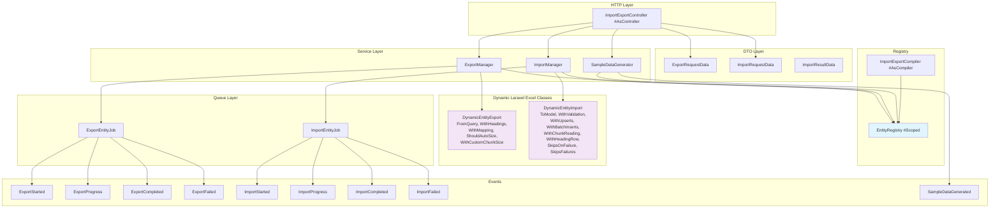

# Design Document — Import/Export Package

## Overview

The `pixielity/laravel-import-export` package provides an attribute-driven
import/export engine built on top of `maatwebsite/laravel-excel` (Laravel Excel
3.1). Instead of requiring developers to write per-entity export/import classes,
the package uses PHP attributes (`#[Exportable]`, `#[Importable]`,
`#[SampleData]`) to declare configuration on model classes. At runtime, two
dynamic classes — `DynamicEntityExport` and `DynamicEntityImport` — are
constructed from attribute metadata and passed to Laravel Excel.

The package integrates with the existing Pixielity ecosystem: Discovery facade
for cross-package model discovery, `#[AsCompiler]` for build-time registry
caching, `BelongsToTenant` for automatic tenant scoping, Spatie Data DTOs for
request validation, and `#[AsEvent]` domain events for lifecycle hooks.

### Key Design Decisions

1. **Dynamic export/import classes over per-entity classes**: A single
   `DynamicEntityExport` class implements Laravel Excel's `FromQuery`,
   `WithHeadings`, `WithMapping`, `ShouldAutoSize`, `WithCustomChunkSize`
   concerns and is configured at construction time. This eliminates boilerplate
   while preserving full Laravel Excel compatibility.

2. **JSON export handled outside Laravel Excel**: Laravel Excel does not
   natively support JSON output. JSON exports are handled directly by the
   `ExportManager` using the query builder and `json_encode`, bypassing Laravel
   Excel for that format only.

3. **Queuing strategy**: For exports, `DynamicEntityExport` conditionally
   implements `ShouldQueue` (via a separate `QueuedDynamicEntityExport`
   subclass) when the row count exceeds the chunk threshold. For imports,
   Laravel Excel's `ShouldQueue` + `WithChunkReading` handles chunked queued
   imports. Custom `ExportEntityJob` and `ImportEntityJob` wrap these to add
   event dispatching and progress tracking.

4. **EntityRegistry as the central catalog**: All attribute metadata is resolved
   at boot time (or compile time via `ImportExportCompiler`) into an
   `EntityRegistry` bound as `#[Scoped]`. Controllers and services query the
   registry to discover available entities and their configurations.

5. **Dry-run imports via database transactions**: Dry-run mode wraps the entire
   import in a transaction that is rolled back after validation and counting,
   returning the `ImportResultData` without persisting.

6. **Async-first API with broadcasting**: All import/export API endpoints are
   async-first — they always accept the job, return a job ID with
   `202 Accepted`, and notify the frontend when the job completes via Laravel
   Broadcasting. Events are broadcast on a private user channel
   (`private-user.{userId}.import-export`) so the frontend can listen via
   Pusher/Soketi/Reverb. One channel per user (not per job) — the frontend
   filters by `jobId` in the event payload. This avoids channel proliferation
   and simplifies subscription management.

7. **CSV separator configuration**: CSV imports/exports support configurable
   field separator (default `,`), multiple value separator (default `|`), and
   field enclosure (default `"`). These are configurable both globally in config
   and per-request via the API.

8. **Zero manual bindings**: All interface bindings use `#[Bind]` and
   `#[Scoped]` attributes on the interfaces themselves — the service provider
   does NOT manually register bindings. This follows the Pixielity convention
   where Discovery resolves `#[Bind]` attributes at boot time.

## Architecture



### Request Flow

**Export (always async)**:

1. Controller receives `ExportRequestData` → calls `ExportManager::export()`
2. ExportManager queries `EntityRegistry` for the entity's `#[Exportable]`
   config
3. ExportManager builds a `DynamicEntityExport` instance with field map, query
   builder, formatters
4. Dispatches `ExportEntityJob` to the queue
5. Returns `202 Accepted` with `{ jobId, status: 'queued', entityKey, format }`
6. Job executes: for CSV/XLSX/PDF passes to `Laravel\Excel::store()`, for JSON
   executes query directly
7. Job dispatches `ExportStarted`, `ExportProgress`, `ExportCompleted` events
8. `ExportCompleted` event is broadcast on `private-user.{userId}.import-export`
   channel
9. Frontend receives broadcast, shows download link or auto-downloads

**Import (always async)**:

1. Controller receives uploaded file + `ImportRequestData` → calls
   `ImportManager::import()`
2. ImportManager stores the uploaded file to the configured import disk
3. ImportManager queries `EntityRegistry` for the entity's `#[Importable]`
   config
4. Dispatches `ImportEntityJob` to the queue
5. Returns `202 Accepted` with
   `{ jobId, status: 'queued', entityKey, fileName }`
6. Job builds `DynamicEntityImport`, passes to `Laravel\Excel::import()`
7. Job collects failures via `SkipsFailures` trait, builds `ImportResultData`
8. Job dispatches `ImportCompleted` (or `ImportFailed`) event
9. `ImportCompleted` event is broadcast on `private-user.{userId}.import-export`
   channel
10. Frontend receives broadcast with full `ImportResultData`

**Import (dry-run — synchronous exception)**:

1. Same as import, but wrapped in `DB::transaction()` with rollback
2. Runs synchronously (not queued) since it's a validation-only operation
3. Returns `ImportResultData` with counts and errors, no data persisted

### Broadcasting Strategy

All job lifecycle events (`ExportCompleted`, `ExportFailed`, `ImportCompleted`,
`ImportFailed`, `ExportProgress`, `ImportProgress`) implement `ShouldBroadcast`
and broadcast on:

```
private-user.{userId}.import-export
```

One private channel per user — not per job, not per entity. The frontend
subscribes once to this channel and filters events by `jobId` in the payload.
This approach:

- Avoids channel proliferation (hundreds of jobs = hundreds of channels)
- Simplifies frontend subscription (subscribe once on login, unsubscribe on
  logout)
- Works naturally with Pusher, Soketi, Reverb, or any Laravel Broadcasting
  driver
- The `userId` comes from `auth()->id()` at the time the job is dispatched and
  is stored on the job

The frontend listens like:

```ts
Echo.private(`user.${userId}.import-export`)
  .listen("ExportCompleted", (e) => {
    /* e.jobId, e.filePath, e.totalRows */
  })
  .listen("ImportCompleted", (e) => {
    /* e.jobId, e.totalRows, e.created, ... */
  })
  .listen("ExportFailed", (e) => {
    /* e.jobId, e.errorMessage */
  })
  .listen("ImportFailed", (e) => {
    /* e.jobId, e.errorMessage */
  });
```

## Components and Interfaces

### Attributes

#### `#[Exportable]`

```php
#[Attribute(Attribute::TARGET_CLASS)]
final readonly class Exportable
{
    public const ATTR_FIELDS = 'fields';
    public const ATTR_FORMATS = 'formats';
    public const ATTR_LABEL = 'label';
    public const ATTR_CHUNK_SIZE = 'chunkSize';
    public const ATTR_FORMATTERS = 'formatters';

    public function __construct(
        public array $fields = [],           // ['ATTR_NAME' => 'Name', 'ATTR_EMAIL' => 'Email']
        public array $formats = [],          // ExportFormat cases; empty = all
        public string $label = '',           // Human-readable entity name
        public int $chunkSize = 1000,
        public array $formatters = [],       // ['field_name' => FormatterClass::class]
    ) {}
}
```

#### `#[Importable]`

```php
#[Attribute(Attribute::TARGET_CLASS)]
final readonly class Importable
{
    public const ATTR_FIELDS = 'fields';
    public const ATTR_RULES = 'rules';
    public const ATTR_UNIQUE_BY = 'uniqueBy';
    public const ATTR_LABEL = 'label';
    public const ATTR_CHUNK_SIZE = 'chunkSize';
    public const ATTR_TRANSFORMERS = 'transformers';
    public const ATTR_FORMATS = 'formats';

    public function __construct(
        public array $fields = [],           // ['Column Header' => 'ATTR_NAME']
        public array $rules = [],            // ['ATTR_NAME' => 'required|string|max:255']
        public array $uniqueBy = [],         // ['ATTR_EMAIL'] for upsert detection
        public string $label = '',
        public int $chunkSize = 500,
        public array $transformers = [],     // ['field_name' => TransformerClass::class]
        public array $formats = [],          // ImportFormat cases; empty = all
    ) {}
}
```

#### `#[SampleData]`

```php
#[Attribute(Attribute::TARGET_CLASS)]
final readonly class SampleData
{
    public const ATTR_FACTORY = 'factory';
    public const ATTR_COUNT = 'count';
    public const ATTR_LABEL = 'label';

    public function __construct(
        public string $factory = '',         // Factory or generator class-string
        public int $count = 10,
        public string $label = '',
    ) {}
}
```

### Contracts (Interfaces)

#### `ExportManagerInterface`

```php
#[Bind(ExportManager::class)]
#[Scoped]
interface ExportManagerInterface
{
    public function export(ExportRequestData $request, int|string $userId): string;  // always returns jobId
    public function template(string $entityKey, ExportFormat $format): mixed;         // sync download
    public function downloadCompleted(string $jobId): mixed;                          // sync download
}
```

#### `ImportManagerInterface`

```php
#[Bind(ImportManager::class)]
#[Scoped]
interface ImportManagerInterface
{
    public function import(ImportRequestData $request, int|string $userId): string;   // always returns jobId
    public function dryRun(ImportRequestData $request): ImportResultData;              // sync validation
}
```

#### `EntityRegistryInterface`

```php
#[Bind(EntityRegistry::class)]
#[Scoped]
interface EntityRegistryInterface
{
    public function exportable(): Collection;    // Collection of exportable entity configs
    public function importable(): Collection;    // Collection of importable entity configs
    public function sampleData(): Collection;    // Collection of sample-data entity configs
    public function getExportConfig(string $entityKey): ?Exportable;
    public function getImportConfig(string $entityKey): ?Importable;
    public function getSampleDataConfig(string $entityKey): ?SampleData;
    public function getModelClass(string $entityKey): ?string;
    public function register(string $modelClass, array $attributes): void;
}
```

#### `SampleDataGeneratorInterface`

```php
#[Bind(SampleDataGenerator::class)]
#[Scoped]
interface SampleDataGeneratorInterface
{
    public function generate(string $entityKey, ?int $count = null): int;  // records created
}
```

#### `ImportResultInterface`

```php
interface ImportResultInterface
{
    public function totalRows(): int;
    public function created(): int;
    public function updated(): int;
    public function skipped(): int;
    public function errors(): array;
}
```

### Dynamic Laravel Excel Classes

#### `DynamicEntityExport`

Constructed by `ExportManager` at runtime from `#[Exportable]` attribute data:

```php
class DynamicEntityExport implements FromQuery, WithHeadings, WithMapping, ShouldAutoSize, WithCustomChunkSize, WithCustomCsvSettings
{
    public function __construct(
        private readonly Builder $queryBuilder,
        private readonly array $fieldMap,        // ['attr_name' => 'Column Header']
        private readonly array $formatters,      // ['attr_name' => callable]
        private readonly int $chunkSize,
        private readonly CsvSettings $csvSettings,
    ) {}

    public function query(): Builder { return $this->queryBuilder; }
    public function headings(): array { return array_values($this->fieldMap); }
    public function map($row): array { /* apply formatters, return ordered values */ }
    public function chunkSize(): int { return $this->chunkSize; }
    public function getCsvSettings(): array {
        return [
            'delimiter' => $this->csvSettings->fieldSeparator,
            'enclosure' => $this->csvSettings->enclosure,
        ];
    }
}
```

#### `DynamicEntityImport`

Constructed by `ImportManager` at runtime from `#[Importable]` attribute data:

```php
class DynamicEntityImport implements ToModel, WithValidation, WithUpserts, WithBatchInserts, WithChunkReading, WithHeadingRow, SkipsOnFailure, WithCustomCsvSettings
{
    use SkipsFailures;

    public function __construct(
        private readonly string $modelClass,
        private readonly array $fieldMap,        // ['column_header' => 'attr_name']
        private readonly array $rules,
        private readonly array $uniqueBy,
        private readonly array $transformers,
        private readonly int $chunkSize,
        private readonly ?string $tenantId,
        private readonly CsvSettings $csvSettings,
    ) {}

    public function model(array $row): Model { /* map columns, apply transformers, set tenant_id */ }
    public function rules(): array { return $this->rules; }
    public function uniqueBy(): array { return $this->uniqueBy; }
    public function batchSize(): int { return $this->chunkSize; }
    public function chunkSize(): int { return $this->chunkSize; }
    public function getCsvSettings(): array {
        return [
            'delimiter' => $this->csvSettings->fieldSeparator,
            'enclosure' => $this->csvSettings->enclosure,
        ];
    }
}
```

### Controller

#### `ImportExportController`

```php
#[AsController]
#[Prefix('api/import-export')]
class ImportExportController extends Controller
{
    public function __construct(
        private readonly ExportManagerInterface $exportManager,
        private readonly ImportManagerInterface $importManager,
        private readonly SampleDataGeneratorInterface $sampleDataGenerator,
        private readonly EntityRegistryInterface $entityRegistry,
    ) {}

    // POST   /export          → accept export job, return 202 + jobId
    // POST   /import          → accept import job, return 202 + jobId
    // POST   /import/dry-run  → validate without persisting (sync, returns result)
    // GET    /status/{jobId}  → async job status + progress
    // GET    /download/{jobId}→ download completed export file
    // GET    /entities        → list all registered entities
    // POST   /sample-data     → generate sample data
    // GET    /template/{entity} → download import template (sync)
}
```

### Jobs

#### `ExportEntityJob`

Wraps `DynamicEntityExport` with event dispatching and broadcasting. Uses
`ShouldQueue`, `Batchable`. Stores `userId` from the authenticated user at
dispatch time. Dispatches `ExportStarted` on handle start, `ExportProgress` per
chunk callback, `ExportCompleted` on success, `ExportFailed` on exception. All
events include `userId` and are broadcast on the user's private channel.

#### `ImportEntityJob`

Wraps `DynamicEntityImport` with event dispatching and broadcasting. Uses
`ShouldQueue`, `Batchable`. Stores `userId` from the authenticated user at
dispatch time. Dispatches `ImportStarted` on handle start, `ImportProgress` per
chunk callback, `ImportCompleted` on success with `ImportResultData`,
`ImportFailed` on exception. All events include `userId` and are broadcast on
the user's private channel.

### Events

All events are `final readonly` DTOs annotated with `#[AsEvent]`, carrying
scalar IDs only. Job lifecycle events also implement `ShouldBroadcast` and
broadcast on `private-user.{userId}.import-export`:

| Event                 | Payload                                                                       | Broadcasts |
| --------------------- | ----------------------------------------------------------------------------- | ---------- |
| `ExportStarted`       | `jobId`, `userId`, `entityKey`, `format`                                      | ✓          |
| `ExportProgress`      | `jobId`, `userId`, `rowsProcessed`, `totalRows`                               | ✓          |
| `ExportCompleted`     | `jobId`, `userId`, `filePath`, `totalRows`                                    | ✓          |
| `ExportFailed`        | `jobId`, `userId`, `errorMessage`                                             | ✓          |
| `ImportStarted`       | `jobId`, `userId`, `entityKey`, `fileName`                                    | ✓          |
| `ImportProgress`      | `jobId`, `userId`, `rowsProcessed`, `totalRows`                               | ✓          |
| `ImportCompleted`     | `jobId`, `userId`, `totalRows`, `created`, `updated`, `skipped`, `errorCount` | ✓          |
| `ImportFailed`        | `jobId`, `userId`, `errorMessage`                                             | ✓          |
| `SampleDataGenerated` | `entityKey`, `tenantId`, `recordCount`                                        | ✗          |

Each broadcastable event implements:

```php
public function broadcastOn(): array
{
    return [new PrivateChannel("user.{$this->userId}.import-export")];
}

public function broadcastAs(): string
{
    return 'ExportCompleted'; // or ImportCompleted, etc.
}
```

### Enums

#### `ExportFormat`

```php
enum ExportFormat: string
{
    use Enum;

    #[Label('CSV')]  #[Description('Comma-separated values')]
    case CSV = 'csv';

    #[Label('XLSX')] #[Description('Excel spreadsheet')]
    case XLSX = 'xlsx';

    #[Label('JSON')] #[Description('JSON array')]
    case JSON = 'json';

    #[Label('PDF')]  #[Description('PDF document')]
    case PDF = 'pdf';

    public function mimeType(): string { /* match expression */ }
    public function extension(): string { /* match expression */ }
    public function laravelExcelType(): ?string { /* maps to Excel::XLSX, Excel::CSV, Excel::DOMPDF, null for JSON */ }
}
```

#### `ImportFormat`

```php
enum ImportFormat: string
{
    use Enum;

    #[Label('CSV')]  #[Description('Comma-separated values')]
    case CSV = 'csv';

    #[Label('XLSX')] #[Description('Excel spreadsheet')]
    case XLSX = 'xlsx';

    #[Label('JSON')] #[Description('JSON array')]
    case JSON = 'json';

    public function laravelExcelType(): ?string { /* maps to Excel::XLSX, Excel::CSV, null for JSON */ }
}
```

### Service Provider

```php
#[Module(name: 'ImportExport', priority: 60)]
#[LoadsResources(migrations: true, config: true, routes: true, commands: true, publishables: true)]
class ImportExportServiceProvider extends ServiceProvider
{
    // No manual bindings needed — all interfaces use #[Bind] + #[Scoped] attributes
    // Discovery resolves them automatically at boot time
}
```

### Compiler

```php
#[AsCompiler(priority: 25, phase: CompilerPhase::REGISTRY, description: 'Discover import/export attributes and build EntityRegistry')]
class ImportExportCompiler implements CompilerInterface
{
    public function compile(CompilerContext $context): CompilerResult
    {
        // Discovery::attribute(Exportable::class)->get()
        // Discovery::attribute(Importable::class)->get()
        // Discovery::attribute(SampleData::class)->get()
        // Store in EntityRegistry cache
    }

    public function name(): string { return 'Import/Export Entity Registry'; }
}
```

## Data Models

### DTOs (Spatie Data)

#### `ExportRequestData`

```php
class ExportRequestData extends Data
{
    public function __construct(
        #[Required, StringType]
        public string $entity,               // Entity key (e.g., 'users', 'products')

        #[Required, StringType]
        public string $format,               // ExportFormat value

        public ?array $columns = null,       // Subset of declared fields; null = all

        public ?array $filters = null,       // CRUD filter operators

        public ?string $fieldSeparator = null,   // CSV field separator override (default from config)
        public ?string $multiValueSeparator = null, // Multiple value separator override
        public ?string $enclosure = null,    // Field enclosure override
    ) {}
}
```

#### `ImportRequestData`

```php
class ImportRequestData extends Data
{
    public function __construct(
        #[Required, StringType]
        public string $entity,

        #[Required]
        public UploadedFile $file,

        public bool $dryRun = false,

        public ?string $fieldSeparator = null,   // CSV field separator override
        public ?string $multiValueSeparator = null, // Multiple value separator override
        public ?string $enclosure = null,    // Field enclosure override
    ) {}
}
```

#### `CsvSettings` (Value Object)

```php
final readonly class CsvSettings
{
    public function __construct(
        public string $fieldSeparator = ',',
        public string $multiValueSeparator = '|',
        public string $enclosure = '"',
    ) {}

    public static function fromConfig(): self
    {
        return new self(
            fieldSeparator: config('import-export.csv.field_separator', ','),
            multiValueSeparator: config('import-export.csv.multi_value_separator', '|'),
            enclosure: config('import-export.csv.enclosure', '"'),
        );
    }

    public static function fromRequest(?string $fieldSep, ?string $multiSep, ?string $enclosure): self
    {
        $defaults = self::fromConfig();
        return new self(
            fieldSeparator: $fieldSep ?? $defaults->fieldSeparator,
            multiValueSeparator: $multiSep ?? $defaults->multiValueSeparator,
            enclosure: $enclosure ?? $defaults->enclosure,
        );
    }
}
```

#### `ImportResultData`

```php
class ImportResultData extends Data implements ImportResultInterface
{
    public function __construct(
        public int $totalRows = 0,
        public int $created = 0,
        public int $updated = 0,
        public int $skipped = 0,
        public array $errors = [],           // [{row: int, field: string, message: string}]
    ) {}
}
```

### Configuration (`config/import-export.php`)

```php
return [
    'export' => [
        'default_format' => 'xlsx',
        'chunk_size' => 1000,
        'storage_disk' => 'local',
        'storage_path' => 'exports',
    ],
    'import' => [
        'chunk_size' => 500,
        'storage_disk' => 'local',
        'storage_path' => 'imports',
        'max_file_size' => 10240,            // kilobytes
        'allowed_errors' => 0,               // 0 = unlimited, N = halt after N errors
        'on_error' => 'skip',                // 'skip' | 'stop' — behavior on row validation failure
    ],
    'csv' => [
        'field_separator' => ',',            // comma, pipe, semicolon, tab
        'multi_value_separator' => '|',      // separator for multi-value fields (e.g., tags)
        'enclosure' => '"',                  // field enclosure character
    ],
    'queue' => [
        'enabled' => true,
        'connection' => null,                // null = default connection
        'queue_name' => 'import-export',
    ],
    'broadcasting' => [
        'enabled' => true,
        'channel_prefix' => 'user',          // private-user.{userId}.import-export
    ],
    'sample_data' => [
        'default_count' => 10,
    ],
    'pdf' => [
        'paper_size' => 'a4',
        'orientation' => 'landscape',
    ],
];
```

### Entity Registry Data Structure

The `EntityRegistry` stores discovered configurations keyed by entity key
(derived from model table name or label):

```php
// Internal storage structure
[
    'users' => [
        'model' => \App\Models\User::class,
        'exportable' => Exportable { fields: [...], formats: [...], ... },
        'importable' => Importable { fields: [...], rules: [...], ... },
        'sampleData' => SampleData { factory: UserFactory::class, count: 10 },
        'isTenantScoped' => true,
    ],
    'products' => [
        'model' => \App\Models\Product::class,
        'exportable' => Exportable { ... },
        'importable' => null,
        'sampleData' => null,
        'isTenantScoped' => true,
    ],
]
```

The `isTenantScoped` flag is determined by checking if the model class uses the
`BelongsToTenant` trait via
`in_array(BelongsToTenant::class, class_uses_recursive($modelClass))`.

## Correctness Properties

_A property is a characteristic or behavior that should hold true across all
valid executions of a system — essentially, a formal statement about what the
system should do. Properties serve as the bridge between human-readable
specifications and machine-verifiable correctness guarantees._

### Property 1: Attribute construction round-trip

_For any_ valid combination of parameters (fields, formats, label, chunkSize,
formatters/transformers/uniqueBy/rules), constructing an `#[Exportable]`,
`#[Importable]`, or `#[SampleData]` attribute instance and reading back its
public properties SHALL yield the exact same values that were passed to the
constructor.

**Validates: Requirements 2.1, 2.5, 3.1, 3.4, 3.5, 4.1**

### Property 2: EntityRegistry listing correctness

_For any_ set of entity registrations (mix of exportable-only, importable-only,
sample-data-only, and combined), the `EntityRegistry::exportable()` method SHALL
return exactly the entities registered with an `Exportable` config,
`importable()` SHALL return exactly those with `Importable` config, and
`sampleData()` SHALL return exactly those with `SampleData` config — with no
missing or extra entries.

**Validates: Requirements 5.4**

### Property 3: Import validation collects all errors without aborting

_For any_ import dataset containing a mix of valid and invalid rows (according
to the configured validation rules), the `DynamicEntityImport` SHALL process all
rows, collect all validation failures via `SkipsFailures`, and the resulting
`ImportResultData` SHALL have `skipped` equal to the number of invalid rows and
`errors` containing one entry per validation failure — without aborting on the
first error.

**Validates: Requirements 7.1, 7.2, 7.7**

### Property 4: Transformer application preserves mapping

_For any_ field value and configured transformer callable, the
`DynamicEntityImport::model()` method SHALL apply the transformer to the field
value before constructing the model, such that the model attribute equals the
transformer's output for that input.

**Validates: Requirements 7.8**

### Property 5: BelongsToTenant detection

_For any_ Eloquent model class, the `EntityRegistry` tenant detection SHALL
return `true` if and only if the class uses the `BelongsToTenant` trait
(directly or via parent), and `false` otherwise.

**Validates: Requirements 10.5**

### Property 6: Events are readonly DTOs with scalar IDs

_For all_ event classes in the package (`ExportStarted`, `ExportProgress`,
`ExportCompleted`, `ExportFailed`, `ImportStarted`, `ImportProgress`,
`ImportCompleted`, `ImportFailed`, `SampleDataGenerated`), each class SHALL be
`final readonly` and every constructor parameter SHALL be a scalar type (`int`,
`string`, `float`, `bool`) or nullable scalar.

**Validates: Requirements 12.4**

### Property 7: Template headers match field map

_For any_ `#[Importable]` field map configuration, generating an import template
SHALL produce a file whose header row contains exactly the column names from the
field map keys, in the same order.

**Validates: Requirements 13.2, 13.3**

### Property 8: ExportFormat enum methods return valid values

_For all_ `ExportFormat` enum cases, the `mimeType()` method SHALL return a
non-empty string matching a known MIME type pattern, and the `extension()`
method SHALL return a non-empty string matching the enum's backed value.

**Validates: Requirements 14.3, 14.4**

## Error Handling

### Export Errors

| Scenario                      | Handling                                                                                                                                                   |
| ----------------------------- | ---------------------------------------------------------------------------------------------------------------------------------------------------------- |
| Unknown entity key            | `ExportManager` throws `InvalidArgumentException` with message identifying the unknown key. Controller returns 404.                                        |
| Unsupported format for entity | `ExportManager` checks `#[Exportable].formats` against requested format. Throws `InvalidArgumentException` if not in allowed list. Controller returns 422. |
| Empty result set              | Export proceeds normally, generating a file with headers only (no data rows). No error.                                                                    |
| Query execution failure       | Exception propagates. For async jobs, `ExportFailed` event dispatched with error message. Job marked as failed in queue.                                   |
| Disk write failure            | `Storage` exception propagates. For async jobs, `ExportFailed` event dispatched.                                                                           |
| PDF driver not installed      | Laravel Excel throws exception. `ExportManager` catches and re-throws with helpful message about installing dompdf/mpdf.                                   |

### Import Errors

| Scenario                                   | Handling                                                                                                            |
| ------------------------------------------ | ------------------------------------------------------------------------------------------------------------------- |
| Unknown entity key                         | `ImportManager` throws `InvalidArgumentException`. Controller returns 404.                                          |
| Unsupported file format                    | `ImportManager` checks file extension against `#[Importable].formats`. Returns 422 with allowed formats.            |
| File exceeds max size                      | Validated at controller level via `ImportRequestData` validation rules. Returns 422.                                |
| Row validation failure                     | Collected via `SkipsFailures` trait. Row skipped, error added to `ImportResultData.errors`. Import continues.       |
| All rows fail validation                   | Import completes with `created=0`, `updated=0`, `skipped=totalRows`. Full error array returned.                     |
| Database constraint violation              | Caught per-row. Row skipped, error added to result. Import continues for remaining rows.                            |
| Malformed file (corrupt XLSX, invalid CSV) | Laravel Excel throws `ReaderException`. `ImportManager` catches and returns 422 with "Unable to read file" message. |
| Dry-run with errors                        | Transaction rolled back. `ImportResultData` returned with validation errors and projected counts.                   |

### Sample Data Errors

| Scenario                  | Handling                                                                                          |
| ------------------------- | ------------------------------------------------------------------------------------------------- |
| Unknown entity key        | `SampleDataGenerator` throws `InvalidArgumentException`. Controller returns 404.                  |
| Factory class not found   | `SampleDataGenerator` throws `InvalidArgumentException` with message identifying missing factory. |
| Factory execution failure | Exception propagates. `SampleDataGenerated` event NOT dispatched. Controller returns 500.         |

### Job Failure Handling

All queued jobs implement Laravel's `failed()` method to dispatch the
corresponding `*Failed` event. Jobs use the configured `queue.connection` and
`queue.queue_name` from config. Failed jobs are recorded in Laravel's
`failed_jobs` table for retry.

## Testing Strategy

### Unit Tests

Unit tests cover specific examples, edge cases, and structural checks:

- **Attribute construction**: Verify each attribute class accepts all documented
  parameters and stores them correctly.
- **Attribute targets**: Verify `Attribute::TARGET_CLASS` on all three
  attributes.
- **Enum cases**: Verify `ExportFormat` and `ImportFormat` have correct cases,
  backed values, `mimeType()`, `extension()`, `laravelExcelType()`.
- **Config defaults**: Verify `config/import-export.php` has all documented keys
  with correct defaults.
- **Event structure**: Verify all events are `final readonly` with `#[AsEvent]`
  and scalar-only constructors.
- **Service provider attributes**: Verify `#[Module]` and `#[LoadsResources]` on
  the service provider.
- **Compiler attributes**: Verify `#[AsCompiler]` on `ImportExportCompiler`.
- **DynamicEntityExport**: Test `headings()` returns field map values, `map()`
  applies formatters, `chunkSize()` returns configured value.
- **DynamicEntityImport**: Test `rules()` returns configured rules, `uniqueBy()`
  returns configured fields, `model()` maps columns and applies transformers.
- **ImportResultData**: Test DTO construction and `ImportResultInterface` method
  implementations.
- **Empty fields fallback**: Test that empty `#[Exportable].fields` falls back
  to model `$fillable`.
- **Dry-run**: Test that dry-run mode returns results without database changes.
- **Queue threshold**: Test that exports/imports exceeding chunk_size dispatch
  jobs.
- **Job events**: Test that each job dispatches the correct lifecycle events.

### Integration Tests

Integration tests verify cross-component wiring with a real database:

- **EntityRegistry discovery**: Boot registry with Discovery mock, verify
  entities are discovered and stored.
- **Export flow (CSV/XLSX/JSON/PDF)**: Full export through ExportManager with a
  test model, verify file output.
- **Import flow**: Full import through ImportManager with a test CSV, verify
  records created/updated.
- **Upsert behavior**: Import with matching `uniqueBy`, verify update instead of
  create.
- **Tenant scoping**: Set tenant context, export/import, verify tenant
  isolation.
- **API endpoints**: HTTP tests for all 8 controller endpoints.
- **Template generation**: Request template, verify file has correct headers.
- **Sample data generation**: Trigger generation, verify records created with
  correct tenant_id.

### Property-Based Tests

Property-based tests use [PHPUnit with `phpunit/phpunit`](https://phpunit.de/)
and a PHP PBT library such as
[`eris/eris`](https://github.com/giorgiosironi/eris) or a custom generator
approach. Each property test runs a minimum of 100 iterations.

| Property   | Test Description                                                                        | Tag                                                                                                  |
| ---------- | --------------------------------------------------------------------------------------- | ---------------------------------------------------------------------------------------------------- |
| Property 1 | Generate random attribute parameters, construct attribute, verify all properties match  | `Feature: import-export-package, Property 1: Attribute construction round-trip`                      |
| Property 2 | Generate random entity registration sets, verify listing methods return correct subsets | `Feature: import-export-package, Property 2: EntityRegistry listing correctness`                     |
| Property 3 | Generate random mixes of valid/invalid rows, verify error collection and counts         | `Feature: import-export-package, Property 3: Import validation collects all errors without aborting` |
| Property 4 | Generate random field values and transformer functions, verify transformation applied   | `Feature: import-export-package, Property 4: Transformer application preserves mapping`              |
| Property 5 | Generate model classes with/without BelongsToTenant, verify detection                   | `Feature: import-export-package, Property 5: BelongsToTenant detection`                              |
| Property 6 | Iterate all event classes, verify final readonly and scalar constructors                | `Feature: import-export-package, Property 6: Events are readonly DTOs with scalar IDs`               |
| Property 7 | Generate random field maps, create template, verify header row matches                  | `Feature: import-export-package, Property 7: Template headers match field map`                       |
| Property 8 | Iterate all ExportFormat cases, verify mimeType() and extension() return valid values   | `Feature: import-export-package, Property 8: ExportFormat enum methods return valid values`          |
