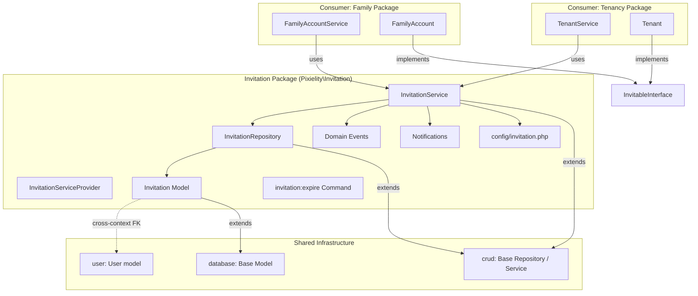
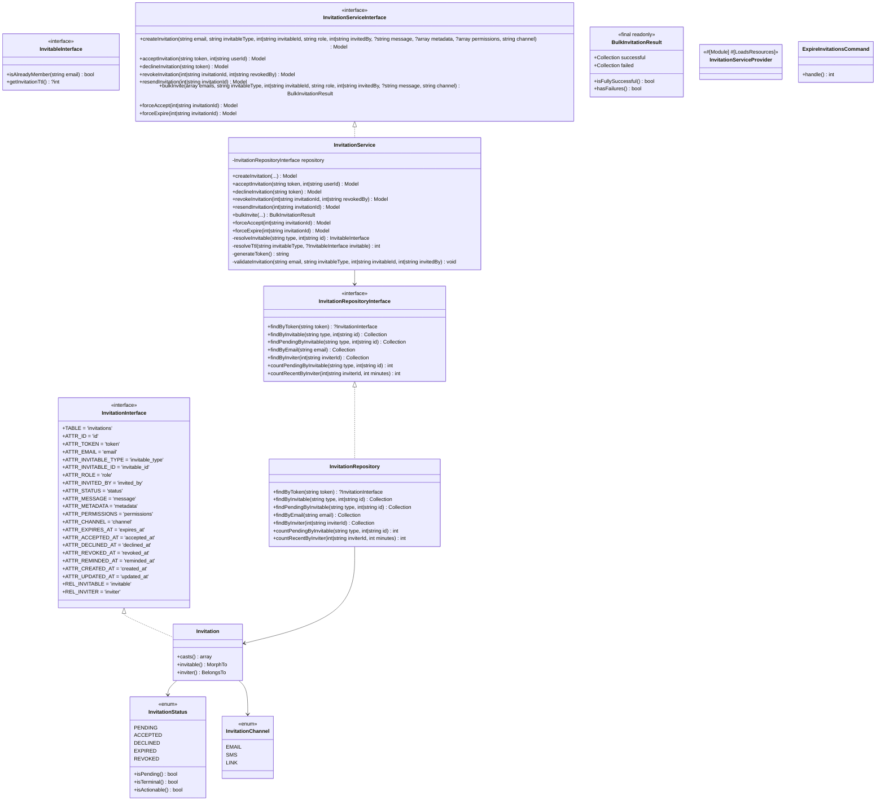
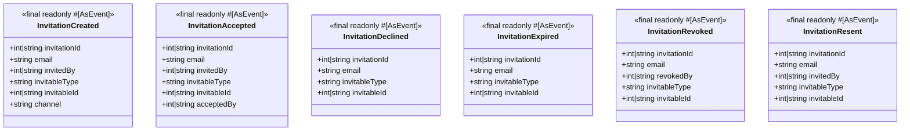
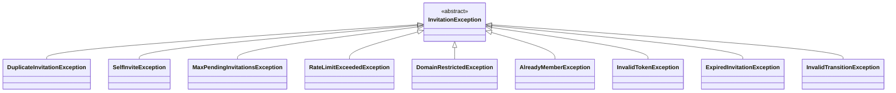

# Design Document: Invitation System

## Overview

The Invitation package (`packages/invitation/`, namespace
`Pixielity\Invitation`, composer `pixielity/laravel-invitation`) is a
standalone, reusable invitation lifecycle system extracted from the family
package. It provides polymorphic invitations that any bounded context can
consume — family invites, tenant invites, team invites, referral invites, etc.

The package follows all Pixielity steering conventions: attribute-driven
configuration, interface-first design with `ATTR_*` constants, layered
architecture (Model → Repository → Service → Controller), `#[AsEvent]` domain
events as readonly DTOs, and cross-context FK columns as `unsignedBigInteger` +
index (no `constrained()`).

The invitation package is its own bounded context. Consumer packages (family,
tenancy, etc.) integrate via the `InvitableInterface` contract and domain event
listeners.

**Validates: Requirements 1.1–1.8, 11.1–11.4**

---

## Architecture

### High-Level Architecture



### Package Dependency Graph

```
pixielity/laravel-invitation
├── pixielity/laravel-crud       (Base Repository, Base Service)
├── pixielity/laravel-database   (Base Model)
├── pixielity/laravel-discovery  (Attribute discovery)
├── pixielity/laravel-enum       (Enum trait, Label, Description)
├── pixielity/laravel-event      (#[AsEvent] attribute)
└── illuminate/* (Laravel 13)
```

### Bounded Context Rules

- `invited_by` references `users.id` — cross-context FK: `unsignedBigInteger` +
  index, no `constrained()`
- `invitable_type` + `invitable_id` — polymorphic morph columns, no FK
  constraints
- Consumer packages listen to domain events (`InvitationAccepted`, etc.) for
  side effects
- Consumer packages resolve `InvitationServiceInterface` from the container for
  operations

**Validates: Requirements 1.1, 1.3, 11.3–11.4, 12.4**

---

## Components and Interfaces

### Class Diagram



### Domain Events



### Exceptions



### Notifications

| Class                            | Trigger                                 | Recipient       | Channels       |
| -------------------------------- | --------------------------------------- | --------------- | -------------- |
| `InvitationSentNotification`     | `InvitationCreated` (email/sms channel) | Invitee (email) | mail, vonage   |
| `InvitationAcceptedNotification` | `InvitationAccepted`                    | Inviter (user)  | mail, database |
| `InvitationDeclinedNotification` | `InvitationDeclined`                    | Inviter (user)  | mail, database |
| `InvitationReminderNotification` | Reminder schedule                       | Invitee (email) | mail           |

**Validates: Requirements 7.1–7.6**

---

## Data Models

### Invitation Table Schema

| Column           | Type                 | Nullable | Default     | Index     | Notes                             |
| ---------------- | -------------------- | -------- | ----------- | --------- | --------------------------------- |
| `id`             | `bigIncrements`      | No       | auto        | PK        |                                   |
| `token`          | `string`             | No       | —           | unique    | Cryptographically random          |
| `email`          | `string`             | No       | —           | index     | Invitee email                     |
| `invitable_type` | `string`             | No       | —           | composite | Polymorphic type                  |
| `invitable_id`   | `unsignedBigInteger` | No       | —           | composite | Polymorphic ID                    |
| `role`           | `string`             | No       | —           | —         | Role assigned on acceptance       |
| `invited_by`     | `unsignedBigInteger` | No       | —           | index     | Cross-context FK to users.id      |
| `status`         | `string`             | No       | `'pending'` | index     | Cast to InvitationStatus enum     |
| `message`        | `text`               | Yes      | null        | —         | Personal message from inviter     |
| `metadata`       | `json`               | Yes      | null        | —         | Context-specific data             |
| `permissions`    | `json`               | Yes      | null        | —         | Permissions granted on acceptance |
| `channel`        | `string`             | No       | `'email'`   | —         | Delivery channel                  |
| `expires_at`     | `timestamp`          | No       | —           | index     | TTL-based expiration              |
| `accepted_at`    | `timestamp`          | Yes      | null        | —         | When accepted                     |
| `declined_at`    | `timestamp`          | Yes      | null        | —         | When declined                     |
| `revoked_at`     | `timestamp`          | Yes      | null        | —         | When revoked                      |
| `reminded_at`    | `timestamp`          | Yes      | null        | —         | Last reminder sent                |
| `created_at`     | `timestamp`          | Yes      | auto        | —         | Laravel timestamp                 |
| `updated_at`     | `timestamp`          | Yes      | auto        | —         | Laravel timestamp                 |

**Composite index:** `(invitable_type, invitable_id, email, status)` — for
duplicate detection queries.

**Validates: Requirements 2.1, 2.8, 2.9**

### InvitationStatus Enum

```php
enum InvitationStatus: string
{
    use Enum;

    case PENDING = 'pending';
    case ACCEPTED = 'accepted';
    case DECLINED = 'declined';
    case EXPIRED = 'expired';
    case REVOKED = 'revoked';

    public function isPending(): bool { return $this === self::PENDING; }

    public function isTerminal(): bool
    {
        return match ($this) {
            self::ACCEPTED, self::DECLINED, self::EXPIRED, self::REVOKED => true,
            default => false,
        };
    }

    public function isActionable(): bool
    {
        return $this === self::PENDING;
    }
}
```

**Validates: Requirements 2.6, 2.7**

### InvitationChannel Enum

```php
enum InvitationChannel: string
{
    use Enum;

    case EMAIL = 'email';
    case SMS = 'sms';
    case LINK = 'link';
}
```

**Validates: Requirement 6.1**

---

## API Design

### InvitationServiceInterface

```php
#[Bind(InvitationService::class)]
#[Scoped]
interface InvitationServiceInterface extends ServiceInterface
{
    /**
     * Create and send a single invitation.
     *
     * Validates: duplicate, self-invite, rate limit, domain restriction,
     * max pending, already-member checks.
     *
     * @throws DuplicateInvitationException
     * @throws SelfInviteException
     * @throws MaxPendingInvitationsException
     * @throws RateLimitExceededException
     * @throws DomainRestrictedException
     * @throws AlreadyMemberException
     */
    public function createInvitation(
        string $email,
        string $invitableType,
        int|string $invitableId,
        string $role,
        int|string $invitedBy,
        ?string $message = null,
        ?array $metadata = null,
        ?array $permissions = null,
        string $channel = 'email',
    ): Model;

    /**
     * Accept an invitation by token.
     *
     * @throws InvalidTokenException
     * @throws ExpiredInvitationException
     * @throws InvalidTransitionException
     */
    public function acceptInvitation(string $token, int|string $userId): Model;

    /**
     * Decline an invitation by token.
     *
     * @throws InvalidTokenException
     * @throws ExpiredInvitationException
     * @throws InvalidTransitionException
     */
    public function declineInvitation(string $token): Model;

    /**
     * Revoke a PENDING invitation.
     *
     * @throws InvalidTransitionException
     */
    public function revokeInvitation(int|string $invitationId, int|string $revokedBy): Model;

    /**
     * Resend a PENDING invitation (regenerates token, resets TTL).
     *
     * @throws InvalidTransitionException
     */
    public function resendInvitation(int|string $invitationId): Model;

    /**
     * Invite multiple emails at once. Returns result with successes and per-email failures.
     */
    public function bulkInvite(
        array $emails,
        string $invitableType,
        int|string $invitableId,
        string $role,
        int|string $invitedBy,
        ?string $message = null,
        string $channel = 'email',
    ): BulkInvitationResult;

    /**
     * Admin: force-accept a PENDING invitation without token/user.
     *
     * @throws InvalidTransitionException
     */
    public function forceAccept(int|string $invitationId): Model;

    /**
     * Admin: force-expire a PENDING invitation.
     *
     * @throws InvalidTransitionException
     */
    public function forceExpire(int|string $invitationId): Model;
}
```

**Validates: Requirements 3.1–3.7, 5.1–5.7, 6.2–6.5, 9.1–9.3**

### InvitationRepositoryInterface

```php
#[Bind(InvitationRepository::class)]
#[Singleton]
interface InvitationRepositoryInterface extends RepositoryInterface
{
    public function findByToken(string $token): ?InvitationInterface;

    public function findByInvitable(string $invitableType, int|string $invitableId): Collection;

    public function findPendingByInvitable(string $invitableType, int|string $invitableId): Collection;

    public function findByEmail(string $email): Collection;

    public function findByInviter(int|string $inviterId): Collection;

    public function countPendingByInvitable(string $invitableType, int|string $invitableId): int;

    public function countRecentByInviter(int|string $inviterId, int $minutes): int;
}
```

**Validates: Requirements 8.1–8.7**

### InvitableInterface

```php
interface InvitableInterface
{
    /**
     * Check if the given email is already a member of this invitable context.
     */
    public function isAlreadyMember(string $email): bool;

    /**
     * Get context-specific TTL in days, or null for default.
     */
    public function getInvitationTtl(): ?int;
}
```

**Validates: Requirements 5.6, 11.1–11.2**

---

## Configuration Schema

```php
// config/invitation.php
return [
    /*
    |--------------------------------------------------------------------------
    | Default TTL (days)
    |--------------------------------------------------------------------------
    */
    'default_ttl' => 7,

    /*
    |--------------------------------------------------------------------------
    | Max Pending Invitations Per Context
    |--------------------------------------------------------------------------
    */
    'max_pending_per_context' => 50,

    /*
    |--------------------------------------------------------------------------
    | Rate Limiting
    |--------------------------------------------------------------------------
    */
    'rate_limit' => [
        'max_per_window' => 20,
        'window_minutes' => 60,
    ],

    /*
    |--------------------------------------------------------------------------
    | Notification Channels (per event type)
    |--------------------------------------------------------------------------
    */
    'notification_channels' => [
        'invitation_sent' => ['mail'],
        'invitation_accepted' => ['mail', 'database'],
        'invitation_declined' => ['mail', 'database'],
        'invitation_reminder' => ['mail'],
    ],

    /*
    |--------------------------------------------------------------------------
    | Reminder Schedule (day offsets from creation)
    |--------------------------------------------------------------------------
    */
    'reminder_schedule' => [3],

    /*
    |--------------------------------------------------------------------------
    | Domain Restrictions (per invitable type)
    |--------------------------------------------------------------------------
    | 'mode' => 'allowlist' | 'blocklist'
    | 'domains' => ['example.com', 'corp.io']
    */
    'domain_restrictions' => [
        // App\Models\Tenant::class => [
        //     'mode' => 'allowlist',
        //     'domains' => ['company.com'],
        // ],
    ],

    /*
    |--------------------------------------------------------------------------
    | Per-Context Overrides
    |--------------------------------------------------------------------------
    */
    'contexts' => [
        // App\Models\FamilyAccount::class => [
        //     'default_ttl' => 14,
        //     'max_pending_per_context' => 10,
        // ],
    ],
];
```

**Validates: Requirements 10.1–10.3, 4.1–4.2**

---

## Event Catalog

All events are `final readonly` DTOs with `#[AsEvent]`, carrying only IDs for
queue serialization.

| Event                | Properties                                                                         | Dispatched When                    | Validates     |
| -------------------- | ---------------------------------------------------------------------------------- | ---------------------------------- | ------------- |
| `InvitationCreated`  | `invitationId`, `email`, `invitedBy`, `invitableType`, `invitableId`, `channel`    | `createInvitation()` succeeds      | 3.1, 3.7, 3.8 |
| `InvitationAccepted` | `invitationId`, `email`, `invitedBy`, `invitableType`, `invitableId`, `acceptedBy` | `acceptInvitation()` succeeds      | 3.2, 3.7, 3.8 |
| `InvitationDeclined` | `invitationId`, `email`, `invitableType`, `invitableId`                            | `declineInvitation()` succeeds     | 3.3, 3.7, 3.8 |
| `InvitationExpired`  | `invitationId`, `email`, `invitableType`, `invitableId`                            | Auto-expiration or `forceExpire()` | 3.7, 4.4, 4.5 |
| `InvitationRevoked`  | `invitationId`, `email`, `revokedBy`, `invitableType`, `invitableId`               | `revokeInvitation()` succeeds      | 3.4, 3.7, 3.8 |
| `InvitationResent`   | `invitationId`, `email`, `invitedBy`, `invitableType`, `invitableId`               | `resendInvitation()` succeeds      | 3.5, 3.7, 3.8 |

**Validates: Requirements 3.7, 3.8, 11.4**

---

## Exception Catalog

All exceptions extend a base `InvitationException` (which extends
`\RuntimeException`).

| Exception                        | Thrown When                                                          | HTTP Status       | Validates |
| -------------------------------- | -------------------------------------------------------------------- | ----------------- | --------- |
| `DuplicateInvitationException`   | PENDING invitation already exists for same email + invitable context | 409 Conflict      | 5.1       |
| `SelfInviteException`            | Inviter email matches invitee email                                  | 422 Unprocessable | 5.2       |
| `MaxPendingInvitationsException` | Pending count for context >= configured max                          | 429 Too Many      | 5.3       |
| `RateLimitExceededException`     | Inviter exceeded rate limit window                                   | 429 Too Many      | 5.4       |
| `DomainRestrictedException`      | Email domain fails allowlist/blocklist check                         | 403 Forbidden     | 5.5       |
| `AlreadyMemberException`         | `InvitableInterface::isAlreadyMember()` returns true                 | 409 Conflict      | 5.7       |
| `InvalidTokenException`          | Token not found or invitation in terminal state                      | 404 Not Found     | 3.6       |
| `ExpiredInvitationException`     | Invitation `expires_at` is in the past                               | 410 Gone          | 3.6, 4.4  |
| `InvalidTransitionException`     | Operation attempted on non-PENDING invitation                        | 422 Unprocessable | 3.6, 9.3  |

**Validates: Requirements 3.6, 5.1–5.5, 5.7, 9.3**

---

## Notification Catalog

| Notification Class               | Trigger                                       | Recipient                        | Default Channels   | Content                                                      | Validates |
| -------------------------------- | --------------------------------------------- | -------------------------------- | ------------------ | ------------------------------------------------------------ | --------- |
| `InvitationSentNotification`     | `InvitationCreated` event (email/sms channel) | Invitee (via email/phone)        | `mail`             | Token URL, inviter name, invitable context, personal message | 7.1       |
| `InvitationAcceptedNotification` | `InvitationAccepted` event                    | Inviter (User model, Notifiable) | `mail`, `database` | Invitee email, invitable context                             | 7.2       |
| `InvitationDeclinedNotification` | `InvitationDeclined` event                    | Inviter (User model, Notifiable) | `mail`, `database` | Invitee email, invitable context                             | 7.3       |
| `InvitationReminderNotification` | Scheduled reminder check                      | Invitee (via email)              | `mail`             | Token URL, days remaining                                    | 7.4       |

All notifications are standard Laravel `Notification` classes. Consumer packages
can override by binding custom notification classes in the config or by
listening to events and dispatching their own notifications.

**Validates: Requirements 7.1–7.6**

---

## Migration Schema

```php
// packages/invitation/src/Migrations/0001_01_01_000001_create_invitations_table.php

use Pixielity\Invitation\Contracts\Data\InvitationInterface;

Schema::create(InvitationInterface::TABLE, function (Blueprint $table): void {
    $table->id();
    $table->string(InvitationInterface::ATTR_TOKEN)->unique();
    $table->string(InvitationInterface::ATTR_EMAIL);
    $table->morphs(InvitationInterface::REL_INVITABLE); // invitable_type + invitable_id + index
    $table->string(InvitationInterface::ATTR_ROLE);
    $table->unsignedBigInteger(InvitationInterface::ATTR_INVITED_BY); // cross-context FK, no constrained()
    $table->string(InvitationInterface::ATTR_STATUS)->default('pending');
    $table->text(InvitationInterface::ATTR_MESSAGE)->nullable();
    $table->json(InvitationInterface::ATTR_METADATA)->nullable();
    $table->json(InvitationInterface::ATTR_PERMISSIONS)->nullable();
    $table->string(InvitationInterface::ATTR_CHANNEL)->default('email');
    $table->timestamp(InvitationInterface::ATTR_EXPIRES_AT);
    $table->timestamp(InvitationInterface::ATTR_ACCEPTED_AT)->nullable();
    $table->timestamp(InvitationInterface::ATTR_DECLINED_AT)->nullable();
    $table->timestamp(InvitationInterface::ATTR_REVOKED_AT)->nullable();
    $table->timestamp(InvitationInterface::ATTR_REMINDED_AT)->nullable();
    $table->timestamps();

    // Individual indexes
    $table->index(InvitationInterface::ATTR_EMAIL);
    $table->index(InvitationInterface::ATTR_STATUS);
    $table->index(InvitationInterface::ATTR_INVITED_BY);
    $table->index(InvitationInterface::ATTR_EXPIRES_AT);

    // Composite index for duplicate detection
    $table->index([
        InvitationInterface::ATTR_INVITABLE_TYPE,
        InvitationInterface::ATTR_INVITABLE_ID,
        InvitationInterface::ATTR_EMAIL,
        InvitationInterface::ATTR_STATUS,
    ], 'invitations_duplicate_detection_index');
});
```

**Validates: Requirements 2.1, 2.8, 2.9**

---

## Family Package Migration Plan

### Files to Remove from `packages/family/`

| File                                                            | Reason                                                                     |
| --------------------------------------------------------------- | -------------------------------------------------------------------------- |
| `src/Models/Invitation.php`                                     | Replaced by `Pixielity\Invitation\Models\Invitation`                       |
| `src/Contracts/Data/InvitationInterface.php`                    | Replaced by `Pixielity\Invitation\Contracts\Data\InvitationInterface`      |
| `src/Contracts/InvitationRepositoryInterface.php`               | Replaced by `Pixielity\Invitation\Contracts\InvitationRepositoryInterface` |
| `src/Repositories/InvitationRepository.php`                     | Replaced by `Pixielity\Invitation\Repositories\InvitationRepository`       |
| `src/Enums/InvitationStatus.php`                                | Replaced by `Pixielity\Invitation\Enums\InvitationStatus`                  |
| `src/Events/InvitationSent.php`                                 | Replaced by `Pixielity\Invitation\Events\InvitationCreated`                |
| `src/Events/InvitationAccepted.php`                             | Replaced by `Pixielity\Invitation\Events\InvitationAccepted`               |
| `src/Migrations/0001_01_01_000002_create_invitations_table.php` | Replaced by invitation package migration                                   |

**Validates: Requirement 12.1**

### Files to Modify in `packages/family/`

**`composer.json`** — Add `"pixielity/laravel-invitation": "@dev"` to `require`.

**Validates: Requirement 12.2**

**`src/Models/FamilyAccount.php`** — Implement
`Pixielity\Invitation\Contracts\InvitableInterface`:

```php
use Pixielity\Invitation\Contracts\InvitableInterface;

class FamilyAccount extends Model implements FamilyAccountInterface, InvitableInterface
{
    public function isAlreadyMember(string $email): bool
    {
        $user = resolve(UserServiceInterface::class)->findByEmail($email);
        if ($user === null) {
            return false;
        }
        return $this->members()
            ->where(FamilyMemberInterface::ATTR_USER_ID, $user->getKey())
            ->exists();
    }

    public function getInvitationTtl(): ?int
    {
        return null; // use default TTL from config
    }

    // Update invitations() to use the invitation package model
    public function invitations(): MorphMany
    {
        return $this->morphMany(
            \Pixielity\Invitation\Models\Invitation::class,
            \Pixielity\Invitation\Contracts\Data\InvitationInterface::REL_INVITABLE,
        );
    }
}
```

**Validates: Requirements 12.3, 11.1–11.2**

**`src/Services/FamilyAccountService.php`** — Replace
`InvitationRepositoryInterface` with `InvitationServiceInterface`:

```php
use Pixielity\Invitation\Contracts\InvitationServiceInterface;

class FamilyAccountService extends Service implements FamilyAccountServiceInterface
{
    protected readonly FamilyMemberRepositoryInterface $familyMemberRepository;
    protected readonly InvitationServiceInterface $invitationService;

    public function __construct(
        FamilyMemberRepositoryInterface $familyMemberRepository,
        InvitationServiceInterface $invitationService,
        ?RepositoryInterface $repository = null,
    ) {
        parent::__construct($repository);
        $this->familyMemberRepository = $familyMemberRepository;
        $this->invitationService = $invitationService;
    }

    public function invite(
        int|string $familyAccountId,
        string $email,
        string $role,
        int|string $invitedBy,
    ): Model {
        return $this->invitationService->createInvitation(
            email: $email,
            invitableType: FamilyAccount::class,
            invitableId: $familyAccountId,
            role: $role,
            invitedBy: $invitedBy,
        );
    }

    public function acceptInvitation(string $token, int|string $userId): Model
    {
        $invitation = $this->invitationService->acceptInvitation($token, $userId);

        // Context-specific side effect: add family member
        return $this->addMember(
            familyAccountId: $invitation->getAttribute(InvitationInterface::ATTR_INVITABLE_ID),
            userId: $userId,
            role: $invitation->getAttribute(InvitationInterface::ATTR_ROLE),
            invitedBy: $invitation->getAttribute(InvitationInterface::ATTR_INVITED_BY),
        );
    }
}
```

**Validates: Requirements 12.4, 12.5**

**`src/Contracts/FamilyAccountServiceInterface.php`** — Retain `invite()` and
`acceptInvitation()` signatures unchanged. Only the internal implementation
changes.

**Validates: Requirement 12.5**

---

## Correctness Properties

_A property is a characteristic or behavior that should hold true across all
valid executions of a system — essentially, a formal statement about what the
system should do. Properties serve as the bridge between human-readable
specifications and machine-verifiable correctness guarantees._

### Property 1: InvitationStatus enum correctness

_For any_ valid invitation status string value (`'pending'`, `'accepted'`,
`'declined'`, `'expired'`, `'revoked'`), casting to `InvitationStatus` should
produce the correct enum case, and the helper methods should return consistent
results: `isPending()` returns true only for PENDING, `isTerminal()` returns
true for ACCEPTED/DECLINED/EXPIRED/REVOKED, and `isActionable()` returns true
only for PENDING.

**Validates: Requirements 2.3, 2.7**

### Property 2: JSON field round-trip

_For any_ valid PHP array, storing it as `metadata` or `permissions` on an
Invitation model and then retrieving it should produce an equivalent array
(serialization round-trip via JSON casting).

**Validates: Requirement 2.4**

### Property 3: Invitation creation invariants

_For any_ valid invitation creation input (email, invitable context, role,
inviter), the created invitation should have: a non-empty cryptographically
random token, status equal to PENDING, and `expires_at` equal to
`now() + resolvedTtl` where `resolvedTtl` is the per-context override if
configured, the invitable model's `getInvitationTtl()` if non-null, or the
default TTL from config.

**Validates: Requirements 3.1, 4.2, 4.3**

### Property 4: State transitions produce correct status and timestamps

_For any_ PENDING, non-expired invitation and any valid transition action
(accept, decline, revoke, force-accept, force-expire), the resulting invitation
should have the correct terminal status and the corresponding timestamp column
set (`accepted_at`, `declined_at`, `revoked_at`), and the matching domain event
should be dispatched with the correct invitation ID and invitable context.

**Validates: Requirements 3.2, 3.3, 3.4, 3.7, 9.1, 9.2**

### Property 5: Resend regenerates token and resets TTL

_For any_ PENDING invitation, resending should produce a new token different
from the original, reset `expires_at` to `now() + resolvedTtl`, and dispatch an
`InvitationResent` event.

**Validates: Requirements 3.5, 3.7**

### Property 6: Non-actionable invitations reject operations

_For any_ invitation that is not in PENDING status (ACCEPTED, DECLINED, EXPIRED,
REVOKED), or any PENDING invitation whose `expires_at` is in the past,
attempting accept, decline, revoke, resend, force-accept, or force-expire should
throw a domain-specific exception (`InvalidTransitionException` or
`ExpiredInvitationException`). For lazy expiration, the status should transition
to EXPIRED before the exception is thrown.

**Validates: Requirements 3.6, 4.4, 9.3**

### Property 7: Duplicate invitation guard

_For any_ invitable context and email address that already has a PENDING
invitation, attempting to create another invitation for the same email and
context should throw `DuplicateInvitationException`, and the total number of
invitations should remain unchanged.

**Validates: Requirement 5.1**

### Property 8: Self-invite guard

_For any_ user, attempting to create an invitation where the invitee email
matches the inviter's email should throw `SelfInviteException`, and no
invitation should be created.

**Validates: Requirement 5.2**

### Property 9: Max pending guard

_For any_ invitable context that has reached the configured
`max_pending_per_context` limit of PENDING invitations, attempting to create one
more should throw `MaxPendingInvitationsException`.

**Validates: Requirement 5.3**

### Property 10: Rate limit guard

_For any_ inviter who has sent `max_per_window` invitations within the
configured `window_minutes`, the next invitation attempt should throw
`RateLimitExceededException`.

**Validates: Requirement 5.4**

### Property 11: Domain restriction guard

_For any_ email address and domain restriction configuration (allowlist or
blocklist mode with a set of domains), the invitation service should accept the
email if and only if: (a) in allowlist mode, the email domain is in the allowed
list, or (b) in blocklist mode, the email domain is not in the blocked list.
Non-compliant emails should throw `DomainRestrictedException`.

**Validates: Requirement 5.5**

### Property 12: Already-member guard

_For any_ invitable context where `isAlreadyMember(email)` returns true,
attempting to create an invitation should throw `AlreadyMemberException`.

**Validates: Requirement 5.7**

### Property 13: Link channel skips notification

_For any_ invitation created with channel `'link'`, no notification should be
dispatched, and the returned invitation should contain a valid token that can be
used to construct a URL.

**Validates: Requirement 6.4**

### Property 14: Bulk invite partitions successes and failures

_For any_ set of email addresses containing a mix of valid and invalid emails
(where invalid means duplicate, self-invite, domain-restricted, etc.), the bulk
invite operation should return a `BulkInvitationResult` where: the successful
collection contains invitations for all valid emails, the failed collection
contains error entries for all invalid emails, and
`successful.count() + failed.count() == input.count()`.

**Validates: Requirements 6.5, 6.6**

### Property 15: Repository findByToken round-trip

_For any_ created invitation, calling `findByToken()` with that invitation's
token should return the same invitation. For any random string that is not a
valid token, `findByToken()` should return null.

**Validates: Requirement 8.1**

### Property 16: Repository filter queries return correct subsets

_For any_ set of invitations across multiple invitable contexts, emails,
inviters, and statuses: `findByInvitable(type, id)` returns only invitations
matching that context, `findPendingByInvitable(type, id)` returns only PENDING
invitations for that context, `findByEmail(email)` returns only invitations for
that email, and `findByInviter(inviterId)` returns only invitations sent by that
inviter.

**Validates: Requirements 8.2, 8.3, 8.4, 8.5**

### Property 17: Repository count queries return correct counts

_For any_ set of invitations, `countPendingByInvitable(type, id)` should equal
the number of PENDING invitations for that context, and
`countRecentByInviter(inviterId, minutes)` should equal the number of
invitations created by that inviter within the last `minutes` minutes.

**Validates: Requirements 8.6, 8.7**

### Property 18: Batch expiration command expires all overdue invitations

_For any_ set of PENDING invitations where some have `expires_at` in the past
and some in the future, running the `invitation:expire` command should
transition exactly the overdue ones to EXPIRED status, dispatch
`InvitationExpired` events for each, and leave future-dated invitations
unchanged.

**Validates: Requirements 4.5, 4.6**

---

## Error Handling

### Exception Hierarchy

All invitation exceptions extend `InvitationException` (which extends
`\RuntimeException`), enabling consumers to catch all invitation errors with a
single catch block or specific exceptions individually.

```php
abstract class InvitationException extends \RuntimeException {}

class DuplicateInvitationException extends InvitationException {}
class SelfInviteException extends InvitationException {}
class MaxPendingInvitationsException extends InvitationException {}
class RateLimitExceededException extends InvitationException {}
class DomainRestrictedException extends InvitationException {}
class AlreadyMemberException extends InvitationException {}
class InvalidTokenException extends InvitationException {}
class ExpiredInvitationException extends InvitationException {}
class InvalidTransitionException extends InvitationException {}
```

### Error Flow

1. Validation guards run in order during `createInvitation()`: self-invite →
   already-member → duplicate → domain restriction → rate limit → max pending.
2. Token-based operations (`acceptInvitation`, `declineInvitation`) first
   resolve the invitation by token (throw `InvalidTokenException` if not found),
   then check expiration (lazy-expire + throw `ExpiredInvitationException`),
   then check status (throw `InvalidTransitionException` if not PENDING).
3. Admin force operations check status only (throw `InvalidTransitionException`
   if not PENDING).
4. Bulk operations catch all `InvitationException` subclasses per-email and
   collect them in the `BulkInvitationResult.failed` collection.

**Validates: Requirements 3.6, 5.1–5.5, 5.7, 6.5, 9.3**

---

## Testing Strategy

### Property-Based Testing

The invitation system has significant pure business logic (validation guards,
state transitions, TTL resolution, domain restriction matching, bulk
partitioning) that is well-suited for property-based testing.

**Library:**
[PHPUnit with `phpunit/phpunit` + `innmind/black-box`](https://github.com/Innmind/BlackBox)
for PHP property-based testing.

**Configuration:**

- Minimum 100 iterations per property test
- Each property test tagged with:
  `Feature: invitation-system, Property {N}: {title}`
- Property tests located in `packages/invitation/tests/Unit/Properties/`

### Unit Tests

Unit tests complement property tests for specific examples, edge cases, and
integration points:

- Enum case values and labels (smoke)
- Model relationship definitions (smoke)
- Service provider attribute verification (smoke)
- Config file structure and defaults (smoke)
- Notification content and channel routing (integration)
- Command argument parsing (example)
- Migration schema verification (smoke)

Unit tests located in `packages/invitation/tests/Unit/`.

### Integration Tests

Integration tests verify end-to-end flows with a real database:

- Full invitation lifecycle: create → accept → verify member added (via event
  listener)
- Notification dispatch verification with `Notification::fake()`
- `invitation:expire` command with real database records
- Family package integration: `FamilyAccountService::invite()` delegates to
  invitation package

Integration tests located in `packages/invitation/tests/Feature/`.

**Validates: All requirements through comprehensive test coverage**
