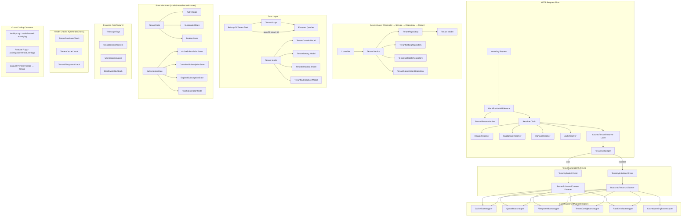

# Design Document: Multi-Tenancy Package

## Overview

This document describes the design for `Pixielity\Tenancy`, a highly structured,
interface-driven, attribute-heavy single-database multi-tenancy Laravel 13
package for a POS/venue management system. The package uses `tenant_id` column
scoping (no separate databases per tenant) and is designed for a headless API
architecture.

The design borrows proven architectural patterns from Stancl/Tenancy
(event-driven bootstrapper lifecycle, cached resolver chain, identification
middleware) while stripping away multi-database concerns, RLS, and resource
syncing. It adds Laravel 13-specific patterns: PHP attributes for container
binding, Eloquent model attributes, attribute-based discovery, state machines,
audit logging, subscription management, and health checks.

### Key Design Decisions

1. **Single-database with column scoping** — All tenants share one database.
   Isolation is enforced via Eloquent global scopes adding
   `WHERE tenant_id = ?`. Simpler, cheaper, and sufficient for a POS system
   where tenants are venues managed by the same operator.
2. **Laravel 13 Container Attributes** — All interfaces use `#[Bind]`,
   `#[Singleton]`, `#[Scoped]` instead of manual service provider registration.
   Bindings are declarative and co-located with interface definitions.
3. **Laravel 13 Eloquent Attributes** — All models use `#[Table]`,
   `#[Unguarded]`, `#[Hidden]`, `#[Fillable]` instead of property-based
   configuration.
4. **Interface-First with Attribute Constants** — Every model interface defines
   `ATTR_*` constants (Magento 2 pattern), used everywhere instead of hardcoded
   strings.
5. **Repository + Service Pattern** — Controller → Service → Repository → Model,
   each with interface and `#[Bind]`.
6. **Event-driven bootstrapper lifecycle** — Tenant initialization/teardown
   fires events that trigger bootstrappers. Bootstrappers are auto-discovered
   via `#[AsBootstrapper]` attribute from `pixielity/laravel-discovery`.
7. **Resolver chain with caching** — Multiple identification strategies
   evaluated in priority order. Resolved tenants are cached.
8. **Key-value stores for settings/metadata** — Dedicated `tenant_settings` and
   `tenant_metadata` tables replace JSON columns, making data queryable and
   indexable.
9. **State machines via spatie/laravel-model-states** — Tenant status and
   subscription status use formal state machines with explicit allowed
   transitions.
10. **Audit logging via spatie/laravel-activitylog** — All tenant operations are
    automatically logged with tenant-scoped tags.
11. **Feature flags via pixielity/laravel-feature-flags** — Built on Laravel
    Pennant, scoped to tenant with repository pattern and helper functions.
12. **Health checks via pixielity/laravel-health** — Tenant-scoped health checks
    with `#[AsHealthCheck]` attribute discovery.
13. **Model Organization** — Each model has `Contracts/`, `Traits/ModelName/`
    with AccessorsTrait, RelationsTrait, ScopesTrait.

## Architecture



### Request Lifecycle

1. Request hits `IdentificationMiddleware` (header, subdomain, or domain
   variant) — discovered via `#[AsIdentification]`
2. Middleware delegates to the appropriate `TenantResolver` (via
   `CachedTenantResolver` layer)
3. Resolver looks up tenant (with optional caching)
4. `TenancyManager::initialize(Tenant)` is called
5. `TenancyInitialized` event fires
6. `BootstrapTenancy` listener iterates bootstrappers (discovered via
   `#[AsBootstrapper]`), calling `bootstrap(Tenant)` on each
7. `EnsureTenantIsActive` middleware checks tenant status (returns 503 for
   suspended, 403 for deleted)
8. Request proceeds — all Eloquent models using `BelongsToTenant` are
   automatically scoped
9. Response is sent
10. On teardown or context switch, `TenancyManager::end()` fires `TenancyEnded`
11. `RevertToCentralContext` listener calls `revert()` on bootstrappers in
    reverse order

## Components and Interfaces

### Contracts with `#[Bind]` Attributes

```php
namespace Pixielity\Tenancy\Contracts;

use Illuminate\Container\Attributes\Bind;
use Illuminate\Container\Attributes\Singleton;

// --- Core Contracts ---

#[Bind(TenancyManager::class)]
#[Singleton]
interface TenancyManagerInterface
{
    public function initialize(TenantInterface|int|string $tenant): void;
    public function end(): void;
    public function run(TenantInterface $tenant, Closure $callback): mixed;
    public function central(Closure $callback): mixed;
    public function runForMultiple(iterable|null $tenants, Closure $callback): void;
    public static function find(int|string $id, ?string $column = null): ?TenantInterface;
}

interface TenantInterface
{
    const ATTR_ID = 'id';
    const ATTR_NAME = 'name';
    const ATTR_SLUG = 'slug';
    const ATTR_STATUS = 'status';
    const ATTR_DELETED_AT = 'deleted_at';
    const ATTR_CREATED_AT = 'created_at';
    const ATTR_UPDATED_AT = 'updated_at';

    public function getTenantKeyName(): string;
    public function getTenantKey(): int|string;
}

interface TenantDomainInterface
{
    const ATTR_ID = 'id';
    const ATTR_TENANT_ID = 'tenant_id';
    const ATTR_DOMAIN = 'domain';
    const ATTR_TYPE = 'type';
    const ATTR_IS_PRIMARY = 'is_primary';
    const ATTR_IS_VERIFIED = 'is_verified';
    const ATTR_DNS_RECORD_TYPE = 'dns_record_type';
    const ATTR_DNS_TARGET = 'dns_target';
    const ATTR_SSL_STATUS = 'ssl_status';
    const ATTR_CREATED_AT = 'created_at';
    const ATTR_UPDATED_AT = 'updated_at';
}

interface TenantSettingInterface
{
    const ATTR_ID = 'id';
    const ATTR_TENANT_ID = 'tenant_id';
    const ATTR_KEY = 'key';
    const ATTR_VALUE = 'value';
}

interface TenantMetadataInterface
{
    const ATTR_ID = 'id';
    const ATTR_TENANT_ID = 'tenant_id';
    const ATTR_KEY = 'key';
    const ATTR_VALUE = 'value';
}

interface TenantSubscriptionInterface
{
    const ATTR_ID = 'id';
    const ATTR_TENANT_ID = 'tenant_id';
    const ATTR_PLAN = 'plan';
    const ATTR_STATUS = 'status';
    const ATTR_TRIAL_ENDS_AT = 'trial_ends_at';
    const ATTR_STARTS_AT = 'starts_at';
    const ATTR_ENDS_AT = 'ends_at';
    const ATTR_CREATED_AT = 'created_at';
    const ATTR_UPDATED_AT = 'updated_at';
}

// --- Resolver Contract ---

#[Bind(ResolverChain::class)]
interface TenantResolverInterface
{
    /** @throws TenantCouldNotBeIdentifiedException */
    public function resolve(mixed ...$args): TenantInterface;
}

// --- Bootstrapper Contract ---

interface TenancyBootstrapperInterface
{
    public function bootstrap(TenantInterface $tenant): void;
    public function revert(): void;
}

// --- Feature Contract ---

interface FeatureInterface
{
    public function bootstrap(): void;
}

// --- Service Contracts ---

#[Bind(TenantService::class)]
interface TenantServiceInterface
{
    public function create(array $data): TenantInterface;
    public function update(TenantInterface $tenant, array $data): TenantInterface;
    public function delete(TenantInterface $tenant): void;
    public function findById(int|string $id): ?TenantInterface;
    public function findBySlug(string $slug): ?TenantInterface;
    public function all(): Collection;
    public function addDomain(TenantInterface $tenant, string $domain, array $options = []): TenantDomainInterface;
    public function removeDomain(TenantInterface $tenant, string $domain): void;
    public function updateStatus(TenantInterface $tenant, string $status): TenantInterface;
}

#[Bind(TenantRepository::class)]
interface TenantRepositoryInterface
{
    public function create(array $data): TenantInterface;
    public function update(TenantInterface $tenant, array $data): TenantInterface;
    public function delete(TenantInterface $tenant): void;
    public function findById(int|string $id): ?TenantInterface;
    public function findBySlug(string $slug): ?TenantInterface;
    public function all(): Collection;
}

#[Bind(TenantSettingRepository::class)]
interface TenantSettingRepositoryInterface
{
    public function get(TenantInterface $tenant, string $key): ?string;
    public function set(TenantInterface $tenant, string $key, ?string $value): void;
    public function delete(TenantInterface $tenant, string $key): void;
    public function all(TenantInterface $tenant): Collection;
}

#[Bind(TenantMetadataRepository::class)]
interface TenantMetadataRepositoryInterface
{
    public function get(TenantInterface $tenant, string $key): ?string;
    public function set(TenantInterface $tenant, string $key, ?string $value): void;
    public function delete(TenantInterface $tenant, string $key): void;
    public function all(TenantInterface $tenant): Collection;
}

#[Bind(TenantSubscriptionRepository::class)]
interface TenantSubscriptionRepositoryInterface
{
    public function findByTenant(TenantInterface $tenant): ?TenantSubscriptionInterface;
    public function create(array $data): TenantSubscriptionInterface;
    public function update(TenantSubscriptionInterface $subscription, array $data): TenantSubscriptionInterface;
}

#[Bind(TenantSubscriptionService::class)]
interface TenantSubscriptionServiceInterface
{
    public function hasActiveSubscription(TenantInterface $tenant): bool;
    public function isOnTrial(TenantInterface $tenant): bool;
    public function isOnPlan(TenantInterface $tenant, string $plan): bool;
}

#[Bind(TenantDataExportService::class)]
interface TenantDataExportServiceInterface
{
    public function export(TenantInterface $tenant): string;
    public function getExportableModels(): array;
}

#[Bind(TenantDataImportService::class)]
interface TenantDataImportServiceInterface
{
    public function import(TenantInterface $tenant, string $filePath): void;
}
```

### TenancyManager (Singleton)

```php
namespace Pixielity\Tenancy;

use Illuminate\Support\Traits\Macroable;
use Pixielity\Tenancy\Contracts\TenancyManagerInterface;
use Pixielity\Tenancy\Contracts\TenantInterface;
use Pixielity\Tenancy\Contracts\TenancyBootstrapperInterface;

class TenancyManager implements TenancyManagerInterface
{
    use Macroable;

    public ?TenantInterface $tenant = null;
    public bool $initialized = false;
    public ?Closure $getBootstrappersUsing = null;

    /** @var list<class-string<TenancyBootstrapperInterface>> */
    public array $initializedBootstrappers = [];

    /** @var list<class-string<FeatureInterface>> */
    protected array $bootstrappedFeatures = [];

    public function initialize(TenantInterface|int|string $tenant): void;
    public function end(): void;
    public function run(TenantInterface $tenant, Closure $callback): mixed;
    public function central(Closure $callback): mixed;
    public function runForMultiple(iterable|null $tenants, Closure $callback): void;
    public static function find(int|string $id, ?string $column = null): ?TenantInterface;
    public static function model(): TenantInterface;
    public static function tenantKeyColumn(): string;
    public function getBootstrappers(): array;
    public function bootstrapFeatures(): void;
}
```

### Models with Laravel 13 Attributes

| Class                | Table                  | Interface                     | Key Relationships                                                                                                  | Traits                                                                                                       |
| -------------------- | ---------------------- | ----------------------------- | ------------------------------------------------------------------------------------------------------------------ | ------------------------------------------------------------------------------------------------------------ |
| `Tenant`             | `tenants`              | `TenantInterface`             | `hasMany(TenantDomain)`, `hasMany(TenantSetting)`, `hasMany(TenantMetadata)`, `hasOne/hasMany(TenantSubscription)` | `HasStates`, `LogsActivity`, `HasFeatures`, `SoftDeletes`, `AccessorsTrait`, `RelationsTrait`, `ScopesTrait` |
| `TenantDomain`       | `tenant_domains`       | `TenantDomainInterface`       | `belongsTo(Tenant)`                                                                                                | `AccessorsTrait`, `RelationsTrait`, `ScopesTrait`                                                            |
| `TenantSetting`      | `tenant_settings`      | `TenantSettingInterface`      | `belongsTo(Tenant)`                                                                                                | `AccessorsTrait`, `RelationsTrait`                                                                           |
| `TenantMetadata`     | `tenant_metadata`      | `TenantMetadataInterface`     | `belongsTo(Tenant)`                                                                                                | `AccessorsTrait`, `RelationsTrait`                                                                           |
| `TenantSubscription` | `tenant_subscriptions` | `TenantSubscriptionInterface` | `belongsTo(Tenant)`                                                                                                | `HasStates`, `AccessorsTrait`, `RelationsTrait`, `ScopesTrait`                                               |
| `ImpersonationToken` | `impersonation_tokens` | —                             | `belongsTo(Tenant)`                                                                                                | —                                                                                                            |

### Resolvers

| Resolver            | Strategy               | Input                                         |
| ------------------- | ---------------------- | --------------------------------------------- |
| `HeaderResolver`    | HTTP header lookup     | Configurable header name (e.g. `X-Tenant-ID`) |
| `SubdomainResolver` | Subdomain extraction   | First segment of hostname                     |
| `DomainResolver`    | Full domain match      | `tenant_domains.domain` lookup                |
| `AuthResolver`      | Authenticated user     | `$user->tenant_id`                            |
| `ResolverChain`     | Priority-ordered chain | Delegates to configured resolvers             |

All resolvers extend `CachedTenantResolver` which provides optional
cache-through resolution.

### Bootstrappers (all annotated with `#[AsBootstrapper]`)

| Bootstrapper               | Responsibility                                                                     |
| -------------------------- | ---------------------------------------------------------------------------------- |
| `CacheBootstrapper`        | Prefix cache keys with tenant identifier                                           |
| `QueueBootstrapper`        | Inject/restore `tenant_id` in job payloads, scope queue names per tenant           |
| `FilesystemBootstrapper`   | Scope disk root paths per tenant                                                   |
| `TenantConfigBootstrapper` | Override Laravel config from tenant settings                                       |
| `RateLimitBootstrapper`    | Register tenant-specific rate limiters via `RateLimiter::for()`, plan-based limits |
| `CacheWarmingBootstrapper` | Preload tenant settings/metadata into cache on initialization                      |

### Middleware

| Middleware                     | Resolver Used       | Discovery             |
| ------------------------------ | ------------------- | --------------------- |
| `InitializeTenancyByHeader`    | `HeaderResolver`    | `#[AsIdentification]` |
| `InitializeTenancyBySubdomain` | `SubdomainResolver` | `#[AsIdentification]` |
| `InitializeTenancyByDomain`    | `DomainResolver`    | `#[AsIdentification]` |
| `EnsureTenantIsActive`         | — (status guard)    | Manual registration   |

All identification middleware extend `IdentificationMiddleware` which provides
`initializeTenancy()` with `onFail` callback support.

### Features (all annotated with `#[AsFeature]`)

| Feature                | Description                                 |
| ---------------------- | ------------------------------------------- |
| `TelescopeTags`        | Tags Telescope entries with `tenant:{key}`  |
| `CrossDomainRedirect`  | Adds `domain()` macro to `RedirectResponse` |
| `UserImpersonation`    | Time-limited token-based user impersonation |
| `DisallowSqliteAttach` | Prevents SQLite ATTACH in tenant context    |

### Health Checks (all annotated with `#[AsHealthCheck]`)

| Health Check            | Description                                      |
| ----------------------- | ------------------------------------------------ |
| `TenantDatabaseCheck`   | Verifies tenant-scoped queries execute correctly |
| `TenantCacheCheck`      | Verifies tenant cache prefix is working          |
| `TenantFilesystemCheck` | Verifies tenant storage path is accessible       |

### Traits

| Trait                     | Purpose                                                                                                  |
| ------------------------- | -------------------------------------------------------------------------------------------------------- |
| `BelongsToTenant`         | Applies `TenantScope`, auto-fills `tenant_id`, defines `tenant()` relationship                           |
| `TenantAware`             | Stores/restores tenant context for jobs                                                                  |
| `TenantAwareCommand`      | Adds `--tenants` option, runs command per tenant                                                         |
| `TenantAwareNotification` | Stores/restores tenant context for queued notifications (separate lifecycle from jobs)                   |
| `HasDiscovery`            | Service provider trait calling `collectBootstrappers()`, `collectFeatures()`, `collectIdentifications()` |

### Events

| Event                  | Trigger                                  |
| ---------------------- | ---------------------------------------- |
| `TenancyInitialized`   | After `TenancyManager::initialize()`     |
| `TenancyEnded`         | After `TenancyManager::end()`            |
| `BootstrappingTenancy` | Before bootstrappers run                 |
| `TenancyBootstrapped`  | After all bootstrappers complete         |
| `TenantCreated`        | Eloquent `created` event on Tenant model |
| `TenantUpdated`        | Eloquent `updated` event on Tenant model |
| `TenantDeleted`        | Eloquent `deleted` event on Tenant model |

### State Machines (spatie/laravel-model-states)

**Tenant Status States** (`src/Models/States/Tenant/`):

```
ActiveState ──→ SuspendedState
ActiveState ──→ DeletedState
SuspendedState ──→ ActiveState
SuspendedState ──→ DeletedState
DeletedState ──→ (no transitions allowed)
```

**Subscription Status States** (`src/Models/States/Subscription/`):

```
TrialSubscriptionState ──→ ActiveSubscriptionState
TrialSubscriptionState ──→ CancelledSubscriptionState
TrialSubscriptionState ──→ ExpiredSubscriptionState
ActiveSubscriptionState ──→ CancelledSubscriptionState
ActiveSubscriptionState ──→ ExpiredSubscriptionState
CancelledSubscriptionState ──→ ActiveSubscriptionState
ExpiredSubscriptionState ──→ ActiveSubscriptionState
```

### Artisan Commands

| Command                          | Description                              |
| -------------------------------- | ---------------------------------------- |
| `tenancy:create`                 | Create a new tenant                      |
| `tenancy:list`                   | List all tenants                         |
| `tenancy:delete`                 | Delete (soft) a tenant                   |
| `tenancy:domain:add`             | Add domain to tenant                     |
| `tenancy:domain:remove`          | Remove domain from tenant                |
| `tenancy:seed`                   | Run seeders in tenant context            |
| `tenancy:run`                    | Run arbitrary command in tenant context  |
| `tenancy:migrate`                | Run migrations in tenant context         |
| `tenancy:status`                 | Update tenant status                     |
| `tenancy:restore`                | Restore a soft-deleted tenant            |
| `tenancy:force-delete`           | Permanently delete a tenant and all data |
| `tenancy:export {tenant}`        | Export all tenant data                   |
| `tenancy:import {tenant} {file}` | Import tenant data from file             |

### Package Structure

```
packages/tenancy/
├── composer.json
├── module.json
└── src/
    ├── Bootstrappers/
    │   ├── CacheBootstrapper.php              # #[AsBootstrapper]
    │   ├── CacheWarmingBootstrapper.php        # #[AsBootstrapper]
    │   ├── FilesystemBootstrapper.php          # #[AsBootstrapper]
    │   ├── QueueBootstrapper.php               # #[AsBootstrapper]
    │   ├── RateLimitBootstrapper.php           # #[AsBootstrapper]
    │   └── TenantConfigBootstrapper.php        # #[AsBootstrapper]
    ├── Commands/
    │   ├── CreateTenantCommand.php
    │   ├── DeleteTenantCommand.php
    │   ├── ExportTenantCommand.php
    │   ├── ForceDeleteTenantCommand.php
    │   ├── ImportTenantCommand.php
    │   ├── ListTenantsCommand.php
    │   ├── AddDomainCommand.php
    │   ├── RemoveDomainCommand.php
    │   ├── RestoreTenantCommand.php
    │   ├── SeedCommand.php
    │   ├── RunCommand.php
    │   ├── MigrateCommand.php
    │   └── StatusCommand.php
    ├── Concerns/
    │   ├── BelongsToTenant.php
    │   ├── TenantAware.php
    │   ├── TenantAwareCommand.php
    │   ├── TenantAwareNotification.php
    │   └── HasDiscovery.php
    ├── Contracts/
    │   ├── FeatureInterface.php
    │   ├── TenancyBootstrapperInterface.php
    │   ├── TenancyManagerInterface.php         # #[Bind], #[Singleton]
    │   ├── TenantDataExportServiceInterface.php # #[Bind]
    │   ├── TenantDataImportServiceInterface.php # #[Bind]
    │   ├── TenantResolverInterface.php         # #[Bind]
    │   ├── TenantServiceInterface.php          # #[Bind]
    │   ├── TenantRepositoryInterface.php       # #[Bind]
    │   ├── TenantSettingRepositoryInterface.php # #[Bind]
    │   ├── TenantMetadataRepositoryInterface.php # #[Bind]
    │   ├── TenantSubscriptionServiceInterface.php # #[Bind]
    │   └── TenantSubscriptionRepositoryInterface.php # #[Bind]
    ├── Events/
    │   ├── BootstrappingTenancy.php
    │   ├── TenancyBootstrapped.php
    │   ├── TenancyEnded.php
    │   ├── TenancyInitialized.php
    │   ├── TenantCreated.php
    │   ├── TenantDeleted.php
    │   └── TenantUpdated.php
    ├── Exceptions/
    │   ├── DomainOccupiedByOtherTenantException.php
    │   ├── TenancyNotInitializedException.php
    │   ├── TenantCouldNotBeIdentifiedByHeaderException.php
    │   ├── TenantCouldNotBeIdentifiedByIdException.php
    │   ├── TenantCouldNotBeIdentifiedException.php
    │   ├── TenantCouldNotBeIdentifiedOnDomainException.php
    │   └── UnsupportedDatabaseOperationException.php
    ├── Facades/
    │   └── Tenancy.php
    ├── Features/
    │   ├── CrossDomainRedirect.php             # #[AsFeature]
    │   ├── DisallowSqliteAttach.php            # #[AsFeature]
    │   ├── TelescopeTags.php                   # #[AsFeature]
    │   └── UserImpersonation.php               # #[AsFeature]
    ├── HealthChecks/
    │   ├── TenantCacheCheck.php                # #[AsHealthCheck]
    │   ├── TenantDatabaseCheck.php             # #[AsHealthCheck]
    │   └── TenantFilesystemCheck.php           # #[AsHealthCheck]
    ├── Listeners/
    │   ├── BootstrapTenancy.php
    │   └── RevertToCentralContext.php
    ├── Middleware/
    │   ├── EnsureTenantIsActive.php
    │   ├── IdentificationMiddleware.php
    │   ├── InitializeTenancyByDomain.php       # #[AsIdentification]
    │   ├── InitializeTenancyByHeader.php       # #[AsIdentification]
    │   └── InitializeTenancyBySubdomain.php    # #[AsIdentification]
    ├── Migrations/
    │   ├── 2024_01_01_000001_create_tenants_table.php
    │   ├── 2024_01_01_000002_create_tenant_domains_table.php
    │   ├── 2024_01_01_000003_create_tenant_settings_table.php
    │   ├── 2024_01_01_000004_create_tenant_metadata_table.php
    │   ├── 2024_01_01_000005_create_tenant_subscriptions_table.php
    │   └── 2024_01_01_000006_create_impersonation_tokens_table.php
    ├── Models/
    │   ├── Tenant/
    │   │   ├── Contracts/
    │   │   │   └── TenantInterface.php
    │   │   ├── Traits/
    │   │   │   └── Tenant/
    │   │   │       ├── AccessorsTrait.php
    │   │   │       ├── RelationsTrait.php
    │   │   │       └── ScopesTrait.php
    │   │   └── Tenant.php                      # #[Table('tenants')], #[Unguarded]
    │   ├── TenantDomain/
    │   │   ├── Contracts/
    │   │   │   └── TenantDomainInterface.php
    │   │   ├── Traits/
    │   │   │   └── TenantDomain/
    │   │   │       ├── AccessorsTrait.php
    │   │   │       ├── RelationsTrait.php
    │   │   │       └── ScopesTrait.php
    │   │   └── TenantDomain.php                # #[Table('tenant_domains')], #[Unguarded]
    │   ├── TenantSetting/
    │   │   ├── Contracts/
    │   │   │   └── TenantSettingInterface.php
    │   │   ├── Traits/
    │   │   │   └── TenantSetting/
    │   │   │       ├── AccessorsTrait.php
    │   │   │       └── RelationsTrait.php
    │   │   └── TenantSetting.php               # #[Table('tenant_settings')], #[Unguarded]
    │   ├── TenantMetadata/
    │   │   ├── Contracts/
    │   │   │   └── TenantMetadataInterface.php
    │   │   ├── Traits/
    │   │   │   └── TenantMetadata/
    │   │   │       ├── AccessorsTrait.php
    │   │   │       └── RelationsTrait.php
    │   │   └── TenantMetadata.php              # #[Table('tenant_metadata')], #[Unguarded]
    │   ├── TenantSubscription/
    │   │   ├── Contracts/
    │   │   │   └── TenantSubscriptionInterface.php
    │   │   ├── Traits/
    │   │   │   └── TenantSubscription/
    │   │   │       ├── AccessorsTrait.php
    │   │   │       ├── RelationsTrait.php
    │   │   │       └── ScopesTrait.php
    │   │   └── TenantSubscription.php          # #[Table('tenant_subscriptions')], #[Unguarded]
    │   ├── States/
    │   │   ├── Tenant/
    │   │   │   ├── TenantState.php             # abstract base
    │   │   │   ├── ActiveState.php
    │   │   │   ├── SuspendedState.php
    │   │   │   └── DeletedState.php
    │   │   └── Subscription/
    │   │       ├── SubscriptionState.php       # abstract base
    │   │       ├── ActiveSubscriptionState.php
    │   │       ├── CancelledSubscriptionState.php
    │   │       ├── ExpiredSubscriptionState.php
    │   │       └── TrialSubscriptionState.php
    │   └── ImpersonationToken.php
    ├── Providers/
    │   └── TenancyServiceProvider.php          # uses HasDiscovery trait
    ├── Repositories/
    │   ├── TenantRepository.php
    │   ├── TenantSettingRepository.php
    │   ├── TenantMetadataRepository.php
    │   └── TenantSubscriptionRepository.php
    ├── Resolvers/
    │   ├── AuthResolver.php
    │   ├── CachedTenantResolver.php
    │   ├── DomainResolver.php
    │   ├── HeaderResolver.php
    │   ├── ResolverChain.php
    │   └── SubdomainResolver.php
    ├── Schema/
    │   └── TenantBlueprint.php                 # registers ->tenantable() macro
    ├── Seeders/
    │   └── TenantSeeder.php
    ├── Services/
    │   ├── TenantService.php
    │   ├── TenantSubscriptionService.php
    │   ├── TenantDataExportService.php
    │   └── TenantDataImportService.php
    ├── TenancyManager.php
    └── helpers.php
```

## Data Models

### tenants table

| Column       | Type            | Constraints                                                                                             |
| ------------ | --------------- | ------------------------------------------------------------------------------------------------------- |
| `id`         | `bigIncrements` | Primary key                                                                                             |
| `name`       | `string`        | Required                                                                                                |
| `slug`       | `string`        | Unique                                                                                                  |
| `status`     | `string`        | Default `'active'`, values: `active`, `suspended`, `deleted` (managed by `spatie/laravel-model-states`) |
| `deleted_at` | `timestamp`     | Nullable (SoftDeletes)                                                                                  |
| `created_at` | `timestamp`     |                                                                                                         |
| `updated_at` | `timestamp`     |                                                                                                         |

Migration uses `TenantInterface::ATTR_*` constants for all column names.

### tenant_domains table

| Column            | Type                 | Constraints                                            |
| ----------------- | -------------------- | ------------------------------------------------------ |
| `id`              | `bigIncrements`      | Primary key                                            |
| `tenant_id`       | `unsignedBigInteger` | Foreign key → `tenants.id`, cascading delete           |
| `domain`          | `string`             | Unique                                                 |
| `type`            | `string`             | Enum: `subdomain`, `custom_domain`                     |
| `is_primary`      | `boolean`            | Default `false`                                        |
| `is_verified`     | `boolean`            | Default `false`                                        |
| `dns_record_type` | `string`             | Nullable, values: `A`, `CNAME`                         |
| `dns_target`      | `string`             | Nullable                                               |
| `ssl_status`      | `string`             | Enum: `pending`, `active`, `failed`, default `pending` |
| `created_at`      | `timestamp`          |                                                        |
| `updated_at`      | `timestamp`          |                                                        |

Migration uses `TenantDomainInterface::ATTR_*` constants for all column names.

### tenant_settings table

| Column      | Type                 | Constraints                                  |
| ----------- | -------------------- | -------------------------------------------- |
| `id`        | `bigIncrements`      | Primary key                                  |
| `tenant_id` | `unsignedBigInteger` | Foreign key → `tenants.id`, cascading delete |
| `key`       | `string`             | Required                                     |
| `value`     | `text`               | Nullable                                     |

Unique composite index on (`tenant_id`, `key`). Migration uses
`TenantSettingInterface::ATTR_*` constants.

### tenant_metadata table

| Column      | Type                 | Constraints                                  |
| ----------- | -------------------- | -------------------------------------------- |
| `id`        | `bigIncrements`      | Primary key                                  |
| `tenant_id` | `unsignedBigInteger` | Foreign key → `tenants.id`, cascading delete |
| `key`       | `string`             | Required                                     |
| `value`     | `text`               | Nullable                                     |

Unique composite index on (`tenant_id`, `key`). Migration uses
`TenantMetadataInterface::ATTR_*` constants.

### tenant_subscriptions table

| Column          | Type                 | Constraints                                         |
| --------------- | -------------------- | --------------------------------------------------- |
| `id`            | `bigIncrements`      | Primary key                                         |
| `tenant_id`     | `unsignedBigInteger` | Foreign key → `tenants.id`, cascading delete        |
| `plan`          | `string`             | Required                                            |
| `status`        | `string`             | Required (managed by `spatie/laravel-model-states`) |
| `trial_ends_at` | `timestamp`          | Nullable                                            |
| `starts_at`     | `timestamp`          | Required                                            |
| `ends_at`       | `timestamp`          | Nullable                                            |
| `created_at`    | `timestamp`          |                                                     |
| `updated_at`    | `timestamp`          |                                                     |

Migration uses `TenantSubscriptionInterface::ATTR_*` constants.

### impersonation_tokens table

| Column         | Type                 | Constraints                                  |
| -------------- | -------------------- | -------------------------------------------- |
| `token`        | `string(64)`         | Primary key                                  |
| `tenant_id`    | `unsignedBigInteger` | Foreign key → `tenants.id`, cascading delete |
| `user_id`      | `unsignedBigInteger` | Required                                     |
| `redirect_url` | `string`             | Required                                     |
| `auth_guard`   | `string`             | Nullable                                     |
| `remember`     | `boolean`            | Default `false`                              |
| `created_at`   | `timestamp`          |                                              |

### Model Code Examples

#### Tenant Model (Laravel 13 Attributes)

```php
namespace Pixielity\Tenancy\Models\Tenant;

use Illuminate\Database\Eloquent\Attributes\Table;
use Illuminate\Database\Eloquent\Attributes\Unguarded;
use Illuminate\Database\Eloquent\Model;
use Illuminate\Database\Eloquent\SoftDeletes;
use Laravel\Pennant\Concerns\HasFeatures;
use Spatie\Activitylog\Traits\LogsActivity;
use Spatie\Activitylog\LogOptions;
use Spatie\ModelStates\HasStates;
use Pixielity\Tenancy\Models\Tenant\Contracts\TenantInterface;
use Pixielity\Tenancy\Models\Tenant\Traits\Tenant\AccessorsTrait;
use Pixielity\Tenancy\Models\Tenant\Traits\Tenant\RelationsTrait;
use Pixielity\Tenancy\Models\Tenant\Traits\Tenant\ScopesTrait;
use Pixielity\Tenancy\Models\States\Tenant\TenantState;

#[Table('tenants')]
#[Unguarded]
class Tenant extends Model implements TenantInterface
{
    use HasStates;
    use LogsActivity;
    use HasFeatures;
    use SoftDeletes;
    use AccessorsTrait;
    use RelationsTrait;
    use ScopesTrait;

    protected $dispatchesEvents = [
        'created' => \Pixielity\Tenancy\Events\TenantCreated::class,
        'updated' => \Pixielity\Tenancy\Events\TenantUpdated::class,
        'deleted' => \Pixielity\Tenancy\Events\TenantDeleted::class,
    ];

    protected function casts(): array
    {
        return [
            TenantInterface::ATTR_STATUS => TenantState::class,
            TenantInterface::ATTR_DELETED_AT => 'datetime',
        ];
    }

    public function getActivitylogOptions(): LogOptions
    {
        return LogOptions::defaults()
            ->logAll()
            ->logOnlyDirty()
            ->useLogName('tenant');
    }

    public function getTenantKeyName(): string
    {
        return TenantInterface::ATTR_ID;
    }

    public function getTenantKey(): int|string
    {
        return $this->getAttribute($this->getTenantKeyName());
    }
}
```

#### TenantInterface with ATTR\_\* Constants

```php
namespace Pixielity\Tenancy\Models\Tenant\Contracts;

interface TenantInterface
{
    const ATTR_ID = 'id';
    const ATTR_NAME = 'name';
    const ATTR_SLUG = 'slug';
    const ATTR_STATUS = 'status';
    const ATTR_DELETED_AT = 'deleted_at';
    const ATTR_CREATED_AT = 'created_at';
    const ATTR_UPDATED_AT = 'updated_at';

    public function getTenantKeyName(): string;
    public function getTenantKey(): int|string;
}
```

#### TenantDomain Model

```php
namespace Pixielity\Tenancy\Models\TenantDomain;

use Illuminate\Database\Eloquent\Attributes\Table;
use Illuminate\Database\Eloquent\Attributes\Unguarded;
use Illuminate\Database\Eloquent\Model;
use Pixielity\Tenancy\Models\TenantDomain\Contracts\TenantDomainInterface;
use Pixielity\Tenancy\Models\TenantDomain\Traits\TenantDomain\AccessorsTrait;
use Pixielity\Tenancy\Models\TenantDomain\Traits\TenantDomain\RelationsTrait;
use Pixielity\Tenancy\Models\TenantDomain\Traits\TenantDomain\ScopesTrait;
use Pixielity\Tenancy\Exceptions\DomainOccupiedByOtherTenantException;

#[Table('tenant_domains')]
#[Unguarded]
class TenantDomain extends Model implements TenantDomainInterface
{
    use AccessorsTrait;
    use RelationsTrait;
    use ScopesTrait;

    protected function casts(): array
    {
        return [
            TenantDomainInterface::ATTR_IS_PRIMARY => 'boolean',
            TenantDomainInterface::ATTR_IS_VERIFIED => 'boolean',
        ];
    }

    protected static function booted(): void
    {
        static::creating(function (TenantDomain $domain) {
            $exists = static::where(TenantDomainInterface::ATTR_DOMAIN, $domain->{TenantDomainInterface::ATTR_DOMAIN})
                ->where(TenantDomainInterface::ATTR_TENANT_ID, '!=', $domain->{TenantDomainInterface::ATTR_TENANT_ID})
                ->exists();

            if ($exists) {
                throw new DomainOccupiedByOtherTenantException(
                    $domain->{TenantDomainInterface::ATTR_DOMAIN},
                    $domain->{TenantDomainInterface::ATTR_TENANT_ID}
                );
            }
        });
    }
}
```

#### TenantSetting Model

```php
namespace Pixielity\Tenancy\Models\TenantSetting;

use Illuminate\Database\Eloquent\Attributes\Table;
use Illuminate\Database\Eloquent\Attributes\Unguarded;
use Illuminate\Database\Eloquent\Model;
use Pixielity\Tenancy\Models\TenantSetting\Contracts\TenantSettingInterface;

#[Table('tenant_settings')]
#[Unguarded]
class TenantSetting extends Model implements TenantSettingInterface
{
    use Traits\TenantSetting\AccessorsTrait;
    use Traits\TenantSetting\RelationsTrait;
}
```

#### TenantSubscription Model with State Machine

```php
namespace Pixielity\Tenancy\Models\TenantSubscription;

use Illuminate\Database\Eloquent\Attributes\Table;
use Illuminate\Database\Eloquent\Attributes\Unguarded;
use Illuminate\Database\Eloquent\Model;
use Spatie\ModelStates\HasStates;
use Pixielity\Tenancy\Models\TenantSubscription\Contracts\TenantSubscriptionInterface;
use Pixielity\Tenancy\Models\States\Subscription\SubscriptionState;

#[Table('tenant_subscriptions')]
#[Unguarded]
class TenantSubscription extends Model implements TenantSubscriptionInterface
{
    use HasStates;
    use Traits\TenantSubscription\AccessorsTrait;
    use Traits\TenantSubscription\RelationsTrait;
    use Traits\TenantSubscription\ScopesTrait;

    protected function casts(): array
    {
        return [
            TenantSubscriptionInterface::ATTR_STATUS => SubscriptionState::class,
            TenantSubscriptionInterface::ATTR_TRIAL_ENDS_AT => 'datetime',
            TenantSubscriptionInterface::ATTR_STARTS_AT => 'datetime',
            TenantSubscriptionInterface::ATTR_ENDS_AT => 'datetime',
        ];
    }
}
```

### State Machine Configuration

#### TenantState (Abstract Base)

```php
namespace Pixielity\Tenancy\Models\States\Tenant;

use Spatie\ModelStates\State;
use Spatie\ModelStates\StateConfig;

abstract class TenantState extends State
{
    public static function config(): StateConfig
    {
        return parent::config()
            ->default(ActiveState::class)
            ->allowTransition(ActiveState::class, SuspendedState::class)
            ->allowTransition(ActiveState::class, DeletedState::class)
            ->allowTransition(SuspendedState::class, ActiveState::class)
            ->allowTransition(SuspendedState::class, DeletedState::class);
            // DeletedState has NO outgoing transitions
    }
}
```

#### SubscriptionState (Abstract Base)

```php
namespace Pixielity\Tenancy\Models\States\Subscription;

use Spatie\ModelStates\State;
use Spatie\ModelStates\StateConfig;

abstract class SubscriptionState extends State
{
    public static function config(): StateConfig
    {
        return parent::config()
            ->default(TrialSubscriptionState::class)
            ->allowTransition(TrialSubscriptionState::class, ActiveSubscriptionState::class)
            ->allowTransition(TrialSubscriptionState::class, CancelledSubscriptionState::class)
            ->allowTransition(TrialSubscriptionState::class, ExpiredSubscriptionState::class)
            ->allowTransition(ActiveSubscriptionState::class, CancelledSubscriptionState::class)
            ->allowTransition(ActiveSubscriptionState::class, ExpiredSubscriptionState::class)
            ->allowTransition(CancelledSubscriptionState::class, ActiveSubscriptionState::class)
            ->allowTransition(ExpiredSubscriptionState::class, ActiveSubscriptionState::class);
    }
}
```

### Discovery Attribute Examples

```php
// Bootstrapper discovery
namespace Pixielity\Tenancy\Bootstrappers;

use Pixielity\Discovery\Attributes\AsBootstrapper;
use Pixielity\Tenancy\Contracts\TenancyBootstrapperInterface;
use Pixielity\Tenancy\Contracts\TenantInterface;

#[AsBootstrapper]
class RateLimitBootstrapper implements TenancyBootstrapperInterface
{
    public function bootstrap(TenantInterface $tenant): void
    {
        // Register tenant-specific rate limiters
        RateLimiter::for("tenant-api", function (Request $request) use ($tenant) {
            $limit = $this->getLimitForTenant($tenant);
            return Limit::perMinute($limit)->by($tenant->getTenantKey());
        });
    }

    public function revert(): void
    {
        // Restore default rate limiters
    }

    private function getLimitForTenant(TenantInterface $tenant): int
    {
        // Check subscription plan for rate limit tier
    }
}

// Feature discovery
#[AsFeature]
class TelescopeTags implements FeatureInterface { /* ... */ }

// Identification middleware discovery
#[AsIdentification]
class InitializeTenancyByHeader extends IdentificationMiddleware { /* ... */ }

// Health check discovery
use Pixielity\Health\Attributes\AsHealthCheck;

#[AsHealthCheck]
class TenantDatabaseCheck extends Check
{
    public function run(): Result
    {
        if (!tenancy()->initialized) {
            return Result::make()->warning('No tenant context');
        }
        // Verify tenant-scoped query works
    }
}
```

### Repository + Service Pattern Example

```php
// Controller injects Service
class TenantController extends Controller
{
    public function __construct(
        private TenantServiceInterface $tenantService,
    ) {}

    public function store(Request $request): JsonResponse
    {
        $tenant = $this->tenantService->create($request->validated());
        return response()->json($tenant, 201);
    }
}

// Service injects Repository
class TenantService implements TenantServiceInterface
{
    public function __construct(
        private TenantRepositoryInterface $tenantRepository,
        private TenantSettingRepositoryInterface $settingRepository,
        private TenantMetadataRepositoryInterface $metadataRepository,
    ) {}

    public function create(array $data): TenantInterface
    {
        return $this->tenantRepository->create($data);
    }
}

// Repository injects Model
class TenantRepository implements TenantRepositoryInterface
{
    public function __construct(
        private TenantInterface $model,
    ) {}

    public function create(array $data): TenantInterface
    {
        return $this->model->newQuery()->create($data);
    }

    public function findById(int|string $id): ?TenantInterface
    {
        return $this->model->newQuery()->find($id);
    }
}
```

### TenantBlueprint Macro

```php
namespace Pixielity\Tenancy\Schema;

use Illuminate\Database\Schema\Blueprint;
use Pixielity\Tenancy\Models\Tenant\Contracts\TenantInterface;

class TenantBlueprint
{
    public static function register(): void
    {
        Blueprint::macro('tenantable', function () {
            /** @var Blueprint $this */
            $this->unsignedBigInteger('tenant_id');
            $this->foreign('tenant_id')
                ->references(TenantInterface::ATTR_ID)
                ->on('tenants')
                ->cascadeOnDelete();
            $this->index('tenant_id');
        });
    }
}
```

### EnsureTenantIsActive Middleware

```php
namespace Pixielity\Tenancy\Middleware;

use Closure;
use Illuminate\Http\Request;
use Pixielity\Tenancy\Models\States\Tenant\ActiveState;
use Pixielity\Tenancy\Models\States\Tenant\SuspendedState;
use Pixielity\Tenancy\Models\States\Tenant\DeletedState;

class EnsureTenantIsActive
{
    public function handle(Request $request, Closure $next, string ...$allowedStatuses): mixed
    {
        $tenant = tenant();

        if (!$tenant) {
            return $next($request);
        }

        $status = $tenant->status;

        if ($status instanceof SuspendedState) {
            return response()->json([
                'error' => 'Tenant is suspended',
                'message' => 'This tenant account has been suspended.',
            ], 503);
        }

        if ($tenant->trashed()) {
            return response()->json([
                'error' => 'Tenant not found',
                'message' => 'This tenant account has been deleted.',
            ], 403);
        }

        return $next($request);
    }
}
```

### CacheWarmingBootstrapper

```php
namespace Pixielity\Tenancy\Bootstrappers;

use Pixielity\Discovery\Attributes\AsBootstrapper;
use Pixielity\Tenancy\Contracts\TenancyBootstrapperInterface;
use Pixielity\Tenancy\Contracts\TenantInterface;
use Pixielity\Tenancy\Contracts\TenantSettingRepositoryInterface;
use Pixielity\Tenancy\Contracts\TenantMetadataRepositoryInterface;

#[AsBootstrapper]
class CacheWarmingBootstrapper implements TenancyBootstrapperInterface
{
    public static ?Closure $warmUsing = null;

    public function __construct(
        private TenantSettingRepositoryInterface $settings,
        private TenantMetadataRepositoryInterface $metadata,
    ) {}

    public function bootstrap(TenantInterface $tenant): void
    {
        // Preload configured settings keys into cache
        $keys = config('tenancy.cache_warming.settings_keys', []);
        foreach ($keys as $key) {
            $this->settings->get($tenant, $key);
        }

        // Custom warming callback
        if (static::$warmUsing) {
            (static::$warmUsing)($tenant);
        }
    }

    public function revert(): void
    {
        // No action — cache entries expire naturally
    }
}
```

### Service Provider with HasDiscovery

```php
namespace Pixielity\Tenancy\Providers;

use Illuminate\Support\ServiceProvider;
use Illuminate\Support\Facades\Event;
use Laravel\Pennant\Feature;
use Pixielity\Tenancy\Concerns\HasDiscovery;
use Pixielity\Tenancy\Events\TenancyInitialized;
use Pixielity\Tenancy\Events\TenancyEnded;
use Pixielity\Tenancy\Listeners\BootstrapTenancy;
use Pixielity\Tenancy\Listeners\RevertToCentralContext;
use Pixielity\Tenancy\Schema\TenantBlueprint;

class TenancyServiceProvider extends ServiceProvider
{
    use HasDiscovery;

    public function register(): void
    {
        $this->mergeConfigFrom(__DIR__ . '/../../config/tenancy.php', 'tenancy');

        // Discovery-based registration replaces manual bindings
        $this->collectBootstrappers();
        $this->collectFeatures();
        $this->collectIdentifications();
    }

    public function boot(): void
    {
        // Load migrations
        $this->loadMigrationsFrom(__DIR__ . '/../Migrations');

        // Publish config
        $this->publishes([
            __DIR__ . '/../../config/tenancy.php' => config_path('tenancy.php'),
        ], 'tenancy-config');

        // Register event listeners
        Event::listen(TenancyInitialized::class, BootstrapTenancy::class);
        Event::listen(TenancyEnded::class, RevertToCentralContext::class);

        // Register commands
        if ($this->app->runningInConsole()) {
            $this->commands([/* all 13 commands */]);
        }

        // Register TenantBlueprint macro
        TenantBlueprint::register();

        // Set Pennant default scope to current tenant
        Feature::resolveScopeUsing(fn () => tenant());

        // Bootstrap features
        tenancy()->bootstrapFeatures();
    }
}
```

### Configuration Schema (tenancy.php)

```php
return [
    'models' => [
        'tenant' => \Pixielity\Tenancy\Models\Tenant\Tenant::class,
        'domain' => \Pixielity\Tenancy\Models\TenantDomain\TenantDomain::class,
        'setting' => \Pixielity\Tenancy\Models\TenantSetting\TenantSetting::class,
        'metadata' => \Pixielity\Tenancy\Models\TenantMetadata\TenantMetadata::class,
        'subscription' => \Pixielity\Tenancy\Models\TenantSubscription\TenantSubscription::class,
        'impersonation_token' => \Pixielity\Tenancy\Models\ImpersonationToken::class,
        'tenant_key_column' => 'tenant_id',
    ],

    'identification' => [
        'resolvers' => [
            \Pixielity\Tenancy\Resolvers\HeaderResolver::class => [
                'header' => 'X-Tenant-ID',
                'cache' => false,
                'cache_ttl' => 3600,
                'cache_store' => null,
            ],
            \Pixielity\Tenancy\Resolvers\DomainResolver::class => [
                'cache' => true,
                'cache_ttl' => 3600,
                'cache_store' => null,
            ],
            \Pixielity\Tenancy\Resolvers\SubdomainResolver::class => [
                'cache' => true,
                'cache_ttl' => 3600,
                'cache_store' => null,
            ],
        ],
        'central_domains' => [],
    ],

    'cache' => [
        'stores' => ['redis'],
        'prefix' => 'tenant_%tenant%_',
    ],

    'queue' => [
        'central_connections' => [],
        'scoped_queues' => ['default', 'high'],
        'queue_name_generator' => null, // Closure or null
    ],

    'filesystem' => [
        'disks' => ['local'],
        'root_override' => [
            'local' => '%storage_path%/app',
        ],
        'suffix_base' => 'tenant',
    ],

    'config_override' => [
        // 'tenant_setting_key' => 'laravel.config.key',
    ],

    'rate_limiting' => [
        'enabled' => true,
        'default_limit' => 60,
        'plan_limits' => [
            'basic' => 60,
            'pro' => 300,
            'enterprise' => 1000,
        ],
    ],

    'cache_warming' => [
        'settings_keys' => [],
        'metadata_keys' => [],
    ],

    'seeder' => null,

    'impersonation' => [
        'ttl' => 60,
    ],

    'database' => [
        'disallowed_operations' => ['ATTACH'],
    ],

    'status_guard' => [
        'allowed_statuses' => ['active'],
    ],
];
```

## Correctness Properties

_A property is a characteristic or behavior that should hold true across all
valid executions of a system — essentially, a formal statement about what the
system should do. Properties serve as the bridge between human-readable
specifications and machine-verifiable correctness guarantees._

### Property 1: Tenant data round-trip persistence

_For any_ valid tenant data (name, slug, status), creating a Tenant and then
retrieving it by ID should return a Tenant with identical attribute values.

**Validates: Requirements 1.1, 1.4, 3.11**

### Property 2: Tenant status restricted to valid states

_For any_ Tenant, the status value must be one of `active`, `suspended`, or
`deleted` as enforced by the state machine. Attempting to set an invalid status
should be rejected.

**Validates: Requirements 1.3, 36.3, 36.4, 36.5, 36.6**

### Property 3: Tenant lifecycle events dispatch on CRUD

_For any_ Tenant creation, update, or deletion, the corresponding event
(`TenantCreated`, `TenantUpdated`, `TenantDeleted`) must be dispatched exactly
once.

**Validates: Requirements 1.5, 1.6, 1.7, 20.3**

### Property 4: Domain uniqueness across tenants

_For any_ two distinct tenants and a domain string, if the domain is assigned to
the first tenant, attempting to assign the same domain to the second tenant must
raise `DomainOccupiedByOtherTenantException`.

**Validates: Requirements 2.5**

### Property 5: Domain-Tenant relationship integrity

_For any_ TenantDomain, the `tenant()` relationship must return the parent
Tenant, and for any Tenant, `domains()` must return all associated TenantDomain
records.

**Validates: Requirements 2.2, 2.3**

### Property 6: TenancyManager initialize/end state invariant

_For any_ Tenant, after calling `initialize(tenant)`, the TenancyManager's
`tenant` property must equal the initialized tenant and `initialized` must be
`true`. After calling `end()`, `tenant` must be `null` and `initialized` must be
`false`.

**Validates: Requirements 3.2, 3.3, 3.4, 3.5**

### Property 7: TenancyManager initialize idempotence

_For any_ Tenant, calling `initialize(tenant)` twice with the same tenant should
not dispatch `TenancyInitialized` on the second call (skip re-initialization).

**Validates: Requirements 3.7**

### Property 8: TenancyManager context switch ends previous tenant

_For any_ two distinct tenants A and B, calling `initialize(A)` then
`initialize(B)` must result in `end()` being called for A before B is
initialized, and the final state must have tenant B active.

**Validates: Requirements 3.6**

### Property 9: TenancyManager run() round-trip

_For any_ Tenant and any previous tenant context (including null),
`run(tenant, closure)` must execute the closure in the tenant's context and
restore the previous context afterward.

**Validates: Requirements 3.8**

### Property 10: TenancyManager central() round-trip

_For any_ initialized tenant context, `central(closure)` must execute the
closure with no tenant active and restore the original tenant context afterward.

**Validates: Requirements 3.9**

### Property 11: TenantScope query isolation

_For any_ model using `BelongsToTenant` and any initialized tenant, all queries
on that model must only return rows where `tenant_id` matches the current
tenant's key.

**Validates: Requirements 4.1, 4.4**

### Property 12: TenantScope inactive when no tenant

_For any_ model using `BelongsToTenant`, when tenancy is not initialized,
queries must return all rows without tenant filtering.

**Validates: Requirements 4.2**

### Property 13: BelongsToTenant auto-fill on creation

_For any_ model using `BelongsToTenant` created while tenancy is initialized,
the `tenant_id` attribute must be automatically set to the current tenant's key.

**Validates: Requirements 4.5**

### Property 14: Bootstrapper lifecycle ordering

_For any_ set of bootstrappers, when `TenancyInitialized` fires, `bootstrap()`
must be called on each in forward order. When `TenancyEnded` fires, `revert()`
must be called on each in reverse order, and only on bootstrappers that were
previously initialized.

**Validates: Requirements 5.2, 5.3, 5.4**

### Property 15: Cache prefix isolation

_For any_ tenant, after `CacheBootstrapper::bootstrap()`, the cache prefix for
all configured stores must contain the tenant's key. After `revert()`, the
original prefixes must be restored.

**Validates: Requirements 6.1, 6.2**

### Property 16: Queue payload tenant injection

_For any_ job dispatched while tenancy is initialized (on a non-central
connection), the job payload must contain `tenant_id` matching the current
tenant's key. For jobs dispatched without tenancy or on central connections, no
`tenant_id` should be present.

**Validates: Requirements 7.1, 7.4, 7.5**

### Property 17: Queue job tenant context restoration

_For any_ queued job with `tenant_id` in its payload, tenancy must be
initialized for that tenant before the job executes, and reverted to the
previous context after the job completes.

**Validates: Requirements 7.2, 7.3**

### Property 18: Filesystem path isolation

_For any_ tenant, after `FilesystemBootstrapper::bootstrap()`, the root path of
all configured disks must contain the tenant identifier. After `revert()`, the
original paths must be restored.

**Validates: Requirements 8.1, 8.2, 8.4**

### Property 19: Resolver chain priority ordering

_For any_ resolver chain configuration and request, the chain must evaluate
resolvers in configured priority order and return the result of the first
successful resolution.

**Validates: Requirements 9.6**

### Property 20: Resolver chain failure propagation

_For any_ request where no resolver can identify a tenant, the resolver chain
must throw `TenantCouldNotBeIdentifiedException`.

**Validates: Requirements 9.7**

### Property 21: Resolver cache round-trip

_For any_ tenant resolved with caching enabled, the first resolution must store
the tenant in cache, and subsequent lookups with the same identifier must return
the cached tenant without database access. After `invalidateCache()`, the next
lookup must hit the database.

**Validates: Requirements 10.1, 10.2, 10.3**

### Property 22: Identification middleware tenant initialization

_For any_ request with a valid tenant identifier (header, subdomain, or domain),
the corresponding identification middleware must initialize tenancy for the
resolved tenant.

**Validates: Requirements 11.1, 11.2, 11.3**

### Property 23: Facade and helper consistency

_For any_ initialized tenant context, `Tenancy::tenant`, `tenancy()->tenant`,
and `tenant()` must all return the same TenantInterface instance.
`tenant('name')` must return the tenant's name attribute value.

**Validates: Requirements 12.1, 12.2, 12.3, 12.4**

### Property 24: TenantAware job serialization round-trip

_For any_ job using the `TenantAware` trait created during active tenancy,
serializing and then unserializing the job must preserve the `tenant_id`, and
tenancy must be initialized for that tenant before the job executes.

**Validates: Requirements 13.1, 13.2, 13.3**

### Property 25: TenantAwareNotification context preservation

_For any_ notification using the `TenantAwareNotification` trait created during
active tenancy, the notification must execute within the originating tenant's
context when processed via queue, and revert to the previous context afterward.

**Validates: Requirements 45.1, 45.2, 45.3**

### Property 26: Impersonation token expiry enforcement

_For any_ impersonation token, if the token's age exceeds the configured TTL,
redemption must fail with a 403 response and the token must be deleted.

**Validates: Requirements 15.2, 15.4**

### Property 27: Impersonation token tenant match

_For any_ impersonation token, if the token's `tenant_id` does not match the
current tenant context, redemption must fail with a 403 response and the token
must be deleted.

**Validates: Requirements 15.3, 15.4**

### Property 28: Cross-domain redirect hostname replacement

_For any_ redirect URL and target domain string, calling
`->domain($targetDomain)` on the redirect response must replace the hostname in
the URL with the target domain while preserving the path and query string.

**Validates: Requirements 16.2**

### Property 29: Config override round-trip

_For any_ tenant with mapped config attributes, after
`TenantConfigBootstrapper::bootstrap()`, the mapped Laravel config values must
equal the tenant's attribute values. After `revert()`, the original config
values must be restored.

**Validates: Requirements 18.2, 18.3**

### Property 30: Exception messages contain identifiers

_For any_ tenant resolution failure, the thrown exception's message must contain
the identifier that failed (domain string, header value, or tenant ID).

**Validates: Requirements 19.2, 19.3, 19.4**

### Property 31: Tenant setting key-value round-trip

_For any_ tenant and key-value pair, calling `set(tenant, key, value)` then
`get(tenant, key)` must return the same value. Calling `delete(tenant, key)`
then `get(tenant, key)` must return null.

**Validates: Requirements 30.4**

### Property 32: Tenant metadata key-value round-trip

_For any_ tenant and key-value pair, calling `set(tenant, key, value)` then
`get(tenant, key)` must return the same value. Calling `delete(tenant, key)`
then `get(tenant, key)` must return null.

**Validates: Requirements 31.4**

### Property 33: Tenant state machine transition enforcement

_For any_ tenant in `DeletedState`, attempting any state transition must throw
`CouldNotPerformTransition`. For tenants in `ActiveState` or `SuspendedState`,
only the explicitly allowed transitions must succeed.

**Validates: Requirements 36.3, 36.4, 36.5, 36.6, 36.7**

### Property 34: Subscription state machine transition enforcement

_For any_ subscription, only the explicitly allowed state transitions must
succeed. Invalid transitions must throw `CouldNotPerformTransition`.

**Validates: Requirements 38.8, 38.9**

### Property 35: Audit log creation on tenant operations

_For any_ tenant CRUD operation or status change, an activity log entry must be
created with the correct event type and tagged with `tenant:{tenant_id}`.

**Validates: Requirements 37.1, 37.2, 37.3, 37.4, 37.5, 37.12**

### Property 36: Subscription service query correctness

_For any_ tenant with an active subscription, `hasActiveSubscription()` must
return `true`. For any tenant on trial, `isOnTrial()` must return `true`. For
any tenant on a specific plan, `isOnPlan(plan)` must return `true`.

**Validates: Requirements 38.7**

### Property 37: Rate limiter tenant scoping

_For any_ tenant, after `RateLimitBootstrapper::bootstrap()`, the registered
rate limiter keys must include the tenant's ID, preventing cross-tenant quota
sharing.

**Validates: Requirements 39.2, 39.6**

### Property 38: EnsureTenantIsActive status guard

_For any_ request to a suspended tenant, the `EnsureTenantIsActive` middleware
must return 503. For any request to a soft-deleted tenant, it must return 403.
For active tenants, the request must proceed.

**Validates: Requirements 40.2, 40.3**

### Property 39: Soft-deleted tenant exclusion from resolution

_For any_ soft-deleted tenant, all tenant resolvers must exclude it from
resolution results.

**Validates: Requirements 41.3**

### Property 40: Queue name tenant scoping

_For any_ tenant, after `QueueBootstrapper::bootstrap()`, configured queue names
must be prefixed with the tenant identifier (e.g., `tenant-{id}-default`). After
`revert()`, original queue names must be restored.

**Validates: Requirements 43.2, 43.5**

### Property 41: Feature flag tenant scoping

_For any_ tenant, `Feature::for($tenant)->active('feature-name')` must correctly
scope the feature flag check to that specific tenant.

**Validates: Requirements 23.2, 47.3**

## Error Handling

### Exception Hierarchy

```
Exception
└── TenantCouldNotBeIdentifiedException (abstract)
    ├── TenantCouldNotBeIdentifiedOnDomainException
    ├── TenantCouldNotBeIdentifiedByHeaderException
    └── TenantCouldNotBeIdentifiedByIdException
TenancyNotInitializedException
DomainOccupiedByOtherTenantException
UnsupportedDatabaseOperationException
```

### Error Handling Strategy

1. **Resolver failures**: Each resolver throws a specific subclass of
   `TenantCouldNotBeIdentifiedException` with the failed identifier in the
   message. The `ResolverChain` catches individual resolver failures and only
   throws when all resolvers fail.

2. **Identification middleware**: Supports an `onFail` callback for custom error
   handling. Without a callback, the exception propagates to Laravel's exception
   handler.

3. **State machine violations**: `spatie/laravel-model-states` throws
   `CouldNotPerformTransition` for invalid state transitions. These should be
   caught at the service layer and converted to appropriate HTTP responses.

4. **Tenant status guard**: `EnsureTenantIsActive` middleware returns JSON error
   responses (503 for suspended, 403 for deleted) before the request reaches the
   controller.

5. **Database operation guard**: `DisallowSqliteAttach` feature throws
   `UnsupportedDatabaseOperationException` for disallowed SQL operations in
   tenant context.

6. **Cache store incompatibility**: `CacheBootstrapper` throws a descriptive
   exception if a configured cache store doesn't support `setPrefix`.

7. **Audit logging**: All exceptions during tenant operations are logged via
   `spatie/laravel-activitylog` with tenant-scoped tags for debugging.

## Testing Strategy

### Dual Testing Approach

The package requires both unit tests and property-based tests for comprehensive
coverage.

**Unit tests** focus on:

- Specific examples demonstrating correct behavior (e.g., creating a tenant with
  known data)
- Integration points between components (e.g., service provider registration,
  middleware pipeline)
- Edge cases and error conditions (e.g., expired impersonation tokens, cache
  stores without `setPrefix`)
- Command output verification
- Health check pass/fail scenarios

**Property-based tests** focus on:

- Universal properties that hold for all valid inputs
- Comprehensive input coverage through randomization
- State machine transition correctness
- Round-trip properties (serialize/deserialize, set/get, bootstrap/revert)
- Isolation guarantees (tenant scope, cache prefix, filesystem path)

### Property-Based Testing Configuration

- **Library**: `spatie/phpunit-snapshot-assertions` for snapshot testing + a PHP
  PBT library (e.g., `eris/eris` or `innmind/black-box`)
- **Minimum iterations**: 100 per property test
- **Tag format**:
  `Feature: multi-tenancy-package, Property {number}: {property_text}`

Each correctness property above maps to a single property-based test. The test
must:

1. Generate random valid inputs using the PBT library's generators
2. Execute the operation under test
3. Assert the property holds for all generated inputs
4. Reference the design property via a comment tag

### Test Organization

```
tests/
├── Unit/
│   ├── Models/
│   │   ├── TenantTest.php
│   │   ├── TenantDomainTest.php
│   │   ├── TenantSettingTest.php
│   │   ├── TenantMetadataTest.php
│   │   └── TenantSubscriptionTest.php
│   ├── Bootstrappers/
│   │   ├── CacheBootstrapperTest.php
│   │   ├── QueueBootstrapperTest.php
│   │   ├── FilesystemBootstrapperTest.php
│   │   ├── TenantConfigBootstrapperTest.php
│   │   ├── RateLimitBootstrapperTest.php
│   │   └── CacheWarmingBootstrapperTest.php
│   ├── Resolvers/
│   │   ├── HeaderResolverTest.php
│   │   ├── SubdomainResolverTest.php
│   │   ├── DomainResolverTest.php
│   │   ├── AuthResolverTest.php
│   │   └── ResolverChainTest.php
│   ├── Middleware/
│   │   ├── InitializeTenancyByHeaderTest.php
│   │   ├── InitializeTenancyBySubdomainTest.php
│   │   ├── InitializeTenancyByDomainTest.php
│   │   └── EnsureTenantIsActiveTest.php
│   ├── Services/
│   │   ├── TenantServiceTest.php
│   │   ├── TenantSubscriptionServiceTest.php
│   │   ├── TenantDataExportServiceTest.php
│   │   └── TenantDataImportServiceTest.php
│   ├── Repositories/
│   │   ├── TenantRepositoryTest.php
│   │   ├── TenantSettingRepositoryTest.php
│   │   ├── TenantMetadataRepositoryTest.php
│   │   └── TenantSubscriptionRepositoryTest.php
│   ├── States/
│   │   ├── TenantStateTest.php
│   │   └── SubscriptionStateTest.php
│   ├── Commands/
│   │   └── (one test per command)
│   ├── Features/
│   │   ├── TelescopeTagsTest.php
│   │   ├── CrossDomainRedirectTest.php
│   │   ├── UserImpersonationTest.php
│   │   └── DisallowSqliteAttachTest.php
│   ├── TenancyManagerTest.php
│   ├── TenantScopeTest.php
│   └── BelongsToTenantTest.php
├── Property/
│   ├── TenantPersistencePropertyTest.php       # Property 1
│   ├── TenantStatusPropertyTest.php            # Property 2
│   ├── TenantEventsPropertyTest.php            # Property 3
│   ├── DomainUniquenessPropertyTest.php        # Property 4
│   ├── DomainRelationshipPropertyTest.php      # Property 5
│   ├── TenancyManagerStatePropertyTest.php     # Properties 6, 7, 8
│   ├── TenancyManagerRunPropertyTest.php       # Properties 9, 10
│   ├── TenantScopePropertyTest.php             # Properties 11, 12, 13
│   ├── BootstrapperLifecyclePropertyTest.php   # Property 14
│   ├── CacheIsolationPropertyTest.php          # Property 15
│   ├── QueueIsolationPropertyTest.php          # Properties 16, 17, 40
│   ├── FilesystemIsolationPropertyTest.php     # Property 18
│   ├── ResolverChainPropertyTest.php           # Properties 19, 20
│   ├── ResolverCachePropertyTest.php           # Property 21
│   ├── MiddlewarePropertyTest.php              # Property 22
│   ├── FacadeHelperPropertyTest.php            # Property 23
│   ├── TenantAwarePropertyTest.php             # Properties 24, 25
│   ├── ImpersonationPropertyTest.php           # Properties 26, 27
│   ├── CrossDomainPropertyTest.php             # Property 28
│   ├── ConfigOverridePropertyTest.php          # Property 29
│   ├── ExceptionPropertyTest.php               # Property 30
│   ├── SettingMetadataPropertyTest.php         # Properties 31, 32
│   ├── StateTransitionPropertyTest.php         # Properties 33, 34
│   ├── AuditLogPropertyTest.php                # Property 35
│   ├── SubscriptionServicePropertyTest.php     # Property 36
│   ├── RateLimiterPropertyTest.php             # Property 37
│   ├── StatusGuardPropertyTest.php             # Property 38
│   ├── SoftDeletePropertyTest.php              # Property 39
│   └── FeatureFlagPropertyTest.php             # Property 41
└── Integration/
    ├── ServiceProviderTest.php
    ├── HealthCheckTest.php
    └── FullLifecycleTest.php
```
