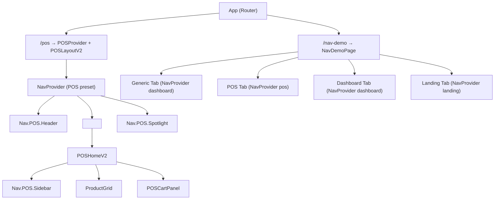
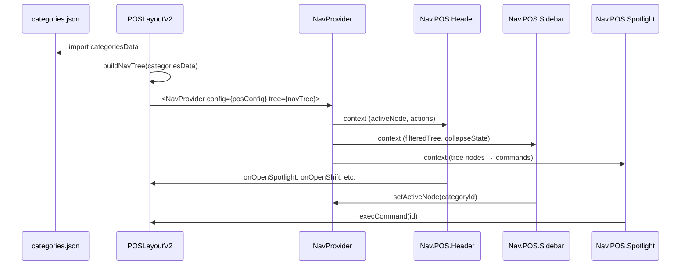
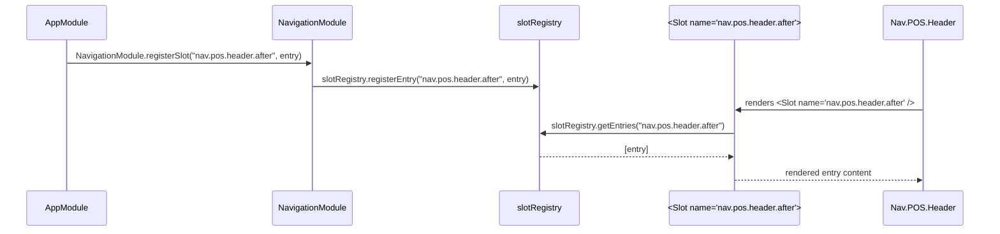

# Design Document: Nav Integration

## Overview

This design covers the integration of the `@nav/*` package suite into the
`vite-template` application across three workstreams:

1. **Nav Demo Page** — A standalone `/nav-demo` route showcasing all `@nav/ui`
   components (Generic, POS, Dashboard, Landing) with interactive feature
   demonstrations (active state, breadcrumbs, role filtering, collapse, keyboard
   nav, plugins).
2. **POS Migration** — Replacing the custom `POSHeader`, `POSSidebar`, and
   `Spotlight` components with `Nav.POS.Header`, `Nav.POS.Sidebar`, and
   `Nav.POS.Spotlight` from `@nav/ui`, wired through `NavProvider` with the POS
   context preset.
3. **Slot System** — Adding `<Slot>` injection points to `@nav/ui` components
   and creating a `NavigationModule` DI module for declarative slot registration
   from `AppModule`.

### Design Decisions

- **Application-level integration**: All changes target `apps/vite-template/`
  and minor `<Slot>` additions to `packages/nav/ui/`. No new packages are
  created.
- **NavProvider wraps POS layout**: The `NavProvider` is placed inside
  `POSLayoutV2`, above the `<Outlet>`, so all POS pages share navigation state.
- **NavTree built from categories.json**: The existing `categoriesData` is
  mapped to `NavNodeDef` objects at render time using `createNavTree`,
  `addSection`, and `addNode`.
- **Slot naming convention**: `nav.{context}.{component}.{position}` (e.g.,
  `nav.pos.header.before`, `nav.dashboard.sidebar.after`). Generic components
  omit the context segment (e.g., `nav.header.before`).
- **NavigationModule delegates to slotRegistry**: It uses the same
  `slotRegistry` singleton from `@abdokouta/react-ui`, ensuring slots registered
  via `NavigationModule` are rendered by the existing `<Slot>` component.

## Architecture

### Component Hierarchy



### Data Flow



### Slot Injection Flow



## Components and Interfaces

### 1. NavDemoPage (`apps/vite-template/src/pages/nav-demo.tsx`)

A new page component registered at `/nav-demo` in `app.tsx`. Contains four tabs,
each wrapping its component group in a `NavProvider` with the matching preset.

**Props**: None (standalone page).

**Internal state**:

- `activeTab: "generic" | "pos" | "dashboard" | "landing"`
- Per-tab: `selectedRole: string[]` for role filtering demo
- Per-tab: sample `NavTree` instances (built with `createNavTree`, `addSection`,
  `addNode`)

### 2. POSLayoutV2 Changes (`apps/vite-template/src/layouts/pos-layout.tsx`)

**New imports**: `NavProvider`, `Nav`, `resolveNavConfig`, `createNavTree`,
`addSection`, `addNode` from `@nav/ui`.

**Changes**:

- Wrap content in
  `<NavProvider config={posConfig} tree={posNavTree} currentPath={activeCategory}>`.
- Replace `<POSHeader ... />` with `<Nav.POS.Header>` passing slot props (logo,
  tenant, spotlight, shift, clock, notifications, ai, user) built from the same
  data sources.
- Replace `<Spotlight ... />` with `<Nav.POS.Spotlight>` passing `commands`
  array mapped from `SPOTLIGHT_COMMANDS`.

**Helper function**: `buildPosNavTree(categories: EventCategory[]): NavTree`

- Creates a tree with context `"pos"`.
- Adds a single section `"categories"` with label `"Categories"`.
- Maps each category to a `NavNodeDef` with `id: cat.id`, `label: cat.label`,
  `path: `/pos/category/${cat.id}`.

### 3. POSHomeV2 Changes (`apps/vite-template/src/pages/pos-home.tsx`)

**Changes**:

- Remove `POSSidebar` import from `components/pos-sidebar.tsx`.
- Replace with `<Nav.POS.Sidebar>` consuming collapse state from `useNav()`.
- Render category items via `<Nav.Menu>` and `<Nav.Item>` children inside the
  sidebar.
- Wire `onCategoryChange` through `useNavActions().setActiveNode()`.

### 4. NavigationModule (`packages/nav/ui/src/navigation.module.ts`)

A new DI module following the `UIModule` pattern.

```typescript
@Package({
  name: "@nav/ui",
  version: "1.0.0",
  description: "Navigation UI components and slot registration",
  dependencies: ["@abdokouta/react-ui"],
  tags: ["nav", "slots"],
})
@Module({})
export class NavigationModule {
  static registerSlot(
    slotName: string,
    entry: SlotEntryOptions,
  ): DynamicModule {
    slotRegistry.registerEntry(slotName, entry);
    return { module: NavigationModule, providers: [], exports: [] };
  }

  static registerSlots(registrations: SlotRegistration[]): DynamicModule {
    for (const { slot, entry } of registrations) {
      slotRegistry.registerEntry(slot, entry);
    }
    return { module: NavigationModule, providers: [], exports: [] };
  }
}
```

### 5. Slot Additions to `@nav/ui` Components

Each component gets `before` and `after` `<Slot>` injection points. The `<Slot>`
component is imported from `@abdokouta/react-ui`.

| Component               | Before Slot                    | After Slot                    |
| ----------------------- | ------------------------------ | ----------------------------- |
| `Nav.POS.Header`        | `nav.pos.header.before`        | `nav.pos.header.after`        |
| `Nav.POS.Sidebar`       | `nav.pos.sidebar.before`       | `nav.pos.sidebar.after`       |
| `Nav.Header`            | `nav.header.before`            | `nav.header.after`            |
| `Nav.Sidebar`           | `nav.sidebar.before`           | `nav.sidebar.after`           |
| `Nav.Footer`            | `nav.footer.before`            | `nav.footer.after`            |
| `Nav.Dashboard.Sidebar` | `nav.dashboard.sidebar.before` | `nav.dashboard.sidebar.after` |
| `Nav.Dashboard.Layout`  | `nav.dashboard.layout.before`  | `nav.dashboard.layout.after`  |
| `Nav.Landing.Header`    | `nav.landing.header.before`    | `nav.landing.header.after`    |
| `Nav.Landing.Footer`    | `nav.landing.footer.before`    | `nav.landing.footer.after`    |

### 6. AppModule Slot Registrations

```typescript
// In app.module.ts imports array:
NavigationModule.registerSlot("nav.pos.header.after", {
  id: "pos:header-shift-indicator",
  priority: 100,
  render: () => createElement("div", { className: "..." }, "🟢 On Shift"),
}),
NavigationModule.registerSlot("nav.pos.sidebar.after", {
  id: "pos:sidebar-help",
  priority: 50,
  render: () => createElement("div", { className: "..." }, "Need help?"),
}),
```

## Data Models

### NavTree Construction from Categories

```typescript
// Input: categories.json
interface EventCategory {
  id: string;
  label: string;
  color: string;
  icon?: string;
}

// Output: NavTree built via @nav/core functions
function buildPosNavTree(categories: EventCategory[]): NavTree {
  const config = resolveNavConfig("pos");
  let tree = createNavTree("pos", config);
  tree = addSection(tree, { id: "categories", label: "Categories" });
  for (const cat of categories) {
    tree = addNode(tree, "categories", {
      id: cat.id,
      label: cat.label,
      path: `/pos/category/${cat.id}`,
      // icon mapped from category data
    });
  }
  return tree;
}
```

### Spotlight Command Mapping

The existing `SPOTLIGHT_COMMANDS` array is mapped to `SpotlightCommand[]` for
`Nav.POS.Spotlight`:

```typescript
const spotlightCommands: SpotlightCommand[] = SPOTLIGHT_COMMANDS.map((cmd) => ({
  id: cmd.id,
  label: cmd.label,
  group: cmd.group,
  shortcut: cmd.shortcut,
  onSelect: () => execCommand(cmd.id),
}));
```

### Slot Naming Convention

```
nav.{context?}.{component}.{position}
```

- `context`: `pos`, `dashboard`, `landing` (omitted for generic components)
- `component`: `header`, `sidebar`, `footer`, `layout`
- `position`: `before`, `after`

## Correctness Properties

_A property is a characteristic or behavior that should hold true across all
valid executions of a system — essentially, a formal statement about what the
system should do. Properties serve as the bridge between human-readable
specifications and machine-verifiable correctness guarantees._

### Property 1: NavTree building preserves category data

_For any_ array of valid `EventCategory` objects, building a NavTree via
`buildPosNavTree` should produce a tree where every category appears as a node
with matching `id`, `label`, and a `path` derived from the category id. The
number of nodes in the tree should equal the number of categories.

**Validates: Requirements 3.2, 3.4**

### Property 2: Slot registration round-trip via NavigationModule

_For any_ slot name string and valid `SlotEntryOptions` object, calling
`NavigationModule.registerSlot(slotName, entry)` should result in
`slotRegistry.getEntries(slotName)` returning an array containing an entry with
the same `id` and `render` function. For batch registration via `registerSlots`,
all entries should be retrievable from their respective slot names.

**Validates: Requirements 9.2, 9.3**

### Property 3: Slot injection renders registered entries in nav components

_For any_ nav component with `<Slot>` injection points and any entry registered
to that slot's name, rendering the component should include the output of the
entry's `render` function in the DOM. The entry should appear in the correct
position (before or after the component's main content) based on the slot name
suffix.

**Validates: Requirements 8.1, 8.2, 8.3, 8.4, 8.5, 8.6, 8.7, 8.8, 8.9, 9.6**

### Property 4: Role-based filtering only returns visible nodes

_For any_ NavTree and any set of user roles, calling `filterByRole(tree, roles)`
should return a tree where every remaining node has a visibility rule that
permits at least one of the provided roles (or has `public` visibility). No node
in the filtered tree should have a `roles` visibility rule that excludes all
provided roles.

**Validates: Requirements 2.4**

## Error Handling

### NavTree Construction Errors

- If `categories.json` contains duplicate `id` values, `addNode` will throw
  `DuplicateNodeError` from `@nav/core`. The `buildPosNavTree` function should
  catch this and log a warning, skipping the duplicate.
- If `categories.json` is empty, the tree is valid but has no nodes. The sidebar
  renders empty with no errors.

### NavProvider Errors

- If `NavProvider` receives an invalid `config`, it falls back to the default
  preset for the given context.
- If `currentPath` doesn't match any node, `resolve()` returns `{ node: null }`
  — the UI shows no active item.

### Slot Registration Errors

- If `NavigationModule.registerSlot` is called with a duplicate `id` for the
  same slot, the `slotRegistry` overwrites the existing entry (last-write-wins).
  This is by design.
- If a slot entry's `render` function throws, the `<Slot>` component should
  catch the error via React error boundaries. The rest of the slot entries still
  render.

### Migration Errors

- If the custom `POSHeader` or `POSSidebar` files are deleted but imports remain
  elsewhere, TypeScript compilation fails with a clear "module not found" error
  pointing to the old path.

## Testing Strategy

### Unit Tests

Unit tests cover specific examples, edge cases, and integration points:

- **NavDemoPage rendering**: Verify the page renders with four tabs, each
  containing the expected components.
- **buildPosNavTree**: Test with known category data, verify node count and
  structure.
- **POS layout integration**: Verify `NavProvider` wraps the layout,
  `Nav.POS.Header` renders with all slot props.
- **Spotlight command mapping**: Verify `SPOTLIGHT_COMMANDS` maps correctly to
  `SpotlightCommand[]`.
- **NavigationModule.registerSlot**: Verify a single entry is registered and
  retrievable.
- **Slot rendering in Nav.POS.Header**: Register an entry, render the header,
  verify the entry appears.
- **Collapsed sidebar**: Verify icons-only mode when `collapsed=true`.
- **Empty categories**: Verify `buildPosNavTree([])` produces a valid empty
  tree.
- **Duplicate category IDs**: Verify graceful handling (skip duplicate, log
  warning).

### Property-Based Tests

Property-based tests verify universal properties across randomized inputs. Use
`fast-check` as the PBT library.

Each test runs a minimum of 100 iterations and is tagged with its design
property reference.

- **Property 1 test**: Generate random arrays of `EventCategory` objects (random
  id, label, color strings). Build a NavTree and verify node count matches input
  length, and each node's id/label/path matches the source category.
  - Tag:
    `Feature: nav-integration, Property 1: NavTree building preserves category data`

- **Property 2 test**: Generate random slot name strings and `SlotEntryOptions`
  objects. Call `NavigationModule.registerSlot`, then verify
  `slotRegistry.getEntries` returns the entry.
  - Tag:
    `Feature: nav-integration, Property 2: Slot registration round-trip via NavigationModule`

- **Property 3 test**: Generate random slot entries, register them to known slot
  names, render the corresponding nav component, and verify the entry's rendered
  content appears in the DOM.
  - Tag:
    `Feature: nav-integration, Property 3: Slot injection renders registered entries in nav components`

- **Property 4 test**: Generate random NavTrees with nodes having various
  visibility rules (roles, public, custom). Generate random role arrays. Apply
  `filterByRole` and verify every remaining node is visible to at least one
  provided role.
  - Tag:
    `Feature: nav-integration, Property 4: Role-based filtering only returns visible nodes`
