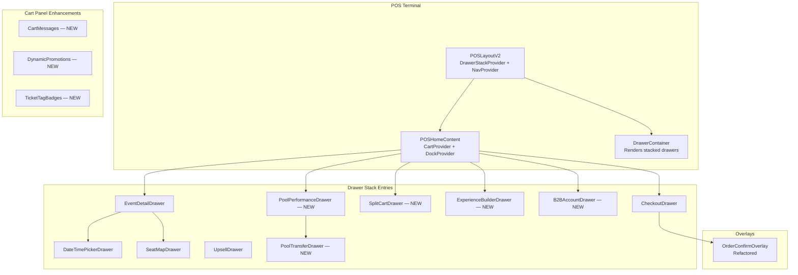
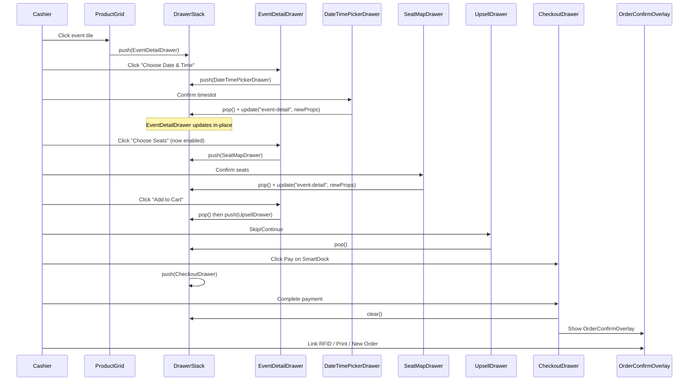
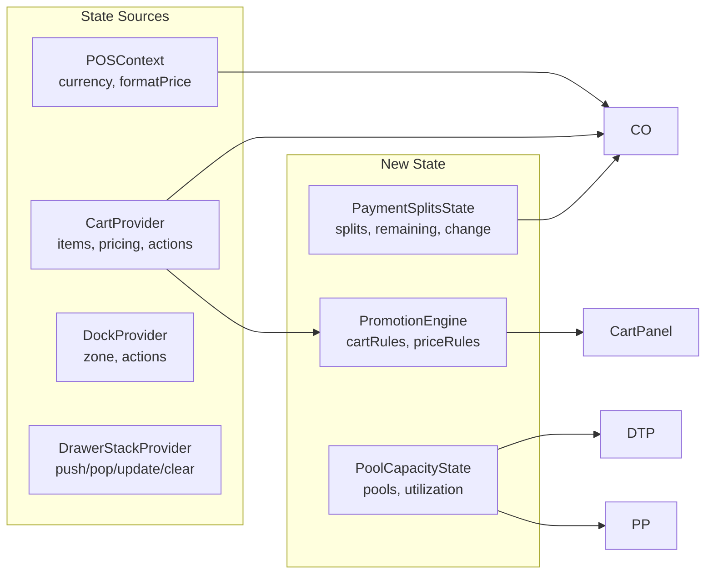

# Design Document: POS v2 Checkout Experience

## Overview

This design covers 22 requirements for the MNGO POS v2 checkout experience
overhaul. The changes span the full checkout lifecycle: pre-checkout flow fixes
(date/time ordering, seat state reflection, drawer behavior, grid layout,
dismiss consistency, collapsible details), payment enhancements (split payment
calculator, foreign currency, customer wallet, gift voucher), cart operations
(split cart), post-payment UX (success page refactor, printing, RFID linking), a
new experience builder wizard, promotions and cart intelligence (dynamic offers,
cart messages), B2B account loading, ticket tagging, and pool/capacity
management (inventory pools on calendar, pool performance, pool transfer).

All new UI surfaces are implemented as drawer stack entries via
`DrawerStackProvider` using `push`/`pop`/`replace`/`update`/`clear` operations.
The existing split-panel layout (catalog left, cart right) and `SmartDock`
context-aware action bar are extended, not replaced. The `@cart/react` package
manages cart state; new payment and metadata features extend the cart item
metadata and checkout drawer state.

## Architecture

### System Context



### Drawer Stack Flow (Updated)

The existing drawer stack flow is extended with new entry points:



### Data Flow



## Components and Interfaces

### Requirement 1–3: Date/Time Before Seats, State Reflection, Update Behavior

**Changes to `EventDetailDrawer`:**

The current implementation already renders Date & Time CTA and Seat Map CTA, but
the ordering in the scrollable body needs adjustment. The Date/Time section must
render above the Seat Map section for timed seated events. The seat selection
button is already disabled when `needsTimeSlot && !activeTimeSlot`.

The `update` operation on the drawer stack is already used by
`handleOpenDateTimePicker` and `handleOpenSeatMap` in `pos-home.tsx` to update
the underlying `EventDetailDrawer` props after a sub-drawer confirms. This
pattern is correct and requires no architectural change — only ensuring the
render order is Date/Time → Seats → Tickets in the scrollable body.

```typescript
// EventDetailDrawer body order (timed seated events):
// 1. Highlights
// 2. Capacity bar
// 3. Collapsible Details (Req 6)
// 4. Date & Time CTA ← MUST be above seats
// 5. Seat Map CTA ← disabled until timeslot selected
// 6. Ticket Tags (Req 19)
// 7. Ticket selection rows
// 8. Required equipment
// 9. Optional add-ons
```

**Interface (unchanged, already correct):**

```typescript
interface EventDetailDrawerProps {
  event: VenueEvent | null;
  onClose: () => void;
  formatPrice: (p: number) => string;
  onAddToCart: (items: Array<{...}>, seats?: string[], seatTotal?: number) => void;
  onOpenSeatMap?: (event: VenueEvent) => void;
  onOpenDateTimePicker?: (event: VenueEvent) => void;
  selectedTimeSlotExternal?: TimeSlot | null;
  selectedSeatsExternal?: string[];
  selectedSeatTotalExternal?: number;
}
```

The seat selection button already reflects confirmed seats via
`selectedSeatsExternal` and `selectedSeatTotalExternal` props. The `update` call
in `pos-home.tsx` already passes these after `SeatMapDrawer.onConfirmSeats`. The
100ms requirement (Req 2.2) is met by the synchronous `update` dispatch + React
reconciliation.

### Requirement 4: Product Grid Layout

**Changes to `ProductGrid`:**

Replace the current grid with CSS `auto-fill` responsive grid:

```css
.product-grid {
  display: grid;
  grid-template-columns: repeat(auto-fill, minmax(180px, 1fr));
  gap: 12px;
}
```

The `ProductGrid` component currently uses Tailwind grid classes. Change to
inline style or a CSS variable approach so the `minmax(180px, 1fr)` constraint
is enforced. The `ResizeObserver` on the catalog panel (already in
`pos-home.tsx` for the cart panel) ensures reflow on resize.

### Requirement 5: Drawer Dismiss Button Consistency

**Changes to `DrawerConfig` type and `DrawerHeader`:**

Extend `DrawerConfig` with a `dismissible` property:

```typescript
interface DrawerConfig<TId extends string = string> {
  id: TId;
  width?: number | string;
  closeOnEscape?: boolean;
  singleton?: boolean;
  metadata?: Record<string, unknown>;
  /** Controls X button visibility. @default true */
  showCloseButton?: boolean;
}
```

**`DrawerHeader` changes:**

- Read `showCloseButton` from the drawer config via `useDrawerPosition()`
  context.
- If `showCloseButton === false`, hide the X button but keep ESC handling.

**Dismiss rules:** | Drawer | X Button | ESC | |--------|----------|-----| |
ProfileDrawer | ❌ | ✅ | | NotificationPanel | ❌ | ✅ | | ShiftPanel | ❌ | ✅
| | EventDetailDrawer | ✅ | ✅ | | CheckoutDrawer | ✅ | ✅ | | SeatMapDrawer |
✅ | ✅ | | DateTimePickerDrawer | ✅ | ✅ |

### Requirement 6: Collapsible Details Section

The `EventDetailDrawer` already has a collapsible "Details, Includes & Rules"
section with `detailsOpen` state defaulting to `false`. The current
implementation groups description, includes, and restrictions. It needs to also
include location, hours, languages, group size, accessibility, and what-to-bring
inside the collapsible section instead of rendering them above it.

**Change:** Move the quick info grid (location, hours, languages, group size,
accessibility, what-to-bring) inside the collapsible `detailsOpen` block, after
the description and before includes/restrictions.

### Requirement 7: Split Payment Calculator

**Changes to `CheckoutDrawer`:**

The current `CheckoutDrawer` already implements split payment with:

- `splits: PaymentSplit[]` state
- `remaining` balance calculation
- Keypad for custom amounts
- Quick tender amounts for cash
- Change due display for cash overpayment
- Non-cash capped at remaining balance
- Remove split functionality

The existing implementation satisfies most of Req 7. Verify:

- ✅ 7.1: Total and remaining displayed
- ✅ 7.2: Keypad + method selection adds splits, reduces remaining
- ✅ 7.3: Cash overpayment accepted, change displayed
- ✅ 7.4: Non-cash capped at remaining (`Math.min(keypadAmount, remaining)`)
- ✅ 7.5: Confirm button enabled when `isFullyPaid`
- ✅ 7.6: Remove split recalculates remaining
- ✅ 7.7: Splits displayed with icon, label, amount, remove button

**Minor enhancement:** Include tip in the remaining balance initialization
(already done: `finalTotal = total + tip`).

### Requirement 8: Foreign Currency Payment

**New component within `CheckoutDrawer`:**

```typescript
interface CurrencySelector {
  currencies: Currency[]; // from POSContext
  selectedCurrency: Currency;
  onSelect: (currency: Currency) => void;
}

// Payment split record extended:
interface PaymentSplit {
  id: string;
  methodId: string;
  methodLabel: string;
  amount: number; // base currency (AED)
  foreignCurrency?: string; // e.g. "USD"
  foreignAmount?: number; // amount in foreign currency
  exchangeRate?: number; // rate used
}
```

**Flow:**

1. Cashier selects payment method → keypad opens
2. Above the keypad amount display, a currency selector dropdown shows available
   currencies
3. When a foreign currency is selected, the remaining balance display converts:
   `remaining * currency.rate`
4. Cashier enters amount in foreign currency
5. On "Apply", the amount is converted back: `foreignAmount / currency.rate` →
   stored as base currency split
6. The split record shows both: "USD $50.00 (AED 183.62)"

### Requirement 9: Customer Wallet Payment

**New payment method in `CheckoutDrawer`:**

```typescript
interface WalletPaymentMethod {
  id: "wallet";
  label: "Customer Wallet";
  enabled: boolean;
  balance: number; // available wallet balance in base currency
  credit: number; // available credit
}
```

**Behavior:**

- Only visible when `cart.customer` is linked (from `useCart()`)
- Pre-fills keypad with `Math.min(remaining, walletBalance)`
- Validates entered amount ≤ wallet balance before adding split
- Shows error toast if exceeded

### Requirement 10: Gift Voucher Payment

**New payment method in `CheckoutDrawer`:**

```typescript
interface GiftVoucherState {
  serialInput: string;
  validating: boolean;
  voucher: { serial: string; remainingValue: number } | null;
  error: string | null;
}
```

**Flow:**

1. Cashier selects "Gift Voucher" from payment grid
2. Input field appears for serial number (supports barcode scanner input)
3. On submit, validate voucher (async call)
4. If valid: show remaining value, auto-apply
   `Math.min(voucherValue, remaining)` as split
5. If invalid/redeemed: show error, prevent split

### Requirement 11: Split Cart

**New component: `SplitCartDrawer`**

```typescript
interface SplitCartDrawerProps {
  onClose: () => void;
  formatPrice: (p: number) => string;
  cartItems: CartItem[];
  onConfirmSplit: (selectedItemIds: string[]) => void;
}
```

**Integration in `pos-home.tsx`:**

- SmartDock shows "Split" action when `cartItems.length >= 2`
- On confirm: `createCart()` → move selected items to new cart → set new cart as
  active
- Prevent splitting all items (would leave original empty)
- Prevent splitting zero items

### Requirement 12: Success Page Refactor

**Changes to `OrderConfirmOverlay`:**

Extend the existing overlay with:

- Payment method summary (list of splits with method + amount)
- Timestamp display
- "Print Receipt", "Send E-Ticket", "New Order" action buttons (replacing
  current PRINT/EMAIL/SAVE)
- Auto-dismiss timer increased from 15s to 30s
- "New Order" creates a fresh cart via `createCart()`

```typescript
interface OrderConfirmOverlayProps {
  open: boolean;
  onClose: () => void;
  orderId: string;
  total: string;
  itemCount: number;
  paymentSplits?: Array<{ method: string; amount: string }>;
  timestamp?: string;
  onPrintReceipt?: () => void;
  onSendETicket?: () => void;
  onNewOrder?: () => void;
  rfidEligible?: boolean;
  onLinkRFID?: () => void;
}
```

### Requirement 13: Printing UX

**New utility: `print-service.ts`**

```typescript
interface PrintService {
  /** Attempt silent print, fallback to browser dialog */
  printReceipt(orderId: string, content: HTMLElement): Promise<void>;
  /** Check if silent printing is available */
  isSilentPrintSupported(): boolean;
}
```

**Integration:**

- Terminal settings (`TerminalSettings`) extended with
  `printMode: "silent" | "preview"`
- On payment complete with receipt option "print": call
  `printService.printReceipt()`
- Silent mode uses `window.print()` with a hidden iframe containing
  print-optimized CSS
- Preview mode opens browser print dialog directly

### Requirement 14: RFID Linking Post-Checkout

**New section in `OrderConfirmOverlay`:**

```typescript
interface RFIDLinkingState {
  phase: "prompt" | "scanning" | "success" | "error" | "skipped";
  tickets: Array<{ ticketId: string; rfidTag: string | null }>;
  currentIndex: number;
  timeoutMs: 15000;
}
```

**Flow:**

1. After payment, if tickets support RFID → show "Link RFID" prompt
2. Cashier scans RFID tag → associate with ticket[currentIndex]
3. Advance to next ticket or complete
4. 15s timeout per scan → show error + retry/skip
5. Skip proceeds to standard post-payment state

**RFID input:** Listen for `keydown` events (RFID readers emit keyboard input)
or a dedicated `WebSerial` / `WebHID` API integration.

### Requirement 15: Experience Builder Flow

**New component: `ExperienceBuilderDrawer`**

```typescript
interface ExperienceBuilderDrawerProps {
  onClose: () => void;
  formatPrice: (p: number) => string;
  categories: EventCategory[];
  events: VenueEvent[];
  onAddToCart: (
    items: Array<{
      event: VenueEvent;
      ticketType: TicketType;
      timeSlot: TimeSlot | null;
      quantity: number;
    }>,
  ) => void;
  onCheckout: () => void;
}

type BuilderStep = "categories" | "events" | "tickets";

interface BuilderState {
  step: BuilderStep;
  selectedCategory: EventCategory | null;
  selectedEvent: VenueEvent | null;
  pendingItems: Array<{
    event: VenueEvent;
    ticketType: TicketType;
    quantity: number;
  }>;
}
```

**3-step wizard:**

1. **Step 1 — Categories:** Grid of category tiles (reuses `EventCategory` data)
2. **Step 2 — Events:** Filtered event list for selected category
3. **Step 3 — Tickets:** Ticket types with quantity steppers for the selected
   event

Uses `SubViewNavigator` from `@abdokouta/react-ui` for step transitions within a
single drawer. Running cart summary shown as a sticky footer. "Back" navigation
preserves selections from other steps.

**Entry points:**

- SmartDock: "Builder" action
- Catalog panel: dedicated button/tile

### Requirement 16: Dynamic Offers and Promotions Display

**New components in cart panel:**

```typescript
interface CartRule {
  id: string;
  type: "buy_x_get_y" | "bundle_discount" | "threshold_discount";
  condition: CartRuleCondition;
  reward: CartRuleReward;
  description: string;
}

interface PriceRule {
  id: string;
  type: "quantity_discount" | "member_discount" | "time_discount";
  condition: PriceRuleCondition;
  discount: { type: "percentage" | "fixed"; value: number };
  description: string;
}

interface PromotionEngine {
  evaluate(cartItems: CartItem[]): {
    appliedCartRules: AppliedCartRule[];
    appliedPriceRules: AppliedPriceRule[];
    suggestions: PromotionSuggestion[];
  };
}
```

**Cart panel integration:**

- Promotion badges on affected items (inline, next to price)
- Discounted price shown with strikethrough original
- Promotions summary section above cart total
- "Nearly qualified" suggestions (e.g., "Add 1 more for Buy 3 Get 1 Free")

### Requirement 17: Cart Messages

**New component: `CartMessageList`**

```typescript
interface CartMessage {
  id: string;
  type: "promotion" | "upsell" | "warning" | "info";
  title: string;
  description: string;
  action?: {
    label: string;
    onClick: () => void;
  };
  dismissible: boolean;
}
```

Rendered in `POSCartPanel` between the item list and totals section. Messages
are generated by the `PromotionEngine` and cart validation rules. Dismissed
messages are tracked in a `Set<string>` scoped to the cart session.

### Requirement 18: B2B Account Loading

**New component: `B2BAccountDrawer`**

```typescript
interface B2BAccountDrawerProps {
  onClose: () => void;
  formatPrice: (p: number) => string;
  onLoadOrder: (items: CartItem[], b2bAccount: B2BAccount) => void;
}

interface B2BAccount {
  id: string;
  name: string;
  type: "school" | "tour_operator" | "corporate" | "reseller";
  creditBalance: number;
  pendingOrders: B2BPendingOrder[];
}

interface B2BPendingOrder {
  id: string;
  reference: string;
  items: Array<{
    event: VenueEvent;
    ticketType: TicketType;
    quantity: number;
    negotiatedPrice: number;
  }>;
  contractLimits: { minQty: number; maxQty: number };
}
```

**Flow:**

1. SmartDock or Catalog panel → "Load B2B" action
2. Search B2B accounts by name/ID/reference
3. Select account → show pending orders
4. Select order → load items into cart with B2B pricing
5. Cart allows quantity adjustment within contract limits
6. Checkout shows B2B credit as payment method

### Requirement 19: Ticket Tags

**Changes to `EventDetailDrawer` and `POSCartPanel`:**

```typescript
interface TicketTag {
  id: string;
  label: string;
  color: string;
  icon?: string;
}

// Extended cart item metadata:
interface CartItemMetadata {
  // ... existing fields
  tags?: string[]; // tag IDs
}
```

- `EventDetailDrawer`: Show available tags as selectable chips below each ticket
  type row
- `POSCartPanel`: Show applied tags as small colored badges on each cart item
  row
- Tags are stored in cart item metadata and persisted with the ticket record on
  purchase

### Requirement 20: Inventory Pools on Calendar

**New component: `PoolMeter`**

```typescript
interface PoolMeterProps {
  pool: InventoryPool;
  formatPrice?: (p: number) => string;
}

interface InventoryPool {
  id: string;
  name: string;
  type: "b2b" | "b2c" | "membership" | "pos" | "reserved";
  color: string;
  allocated: number;
  sold: number;
  remaining: number;
}
```

**Integration in `DateTimePickerDrawer`:**

- Below each timeslot row, show `PoolMeter` bars for each configured pool
- Color-coded: B2B (blue), B2C (green), Membership (purple), POS (orange)
- "Full" indicator when `remaining === 0` → prevent selection from that pool
- Capacity deduction based on `POSContext` sales channel

### Requirement 21: Pool Performance Section

**New component: `PoolPerformanceDrawer`**

```typescript
interface PoolPerformanceDrawerProps {
  onClose: () => void;
  formatPrice: (p: number) => string;
  onTransfer: (sourcePool: string, destPool: string) => void;
}

interface PoolPerformanceMetrics {
  poolId: string;
  poolName: string;
  poolType: string;
  allocated: number;
  sold: number;
  remaining: number;
  utilizationPct: number;
  sellThroughRate: number;
}
```

- Accessible from SmartDock or dashboard view
- Displays utilization %, sell-through rate, remaining capacity per pool
- Auto-refreshes every 60 seconds (or real-time via WebSocket)
- Filterable by date range, event, pool type

### Requirement 22: Pool Transfer

**New component: `PoolTransferDrawer`**

```typescript
interface PoolTransferDrawerProps {
  onClose: () => void;
  sourcePool: InventoryPool;
  pools: InventoryPool[];
  onConfirm: (transfer: PoolTransfer) => void;
}

interface PoolTransfer {
  sourcePoolId: string;
  destinationPoolId: string;
  quantity: number;
  supervisorId: string;
  timestamp: string;
}
```

- Restricted to supervisor permissions (check via `useGetIdentity()` role)
- Source pool selector, destination pool selector, quantity input
- Validates quantity ≤ source pool remaining
- On confirm: update both pool meters immediately
- Audit log entry with supervisor identity, timestamp, pools, quantity

## Data Models

### Extended Payment Split

```typescript
interface PaymentSplit {
  id: string;
  methodId: string;
  methodLabel: string;
  amount: number; // base currency (AED)
  foreignCurrency?: string; // ISO currency code
  foreignAmount?: number; // amount in foreign currency
  exchangeRate?: number; // rate at time of payment
  voucherSerial?: string; // for gift voucher payments
  walletId?: string; // for wallet payments
}
```

### Cart Item Metadata Extensions

```typescript
interface ExtendedCartItemMetadata {
  eventId: string;
  ticketTypeId: string;
  ticketLabel: string;
  timeSlotId: string | null;
  timeSlot: string | null;
  venue: string;
  admissionType: AdmissionType;
  image: string;
  // New fields:
  tags?: string[]; // ticket tag IDs
  b2bAccountId?: string; // B2B account reference
  b2bOrderId?: string; // B2B pending order reference
  b2bNegotiatedPrice?: number; // B2B contract price
  b2bContractLimits?: { min: number; max: number };
}
```

### Promotion Models

```typescript
interface CartRule {
  id: string;
  name: string;
  type: "buy_x_get_y" | "bundle_discount" | "threshold_discount";
  condition: {
    minItems?: number;
    minTotal?: number;
    requiredCategories?: string[];
    requiredEventIds?: string[];
  };
  reward: {
    type: "free_item" | "percentage_off" | "fixed_off";
    value: number;
    appliesTo: "cheapest" | "all" | "specific";
  };
  description: string;
  priority: number;
  stackable: boolean;
}

interface PriceRule {
  id: string;
  name: string;
  type:
    | "quantity_discount"
    | "member_discount"
    | "time_discount"
    | "channel_discount";
  condition: {
    minQuantity?: number;
    membershipTier?: string;
    timeWindow?: { start: string; end: string };
    channel?: "pos" | "b2c" | "b2b";
  };
  discount: {
    type: "percentage" | "fixed";
    value: number;
  };
  description: string;
}

interface CartMessage {
  id: string;
  type: "promotion" | "upsell" | "warning" | "info";
  title: string;
  description: string;
  icon?: string;
  action?: {
    label: string;
    type: "add_item" | "apply_promo" | "upgrade" | "navigate";
    payload: Record<string, unknown>;
  };
  dismissible: boolean;
  priority: number;
}
```

### Inventory Pool Models

```typescript
interface InventoryPool {
  id: string;
  name: string;
  type: "b2b" | "b2c" | "membership" | "pos" | "reserved";
  color: string;
  eventId: string;
  timeSlotId: string;
  allocated: number;
  sold: number;
  remaining: number;
}

interface PoolTransferRecord {
  id: string;
  sourcePoolId: string;
  destinationPoolId: string;
  quantity: number;
  supervisorId: string;
  supervisorName: string;
  timestamp: string;
  eventId: string;
  timeSlotId: string;
}
```

### RFID Linking Model

```typescript
interface RFIDLink {
  ticketId: string;
  rfidTag: string;
  mediaType: "card" | "bracelet" | "hotel_card";
  linkedAt: string;
  linkedBy: string; // cashier ID
}
```
