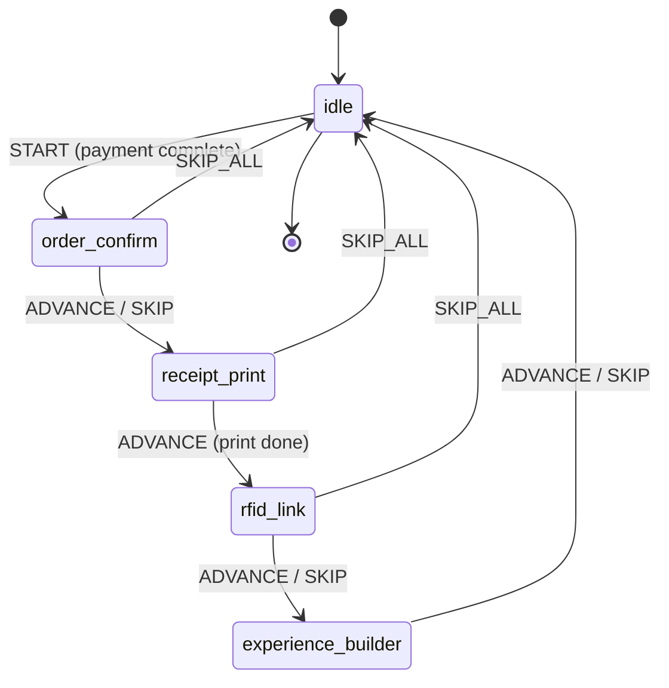

# Design Document: Post-Checkout Flow

## Overview

The Post-Checkout Flow introduces a state-machine-driven orchestrator that
chains post-payment steps in the MNGO POS system. After a cashier completes
payment, the system automatically progresses through: **Order Confirmation →
Receipt Print → RFID Link → Experience Builder → Return to Catalog**. Each step
is independently skippable, and the entire flow is dismissible via a "Skip All"
action.

Today, `handleCompleteOrder` in `pos-home.tsx` fires the `OrderConfirmOverlay`
as a standalone boolean-gated overlay, then the overlay auto-closes after a
countdown. There is no chaining — receipt printing, RFID linking, and upsell are
disconnected. This design replaces that with a `usePostCheckoutFlow` hook that
owns a finite-state machine and drives each step in sequence, reusing existing
components (overlay, print service, experience builder drawer) and introducing
one new component (RFID link prompt).

### Key Design Decisions

1. **Hook-based state machine over context provider** — The flow is scoped to
   `POSHomeContent` and doesn't need global access. A `usePostCheckoutFlow` hook
   with `useReducer` keeps the state machine co-located with the only consumer,
   avoiding unnecessary context plumbing.

2. **Reducer-driven transitions** — Each step transition is a dispatched action
   (`ADVANCE`, `SKIP`, `SKIP_ALL`, `RESET`). This makes the flow deterministic,
   testable, and easy to extend with new steps.

3. **Reuse existing DrawerStack for RFID and Experience Builder steps** — The
   RFID link prompt and experience builder open as drawer-stack entries,
   consistent with every other panel in the POS. The overlay step remains a
   portal-based overlay (matching current `OrderConfirmOverlay` behavior).

4. **Print step is non-visual** — The receipt print step calls
   `PrintService.printReceipt()` and auto-advances. A brief toast/status
   indicator shows printing state, but no drawer or overlay is needed.

## Architecture



### Flow Integration Point

The flow hooks into the existing `handleCompleteOrder` callback in
`pos-home.tsx`. Instead of setting `orderConfirmOpen = true`, it dispatches
`START` to the flow controller with the completed order data. The flow
controller then drives each step.

```
CheckoutDrawer.onComplete
  → handleCompleteOrder()
    → completeCart(), clear drawer stack
    → flowDispatch({ type: 'START', payload: orderData })
      → state machine enters 'order_confirm'
        → OrderConfirmOverlay renders (driven by flow state, not standalone boolean)
```

## Components and Interfaces

### 1. `usePostCheckoutFlow` Hook

The core orchestrator. Returns current state and dispatch function.

```typescript
// apps/vite-template/src/hooks/use-post-checkout-flow.ts

type FlowStep =
  | "idle"
  | "order_confirm"
  | "receipt_print"
  | "rfid_link"
  | "experience_builder";

interface OrderData {
  orderId: string;
  total: string;
  itemCount: number;
  items: Array<{
    ticketId: string;
    name: string;
    quantity: number;
    unitPrice: number;
  }>;
  cashierId: string;
}

type FlowAction =
  | { type: "START"; payload: OrderData }
  | { type: "ADVANCE" }
  | { type: "SKIP" }
  | { type: "SKIP_ALL" }
  | { type: "RESET" };

interface FlowState {
  step: FlowStep;
  orderData: OrderData | null;
  isActive: boolean;
}

function usePostCheckoutFlow(): {
  state: FlowState;
  dispatch: React.Dispatch<FlowAction>;
};
```

**Reducer logic:**

| Current Step         | Action     | Next Step            |
| -------------------- | ---------- | -------------------- |
| `idle`               | `START`    | `order_confirm`      |
| `order_confirm`      | `ADVANCE`  | `receipt_print`      |
| `order_confirm`      | `SKIP`     | `receipt_print`      |
| `order_confirm`      | `SKIP_ALL` | `idle`               |
| `receipt_print`      | `ADVANCE`  | `rfid_link`          |
| `receipt_print`      | `SKIP_ALL` | `idle`               |
| `rfid_link`          | `ADVANCE`  | `experience_builder` |
| `rfid_link`          | `SKIP`     | `experience_builder` |
| `rfid_link`          | `SKIP_ALL` | `idle`               |
| `experience_builder` | `ADVANCE`  | `idle`               |
| `experience_builder` | `SKIP`     | `idle`               |
| Any                  | `RESET`    | `idle`               |

The `isActive` derived field is `step !== 'idle'`. When `isActive` is true, the
checkout button is disabled (Requirement 1.5).

### 2. Step Sequence Definition

```typescript
const STEP_SEQUENCE: FlowStep[] = [
  "order_confirm",
  "receipt_print",
  "rfid_link",
  "experience_builder",
];

function getNextStep(current: FlowStep): FlowStep {
  const idx = STEP_SEQUENCE.indexOf(current);
  if (idx === -1 || idx === STEP_SEQUENCE.length - 1) return "idle";
  return STEP_SEQUENCE[idx + 1];
}
```

### 3. Modified `OrderConfirmOverlay`

The existing overlay gains a new prop to integrate with the flow:

```typescript
interface OrderConfirmOverlayProps {
  open: boolean;
  onClose: () => void; // wired to dispatch({ type: 'ADVANCE' })
  onSkipAll: () => void; // wired to dispatch({ type: 'SKIP_ALL' })
  orderId: string;
  total: string;
  itemCount: number;
}
```

Changes:

- Countdown expiry calls `onClose` (which now means "advance" instead of
  "dismiss")
- Add a "Continue" button that calls `onClose`
- Add a "Skip All" link that calls `onSkipAll` and returns directly to catalog
- The existing Print/Email/Save action buttons remain as quick actions

### 4. Receipt Print Step (non-visual)

When the flow enters `receipt_print`, a `useEffect` in `POSHomeContent`
triggers:

```typescript
useEffect(() => {
  if (flow.state.step !== "receipt_print" || !flow.state.orderData) return;

  setPrintStatus("printing");
  const receiptHtml = buildReceiptContent(flow.state.orderData);

  PrintService.printReceipt(flow.state.orderData.orderId, receiptHtml)
    .then(() => setPrintStatus("done"))
    .catch(() => setPrintStatus("done")) // fallback already handled inside PrintService
    .finally(() => {
      setTimeout(() => {
        setPrintStatus("idle");
        flow.dispatch({ type: "ADVANCE" });
      }, 800); // brief delay so cashier sees "Printed ✓"
    });
}, [flow.state.step]);
```

A small toast or inline status indicator shows: `Printing…` → `Printed ✓`.

### 5. `buildReceiptContent` Utility

```typescript
// apps/vite-template/src/utils/receipt-content.ts

function buildReceiptContent(order: OrderData): string;
```

Generates the receipt HTML body string (not the full document —
`PrintService.buildReceiptDocument` wraps it). Includes:

- Venue name (from terminal settings or a constant)
- Order ID
- Date/time of purchase
- Line items with name, quantity, unit price
- Order total
- Machine-readable order ID (barcode placeholder div)

Formatted for 80mm thermal paper using the existing receipt CSS classes from
`print-service.ts`.

### 6. `RFIDLinkPrompt` Component

New drawer component for the RFID linking step.

```typescript
// apps/vite-template/src/components/drawers/rfid-link-prompt.tsx

interface RFIDLinkPromptProps {
  onClose: () => void; // advance to next step
  onSkip: () => void; // skip this step
  tickets: Array<{
    ticketId: string;
    name: string;
  }>;
  cashierId: string;
  onLinkComplete: (links: RFIDLink[]) => void;
}
```

Internal state tracks per-ticket linking status:

```typescript
interface TicketLinkState {
  ticketId: string;
  name: string;
  status: "pending" | "linked";
  mediaType: "card" | "bracelet" | "hotel_card" | null;
  rfidTag: string | null;
}
```

Behavior:

- Renders a list of tickets with status badges (pending / linked)
- Each ticket row has a media type selector (card / bracelet / hotel_card)
- An RFID tag input field (text input simulating scanner input)
- On scan/enter: validates tag isn't already used (checks against other linked
  tickets in this session), creates the `RFIDLink`, updates status to `linked`
- "Skip" button always visible — calls `onSkip`
- When all tickets are linked, shows "Done" button — calls `onClose`
- Duplicate tag detection: if the entered tag matches another ticket's tag in
  the current batch, show inline error and reject

### 7. Experience Builder Integration

The existing `ExperienceBuilderDrawer` is pushed onto the drawer stack when the
flow reaches `experience_builder`. The flow wires:

- `onClose` → `dispatch({ type: 'ADVANCE' })` (cashier completed or dismissed)
- A new "No Thanks" / "Skip" button → `dispatch({ type: 'SKIP' })`
- `onAddToCart` → creates a new cart with upsell items, then advances

### 8. Integration in `POSHomeContent`

```typescript
// Inside POSHomeContent:
const flow = usePostCheckoutFlow();

// Modified handleCompleteOrder:
const handleCompleteOrder = useCallback(() => {
  const items = cartItemsRef.current;
  const total = cartTotalRef.current;
  const orderId = `ORD-${Date.now().toString(36).toUpperCase()}`;
  const formattedTotal = formatPriceRef.current(total);
  const itemCount = items.reduce((s, i) => s + i.quantity, 0);

  completeCartRef.current(activeCartIdRef.current);
  clearRef.current(); // clear drawer stack

  flow.dispatch({
    type: "START",
    payload: {
      orderId,
      total: formattedTotal,
      itemCount,
      items: items.map((i) => ({
        ticketId: i.id,
        name: i.name,
        quantity: i.quantity,
        unitPrice: i.unitPrice,
      })),
      cashierId: "CASHIER-001", // from auth context in production
    },
  });
}, []);

// Checkout button disabled when flow is active:
const checkoutDisabled = flow.state.isActive;
```

**Step rendering logic** (in JSX):

```typescript
{/* Order Confirm — overlay */}
<OrderConfirmOverlay
  open={flow.state.step === 'order_confirm'}
  onClose={() => flow.dispatch({ type: 'ADVANCE' })}
  onSkipAll={() => flow.dispatch({ type: 'SKIP_ALL' })}
  orderId={flow.state.orderData?.orderId ?? ''}
  total={flow.state.orderData?.total ?? ''}
  itemCount={flow.state.orderData?.itemCount ?? 0}
/>

{/* Print status toast */}
{printStatus !== 'idle' && <PrintStatusToast status={printStatus} />}

{/* RFID + Experience Builder steps push into drawer stack via useEffect */}
```

**Drawer-based steps** are driven by `useEffect` watchers:

```typescript
// RFID Link step — push drawer
useEffect(() => {
  if (flow.state.step !== 'rfid_link' || !flow.state.orderData) return;
  pushRef.current(
    { id: 'rfid-link', width: 480 },
    <RFIDLinkPrompt
      tickets={flow.state.orderData.items.map(i => ({
        ticketId: i.ticketId,
        name: i.name,
      }))}
      cashierId={flow.state.orderData.cashierId}
      onClose={() => { popRef.current(); flow.dispatch({ type: 'ADVANCE' }); }}
      onSkip={() => { popRef.current(); flow.dispatch({ type: 'SKIP' }); }}
      onLinkComplete={(links) => console.log('RFID links:', links)}
    />,
  );
}, [flow.state.step]);

// Experience Builder step — push drawer
useEffect(() => {
  if (flow.state.step !== 'experience_builder') return;
  pushRef.current(
    { id: 'experience-builder', width: 680 },
    <ExperienceBuilderDrawer
      onClose={() => { popRef.current(); flow.dispatch({ type: 'ADVANCE' }); }}
      formatPrice={formatPriceRef.current}
      categories={CATEGORIES}
      events={EVENTS}
      onAddToCart={(items) => { /* create new cart with upsell items */ }}
      onCheckout={() => { popRef.current(); flow.dispatch({ type: 'ADVANCE' }); }}
    />,
  );
}, [flow.state.step]);
```

## Data Models

### FlowState

```typescript
interface FlowState {
  step: FlowStep;
  orderData: OrderData | null;
  isActive: boolean; // derived: step !== 'idle'
}
```

### OrderData (passed through the flow)

```typescript
interface OrderData {
  orderId: string;
  total: string; // pre-formatted price string
  itemCount: number;
  items: Array<{
    ticketId: string;
    name: string;
    quantity: number;
    unitPrice: number;
  }>;
  cashierId: string;
}
```

### RFIDLink (existing type, reused)

```typescript
interface RFIDLink {
  ticketId: string;
  rfidTag: string;
  mediaType: "card" | "bracelet" | "hotel_card";
  linkedAt: string; // ISO timestamp
  linkedBy: string; // cashier ID
}
```

### ReceiptContent (generated HTML string)

Not a stored model — `buildReceiptContent(order: OrderData): string` produces an
HTML string consumed by `PrintService.printReceipt()`.

## Correctness Properties

_A property is a characteristic or behavior that should hold true across all
valid executions of a system — essentially, a formal statement about what the
system should do. Properties serve as the bridge between human-readable
specifications and machine-verifiable correctness guarantees._

### Property 1: State machine transitions follow the defined step sequence

_For any_ flow step and any valid action (ADVANCE or SKIP), the resulting step
SHALL equal the next step in the sequence
`[order_confirm, receipt_print, rfid_link, experience_builder]`, where the step
after `experience_builder` is `idle`, and dispatching START from `idle` with
valid OrderData produces `order_confirm`.

**Validates: Requirements 1.1, 1.2, 1.3, 3.5, 4.4, 5.5, 6.3**

### Property 2: isActive reflects non-idle state

_For any_ FlowState, `isActive` SHALL be `true` if and only if
`step !== 'idle'`. Equivalently, for any state produced by the reducer after any
sequence of valid actions, `isActive === (step !== 'idle')`.

**Validates: Requirements 1.4, 1.5**

### Property 3: SKIP_ALL from any active step returns to idle

_For any_ flow step that is not `idle`, dispatching `SKIP_ALL` SHALL produce a
state with `step === 'idle'` and `isActive === false`.

**Validates: Requirements 6.4**

### Property 4: Receipt content contains all required order fields

_For any_ valid OrderData, calling `buildReceiptContent(orderData)` SHALL
produce an HTML string that contains the order ID, each line item name, each
line item quantity, each line item price, and the order total. The output SHALL
also contain a machine-readable element with the order ID.

**Validates: Requirements 3.1, 7.1, 7.3**

### Property 5: RFID link creation preserves all input fields

_For any_ valid ticket ID, RFID tag string, media type, and cashier ID, creating
an RFIDLink SHALL produce an object where `ticketId`, `rfidTag`, `mediaType`,
and `linkedBy` match the inputs, and `linkedAt` is a valid ISO timestamp.

**Validates: Requirements 4.3**

### Property 6: No duplicate RFID tags within a linking batch

_For any_ batch of RFID link operations on a set of tickets, the system SHALL
reject an RFID tag that is already assigned to another ticket in the same batch.
After all successful links, all `rfidTag` values in the batch SHALL be unique.

**Validates: Requirements 4.7**

## Error Handling

| Scenario                                                               | Handling                                                                                                                                  |
| ---------------------------------------------------------------------- | ----------------------------------------------------------------------------------------------------------------------------------------- |
| Silent print fails                                                     | `PrintService` already falls back to preview mode and logs a warning. The flow auto-advances regardless of print outcome.                 |
| Duplicate RFID tag scanned                                             | `RFIDLinkPrompt` shows inline error on the ticket row, rejects the scan, keeps the input focused for retry.                               |
| Drawer stack push fails (e.g., during RFID or Experience Builder step) | Flow catches the error, logs it, and auto-advances to the next step to avoid blocking the cashier.                                        |
| Flow is in active state and browser refreshes                          | Flow state is ephemeral (in-memory reducer). On refresh, flow resets to idle. The completed order is already persisted by `completeCart`. |
| Experience Builder `onAddToCart` fails                                 | Error is caught, toast notification shown, cashier can retry or skip. Flow does not auto-advance on error.                                |
| OrderData is null when a step tries to read it                         | Guard clauses in each step's `useEffect` check `flow.state.orderData` before proceeding. If null, dispatch `RESET`.                       |

## Testing Strategy

### Property-Based Tests (fast-check)

The state machine reducer and receipt content generator are pure functions
well-suited for property-based testing. Use `fast-check` as the PBT library.

- Each property test runs a minimum of **100 iterations**
- Each test is tagged with: `Feature: post-checkout-flow, Property {N}: {title}`
- Properties 1–3 test the `flowReducer` function directly (no React rendering
  needed)
- Property 4 tests `buildReceiptContent` (pure string function)
- Properties 5–6 test RFID link creation/validation logic (pure functions)

### Unit Tests (example-based)

- OrderConfirmOverlay renders order details correctly (Req 2.1)
- OrderConfirmOverlay countdown triggers advance (Req 2.2)
- OrderConfirmOverlay dismiss triggers advance (Req 2.3)
- OrderConfirmOverlay shows "Continue" button (Req 2.4)
- Print status indicator appears during print step (Req 3.6)
- RFIDLinkPrompt renders all tickets (Req 4.1)
- RFIDLinkPrompt media type selection works (Req 4.2)
- RFIDLinkPrompt shows Skip button (Req 4.5, 6.1)
- RFIDLinkPrompt shows linking status per ticket (Req 4.6)
- ExperienceBuilderDrawer opens in drawer stack (Req 5.1)
- ExperienceBuilderDrawer shows Skip/No Thanks (Req 5.4, 6.2)
- Receipt CSS targets 80mm thermal paper (Req 7.2)

### Integration Tests

- Silent print mode uses iframe approach (Req 3.2)
- Preview print mode opens print dialog (Req 3.3)
- Silent print failure falls back to preview (Req 3.4)
- Full flow end-to-end: START → order_confirm → receipt_print → rfid_link →
  experience_builder → idle
- Upsell items create a new cart (Req 5.3)
