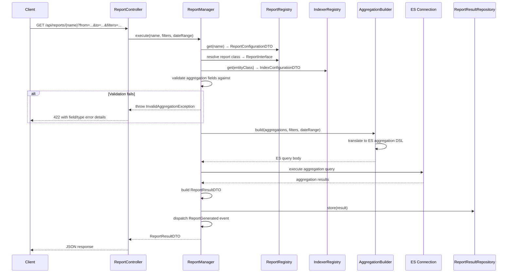
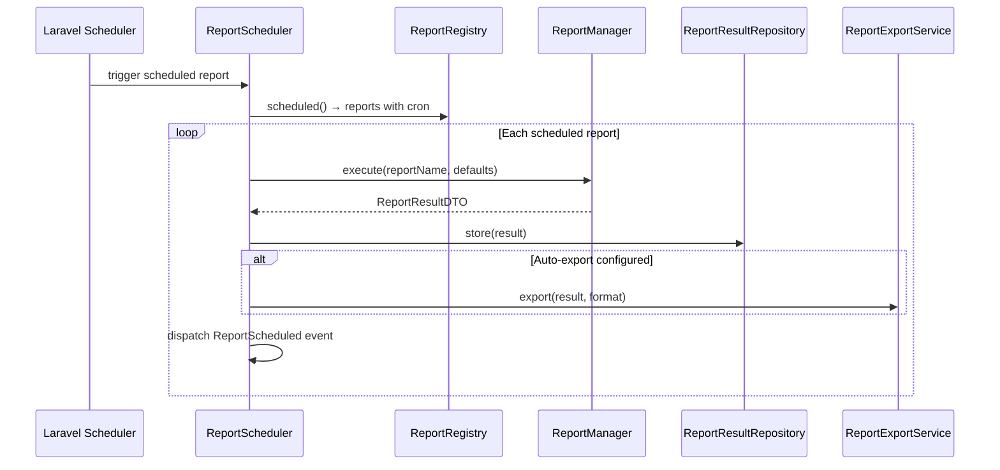
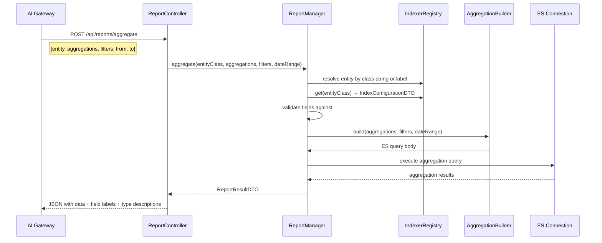

# Design Document — Reporting Package (`pixielity/laravel-reporting`)

## Overview

The `pixielity/laravel-reporting` package provides the reporting and analytics
engine for the MNGO venue management platform. It builds on the framework
Indexer sub-package (which owns `#[Aggregatable]`, `AggregationType`,
`IndexerRegistry`, `IndexConfigurationDTO`) and the search package (which owns
the Elasticsearch implementation via `pdphilip/elasticsearch`). Reports are ES
aggregation queries on the same indexes the search package manages — no separate
data store, no materialized views.

### Key Design Decisions

1. **ES Aggregation on Existing Indexes** — Reports execute ES aggregation
   queries (`terms`, `sum`, `avg`, `date_histogram`, `range`, `geo_distance`,
   `cardinality`, `percentiles`) on the same indexes the search package manages.
   No separate data pipeline.

2. **Attribute-Driven Report Discovery** — `#[AsReport]` on report classes
   declares metadata (name, label, entity, schedule). `ReportRegistryCompiler`
   discovers these at compile time via
   `Discovery::attribute(AsReport::class)->get()` and caches to
   `bootstrap/cache/report_registry.php`. Zero runtime Discovery calls.

3. **Aggregatable Field Validation** — Every aggregation request is validated
   against the entity's `#[Aggregatable]` fields from `IndexerRegistry`. If a
   field is not declared aggregatable or the requested `AggregationType` is not
   allowed for that field, `InvalidAggregationException` is thrown.

4. **No Direct ES Dependency** — All ES access goes through the search package's
   `pdphilip/elasticsearch` `Connection`. The reporting package declares
   `pixielity/laravel-search` as a composer dependency, not
   `pdphilip/elasticsearch` or `elasticsearch/elasticsearch`.

5. **PostgreSQL for Historical Results** — Report execution results are stored
   in the `report_results` PostgreSQL table for historical access. This keeps
   historical data independent of ES availability.

6. **Export via Import-Export Package** — Report export delegates to the
   import-export package's `ExportManager`. No duplication of CSV/XLSX/JSON/PDF
   generation logic.

7. **Tenant Isolation via Search Bootstrapper** — Tenant-scoped aggregations use
   the search package's `SearchBootstrapper` which sets
   `Connection::setIndexPrefix('tenant_{key}_')`. The reporting package reads
   `isTenantScoped` from `IndexerRegistry` to determine which entities are
   tenant-scoped.

8. **Ad-Hoc Aggregations for AI** — The `ReportManager::aggregate()` method
   supports ad-hoc aggregation queries not tied to pre-defined report classes,
   enabling the AI Gateway to translate natural language queries into structured
   aggregation requests.

## Architecture

```mermaid
graph TB
    subgraph "Framework Indexer (dependency)"
        AG["#[Aggregatable]"]
        ATE[AggregationType Enum]
        IR[IndexerRegistry]
        DTO[IndexConfigurationDTO]
    end

    subgraph "Search Package (dependency)"
        ESC[ES Connection]
        SB[SearchBootstrapper]
    end

    subgraph "Import-Export Package (dependency)"
        EXM[ExportManager]
        EXF[ExportFormat Enum]
    end

    subgraph "Reporting Package (this spec)"
        ASR["#[AsReport] Attribute"]

        RI[ReportInterface]
        RMI[ReportManagerInterface]
        ABI[AggregationBuilderInterface]
        RESI[ReportExportServiceInterface]
        RRPI[ReportResultRepositoryInterface]

        RM[ReportManager]
        AB[AggregationBuilder]
        RES[ReportExportService]
        RS[ReportScheduler]

        RR[ReportRegistry]
        RRC[ReportRegistryCompiler]

        RRP[ReportResultRepository]
        RRM[ReportResult Model]

        RC[ReportController]

        EVT_RG[ReportGenerated Event]
        EVT_RE[ReportExported Event]
        EVT_RS[ReportScheduled Event]

        CMD_RUN[reporting:run]
        CMD_LIST[reporting:list]
        CMD_PRUNE[reporting:prune]
        CMD_SCHED[reporting:schedule-run]

        RSP[ReportingServiceProvider]

        RPT_SR[SalesRevenueReport]
        RPT_AC[AttendanceCapacityReport]
        RPT_PP[PosPerformanceReport]
        RPT_ML[MembershipLoyaltyReport]
        RPT_PE[PromotionEffectivenessReport]
        RPT_B2B[B2BPerformanceReport]
        RPT_ACL[AccessControlReport]
    end

    RRC -->|discovers| ASR
    RRC -->|populates| RR
    RR -->|stores| ReportConfigurationDTO

    RM -->|reads configs| RR
    RM -->|reads entity configs| IR
    RM -->|validates fields| AG
    RM -->|builds queries| AB
    RM -->|executes via| ESC
    RM -->|dispatches| EVT_RG

    AB -->|produces ES DSL| ESC
    AB -->|reads aggregation types| ATE

    RES -->|delegates to| EXM
    RES -->|dispatches| EVT_RE

    RS -->|reads scheduled| RR
    RS -->|executes via| RM
    RS -->|stores results| RRP
    RS -->|dispatches| EVT_RS

    RRP -->|persists to| RRM

    RC -->|delegates to| RM
    RC -->|delegates to| RES
    RC -->|delegates to| RRP

    SB -->|sets tenant prefix| ESC

    RPT_SR -->|implements| RI
    RPT_AC -->|implements| RI
    RPT_PP -->|implements| RI
    RPT_ML -->|implements| RI
    RPT_PE -->|implements| RI
    RPT_B2B -->|implements| RI
    RPT_ACL -->|implements| RI
```



### Report Execution Flow



### Scheduled Report Flow



### Ad-Hoc Aggregation Flow (AI Gateway)



## Components and Interfaces

### `#[AsReport]` Attribute

Resides at `packages/reporting/src/Attributes/AsReport.php` under
`Pixielity\Reporting\Attributes`.

```php
#[Attribute(Attribute::TARGET_CLASS)]
final readonly class AsReport
{
    public const ATTR_NAME = 'name';
    public const ATTR_LABEL = 'label';
    public const ATTR_ENTITY = 'entity';
    public const ATTR_SCHEDULE = 'schedule';

    /**
     * @param string       $name     Unique kebab-case slug identifying the report (e.g., 'daily-sales').
     * @param string       $label    Human-readable report name (e.g., 'Daily Sales Report').
     * @param class-string $entity   The indexed model class this report aggregates against.
     * @param string|null  $schedule Cron expression for automated execution (null = on-demand only).
     */
    public function __construct(
        public string $name,
        public string $label,
        public string $entity,
        public ?string $schedule = null,
    ) {}
}
```

### Contracts

#### `ReportInterface`

Resides at `packages/reporting/src/Contracts/ReportInterface.php` under
`Pixielity\Reporting\Contracts`.

```php
interface ReportInterface
{
    /**
     * Return the aggregation definitions for this report.
     *
     * Each definition specifies the field name, AggregationType, optional parameters
     * (interval for date_histogram, ranges for range aggregation), and optional sub-aggregations.
     *
     * @return array<AggregationDefinitionDTO>
     */
    public function aggregations(): array;

    /**
     * Return the available filter parameter definitions for this report.
     *
     * Each definition specifies the filter name, field name, type ('select', 'date_range', 'text'),
     * and optional allowed values.
     *
     * @return array<array{name: string, field: string, type: string, values?: array}>
     */
    public function filters(): array;

    /**
     * Return the default date range when no explicit range is provided.
     *
     * @return array{from: string, to: string}
     */
    public function defaultDateRange(): array;
}
```

#### `ReportManagerInterface`

Resides at `packages/reporting/src/Contracts/ReportManagerInterface.php` under
`Pixielity\Reporting\Contracts`.

```php
#[Bind(ReportManager::class)]
interface ReportManagerInterface
{
    /**
     * List all available report configurations.
     *
     * @return \Illuminate\Support\Collection<ReportConfigurationDTO>
     */
    public function list(): Collection;

    /**
     * Execute a named report with optional filters and date range.
     *
     * @param  string     $reportName  The report slug from #[AsReport].
     * @param  array      $filters     Associative array of filter values.
     * @param  array|null $dateRange   ['from' => string, 'to' => string] or null for defaults.
     * @return ReportResultDTO
     *
     * @throws ReportNotFoundException
     * @throws InvalidAggregationException
     * @throws ReportExecutionException
     */
    public function execute(string $reportName, array $filters = [], ?array $dateRange = null): ReportResultDTO;

    /**
     * Execute an ad-hoc aggregation query not tied to a pre-defined report.
     *
     * @param  string     $entityClass  Entity class-string or human-readable label.
     * @param  array      $aggregations Array of aggregation definitions.
     * @param  array      $filters      Associative array of filter values.
     * @param  array|null $dateRange    ['from' => string, 'to' => string] or null.
     * @return ReportResultDTO
     *
     * @throws InvalidAggregationException
     * @throws ReportExecutionException
     */
    public function aggregate(string $entityClass, array $aggregations, array $filters = [], ?array $dateRange = null): ReportResultDTO;
}
```

#### `AggregationBuilderInterface`

Resides at `packages/reporting/src/Contracts/AggregationBuilderInterface.php`
under `Pixielity\Reporting\Contracts`.

```php
#[Bind(AggregationBuilder::class)]
interface AggregationBuilderInterface
{
    /**
     * Build an ES aggregation query body from aggregation definitions, filters, and date range.
     *
     * @param  array<AggregationDefinitionDTO> $aggregations  Aggregation definitions.
     * @param  array                           $filters       Filter clauses for bool.filter.
     * @param  array|null                      $dateRange     ['from' => string, 'to' => string].
     * @param  string                          $dateField     Timestamp field for date range filtering.
     * @return array The ES query body with 'query' and 'aggs' keys.
     */
    public function build(array $aggregations, array $filters = [], ?array $dateRange = null, string $dateField = 'created_at'): array;
}
```

#### `ReportExportServiceInterface`

Resides at `packages/reporting/src/Contracts/ReportExportServiceInterface.php`
under `Pixielity\Reporting\Contracts`.

```php
#[Bind(ReportExportService::class)]
interface ReportExportServiceInterface
{
    /**
     * Export a report result in the specified format.
     *
     * @param  ReportResultDTO $result  The report result to export.
     * @param  ExportFormat    $format  The export format (CSV, XLSX, JSON, PDF).
     * @return string The file path of the generated export.
     */
    public function export(ReportResultDTO $result, ExportFormat $format): string;
}
```

#### `ReportResultRepositoryInterface`

Resides at
`packages/reporting/src/Contracts/ReportResultRepositoryInterface.php` under
`Pixielity\Reporting\Contracts`.

```php
#[Bind(ReportResultRepository::class)]
interface ReportResultRepositoryInterface
{
    /**
     * Store a report result in PostgreSQL.
     *
     * @param  ReportResultDTO $result The result to persist.
     * @return ReportResult The persisted Eloquent model.
     */
    public function store(ReportResultDTO $result): ReportResult;

    /**
     * Find historical results for a report, optionally scoped to a tenant.
     *
     * @param  string   $reportName The report slug.
     * @param  int|null $tenantId   Tenant ID for scoping (null = current tenant context).
     * @param  int      $limit      Max results to return.
     * @return \Illuminate\Support\Collection<ReportResult>
     */
    public function findByReport(string $reportName, ?int $tenantId = null, int $limit = 10): Collection;

    /**
     * Get the latest result for a report.
     *
     * @param  string   $reportName The report slug.
     * @param  int|null $tenantId   Tenant ID for scoping.
     * @return ReportResult|null
     */
    public function latest(string $reportName, ?int $tenantId = null): ?ReportResult;
}
```

### Service Implementations

#### `ReportManager`

Resides at `packages/reporting/src/Services/ReportManager.php` under
`Pixielity\Reporting\Services`.

```php
#[Scoped]
class ReportManager implements ReportManagerInterface
{
    public function __construct(
        private readonly ReportRegistry $registry,
        private readonly IndexerRegistry $indexerRegistry,
        private readonly AggregationBuilderInterface $aggregationBuilder,
        private readonly Connection $connection,
        private readonly ReportResultRepositoryInterface $resultRepository,
    ) {}

    /**
     * List all available report configurations from the registry.
     */
    public function list(): Collection
    {
        return $this->registry->all();
    }

    /**
     * Execute a named report.
     *
     * 1. Resolve ReportConfigurationDTO from ReportRegistry
     * 2. Instantiate the report class → ReportInterface
     * 3. Read aggregations(), apply filters and dateRange (or defaults)
     * 4. Validate all aggregation fields against #[Aggregatable] from IndexerRegistry
     * 5. Build ES query via AggregationBuilder
     * 6. Execute via search package's ES Connection
     * 7. Build ReportResultDTO
     * 8. Store result via ReportResultRepository
     * 9. Dispatch ReportGenerated event
     * 10. Return ReportResultDTO
     */
    public function execute(string $reportName, array $filters = [], ?array $dateRange = null): ReportResultDTO {}

    /**
     * Execute an ad-hoc aggregation query.
     *
     * 1. Resolve entity by class-string or label via IndexerRegistry
     * 2. Validate aggregation fields against #[Aggregatable]
     * 3. Build ES query via AggregationBuilder
     * 4. Execute via ES Connection
     * 5. Return ReportResultDTO (not stored by default)
     */
    public function aggregate(string $entityClass, array $aggregations, array $filters = [], ?array $dateRange = null): ReportResultDTO {}

    /**
     * Validate that all requested fields are declared in #[Aggregatable]
     * and that the requested AggregationType is allowed for each field.
     *
     * @throws InvalidAggregationException
     */
    private function validateAggregations(string $entityClass, array $aggregations): void
    {
        $config = $this->indexerRegistry->get($entityClass);
        $aggregatableFields = $config->aggregatableFields;

        foreach ($aggregations as $agg) {
            if (!array_key_exists($agg->field, $aggregatableFields)) {
                throw new InvalidAggregationException(
                    "Field '{$agg->field}' is not aggregatable on {$entityClass}. "
                    . "Allowed fields: " . implode(', ', array_keys($aggregatableFields))
                );
            }

            $allowedTypes = (array) $aggregatableFields[$agg->field];
            if (!in_array($agg->type, $allowedTypes, true)) {
                throw new InvalidAggregationException(
                    "AggregationType '{$agg->type->value}' is not allowed for field '{$agg->field}' on {$entityClass}. "
                    . "Allowed types: " . implode(', ', array_map(fn($t) => $t->value, $allowedTypes))
                );
            }
        }
    }

    /**
     * Resolve an entity identifier to a class-string.
     * Accepts both class-strings and human-readable labels from #[Indexed].
     */
    private function resolveEntityClass(string $entityIdentifier): string
    {
        // 1. If class_exists($entityIdentifier), return as-is
        // 2. Otherwise, search IndexerRegistry::all() for matching label
        // 3. Throw InvalidArgumentException if not found
    }
}
```

#### `AggregationBuilder`

Resides at `packages/reporting/src/Services/AggregationBuilder.php` under
`Pixielity\Reporting\Services`.

```php
#[Scoped]
class AggregationBuilder implements AggregationBuilderInterface
{
    /**
     * Build ES aggregation query body.
     *
     * Produces a query body with:
     * - 'query' key: bool filter with date range + additional filters
     * - 'aggs' key: nested aggregation definitions
     * - 'size': 0 (aggregation-only, no document hits)
     */
    public function build(
        array $aggregations,
        array $filters = [],
        ?array $dateRange = null,
        string $dateField = 'created_at',
    ): array {
        $query = ['size' => 0, 'query' => ['bool' => ['filter' => []]], 'aggs' => []];

        // Apply date range filter
        if ($dateRange) {
            $query['query']['bool']['filter'][] = [
                'range' => [$dateField => ['gte' => $dateRange['from'], 'lte' => $dateRange['to']]],
            ];
        }

        // Apply additional filters as bool.filter clauses
        foreach ($filters as $field => $value) {
            if (is_array($value)) {
                $query['query']['bool']['filter'][] = ['terms' => [$field => $value]];
            } else {
                $query['query']['bool']['filter'][] = ['term' => [$field => $value]];
            }
        }

        // Build aggregation definitions
        foreach ($aggregations as $agg) {
            $query['aggs'][$agg->field . '_' . $agg->type->value] = $this->buildAggregation($agg);
        }

        return $query;
    }

    /**
     * Build a single aggregation definition, including sub-aggregations.
     */
    private function buildAggregation(AggregationDefinitionDTO $agg): array
    {
        $definition = match ($agg->type) {
            AggregationType::TERMS => [
                'terms' => [
                    'field' => $agg->field,
                    'size' => $agg->params['size'] ?? 10,
                ],
            ],
            AggregationType::SUM => ['sum' => ['field' => $agg->field]],
            AggregationType::AVG => ['avg' => ['field' => $agg->field]],
            AggregationType::MIN => ['min' => ['field' => $agg->field]],
            AggregationType::MAX => ['max' => ['field' => $agg->field]],
            AggregationType::DATE_HISTOGRAM => [
                'date_histogram' => [
                    'field' => $agg->field,
                    'calendar_interval' => $agg->params['interval'] ?? 'day',
                ],
            ],
            AggregationType::RANGE => [
                'range' => [
                    'field' => $agg->field,
                    'ranges' => $agg->params['ranges'] ?? [],
                ],
            ],
            AggregationType::GEO => [
                'geo_distance' => [
                    'field' => $agg->field,
                    'origin' => $agg->params['origin'] ?? ['lat' => 0, 'lon' => 0],
                    'ranges' => $agg->params['ranges'] ?? [],
                ],
            ],
            AggregationType::CARDINALITY => ['cardinality' => ['field' => $agg->field]],
            AggregationType::PERCENTILES => [
                'percentiles' => [
                    'field' => $agg->field,
                    'percents' => $agg->params['percents'] ?? [25, 50, 75, 90, 95, 99],
                ],
            ],
        };

        // Attach sub-aggregations if present
        if (!empty($agg->subAggregations)) {
            $definition['aggs'] = [];
            foreach ($agg->subAggregations as $subAgg) {
                $definition['aggs'][$subAgg->field . '_' . $subAgg->type->value] = $this->buildAggregation($subAgg);
            }
        }

        return $definition;
    }
}
```

#### `ReportExportService`

Resides at `packages/reporting/src/Services/ReportExportService.php` under
`Pixielity\Reporting\Services`.

```php
#[Scoped]
class ReportExportService implements ReportExportServiceInterface
{
    public function __construct(
        private readonly ExportManagerInterface $exportManager,
    ) {}

    /**
     * Export a report result.
     *
     * 1. For CSV/XLSX/PDF: flatten nested aggregation buckets into tabular rows
     * 2. For JSON: export raw aggregation data structure as-is
     * 3. Delegate file generation to import-export package's ExportManager
     * 4. Dispatch ReportExported event
     * 5. Return file path
     */
    public function export(ReportResultDTO $result, ExportFormat $format): string {}

    /**
     * Flatten nested aggregation data into tabular rows.
     *
     * Walks the aggregation tree, producing one row per leaf bucket with
     * columns for each aggregation dimension and metric value.
     */
    private function flattenAggregations(array $aggregationData): array {}
}
```

#### `ReportScheduler`

Resides at `packages/reporting/src/Services/ReportScheduler.php` under
`Pixielity\Reporting\Services`.

```php
class ReportScheduler
{
    public function __construct(
        private readonly ReportRegistry $registry,
        private readonly ReportManagerInterface $reportManager,
        private readonly ReportResultRepositoryInterface $resultRepository,
        private readonly ReportExportServiceInterface $exportService,
    ) {}

    /**
     * Register all scheduled reports with Laravel's scheduler.
     * Called from ReportingServiceProvider::boot() via HasScheduledTasks.
     */
    public function registerScheduledReports(Schedule $schedule): void
    {
        if (!config('reporting.schedule.enabled', true)) {
            return;
        }

        foreach ($this->registry->scheduled() as $config) {
            $schedule->call(fn () => $this->runScheduledReport($config))
                ->cron($config->schedule)
                ->name("report:{$config->name}")
                ->withoutOverlapping();
        }
    }

    /**
     * Execute a single scheduled report.
     *
     * 1. Execute report via ReportManager
     * 2. Store result via ReportResultRepository
     * 3. Auto-export if configured
     * 4. Dispatch ReportScheduled event
     */
    private function runScheduledReport(ReportConfigurationDTO $config): void {}
}
```

### Registry and Compiler

#### `ReportRegistry`

Resides at `packages/reporting/src/Registry/ReportRegistry.php` under
`Pixielity\Reporting\Registry`.

```php
#[Scoped]
class ReportRegistry
{
    /** @var array<string, ReportConfigurationDTO> Keyed by report name. */
    private array $configs = [];

    /**
     * Get a report configuration by name.
     *
     * @throws ReportNotFoundException
     */
    public function get(string $name): ReportConfigurationDTO
    {
        if (!isset($this->configs[$name])) {
            throw new ReportNotFoundException("Report '{$name}' not found in registry.");
        }

        return $this->configs[$name];
    }

    /**
     * Get all registered report configurations.
     */
    public function all(): Collection
    {
        return collect($this->configs);
    }

    /**
     * Check if a report exists in the registry.
     */
    public function has(string $name): bool
    {
        return isset($this->configs[$name]);
    }

    /**
     * Get all reports with non-null schedule (cron expression).
     */
    public function scheduled(): Collection
    {
        return collect($this->configs)->filter(fn (ReportConfigurationDTO $c) => $c->schedule !== null);
    }

    /**
     * Register a report configuration.
     */
    public function register(string $name, ReportConfigurationDTO $config): void
    {
        $this->configs[$name] = $config;
    }

    /**
     * Load pre-resolved configurations from cache.
     */
    public function loadFromCache(array $cached): void
    {
        $this->configs = $cached;
    }
}
```

#### `ReportRegistryCompiler`

Resides at `packages/reporting/src/Compiler/ReportRegistryCompiler.php` under
`Pixielity\Reporting\Compiler`.

```php
#[AsCompiler(priority: 30, phase: CompilerPhase::REGISTRY)]
class ReportRegistryCompiler implements CompilerInterface
{
    /**
     * Discover all #[AsReport] classes, validate configurations, and cache.
     *
     * Validation:
     * 1. Each class must implement ReportInterface → ReportConfigurationException
     * 2. Each report name must be unique → ReportConfigurationException
     * 3. Each entity must be registered in IndexerRegistry → ReportConfigurationException
     *
     * Cache: bootstrap/cache/report_registry.php
     */
    public function compile(CompilerContext $context): CompilerResult
    {
        $reports = Discovery::attribute(AsReport::class)->get();

        if ($reports->isEmpty()) {
            return CompilerResult::skipped('No report classes found');
        }

        // Validate and build ReportConfigurationDTO per report
        // Cache to bootstrap/cache/report_registry.php
        // Return CompilerResult::success("Discovered {$count} report classes")
    }

    public function name(): string
    {
        return 'Report Registry';
    }
}
```

### ReportController

Resides at `packages/reporting/src/Controllers/ReportController.php` under
`Pixielity\Reporting\Controllers`.

```php
#[AsController]
#[Prefix('api/reports')]
class ReportController extends Controller
{
    public function __construct(
        private readonly ReportManagerInterface $reportManager,
        private readonly ReportExportServiceInterface $exportService,
        private readonly ReportResultRepositoryInterface $resultRepository,
    ) {}

    /**
     * GET /api/reports
     * List all available reports with metadata and filter definitions.
     */
    public function index(): JsonResponse {}

    /**
     * GET /api/reports/{name}
     * Execute a named report with optional filters and date range.
     */
    public function show(string $name, Request $request): JsonResponse {}

    /**
     * GET /api/reports/{name}/export
     * Export report results in the specified format.
     */
    public function export(string $name, Request $request): mixed {}

    /**
     * POST /api/reports/aggregate
     * Execute an ad-hoc aggregation query.
     */
    public function aggregate(Request $request): JsonResponse {}

    /**
     * GET /api/reports/history/{name}
     * Retrieve historical report results.
     */
    public function history(string $name, Request $request): JsonResponse {}
}
```

### Artisan Commands

All commands use Laravel Prompts for output. No `$this->info()` or
`$this->error()`.

| Command                  | Signature                                             | Description                                                    |
| ------------------------ | ----------------------------------------------------- | -------------------------------------------------------------- |
| `reporting:run`          | `reporting:run {name} {--filters=} {--from=} {--to=}` | Execute a named report and display results in table format     |
| `reporting:list`         | `reporting:list`                                      | Display all registered reports (name, label, entity, schedule) |
| `reporting:prune`        | `reporting:prune {--days=}`                           | Delete report results older than retention period              |
| `reporting:schedule-run` | `reporting:schedule-run {--name=}`                    | Manually trigger all or specific scheduled reports             |

### Events

All events are `final readonly` DTOs annotated with `#[AsEvent]`, carrying
scalar values only.

| Event             | Properties                                                                                  | Dispatched By                   |
| ----------------- | ------------------------------------------------------------------------------------------- | ------------------------------- |
| `ReportGenerated` | `reportName`, `entityClass`, `executionTimeMs`, `tenantId` (nullable), `resultId`           | `ReportManager::execute()`      |
| `ReportExported`  | `reportName`, `format`, `filePath`, `tenantId` (nullable), `userId` (nullable)              | `ReportExportService::export()` |
| `ReportScheduled` | `reportName`, `status`, `executionTimeMs`, `tenantId` (nullable), `errorMessage` (nullable) | `ReportScheduler`               |

```php
#[AsEvent]
final readonly class ReportGenerated
{
    public function __construct(
        public string $reportName,
        public string $entityClass,
        public int $executionTimeMs,
        public int|string|null $tenantId,
        public int $resultId,
    ) {}
}

#[AsEvent]
final readonly class ReportExported
{
    public function __construct(
        public string $reportName,
        public string $format,
        public string $filePath,
        public int|string|null $tenantId,
        public int|string|null $userId,
    ) {}
}

#[AsEvent]
final readonly class ReportScheduled
{
    public function __construct(
        public string $reportName,
        public string $status,
        public int $executionTimeMs,
        public int|string|null $tenantId,
        public ?string $errorMessage,
    ) {}
}
```

### Exceptions

All exception classes reside in `packages/reporting/src/Exceptions/` under
`Pixielity\Reporting\Exceptions`.

```php
class InvalidAggregationException extends \InvalidArgumentException {}
class ReportNotFoundException extends \RuntimeException {}
class ReportConfigurationException extends \RuntimeException {}
class ReportExecutionException extends \RuntimeException {}
```

### ReportingServiceProvider

```php
#[Module(name: 'Reporting', priority: 65)]
#[LoadsResources(migrations: true, config: true, routes: true, commands: true, publishables: true)]
class ReportingServiceProvider extends ServiceProvider implements HasBindings, HasScheduledTasks
{
    public function bindings(): void
    {
        $this->app->scoped(ReportManagerInterface::class, ReportManager::class);
        $this->app->scoped(AggregationBuilderInterface::class, AggregationBuilder::class);
        $this->app->scoped(ReportExportServiceInterface::class, ReportExportService::class);
        $this->app->scoped(ReportResultRepositoryInterface::class, ReportResultRepository::class);
    }

    public function scheduledTasks(Schedule $schedule): void
    {
        $scheduler = $this->app->make(ReportScheduler::class);
        $scheduler->registerScheduledReports($schedule);
    }
}
```

### MNGO Phase 1 Report Definitions

All report classes reside in `packages/reporting/src/Reports/` under
`Pixielity\Reporting\Reports`. Each implements `ReportInterface` and is
annotated with `#[AsReport]`.

#### `SalesRevenueReport`

```php
#[AsReport(
    name: 'sales-revenue',
    label: 'Sales & Revenue Report',
    entity: OrderInterface::class,
)]
class SalesRevenueReport implements ReportInterface
{
    public function aggregations(): array
    {
        return [
            new AggregationDefinitionDTO(
                field: 'channel',
                type: AggregationType::TERMS,
                params: ['size' => 10],
                subAggregations: [
                    new AggregationDefinitionDTO(field: 'total_amount', type: AggregationType::SUM),
                ],
            ),
            new AggregationDefinitionDTO(
                field: 'created_at',
                type: AggregationType::DATE_HISTOGRAM,
                params: ['interval' => 'day'],
                subAggregations: [
                    new AggregationDefinitionDTO(field: 'total_amount', type: AggregationType::SUM),
                ],
            ),
            new AggregationDefinitionDTO(
                field: 'event_id',
                type: AggregationType::TERMS,
                params: ['size' => 20],
                subAggregations: [
                    new AggregationDefinitionDTO(field: 'total_amount', type: AggregationType::SUM),
                ],
            ),
        ];
    }

    public function filters(): array
    {
        return [
            ['name' => 'channel', 'field' => 'channel', 'type' => 'select', 'values' => ['pos', 'b2c', 'b2b']],
            ['name' => 'venue', 'field' => 'venue_id', 'type' => 'select'],
            ['name' => 'date_range', 'field' => 'created_at', 'type' => 'date_range'],
        ];
    }

    public function defaultDateRange(): array
    {
        return ['from' => 'now-30d', 'to' => 'now'];
    }
}
```

#### `AttendanceCapacityReport`

```php
#[AsReport(
    name: 'attendance-capacity',
    label: 'Attendance & Capacity Report',
    entity: TicketInterface::class,
)]
class AttendanceCapacityReport implements ReportInterface
{
    public function aggregations(): array
    {
        return [
            new AggregationDefinitionDTO(field: 'venue_id', type: AggregationType::TERMS, params: ['size' => 20],
                subAggregations: [new AggregationDefinitionDTO(field: 'ticket_id', type: AggregationType::CARDINALITY)]),
            new AggregationDefinitionDTO(field: 'time_slot', type: AggregationType::TERMS, params: ['size' => 50],
                subAggregations: [new AggregationDefinitionDTO(field: 'ticket_id', type: AggregationType::CARDINALITY)]),
            new AggregationDefinitionDTO(field: 'scanned_at', type: AggregationType::DATE_HISTOGRAM, params: ['interval' => 'hour'],
                subAggregations: [new AggregationDefinitionDTO(field: 'ticket_id', type: AggregationType::CARDINALITY)]),
        ];
    }

    public function filters(): array
    {
        return [
            ['name' => 'venue', 'field' => 'venue_id', 'type' => 'select'],
            ['name' => 'event', 'field' => 'event_id', 'type' => 'select'],
            ['name' => 'date_range', 'field' => 'scanned_at', 'type' => 'date_range'],
        ];
    }

    public function defaultDateRange(): array
    {
        return ['from' => 'now-30d', 'to' => 'now'];
    }
}
```

#### `PosPerformanceReport`

```php
#[AsReport(
    name: 'pos-performance',
    label: 'POS Performance Report',
    entity: TransactionInterface::class,
)]
class PosPerformanceReport implements ReportInterface
{
    public function aggregations(): array
    {
        return [
            new AggregationDefinitionDTO(field: 'created_at', type: AggregationType::DATE_HISTOGRAM, params: ['interval' => 'hour'],
                subAggregations: [new AggregationDefinitionDTO(field: 'total_amount', type: AggregationType::SUM)]),
            new AggregationDefinitionDTO(field: 'cashier_id', type: AggregationType::TERMS, params: ['size' => 50],
                subAggregations: [new AggregationDefinitionDTO(field: 'total_amount', type: AggregationType::AVG)]),
            new AggregationDefinitionDTO(field: 'payment_method', type: AggregationType::TERMS, params: ['size' => 10],
                subAggregations: [new AggregationDefinitionDTO(field: 'total_amount', type: AggregationType::SUM)]),
        ];
    }

    public function filters(): array
    {
        return [
            ['name' => 'cashier', 'field' => 'cashier_id', 'type' => 'select'],
            ['name' => 'terminal', 'field' => 'terminal_id', 'type' => 'select'],
            ['name' => 'date_range', 'field' => 'created_at', 'type' => 'date_range'],
        ];
    }

    public function defaultDateRange(): array
    {
        return ['from' => 'now-7d', 'to' => 'now'];
    }
}
```

#### `MembershipLoyaltyReport`

```php
#[AsReport(
    name: 'membership-loyalty',
    label: 'Membership & Loyalty Report',
    entity: MembershipInterface::class,
)]
class MembershipLoyaltyReport implements ReportInterface
{
    public function aggregations(): array
    {
        return [
            new AggregationDefinitionDTO(field: 'tier', type: AggregationType::TERMS, params: ['size' => 10],
                subAggregations: [new AggregationDefinitionDTO(field: 'member_id', type: AggregationType::CARDINALITY)]),
            new AggregationDefinitionDTO(field: 'created_at', type: AggregationType::DATE_HISTOGRAM, params: ['interval' => 'month'],
                subAggregations: [new AggregationDefinitionDTO(field: 'member_id', type: AggregationType::CARDINALITY)]),
            new AggregationDefinitionDTO(field: 'points_earned', type: AggregationType::SUM),
            new AggregationDefinitionDTO(field: 'points_redeemed', type: AggregationType::SUM),
        ];
    }

    public function filters(): array
    {
        return [
            ['name' => 'tier', 'field' => 'tier', 'type' => 'select'],
            ['name' => 'status', 'field' => 'status', 'type' => 'select', 'values' => ['active', 'expired', 'cancelled']],
            ['name' => 'date_range', 'field' => 'created_at', 'type' => 'date_range'],
        ];
    }

    public function defaultDateRange(): array
    {
        return ['from' => 'now-30d', 'to' => 'now'];
    }
}
```

#### `PromotionEffectivenessReport`

```php
#[AsReport(
    name: 'promotion-effectiveness',
    label: 'Promotion Effectiveness Report',
    entity: PromotionInterface::class,
)]
class PromotionEffectivenessReport implements ReportInterface
{
    public function aggregations(): array
    {
        return [
            new AggregationDefinitionDTO(field: 'promotion_code', type: AggregationType::TERMS, params: ['size' => 50],
                subAggregations: [
                    new AggregationDefinitionDTO(field: 'order_id', type: AggregationType::CARDINALITY),
                    new AggregationDefinitionDTO(field: 'discount_amount', type: AggregationType::SUM),
                    new AggregationDefinitionDTO(field: 'order_total', type: AggregationType::AVG),
                ]),
        ];
    }

    public function filters(): array
    {
        return [
            ['name' => 'channel', 'field' => 'channel', 'type' => 'select', 'values' => ['pos', 'b2c', 'b2b']],
            ['name' => 'date_range', 'field' => 'created_at', 'type' => 'date_range'],
        ];
    }

    public function defaultDateRange(): array
    {
        return ['from' => 'now-30d', 'to' => 'now'];
    }
}
```

#### `B2BPerformanceReport`

```php
#[AsReport(
    name: 'b2b-performance',
    label: 'B2B Performance Report',
    entity: ResellerOrderInterface::class,
)]
class B2BPerformanceReport implements ReportInterface
{
    public function aggregations(): array
    {
        return [
            new AggregationDefinitionDTO(field: 'reseller_id', type: AggregationType::TERMS, params: ['size' => 50],
                subAggregations: [
                    new AggregationDefinitionDTO(field: 'total_amount', type: AggregationType::SUM),
                    new AggregationDefinitionDTO(field: 'commission_amount', type: AggregationType::SUM),
                ]),
            new AggregationDefinitionDTO(field: 'settlement_status', type: AggregationType::TERMS, params: ['size' => 5]),
            new AggregationDefinitionDTO(field: 'created_at', type: AggregationType::DATE_HISTOGRAM, params: ['interval' => 'week'],
                subAggregations: [new AggregationDefinitionDTO(field: 'total_amount', type: AggregationType::SUM)]),
        ];
    }

    public function filters(): array
    {
        return [
            ['name' => 'reseller', 'field' => 'reseller_id', 'type' => 'select'],
            ['name' => 'settlement_status', 'field' => 'settlement_status', 'type' => 'select', 'values' => ['pending', 'settled', 'overdue']],
            ['name' => 'date_range', 'field' => 'created_at', 'type' => 'date_range'],
        ];
    }

    public function defaultDateRange(): array
    {
        return ['from' => 'now-30d', 'to' => 'now'];
    }
}
```

#### `AccessControlReport`

```php
#[AsReport(
    name: 'access-control',
    label: 'Access Control Report',
    entity: AccessLogInterface::class,
)]
class AccessControlReport implements ReportInterface
{
    public function aggregations(): array
    {
        return [
            new AggregationDefinitionDTO(field: 'gate_id', type: AggregationType::TERMS, params: ['size' => 50],
                subAggregations: [new AggregationDefinitionDTO(field: 'entry_id', type: AggregationType::CARDINALITY)]),
            new AggregationDefinitionDTO(field: 'scanned_at', type: AggregationType::DATE_HISTOGRAM, params: ['interval' => 'hour'],
                subAggregations: [new AggregationDefinitionDTO(field: 'entry_id', type: AggregationType::CARDINALITY)]),
            new AggregationDefinitionDTO(field: 'violation_type', type: AggregationType::TERMS, params: ['size' => 10],
                subAggregations: [new AggregationDefinitionDTO(field: 'entry_id', type: AggregationType::CARDINALITY)]),
        ];
    }

    public function filters(): array
    {
        return [
            ['name' => 'gate', 'field' => 'gate_id', 'type' => 'select'],
            ['name' => 'venue', 'field' => 'venue_id', 'type' => 'select'],
            ['name' => 'date_range', 'field' => 'scanned_at', 'type' => 'date_range'],
        ];
    }

    public function defaultDateRange(): array
    {
        return ['from' => 'now-7d', 'to' => 'now'];
    }
}
```

## Data Models

### DTOs

All DTOs reside in `packages/reporting/src/Data/` under
`Pixielity\Reporting\Data`.

#### `ReportConfigurationDTO`

```php
final readonly class ReportConfigurationDTO
{
    public function __construct(
        /** Unique kebab-case slug identifying the report. */
        public string $name,

        /** Human-readable report name. */
        public string $label,

        /** @var class-string The indexed model class this report aggregates against. */
        public string $entityClass,

        /** Cron expression for automated execution (null = on-demand only). */
        public ?string $schedule,

        /** @var class-string The report implementation class. */
        public string $reportClass,

        /** @var array<AggregationDefinitionDTO> Aggregation definitions from the report. */
        public array $aggregations,

        /** @var array<array{name: string, field: string, type: string, values?: array}> Filter definitions. */
        public array $filters,

        /** @var array{from: string, to: string} Default date range. */
        public array $defaultDateRange,
    ) {}
}
```

#### `ReportResultDTO`

```php
final readonly class ReportResultDTO
{
    public function __construct(
        /** The report slug. */
        public string $reportName,

        /** Human-readable report name. */
        public string $label,

        /** @var class-string The entity class. */
        public string $entityClass,

        /** Nested aggregation result data from ES. */
        public array $aggregationData,

        /** Applied filter values. */
        public array $filters,

        /** @var array{from: string, to: string} Applied date range. */
        public array $dateRange,

        /** Query execution time in milliseconds. */
        public int $executionTimeMs,

        /** ISO 8601 timestamp of when the report was generated. */
        public string $generatedAt,

        /** Tenant ID if executed within a tenant context. */
        public int|string|null $tenantId = null,
    ) {}
}
```

#### `AggregationDefinitionDTO`

```php
final readonly class AggregationDefinitionDTO
{
    public function __construct(
        /** The field name to aggregate on. */
        public string $field,

        /** The aggregation type from the framework's AggregationType enum. */
        public AggregationType $type,

        /** Optional parameters (interval, ranges, percents, size, origin). */
        public array $params = [],

        /** @var array<AggregationDefinitionDTO>|null Nested sub-aggregations. */
        public ?array $subAggregations = null,
    ) {}
}
```

### Enums

#### `ReportStatus`

Resides at `packages/reporting/src/Enums/ReportStatus.php` under
`Pixielity\Reporting\Enums`.

```php
enum ReportStatus: string
{
    use Enum;

    /**
     * Report execution completed successfully.
     */
    #[Label('Completed')]
    #[Description('Report execution completed successfully.')]
    case COMPLETED = 'completed';

    /**
     * Report execution failed.
     */
    #[Label('Failed')]
    #[Description('Report execution failed with an error.')]
    case FAILED = 'failed';

    /**
     * Report is currently executing.
     */
    #[Label('Running')]
    #[Description('Report is currently being executed.')]
    case RUNNING = 'running';

    /**
     * Report execution is pending.
     */
    #[Label('Pending')]
    #[Description('Report execution is queued and awaiting processing.')]
    case PENDING = 'pending';

    /**
     * Whether this status represents a terminal (final) state.
     */
    public function isTerminal(): bool
    {
        return match ($this) {
            self::COMPLETED, self::FAILED => true,
            default => false,
        };
    }

    /**
     * Whether this status represents an active (in-progress) state.
     */
    public function isActive(): bool
    {
        return match ($this) {
            self::RUNNING, self::PENDING => true,
            default => false,
        };
    }
}
```

### Eloquent Model

#### `ReportResult`

Resides at `packages/reporting/src/Models/ReportResult.php` under
`Pixielity\Reporting\Models`.

```php
#[Table('report_results')]
#[Unguarded]
class ReportResult extends Model
{
    public function casts(): array
    {
        return [
            'filters' => 'array',
            'date_range' => 'array',
            'aggregation_data' => 'array',
            'execution_time_ms' => 'integer',
        ];
    }
}
```

### Migration

```php
Schema::create('report_results', function (Blueprint $table): void {
    $table->id();
    $table->string('report_name')->index();
    $table->unsignedBigInteger('tenant_id')->nullable()->index();
    $table->json('filters');
    $table->json('date_range');
    $table->json('aggregation_data');
    $table->integer('execution_time_ms');
    $table->string('status')->default('completed');
    $table->text('error_message')->nullable();
    $table->timestamps();

    $table->index('created_at');
});
```

### Configuration (`config/reporting.php`)

```php
return [
    'connection' => env('REPORTING_ES_CONNECTION', 'elasticsearch'),

    'results' => [
        'table' => 'report_results',
        'retention_days' => 90,
    ],

    'schedule' => [
        'enabled' => true,
        'auto_export_format' => null, // null, 'csv', 'xlsx', 'json', 'pdf'
    ],

    'aggregation' => [
        'default_date_field' => 'created_at',
        'max_buckets' => 10000,
    ],

    'export' => [
        'storage_disk' => 'local',
        'storage_path' => 'report-exports',
    ],

    'queue' => null, // null = default queue
];
```

## Correctness Properties

_A property is a characteristic or behavior that should hold true across all
valid executions of a system — essentially, a formal statement about what the
system should do. Properties serve as the bridge between human-readable
specifications and machine-verifiable correctness guarantees._

### Property 1: Value object construction round-trip

_For any_ valid combination of parameters, constructing an `#[AsReport]`
attribute, `ReportConfigurationDTO`, `ReportResultDTO`,
`AggregationDefinitionDTO`, `ReportGenerated`, `ReportExported`, or
`ReportScheduled` event and reading back all public properties SHALL yield
values identical to the input parameters. This includes strings, integers,
arrays, nullable values, and `AggregationType` enum values.

**Validates: Requirements 2.1, 16.1, 16.2, 16.3, 17.1, 17.2, 17.3**

### Property 2: Aggregation field validation

_For any_ entity class with a known set of `#[Aggregatable]` fields and allowed
`AggregationType`s, the `ReportManager` validation SHALL accept aggregation
requests where the field exists in the aggregatable set AND the requested type
is in the allowed types for that field, and SHALL throw
`InvalidAggregationException` for any request where the field is not
aggregatable OR the type is not allowed for that field.

**Validates: Requirements 4.5, 4.6, 4.7, 14.3**

### Property 3: AggregationBuilder produces structurally valid ES DSL

_For any_ valid `AggregationDefinitionDTO` (with any `AggregationType`, optional
params, optional sub-aggregations), optional date range, and optional filter
map, the `AggregationBuilder::build()` output SHALL:

- contain a `size` key equal to `0`
- contain a `query.bool.filter` array
- contain an `aggs` object with one key per top-level aggregation
- include a `range` filter on the date field when a date range is provided
- include `term`/`terms` filter clauses for each additional filter
- nest sub-aggregations under their parent aggregation's `aggs` key

**Validates: Requirements 5.2, 5.3, 5.4, 5.5, 5.6, 5.7, 5.8, 5.9, 5.10, 5.11,
5.12**

### Property 4: ReportRegistry CRUD consistency

_For any_ set of `ReportConfigurationDTO` instances registered into
`ReportRegistry`, `has()` SHALL return `true` for every registered report name
and `false` for unregistered names, `get()` SHALL return the exact DTO that was
registered, `all()` SHALL return all registered DTOs, and `scheduled()` SHALL
return only DTOs where `schedule` is non-null.

**Validates: Requirements 4.2, 6.5**

### Property 5: ReportResult store/retrieve round-trip

_For any_ valid `ReportResultDTO`, storing it via
`ReportResultRepository::store()` and then retrieving it via `findByReport()` or
`latest()` SHALL return a record whose `report_name`, `filters`, `date_range`,
`aggregation_data`, `execution_time_ms`, and `status` match the original DTO
values.

**Validates: Requirements 9.1, 9.3**

### Property 6: Aggregation data flattening preserves leaf values

_For any_ nested aggregation data structure (buckets containing sub-buckets
containing metric values), the `ReportExportService` flattening logic SHALL
produce one row per leaf bucket, where each row contains columns for every
aggregation dimension traversed and the metric value at the leaf. The total
number of rows SHALL equal the product of bucket counts at each nesting level.

**Validates: Requirements 10.3**

### Property 7: ReportStatus categorization is mutually exclusive and exhaustive

_For any_ `ReportStatus` case, exactly one of `isTerminal()` or `isActive()`
SHALL return `true`. The mapping SHALL be: `COMPLETED`/`FAILED` → terminal,
`RUNNING`/`PENDING` → active.

**Validates: Requirements 18.1, 18.2**

### Property 8: MNGO report definitions return valid structures

_For any_ MNGO Phase 1 report class (`SalesRevenueReport`,
`AttendanceCapacityReport`, `PosPerformanceReport`, `MembershipLoyaltyReport`,
`PromotionEffectivenessReport`, `B2BPerformanceReport`, `AccessControlReport`),
calling `aggregations()` SHALL return a non-empty array of
`AggregationDefinitionDTO` instances where each has a non-empty `field` and a
valid `AggregationType`, calling `filters()` SHALL return an array where each
element has `name`, `field`, and `type` keys, and calling `defaultDateRange()`
SHALL return an array with `from` and `to` keys containing non-empty strings.

**Validates: Requirements 22.1, 22.2, 22.3, 22.4, 22.5, 22.6, 22.7, 22.9**

### Property 9: Entity resolution by class-string or label

_For any_ entity registered in the `IndexerRegistry` with a known class-string
and label, the `ReportManager` entity resolution SHALL return the same
class-string when given either the class-string directly or the human-readable
label.

**Validates: Requirements 23.3**

## Error Handling

| Scenario                                             | Handling                                                                                      | Component                |
| ---------------------------------------------------- | --------------------------------------------------------------------------------------------- | ------------------------ |
| Report name not found in registry                    | Throw `ReportNotFoundException` with report name in message. Controller returns 404.          | `ReportManager`          |
| Aggregation field not in `#[Aggregatable]`           | Throw `InvalidAggregationException` listing field and allowed fields. Controller returns 422. | `ReportManager`          |
| AggregationType not allowed for field                | Throw `InvalidAggregationException` listing field, type, and allowed types. Returns 422.      | `ReportManager`          |
| Entity not registered in `IndexerRegistry`           | Throw `InvalidArgumentException`. Controller returns 422 with available entities.             | `ReportManager`          |
| Report class missing `ReportInterface`               | Throw `ReportConfigurationException` during compilation. Compile fails.                       | `ReportRegistryCompiler` |
| Duplicate report name in registry                    | Throw `ReportConfigurationException` during compilation. Compile fails.                       | `ReportRegistryCompiler` |
| Report entity not `#[Indexed]`                       | Throw `ReportConfigurationException` during compilation. Compile fails.                       | `ReportRegistryCompiler` |
| ES aggregation query fails                           | Throw `ReportExecutionException` wrapping the ES error. Controller returns 500.               | `ReportManager`          |
| ES connection unavailable                            | Throw `ReportExecutionException`. No fallback — aggregations require ES.                      | `ReportManager`          |
| Scheduled report execution fails                     | Log error, dispatch `ReportScheduled` event with `status: 'failed'` and `errorMessage`.       | `ReportScheduler`        |
| Export format not supported by import-export package | Exception propagates from `ExportManager`. Controller returns 422.                            | `ReportExportService`    |
| Historical results query with invalid report name    | Return empty collection (no exception). Controller returns empty array with 200.              | `ReportResultRepository` |
| No `#[AsReport]` classes found during compilation    | Return `CompilerResult::skipped('No report classes found')`. No error.                        | `ReportRegistryCompiler` |
| Cache file missing at boot                           | `ReportRegistry` falls back to runtime Discovery resolution.                                  | `ReportRegistry`         |

## Testing Strategy

### Unit Tests (Example-Based)

Unit tests cover structural constraints, specific examples, and edge cases:

- **Attribute structure**: Verify `#[AsReport]` has `Attribute::TARGET_CLASS`
  target, `final readonly` modifier, and `ATTR_*` constants (Requirements 2.2,
  2.3)
- **Interface structure**: Verify `ReportInterface`, `ReportManagerInterface`,
  `AggregationBuilderInterface`, `ReportExportServiceInterface`,
  `ReportResultRepositoryInterface` define correct method signatures
  (Requirements 3.1–3.4)
- **Enum structure**: Verify `ReportStatus` has correct backing values,
  `use Enum` trait, `#[Label]`/`#[Description]` on each case (Requirements 18.1)
- **Event structure**: Verify `ReportGenerated`, `ReportExported`,
  `ReportScheduled` are `final readonly` with `#[AsEvent]` and scalar properties
  (Requirements 16.4)
- **Exception hierarchy**: Verify `InvalidAggregationException` extends
  `\InvalidArgumentException`, others extend `\RuntimeException` (Requirements
  24.1–24.4)
- **Compiler annotation**: Verify `ReportRegistryCompiler` has
  `#[AsCompiler(priority: 30, phase: CompilerPhase::REGISTRY)]` (Requirements
  7.1–7.2)
- **Compiler skip**: Verify `CompilerResult::skipped()` returned when no reports
  found (Requirement 7.5)
- **Service provider**: Verify `#[Module]` and `#[LoadsResources]` annotations,
  `HasBindings` and `HasScheduledTasks` implementation (Requirements 1.1–1.3)
- **Config defaults**: Verify all config keys exist with documented defaults
  (Requirements 21.1–21.6)
- **Report 404**: Verify controller returns 404 for non-existent report name
  (Requirement 12.3)
- **Entity 422**: Verify controller returns 422 for unindexed entity
  (Requirement 14.4)
- **Empty history**: Verify controller returns empty array with 200 for no
  historical results (Requirement 15.4)

### Integration Tests

Integration tests cover component interactions with mocked dependencies:

- **ReportManager execution flow**: Mock ES connection and IndexerRegistry,
  verify full execute() pipeline (Requirement 4.3)
- **ReportManager ad-hoc aggregation**: Mock ES connection, verify aggregate()
  pipeline (Requirement 4.4)
- **ReportScheduler registration**: Mock scheduler, verify cron jobs registered
  for scheduled reports (Requirement 8.1)
- **ReportScheduler execution**: Mock ReportManager, verify execute() called and
  result stored (Requirements 8.2–8.3)
- **ReportScheduler auto-export**: Mock export service, verify export triggered
  when config set (Requirement 8.4)
- **ReportScheduler failure handling**: Mock ReportManager to throw, verify
  error logged and event dispatched (Requirement 8.6)
- **ReportExportService delegation**: Mock ExportManager, verify delegation with
  correct parameters (Requirement 10.2)
- **Tenant-scoped execution**: Mock tenant context, verify tenant-prefixed ES
  connection used (Requirements 19.1–19.5)
- **API endpoints**: Feature tests for all controller endpoints with mocked
  services (Requirements 11–15)
- **Artisan commands**: Test command execution with mocked services
  (Requirements 20.1–20.4)

### Property-Based Tests

Property-based tests use `innmind/black-box` (or `eris/eris`) for PHP with
minimum 100 iterations per property. Each test references its design document
property.

| Property   | Test Description                                                                                                   | Tag                                                                                             |
| ---------- | ------------------------------------------------------------------------------------------------------------------ | ----------------------------------------------------------------------------------------------- |
| Property 1 | Generate random valid parameters for AsReport, DTOs, and Events; construct and verify all properties preserved     | `Feature: reporting-package, Property 1: Value object construction round-trip`                  |
| Property 2 | Generate random field/type combos against known aggregatable config; verify accept/reject behavior                 | `Feature: reporting-package, Property 2: Aggregation field validation`                          |
| Property 3 | Generate random AggregationDefinitionDTOs with various types, sub-aggs, filters, date ranges; verify ES DSL output | `Feature: reporting-package, Property 3: AggregationBuilder produces structurally valid ES DSL` |
| Property 4 | Generate random report configs, register in ReportRegistry; verify get/all/has/scheduled consistency               | `Feature: reporting-package, Property 4: ReportRegistry CRUD consistency`                       |
| Property 5 | Generate random ReportResultDTOs, store and retrieve; verify data preserved                                        | `Feature: reporting-package, Property 5: ReportResult store/retrieve round-trip`                |
| Property 6 | Generate random nested aggregation structures; flatten and verify row count and column completeness                | `Feature: reporting-package, Property 6: Aggregation data flattening preserves leaf values`     |
| Property 7 | For each ReportStatus case, verify exactly one of isTerminal/isActive is true                                      | `Feature: reporting-package, Property 7: ReportStatus categorization is mutually exclusive`     |
| Property 8 | For each MNGO report class, verify aggregations/filters/defaultDateRange return valid structures                   | `Feature: reporting-package, Property 8: MNGO report definitions return valid structures`       |
| Property 9 | Generate random entity configs with labels; verify resolution works by both class-string and label                 | `Feature: reporting-package, Property 9: Entity resolution by class-string or label`            |
