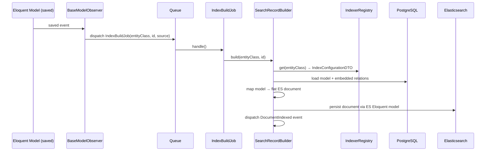
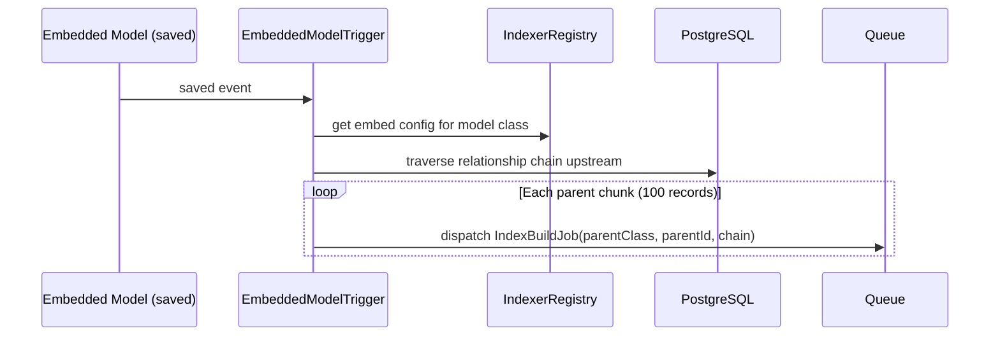
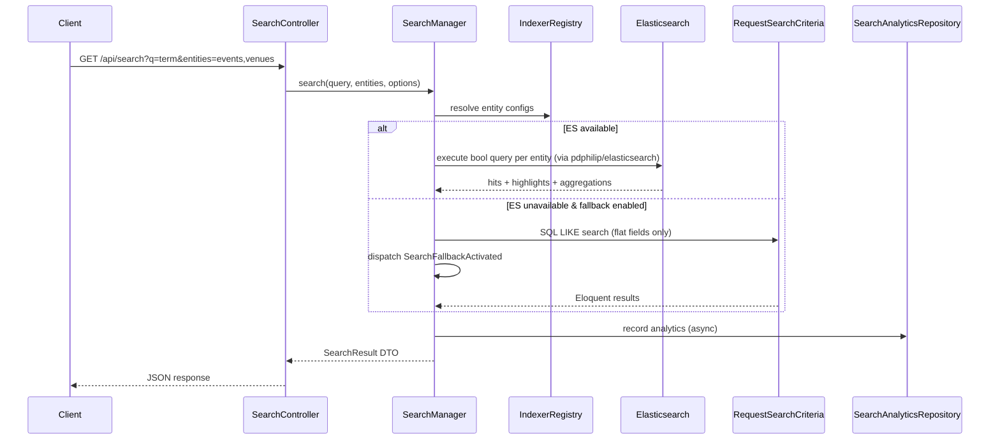

# Design Document — Search Package (`pixielity/laravel-search`)

## Overview

The `pixielity/laravel-search` package is the Elasticsearch implementation layer
for the Pixielity monorepo. It implements the three framework Indexer contracts
(`IndexerInterface`, `IndexManagerInterface`, `RecordBuilderInterface`) using
`pdphilip/elasticsearch` v5 as the ES Eloquent driver, and provides the full
search orchestration layer: unified cross-entity search, entity-specific search,
autocomplete, faceted search, geo-search, SQL LIKE fallback, observer chains,
tenant lifecycle management, Artisan commands, health checks, and search
analytics.

### Key Design Decisions

1. **Framework Contract Implementation** — `SearchIndexer`,
   `SearchIndexManager`, and `SearchRecordBuilder` implement the framework's
   `IndexerInterface`, `IndexManagerInterface`, and `RecordBuilderInterface`
   respectively. The `#[Bind]` annotations on the framework interfaces point to
   these classes. This package never redefines framework-owned types.

2. **pdphilip/elasticsearch as ES Driver** — All ES operations go through
   `PDPhilip\Elasticsearch\Connection` which extends Laravel's `BaseConnection`.
   This gives us Eloquent-compatible query builders, schema management via
   `Schema\Builder`, bulk operations, and `setIndexPrefix()` for tenant
   isolation. No raw `elasticsearch/elasticsearch` client, no Scout, no
   Meilisearch.

3. **ElasticLens Patterns Adapted** — `ObserverRegistry` registers observers for
   base + embedded models. `BaseModelObserver` dispatches `IndexBuildJob` on
   save/delete. `EmbeddedModelTrigger` traverses relationship chains to rebuild
   parent documents. `SearchRecordBuilder` builds ES documents from model +
   embeds. All adapted to use Pixielity attributes and Discovery instead of
   config-based field maps.

4. **Index-Per-Tenant via setIndexPrefix()** — `SearchBootstrapper` calls
   `Connection::setIndexPrefix('tenant_{key}_')` on tenant init. All ES
   operations automatically use tenant-prefixed index names. Reverts on tenant
   teardown. Global indexes (non-`BelongsToTenant` models) are unaffected.

5. **SQL LIKE Fallback** — When ES is unreachable and fallback is enabled,
   `SearchManager` delegates to `RequestSearchCriteria` from the CRUD package
   for flat-field search. Embedded relationship search is unavailable in
   fallback mode. A `SearchFallbackActivated` event is dispatched.

6. **Analytics in PostgreSQL** — Search analytics (query tracking,
   click-through, zero-result tracking) are stored in PostgreSQL tables, not ES.
   This keeps analytics independent of ES availability and leverages existing
   relational query patterns.

## Architecture

```mermaid
graph TB
    subgraph "Framework Indexer Sub-Package (dependency)"
        II[IndexerInterface]
        IMI[IndexManagerInterface]
        RBI[RecordBuilderInterface]
        IR[IndexerRegistry]
        DTO[IndexConfigurationDTO]
        IX[Indexable Trait]
        RTI[RoutesToIndex Trait]
        DI_EVT[DocumentIndexed Event]
        BS_ENUM[BuildState Enum]
        IS_ENUM[IndexStatus Enum]
        AT_ENUM[AggregationType Enum]
    end

    subgraph "Search Package (this spec)"
        SI[SearchIndexer]
        SIM[SearchIndexManager]
        SRB[SearchRecordBuilder]
        SM[SearchManager]
        SB[SearchBootstrapper]

        OR[ObserverRegistry]
        BMO[BaseModelObserver]
        EMT[EmbeddedModelTrigger]

        IBJ[IndexBuildJob]
        IDJ[IndexDeleteJob]
        BIJ[BulkIndexJob]

        SC[SearchController]
        SAR[SearchAnalyticsRepository]

        SHC[SearchHealthCheck]
        SSP[SearchServiceProvider]

        EVT_IC[IndexCreated Event]
        EVT_IR[IndexRebuilt Event]
        EVT_IF[IndexFlushed Event]
        EVT_ID[IndexDeleted Event]
        EVT_SP[SearchPerformed Event]
        EVT_SF[SearchFallbackActivated Event]

        CMD_I[search:index Command]
        CMD_F[search:flush Command]
        CMD_R[search:rebuild Command]
        CMD_S[search:status Command]

        LST_TC[CreateTenantIndexes Listener]
        LST_TD[DeleteTenantIndexes Listener]
    end

    subgraph "pdphilip/elasticsearch (dependency)"
        ESC[Connection]
        ESSB[Schema\Builder]
        ESQB[Query\Builder]
        ESM[Eloquent\Model]
    end

    subgraph "CRUD Package (dependency)"
        RSC[RequestSearchCriteria]
    end

    subgraph "Tenancy Package (dependency)"
        TBI[TenancyBootstrapperInterface]
        TE_C[TenantCreated Event]
        TE_D[TenantDeleted Event]
    end

    II -.->|implemented by| SI
    IMI -.->|implemented by| SIM
    RBI -.->|implemented by| SRB

    SI -->|uses| ESC
    SI -->|reads config| IR
    SI -->|dispatches| BIJ
    SIM -->|uses| ESSB
    SIM -->|uses| ESC
    SIM -->|reads config| IR
    SIM -->|dispatches| EVT_IC
    SIM -->|dispatches| EVT_IR
    SIM -->|dispatches| EVT_IF
    SIM -->|dispatches| EVT_ID
    SRB -->|reads config| IR
    SRB -->|dispatches| DI_EVT

    SM -->|uses| ESQB
    SM -->|reads config| IR
    SM -->|fallback| RSC
    SM -->|dispatches| EVT_SP
    SM -->|dispatches| EVT_SF
    SM -->|records| SAR

    SB -->|implements| TBI
    SB -->|calls| ESC

    OR -->|reads config| IR
    OR -->|registers| BMO
    OR -->|registers| EMT
    BMO -->|dispatches| IBJ
    BMO -->|dispatches| IDJ
    EMT -->|dispatches| IBJ

    IBJ -->|delegates to| SRB
    IDJ -->|delegates to| SI
    BIJ -->|delegates to| SRB

    SC -->|delegates to| SM
    SC -->|delegates to| SAR

    LST_TC -->|listens| TE_C
    LST_TC -->|delegates to| SIM
    LST_TD -->|listens| TE_D
    LST_TD -->|delegates to| SIM

    SHC -->|uses| ESC
    SHC -->|reads config| IR

    CMD_I -->|delegates to| SIM
    CMD_F -->|delegates to| SIM
    CMD_R -->|delegates to| SIM
    CMD_S -->|delegates to| SIM
```



### Index Build Flow (Observer → Job → ES)



### Embedded Model Trigger Flow



### Search Request Flow



## Components and Interfaces

### Service Implementations (Framework Contracts)

#### `SearchIndexer` — implements `IndexerInterface`

Resides at `packages/search/src/Services/SearchIndexer.php` under
`Pixielity\Search\Services`.

```php
#[Scoped]
class SearchIndexer implements IndexerInterface
{
    public function __construct(
        private readonly IndexerRegistry $registry,
        private readonly RecordBuilderInterface $recordBuilder,
        private readonly Connection $connection,
    ) {}

    /**
     * Index a single model record into ES.
     * Builds the document via RecordBuilder and persists via ES Eloquent model.
     */
    public function index(object $model): void
    {
        // 1. Resolve entity config from IndexerRegistry
        // 2. Build document via RecordBuilder::build()
        // 3. Upsert into ES index via pdphilip/elasticsearch Connection
    }

    /**
     * Remove a single model record from the ES index.
     */
    public function remove(object $model): void
    {
        // 1. Resolve index name from registry
        // 2. Delete document by primary key via ES Connection
    }

    /**
     * Remove all documents from an entity's ES index.
     */
    public function flush(string $entityClass): void
    {
        // 1. Resolve index name from registry
        // 2. Execute delete-by-query with match_all via ES Connection
    }

    /**
     * Rebuild all documents for an entity.
     * Flushes the index and dispatches BulkIndexJob chunks.
     */
    public function rebuild(string $entityClass, ?callable $progress = null): void
    {
        // 1. Flush existing documents
        // 2. Query total count from database
        // 3. Chunk records and dispatch BulkIndexJob per chunk
        // 4. Call progress callback with (imported, total)
    }
}
```

#### `SearchIndexManager` — implements `IndexManagerInterface`

Resides at `packages/search/src/Services/SearchIndexManager.php` under
`Pixielity\Search\Services`.

```php
#[Scoped]
class SearchIndexManager implements IndexManagerInterface
{
    public function __construct(
        private readonly IndexerRegistry $registry,
        private readonly IndexerInterface $indexer,
        private readonly Connection $connection,
    ) {}

    /**
     * Create an ES index with configured mappings, analyzers, and settings.
     * Uses pdphilip/elasticsearch Schema\Builder for index creation.
     */
    public function createIndex(string $entityClass, ?int $tenantKey = null): void
    {
        // 1. Resolve IndexConfigurationDTO from registry
        // 2. Resolve index name (tenant-prefixed if tenantKey provided)
        // 3. Build Blueprint: field types from searchable/filterable fields,
        //    nested objects for EmbedOne/EmbedMany, geo_point for geoField
        // 4. Configure analyzers: synonyms, stop words, custom analyzer
        // 5. Create index via Schema\Builder::create()
        // 6. Dispatch IndexCreated event
    }

    /**
     * Delete an ES index.
     */
    public function deleteIndex(string $entityClass, ?int $tenantKey = null): void
    {
        // 1. Resolve index name
        // 2. Drop via Schema\Builder::dropIfExists()
        // 3. Dispatch IndexDeleted event
    }

    /**
     * Rebuild an ES index: flush, re-apply settings, re-import all records.
     */
    public function rebuildIndex(string $entityClass, ?int $tenantKey = null, ?callable $progress = null): void
    {
        // 1. Delete existing index
        // 2. Create fresh index with current settings
        // 3. Delegate to Indexer::rebuild() for data import
        // 4. Dispatch IndexRebuilt event
    }

    /**
     * Flush all documents from an ES index.
     */
    public function flushIndex(string $entityClass, ?int $tenantKey = null): void
    {
        // 1. Resolve index name
        // 2. Delegate to Indexer::flush()
        // 3. Dispatch IndexFlushed event
    }

    /**
     * Get index status: name, doc count, size, health, last update.
     */
    public function getIndexStatus(string $entityClass, ?int $tenantKey = null): IndexStatusDTO
    {
        // 1. Resolve index name
        // 2. Query via Connection::catIndices() for doc count, size, health
        // 3. Map health string to IndexStatus enum
        // 4. Return IndexStatusDTO
    }

    /**
     * Resolve the full ES index name for an entity, optionally tenant-scoped.
     */
    public function resolveIndexName(string $entityClass, ?int $tenantKey = null): string
    {
        // 1. Get IndexConfigurationDTO from registry
        // 2. If tenantKey provided and entity is tenant-scoped:
        //    return "tenant_{tenantKey}_{indexName}"
        // 3. Otherwise return indexName as-is
    }
}
```

#### `SearchRecordBuilder` — implements `RecordBuilderInterface`

Resides at `packages/search/src/Services/SearchRecordBuilder.php` under
`Pixielity\Search\Services`.

Adapted from ElasticLens `RecordBuilder`/`RecordMapper` pattern. Uses
`IndexerRegistry` for config instead of `IndexConfig`.

```php
#[Scoped]
class SearchRecordBuilder implements RecordBuilderInterface
{
    public function __construct(
        private readonly IndexerRegistry $registry,
    ) {}

    /**
     * Build a single ES document from a model record.
     * Loads model from DB, resolves embeds, produces flat document array.
     */
    public function build(string $entityClass, int|string $id): array
    {
        // 1. Get IndexConfigurationDTO from registry
        // 2. Load model from DB (withTrashed if soft-deletable)
        // 3. Call map() to produce document
        // 4. Persist to ES via Eloquent model upsert
        // 5. Dispatch DocumentIndexed event with BuildState::COMPLETED
        // 6. Return document array
    }

    /**
     * Map a model instance to an ES document array.
     * Returns null if model's excludeIndex() returns true.
     */
    public function map(object $model, array $config): ?array
    {
        // 1. Check excludeIndex() → return null if true
        // 2. Extract searchable field values from model
        // 3. Resolve EmbedOne: load related, extract declared fields as nested object
        // 4. Resolve EmbedMany: load collection (limit/orderBy), extract as array of objects
        // 5. Transform geo field to ES geo_point format if configured
        // 6. Return flat document array with 'id' key
    }

    /**
     * Build document without persisting to ES. For validation/debugging.
     */
    public function dryRun(string $entityClass, int|string $id): array
    {
        // 1. Load model, call map(), return document without ES write
    }
}
```

### SearchManager Service

Resides at `packages/search/src/Services/SearchManager.php` under
`Pixielity\Search\Services`.

```php
#[Bind(SearchManagerInterface::class)]
#[Scoped]
class SearchManager implements SearchManagerInterface
{
    public function __construct(
        private readonly IndexerRegistry $registry,
        private readonly Connection $connection,
        private readonly SearchAnalyticsRepositoryInterface $analytics,
    ) {}

    /**
     * Unified cross-entity search.
     * Executes ES bool queries across multiple entity indexes.
     */
    public function search(
        string $query,
        array $entities = [],
        array $options = [],
    ): SearchResult {}

    /**
     * Entity-specific search with filtering, sorting, pagination.
     */
    public function searchEntity(
        string $entity,
        string $query,
        array $filters = [],
        ?string $sort = null,
        array $options = [],
    ): EntityResult {}

    /**
     * Autocomplete/suggestions via ES prefix/match_phrase_prefix queries.
     */
    public function suggest(
        string $query,
        array $entities = [],
        int $limit = 5,
    ): array {}

    /**
     * Faceted search: aggregation queries on filterable fields.
     */
    public function facets(
        string $entity,
        ?string $query = null,
    ): array {}

    /**
     * Check if ES is available via lightweight health check.
     */
    public function isAvailable(): bool
    {
        // Try Connection::getClientInfo() with configurable timeout
    }
}
```

The `SearchManager` builds ES query DSL as follows:

- Full-text search: `bool.must` with `multi_match` across searchable fields,
  `fuzziness: 'AUTO'` when `typoTolerance` is true
- Filters: `bool.filter` with `term`/`terms`/`range` clauses from filterable
  fields
- Sorting: `sort` array from sortable fields
- Geo-filter: `bool.filter` with `geo_distance` when lat/lng/radius provided
- Geo-sort: `sort` with `_geo_distance` for distance calculation
- Highlights: `highlight.fields` for all searchable fields with configurable
  pre/post tags
- Aggregations: `aggs` with `terms` on filterable fields for facet distributions
- Suggestions: `match_phrase_prefix` with reduced `_source` (displayedAttributes
  only)

When ES is unavailable and `search.fallback.enabled` is true, the
`SearchManager` falls back to `RequestSearchCriteria` from the CRUD package for
flat-field SQL LIKE search. Embedded relationship search is not available in
fallback mode.

### Contracts (Package-Owned)

#### `SearchManagerInterface`

```php
#[Bind(SearchManager::class)]
interface SearchManagerInterface
{
    public function search(string $query, array $entities = [], array $options = []): SearchResult;
    public function searchEntity(string $entity, string $query, array $filters = [], ?string $sort = null, array $options = []): EntityResult;
    public function suggest(string $query, array $entities = [], int $limit = 5): array;
    public function facets(string $entity, ?string $query = null): array;
    public function isAvailable(): bool;
}
```

#### `SearchAnalyticsRepositoryInterface`

```php
#[Bind(SearchAnalyticsRepository::class)]
interface SearchAnalyticsRepositoryInterface
{
    public function recordSearch(string $query, array $entities, int $totalResults, array $resultCounts, ?int $userId, ?int $tenantId, float $responseTimeMs): void;
    public function recordClick(string $query, string $entity, int|string $recordId, int $position, ?int $userId, ?int $tenantId): void;
    public function getSummary(array $filters = []): array;
    public function getTopQueries(int $limit = 20, array $filters = []): array;
    public function getZeroResultQueries(int $limit = 20, array $filters = []): array;
}
```

### Observer Chain

#### `ObserverRegistry`

Resides at `packages/search/src/Observers/ObserverRegistry.php`. Adapted from
ElasticLens `ObserverRegistry`.

```php
class ObserverRegistry
{
    public function __construct(
        private readonly IndexerRegistry $registry,
    ) {}

    /**
     * Register observers for a base model and all its embedded relationship models.
     * Called from the framework's Indexable trait bootIndexable() method.
     */
    public function register(string $baseModelClass): void
    {
        // 1. Get IndexConfigurationDTO from registry
        // 2. Register BaseModelObserver on the base model
        // 3. For each EmbedOne/EmbedMany config:
        //    Register EmbeddedModelTrigger on the related model class
    }
}
```

#### `BaseModelObserver`

Resides at `packages/search/src/Observers/BaseModelObserver.php`. Adapted from
ElasticLens `BaseModelObserver`.

```php
class BaseModelObserver
{
    /**
     * On model saved (created/updated): dispatch IndexBuildJob.
     */
    public function saved(object $model): void
    {
        IndexBuildJob::dispatch(
            entityClass: $model::class,
            id: $model->getKey(),
            source: $model::class . ' (saved)',
        );
    }

    /**
     * On model deleting: dispatch IndexDeleteJob.
     * Handles soft-delete awareness.
     */
    public function deleting(object $model): void
    {
        // If soft-deleting and index should retain soft-deleted records, skip
        // Otherwise dispatch IndexDeleteJob
    }

    /**
     * On model deleted (soft-delete): dispatch IndexBuildJob to rebuild with soft-delete state.
     */
    public function deleted(object $model): void {}

    /**
     * On model restored: dispatch IndexBuildJob.
     */
    public function restored(object $model): void {}
}
```

#### `EmbeddedModelTrigger`

Resides at `packages/search/src/Observers/EmbeddedModelTrigger.php`. Adapted
from ElasticLens `EmbeddedModelTrigger`.

```php
class EmbeddedModelTrigger
{
    /**
     * Handle an embedded model event (saved/deleted).
     * Traverses the relationship chain upstream to the parent #[Indexed] model(s)
     * and dispatches IndexBuildJob(s) to rebuild affected parent documents.
     * Uses chunked queries (100 records per chunk) for multi-parent rebuilds.
     */
    public function handle(object $model, string $event, array $embedConfig, string $baseModelClass): void
    {
        // 1. Walk upstream through relationship chain
        // 2. For each parent chunk (100 records):
        //    Dispatch IndexBuildJob(parentClass, parentId, observerChain)
    }
}
```

### SearchBootstrapper

Resides at `packages/search/src/Bootstrappers/SearchBootstrapper.php`.

```php
#[AsBootstrapper(priority: 110)]
class SearchBootstrapper implements TenancyBootstrapperInterface
{
    private string $originalPrefix = '';

    /**
     * Bootstrap tenant: set ES index prefix to tenant_{key}_.
     */
    public function bootstrap(Tenant $tenant): void
    {
        $connection = DB::connection(config('search.connection', 'elasticsearch'));
        $this->originalPrefix = $connection->getIndexPrefix();
        $template = config('search.index.tenant_prefix_template', 'tenant_%tenant%_');
        $prefix = str_replace('%tenant%', (string) $tenant->getTenantKey(), $template);
        $connection->setIndexPrefix($prefix);
    }

    /**
     * Revert: restore original index prefix.
     */
    public function revert(): void
    {
        $connection = DB::connection(config('search.connection', 'elasticsearch'));
        $connection->setIndexPrefix($this->originalPrefix);
    }
}
```

### Jobs

#### `IndexBuildJob`

```php
class IndexBuildJob implements ShouldQueue
{
    use Dispatchable, InteractsWithQueue, Queueable, SerializesModels;

    public function __construct(
        public readonly string $entityClass,
        public readonly int|string $id,
        public readonly string $source,
    ) {
        $queue = config('search.queue');
        if ($queue) {
            $this->onQueue($queue);
        }
    }

    public function handle(RecordBuilderInterface $recordBuilder): void
    {
        $recordBuilder->build($this->entityClass, $this->id);
    }

    public function failed(\Throwable $exception): void
    {
        Log::error("IndexBuildJob failed", [
            'entity' => $this->entityClass,
            'id' => $this->id,
            'error' => $exception->getMessage(),
        ]);
        event(new DocumentIndexed(
            modelClass: $this->entityClass,
            recordId: $this->id,
            buildState: BuildState::FAILED,
            indexName: '', // resolved at dispatch time
        ));
    }
}
```

#### `IndexDeleteJob`

```php
class IndexDeleteJob implements ShouldQueue
{
    use Dispatchable, InteractsWithQueue, Queueable, SerializesModels;

    public function __construct(
        public readonly string $entityClass,
        public readonly int|string $id,
    ) {
        $queue = config('search.queue');
        if ($queue) {
            $this->onQueue($queue);
        }
    }

    public function handle(IndexerInterface $indexer): void
    {
        // Create a minimal model stub with the ID to pass to indexer::remove()
    }
}
```

#### `BulkIndexJob`

```php
class BulkIndexJob implements ShouldQueue
{
    use Dispatchable, InteractsWithQueue, Queueable, SerializesModels;

    public function __construct(
        public readonly string $entityClass,
        public readonly array $ids,
    ) {
        $queue = config('search.queue');
        if ($queue) {
            $this->onQueue($queue);
        }
    }

    public function handle(RecordBuilderInterface $recordBuilder): void
    {
        foreach ($this->ids as $id) {
            $recordBuilder->build($this->entityClass, $id);
        }
    }
}
```

### SearchController

Resides at `packages/search/src/Controllers/SearchController.php`.

```php
class SearchController extends Controller
{
    public function __construct(
        private readonly SearchManagerInterface $searchManager,
        private readonly SearchAnalyticsRepositoryInterface $analytics,
    ) {}

    /** GET /api/search */
    public function search(Request $request): JsonResponse {}

    /** GET /api/search/{entity} */
    public function searchEntity(string $entity, Request $request): JsonResponse {}

    /** GET /api/search/suggest */
    public function suggest(Request $request): JsonResponse {}

    /** GET /api/search/facets/{entity} */
    public function facets(string $entity, Request $request): JsonResponse {}

    /** POST /api/search/analytics/click */
    public function recordClick(Request $request): JsonResponse {}

    /** GET /api/search/analytics/summary */
    public function analyticsSummary(Request $request): JsonResponse {}
}
```

### Artisan Commands

All commands use Laravel Prompts for output. No `$this->info()` or
`$this->error()`.

| Command          | Signature                                | Description                                          |
| ---------------- | ---------------------------------------- | ---------------------------------------------------- |
| `search:index`   | `search:index {--entity=} {--tenant=}`   | Create ES indexes for all or specific entities       |
| `search:flush`   | `search:flush {--entity=} {--tenant=}`   | Remove all documents from indexes                    |
| `search:rebuild` | `search:rebuild {--entity=} {--tenant=}` | Flush and re-import all data with progress display   |
| `search:status`  | `search:status`                          | Display index status table (doc count, size, health) |

When `--tenant=all`, commands iterate over all tenants via the tenancy package.

### Health Check

```php
#[AsHealthCheck]
class SearchHealthCheck implements HealthCheckInterface
{
    public function __construct(
        private readonly Connection $connection,
        private readonly IndexerRegistry $registry,
    ) {}

    /**
     * Check ES connectivity, index existence, health status, and sync status.
     * Reports: cluster reachable, expected indexes exist, health per index,
     * document count vs database record count per entity.
     */
    public function check(): HealthCheckResult {}
}
```

### Tenant Lifecycle Listeners

```php
class CreateTenantIndexes
{
    public function handle(TenantCreated $event): void
    {
        // For each tenant-scoped entity in IndexerRegistry::tenantScoped():
        //   IndexManager::createIndex(entityClass, tenantKey)
    }
}

class DeleteTenantIndexes
{
    public function handle(TenantDeleted $event): void
    {
        // For each tenant-scoped entity in IndexerRegistry::tenantScoped():
        //   IndexManager::deleteIndex(entityClass, tenantKey)
    }
}
```

### Events

All events are `final readonly` DTOs with `#[AsEvent]`, carrying scalar values
only.

| Event                     | Properties                                           | Dispatched By                        |
| ------------------------- | ---------------------------------------------------- | ------------------------------------ |
| `IndexCreated`            | `entityClass`, `indexName`, `tenantKey`              | `SearchIndexManager::createIndex()`  |
| `IndexRebuilt`            | `entityClass`, `indexName`, `tenantKey`              | `SearchIndexManager::rebuildIndex()` |
| `IndexFlushed`            | `entityClass`, `indexName`, `tenantKey`              | `SearchIndexManager::flushIndex()`   |
| `IndexDeleted`            | `entityClass`, `indexName`, `tenantKey`              | `SearchIndexManager::deleteIndex()`  |
| `SearchPerformed`         | `query`, `entities`, `resultCount`, `responseTimeMs` | `SearchManager::search()`            |
| `SearchFallbackActivated` | `reason`                                             | `SearchManager` (on ES unavailable)  |

### SearchServiceProvider

```php
#[Module(name: 'Search', priority: 55)]
#[LoadsResources(migrations: true, config: true, routes: true, commands: true, publishables: true)]
class SearchServiceProvider extends ServiceProvider implements HasBindings
{
    public function bindings(): void
    {
        $this->app->scoped(SearchManagerInterface::class, SearchManager::class);
        $this->app->scoped(SearchAnalyticsRepositoryInterface::class, SearchAnalyticsRepository::class);
    }
}
```

### Enums (Package-Owned)

#### `SearchScope`

```php
enum SearchScope: string
{
    use Enum;

    #[Label('All')]
    #[Description('Search across all scopes (tenant + global).')]
    case ALL = 'all';

    #[Label('Tenant')]
    #[Description('Search only tenant-scoped indexes.')]
    case TENANT = 'tenant';

    #[Label('Global')]
    #[Description('Search only global (non-tenant) indexes.')]
    case GLOBAL = 'global';
}
```

## Data Models

### DTOs (Package-Owned)

#### `SearchResult`

Returned by `SearchManager::search()` for unified cross-entity search.

```php
final readonly class SearchResult
{
    public function __construct(
        /** @var array<string, EntityResult> Results grouped by entity identifier. */
        public array $results,
        /** Total hits across all entities. */
        public int $totalHits,
        /** Query processing time in milliseconds. */
        public float $queryTimeMs,
        /** The original query string. */
        public string $query,
        /** Whether results came from SQL LIKE fallback. */
        public bool $fallback = false,
    ) {}
}
```

#### `EntityResult`

Returned by `SearchManager::searchEntity()` and nested within `SearchResult`.

```php
final readonly class EntityResult
{
    public function __construct(
        /** @var array<int, array> Array of search hit items with _highlights. */
        public array $items,
        /** Total count of matching documents for this entity. */
        public int $total,
        /** Current page number. */
        public int $page,
        /** Results per page. */
        public int $perPage,
        /** @var array<string, array> Facet distributions keyed by field name. */
        public array $facets = [],
        /** @var array<int, array> Highlight data per item. */
        public array $highlights = [],
    ) {}
}
```

#### `SearchSuggestion`

Returned by `SearchManager::suggest()`.

```php
final readonly class SearchSuggestion
{
    public function __construct(
        /** The suggested completion or match text. */
        public string $text,
        /** The entity type identifier. */
        public string $entity,
        /** The record ID. */
        public int|string $id,
        /** The matched portion with highlight markers. */
        public string $highlight,
        /** Relevance score. */
        public float $score,
    ) {}
}
```

#### `IndexStatusDTO`

Returned by `SearchIndexManager::getIndexStatus()`.

```php
final readonly class IndexStatusDTO
{
    public function __construct(
        /** The full ES index name. */
        public string $indexName,
        /** Number of documents in the index. */
        public int $documentCount,
        /** Index size in bytes. */
        public int $sizeBytes,
        /** Index health status from framework enum. */
        public IndexStatus $health,
        /** Last update timestamp (nullable if unknown). */
        public ?string $lastUpdated,
        /** Number of records in the source database table. */
        public int $sourceCount,
    ) {}
}
```

### Eloquent Models (PostgreSQL — Analytics)

#### `SearchAnalytic`

```php
class SearchAnalytic extends Model
{
    protected $table; // from config: search.analytics.table

    protected function casts(): array
    {
        return [
            'entities' => 'array',
            'result_counts' => 'array',
            'is_zero_result' => 'boolean',
            'response_time_ms' => 'float',
        ];
    }
}
```

Columns: `id`, `query`, `entities` (json), `total_results`, `result_counts`
(json), `is_zero_result`, `user_id` (nullable), `tenant_id` (nullable),
`response_time_ms`, `created_at`.

#### `SearchClick`

```php
class SearchClick extends Model
{
    protected $table; // from config: search.analytics.clicks_table

    protected function casts(): array
    {
        return [
            'position' => 'integer',
        ];
    }
}
```

Columns: `id`, `query`, `entity`, `record_id`, `position`, `user_id` (nullable),
`tenant_id` (nullable), `created_at`.

### Migrations

#### `create_search_analytics_table`

```php
Schema::create(config('search.analytics.table', 'search_analytics'), function (Blueprint $table): void {
    $table->id();
    $table->string('query');
    $table->json('entities');
    $table->unsignedInteger('total_results');
    $table->json('result_counts');
    $table->boolean('is_zero_result')->default(false);
    $table->unsignedBigInteger('user_id')->nullable()->index();
    $table->unsignedBigInteger('tenant_id')->nullable()->index();
    $table->float('response_time_ms');
    $table->timestamp('created_at')->useCurrent();
    $table->index(['query', 'created_at']);
    $table->index(['tenant_id', 'created_at']);
});
```

#### `create_search_clicks_table`

```php
Schema::create(config('search.analytics.clicks_table', 'search_clicks'), function (Blueprint $table): void {
    $table->id();
    $table->string('query');
    $table->string('entity');
    $table->string('record_id');
    $table->unsignedInteger('position');
    $table->unsignedBigInteger('user_id')->nullable()->index();
    $table->unsignedBigInteger('tenant_id')->nullable()->index();
    $table->timestamp('created_at')->useCurrent();
    $table->index(['query', 'entity', 'created_at']);
});
```

### Configuration (`config/search.php`)

```php
return [
    'connection' => env('SEARCH_CONNECTION', 'elasticsearch'),

    'index' => [
        'tenant_prefix_template' => env('SEARCH_TENANT_PREFIX', 'tenant_%tenant%_'),
    ],

    'pagination' => [
        'default_per_page' => 20,
        'max_per_page' => 100,
    ],

    'highlight' => [
        'pre_tag' => '<em>',
        'post_tag' => '</em>',
    ],

    'analytics' => [
        'enabled' => env('SEARCH_ANALYTICS_ENABLED', true),
        'retention_days' => 90,
        'table' => 'search_analytics',
        'clicks_table' => 'search_clicks',
    ],

    'suggest' => [
        'default_limit' => 5,
        'max_limit' => 20,
    ],

    'fallback' => [
        'enabled' => env('SEARCH_FALLBACK_ENABLED', true),
        'health_check_timeout' => 2,
    ],

    'queue' => env('SEARCH_QUEUE', null),
];
```

### Package Structure

```
packages/search/
├── composer.json
├── module.json
├── config/search.php
├── src/
│   ├── Bootstrappers/
│   │   └── SearchBootstrapper.php
│   ├── Commands/
│   │   ├── IndexCommand.php
│   │   ├── FlushCommand.php
│   │   ├── RebuildCommand.php
│   │   └── StatusCommand.php
│   ├── Contracts/
│   │   ├── SearchManagerInterface.php
│   │   └── SearchAnalyticsRepositoryInterface.php
│   ├── Controllers/
│   │   └── SearchController.php
│   ├── Data/
│   │   ├── SearchResult.php
│   │   ├── EntityResult.php
│   │   ├── SearchSuggestion.php
│   │   └── IndexStatusDTO.php
│   ├── Enums/
│   │   └── SearchScope.php
│   ├── Events/
│   │   ├── IndexCreated.php
│   │   ├── IndexRebuilt.php
│   │   ├── IndexFlushed.php
│   │   ├── IndexDeleted.php
│   │   ├── SearchPerformed.php
│   │   └── SearchFallbackActivated.php
│   ├── HealthChecks/
│   │   └── SearchHealthCheck.php
│   ├── Jobs/
│   │   ├── IndexBuildJob.php
│   │   ├── IndexDeleteJob.php
│   │   └── BulkIndexJob.php
│   ├── Listeners/
│   │   ├── CreateTenantIndexes.php
│   │   └── DeleteTenantIndexes.php
│   ├── Migrations/
│   │   ├── create_search_analytics_table.php
│   │   └── create_search_clicks_table.php
│   ├── Models/
│   │   ├── SearchAnalytic.php
│   │   └── SearchClick.php
│   ├── Observers/
│   │   ├── ObserverRegistry.php
│   │   ├── BaseModelObserver.php
│   │   └── EmbeddedModelTrigger.php
│   ├── Providers/
│   │   └── SearchServiceProvider.php
│   ├── Repositories/
│   │   └── SearchAnalyticsRepository.php
│   ├── Services/
│   │   ├── SearchIndexer.php
│   │   ├── SearchIndexManager.php
│   │   ├── SearchRecordBuilder.php
│   │   └── SearchManager.php
│   └── routes/
│       └── api.php
└── tests/
```

## Correctness Properties

_A property is a characteristic or behavior that should hold true across all
valid executions of a system — essentially, a formal statement about what the
system should do. Properties serve as the bridge between human-readable
specifications and machine-verifiable correctness guarantees._

### Property 1: DTO construction round-trip

_For any_ valid set of property values, constructing `SearchResult`,
`EntityResult`, `SearchSuggestion`, or `IndexStatusDTO` and reading back all
properties should return the original values unchanged. This includes all scalar
types, enum values, arrays, and nullable fields.

**Validates: Requirements 8.3, 8.4, 9.6, 10.3**

### Property 2: Rebuild chunking covers all record IDs

_For any_ total record count N and chunk size C, when `Indexer::rebuild()`
dispatches `BulkIndexJob`s, the union of all chunk ID arrays should equal the
full set of record IDs, and each chunk should contain at most C IDs.

**Validates: Requirements 2.6**

### Property 3: Index name resolution follows tenant/global pattern

_For any_ entity class with `isTenantScoped` flag and optional tenant key,
`IndexManager::resolveIndexName()` should return
`tenant_{tenantKey}_{indexName}` when tenant-scoped with a tenant key, and the
bare `indexName` when not tenant-scoped or no tenant key is provided.

**Validates: Requirements 2.7, 14.7**

### Property 4: Document building includes all searchable fields and embed field names

_For any_ `IndexConfigurationDTO` with a set of searchable fields and
`EmbedOne`/`EmbedMany` declarations, the document array produced by
`RecordBuilder::map()` should contain keys for every searchable field and every
declared embed field name.

**Validates: Requirements 4.3, 4.4**

### Property 5: EmbedMany respects limit constraint

_For any_ `EmbedMany` configuration with a non-null `limit` of N, the embedded
array in the document output should contain at most N items, regardless of how
many related records exist.

**Validates: Requirements 4.5**

### Property 6: excludeIndex returns null from map

_For any_ model where `excludeIndex()` returns `true`, calling
`RecordBuilder::map()` should return `null`.

**Validates: Requirements 4.6**

### Property 7: Bootstrapper prefix round-trip

_For any_ original index prefix string and any tenant key, calling
`SearchBootstrapper::bootstrap()` then `SearchBootstrapper::revert()` should
restore the ES connection's index prefix to the original value.

**Validates: Requirements 6.2, 6.3, 6.4**

### Property 8: Search query DSL includes searchable fields with conditional fuzziness

_For any_ entity configuration with a set of searchable fields and a
`typoTolerance` flag, the generated ES bool query should contain a `multi_match`
clause covering all searchable fields, and should include `fuzziness: 'AUTO'` if
and only if `typoTolerance` is `true`.

**Validates: Requirements 7.3, 7.4**

### Property 9: Filter and sort validation rejects undeclared fields

_For any_ field name that is not present in an entity's declared filterable
fields, applying it as a filter should produce a validation error. Similarly,
_for any_ field name not in the entity's declared sortable fields, applying it
as a sort should produce a validation error.

**Validates: Requirements 9.4, 9.5**

### Property 10: Filter clauses generated from filterable fields

_For any_ filter key that exists in the entity's declared filterable fields and
a corresponding filter value, the generated ES query should contain a
`bool.filter` clause for that field.

**Validates: Requirements 9.2**

### Property 11: Sort clauses generated from sortable fields

_For any_ sort field that exists in the entity's declared sortable fields and a
direction (asc/desc), the generated ES query should contain a `sort` entry for
that field with the specified direction.

**Validates: Requirements 9.3**

### Property 12: Aggregation query contains terms for filterable fields

_For any_ entity with a set of declared filterable fields, the facet query
generated by `SearchManager::facets()` should contain a `terms` aggregation for
each filterable field.

**Validates: Requirements 11.2**

### Property 13: Highlight configuration uses configured tags

_For any_ non-empty `pre_tag` and `post_tag` configuration strings, the
generated ES highlight configuration should use those exact strings as the
highlight markers.

**Validates: Requirements 12.1**

### Property 14: Geo field transformation produces valid ES geo_point

_For any_ valid latitude (-90 to 90) and longitude (-180 to 180), the geo field
transformation should produce a valid ES `geo_point` object with `lat` and `lon`
keys matching the input values.

**Validates: Requirements 13.2**

### Property 15: Geo distance filter generation

_For any_ valid latitude, longitude, and positive radius in meters, the
generated ES query should contain a `geo_distance` filter with the specified
distance and location.

**Validates: Requirements 13.4**

### Property 16: Unrecognized entity validation

_For any_ entity identifier string that is not registered in the
`IndexerRegistry`, the `SearchManager` should reject it with a validation error
listing the allowed entity identifiers.

**Validates: Requirements 8.6**

### Property 17: Zero-result analytics flag

_For any_ search result where `totalResults` equals 0, the persisted analytics
record should have `is_zero_result` set to `true`. _For any_ search result where
`totalResults` is greater than 0, `is_zero_result` should be `false`.

**Validates: Requirements 20.2**

### Property 18: Package events are final readonly DTOs with scalar properties

_For any_ event class in the `Pixielity\Search\Events` namespace
(`IndexCreated`, `IndexRebuilt`, `IndexFlushed`, `IndexDeleted`,
`SearchPerformed`, `SearchFallbackActivated`), the class should be
`final readonly` and all constructor parameters should be scalar types, enum
types, or nullable scalar types.

**Validates: Requirements 19.4**

## Error Handling

| Scenario                                       | Behavior                                                                                                                | Component             |
| ---------------------------------------------- | ----------------------------------------------------------------------------------------------------------------------- | --------------------- |
| ES cluster unreachable, fallback enabled       | Fall back to SQL LIKE via `RequestSearchCriteria`, dispatch `SearchFallbackActivated`, set `fallback: true` in response | `SearchManager`       |
| ES cluster unreachable, fallback disabled      | Throw exception / return error response                                                                                 | `SearchManager`       |
| ES cluster recovers after fallback             | Auto-resume ES on next health check pass                                                                                | `SearchManager`       |
| Unrecognized entity identifier in search       | Return validation error listing allowed entities                                                                        | `SearchManager`       |
| Undeclared filter field                        | Return validation error listing allowed filterable fields                                                               | `SearchManager`       |
| Undeclared sort field                          | Return validation error listing allowed sortable fields                                                                 | `SearchManager`       |
| Model's `excludeIndex()` returns true          | `RecordBuilder::map()` returns null, document skipped, stale index removed                                              | `SearchRecordBuilder` |
| `IndexBuildJob` fails after all retries        | Log error, dispatch `DocumentIndexed` with `BuildState::FAILED`                                                         | `IndexBuildJob`       |
| Index creation fails (ES error)                | Log error, re-throw for command/listener to handle                                                                      | `SearchIndexManager`  |
| Tenant index already exists on `TenantCreated` | Skip creation (idempotent), log info                                                                                    | `CreateTenantIndexes` |
| EmbedOne relation returns null                 | Include null for that embed field in document                                                                           | `SearchRecordBuilder` |
| EmbedMany relation returns empty collection    | Include empty array for that embed field                                                                                | `SearchRecordBuilder` |
| Analytics disabled via config                  | Skip all analytics recording, search functions unaffected                                                               | `SearchManager`       |
| Health check: ES unreachable                   | Report failure with connection error details                                                                            | `SearchHealthCheck`   |
| Health check: missing indexes                  | Report warning listing missing index names                                                                              | `SearchHealthCheck`   |
| Health check: doc count mismatch               | Report sync status with ES count vs DB count per entity                                                                 | `SearchHealthCheck`   |

## Testing Strategy

### Unit Tests (Example-Based)

Unit tests cover structural constraints, specific examples, and edge cases:

- **Service provider structure**: Verify `SearchServiceProvider` has
  `#[Module(name: 'Search', priority: 55)]`, `#[LoadsResources(...)]`,
  implements `HasBindings`, registers correct bindings (Requirement 1)
- **Interface implementations**: Verify `SearchIndexer` implements
  `IndexerInterface`, `SearchIndexManager` implements `IndexManagerInterface`,
  `SearchRecordBuilder` implements `RecordBuilderInterface` (Requirements 2.1,
  3.1, 4.1)
- **Job structure**: Verify `IndexBuildJob`, `IndexDeleteJob`, `BulkIndexJob`
  implement `ShouldQueue`, use correct queue from config (Requirements
  14.1–14.4)
- **Event structure**: Verify all events have `#[AsEvent]`, are
  `final readonly`, carry correct properties (Requirement 19)
- **Enum structure**: Verify `SearchScope` has correct cases, backing values,
  `#[Label]`/`#[Description]` (Requirement 21.1)
- **Bootstrapper structure**: Verify `SearchBootstrapper` has
  `#[AsBootstrapper(priority: 110)]`, implements `TenancyBootstrapperInterface`
  (Requirement 6.1)
- **Health check structure**: Verify `SearchHealthCheck` has `#[AsHealthCheck]`
  (Requirement 18.1)
- **Config structure**: Verify all config keys exist with correct defaults
  (Requirement 22)
- **Composer dependencies**: Verify required packages present, forbidden
  packages absent (Requirements 1.4, 1.5)
- **Observer dispatch**: Verify `BaseModelObserver::saved()` dispatches
  `IndexBuildJob`, `deleting()` dispatches `IndexDeleteJob` (Requirement 5.2)
- **Fallback flag**: Verify `SearchResult` includes `fallback: true` when in
  fallback mode (Requirement 17.4)
- **Analytics disabled**: Verify no analytics calls when
  `search.analytics.enabled` is false (Requirement 20.6)

### Integration Tests

Integration tests cover component interactions with mocked dependencies:

- **Indexer operations**: Mock ES Connection, verify `index()` calls build +
  persist, `remove()` calls delete, `flush()` calls delete-by-query
  (Requirements 2.3–2.5)
- **IndexManager lifecycle**: Mock Schema Builder and Connection, verify
  `createIndex()` creates with correct mappings/analyzers, `deleteIndex()`
  drops, `rebuildIndex()` sequences correctly, events dispatched (Requirements
  3.3–3.7)
- **RecordBuilder pipeline**: Mock DB and registry, verify `build()` loads
  model + embeds, `dryRun()` skips ES write (Requirements 4.3, 4.7)
- **Observer chain registration**: Mock model classes, verify
  `ObserverRegistry::register()` attaches observers to base and embedded models
  (Requirement 5.1)
- **EmbeddedModelTrigger traversal**: Mock DB with multi-level relationships,
  verify upstream traversal and chunked job dispatch (Requirements 5.3–5.5)
- **Tenant lifecycle listeners**: Dispatch `TenantCreated`/`TenantDeleted`,
  verify `IndexManager` called for each tenant-scoped entity (Requirement 16)
- **SQL LIKE fallback**: Mock ES as unavailable, verify `RequestSearchCriteria`
  used, event dispatched, log written (Requirement 17)
- **Health check**: Mock ES connection and registry, verify cluster check, index
  existence, sync status (Requirement 18)
- **Artisan commands**: Mock `IndexManager`, verify correct methods called with
  correct arguments, output formatted with Laravel Prompts (Requirement 15)
- **Search analytics persistence**: Call `recordSearch()` and `recordClick()`,
  verify DB records created (Requirement 20)
- **API endpoints**: HTTP tests for all controller endpoints with mocked
  `SearchManager` (Requirements 8, 9, 10, 11)

### Property-Based Tests

Property-based tests use `innmind/black-box` (PHP PBT library) with minimum 100
iterations per property. Each test references its design document property.

| Property    | Test Description                                                                                           | Tag                                                                                                           |
| ----------- | ---------------------------------------------------------------------------------------------------------- | ------------------------------------------------------------------------------------------------------------- |
| Property 1  | Generate random valid property values for each DTO, construct, verify all properties preserved             | `Feature: search-package, Property 1: DTO construction round-trip`                                            |
| Property 2  | Generate random record counts and chunk sizes, verify all IDs covered and chunk sizes respected            | `Feature: search-package, Property 2: Rebuild chunking covers all record IDs`                                 |
| Property 3  | Generate random entity configs with isTenantScoped flag and tenant keys, verify index name pattern         | `Feature: search-package, Property 3: Index name resolution follows tenant/global pattern`                    |
| Property 4  | Generate random IndexConfigurationDTOs with searchable fields and embed configs, verify document keys      | `Feature: search-package, Property 4: Document building includes all searchable fields and embed field names` |
| Property 5  | Generate random EmbedMany configs with limits and varying related record counts, verify array size ≤ limit | `Feature: search-package, Property 5: EmbedMany respects limit constraint`                                    |
| Property 6  | Generate random models with excludeIndex() returning true, verify map() returns null                       | `Feature: search-package, Property 6: excludeIndex returns null from map`                                     |
| Property 7  | Generate random prefix strings and tenant keys, verify bootstrap/revert round-trip                         | `Feature: search-package, Property 7: Bootstrapper prefix round-trip`                                         |
| Property 8  | Generate random searchable field sets and typoTolerance flags, verify query DSL structure                  | `Feature: search-package, Property 8: Search query DSL includes searchable fields with conditional fuzziness` |
| Property 9  | Generate random field names not in filterable/sortable sets, verify validation errors                      | `Feature: search-package, Property 9: Filter and sort validation rejects undeclared fields`                   |
| Property 10 | Generate random filter keys from filterable fields, verify bool.filter clauses present                     | `Feature: search-package, Property 10: Filter clauses generated from filterable fields`                       |
| Property 11 | Generate random sort fields from sortable fields with directions, verify sort entries                      | `Feature: search-package, Property 11: Sort clauses generated from sortable fields`                           |
| Property 12 | Generate random sets of filterable fields, verify terms aggregation per field                              | `Feature: search-package, Property 12: Aggregation query contains terms for filterable fields`                |
| Property 13 | Generate random pre_tag/post_tag strings, verify highlight config uses them                                | `Feature: search-package, Property 13: Highlight configuration uses configured tags`                          |
| Property 14 | Generate random lat (-90..90) and lng (-180..180), verify geo_point output                                 | `Feature: search-package, Property 14: Geo field transformation produces valid ES geo_point`                  |
| Property 15 | Generate random lat, lng, positive radius, verify geo_distance filter in query                             | `Feature: search-package, Property 15: Geo distance filter generation`                                        |
| Property 16 | Generate random strings not in registry, verify validation error with allowed list                         | `Feature: search-package, Property 16: Unrecognized entity validation`                                        |
| Property 17 | Generate random totalResults values, verify is_zero_result flag matches totalResults == 0                  | `Feature: search-package, Property 17: Zero-result analytics flag`                                            |
| Property 18 | Iterate all event classes, verify final readonly with scalar constructor params                            | `Feature: search-package, Property 18: Package events are final readonly DTOs with scalar properties`         |
