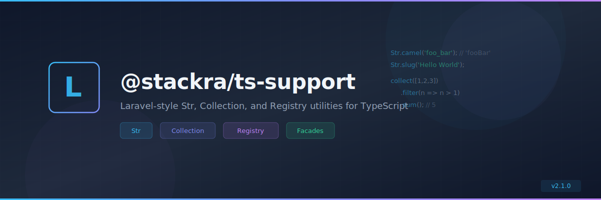

<div align="center">
  
</div>

<div align="center">

[](https://github.com/pixielity-inc/frontend-monorepo/actions/workflows/ci.yml)
[](https://github.com/pixielity-inc/frontend-monorepo/actions/workflows/security.yml)
[](https://nodejs.org)
[](https://nextjs.org)
[](https://typescriptlang.org)
[](LICENSE)

**A production-ready Next.js monorepo template powered by
[Turborepo](https://turborepo.dev).** Batteries included: HeroUI, Tailwind 4,
shared ESLint/tsconfig, CI/CD, git hooks, and MCP.

[Quick Start](#quick-start) · [Structure](#structure) · [Commands](#commands) ·
[Packages](#packages) · [CI/CD](#cicd) · [Contributing](CONTRIBUTING.md)

</div>

---

## Structure

```
frontend-monorepo/
├── apps/
│   ├── web/                   # @pixielity/web — Next.js 16 (port 3000)
│   └── docs/                  # @pixielity/docs — Next.js 16 (port 3001)
├── packages/
│   ├── react-ui/              # @pixielity/react-ui — shared React component library
│   ├── eslint-config/         # @pixielity/eslint-config — ESLint 9 flat config
│   └── typescript-config/     # @pixielity/typescript-config — shared tsconfigs
├── .github/
│   ├── assets/banner.svg
│   ├── workflows/
│   │   ├── ci.yml             # Lint · type-check · build on Node 18/20/22
│   │   ├── release.yml        # GitHub Release + npm publish on version tags
│   │   └── security.yml       # Weekly npm audit + CodeQL
│   ├── CODEOWNERS
│   └── dependabot.yml
├── .githooks/                 # pre-commit · commit-msg · pre-push
├── .kiro/settings/mcp.json    # Next.js devtools · HeroUI React · Tailwind · GitHub
├── turbo.json                 # Turborepo pipeline
├── package.json               # npm workspaces root
├── pnpm-workspace.yaml        # pnpm workspace declaration
└── prettier.config.js         # Shared Prettier config
```

---

## Quick start

```bash
# 1. Clone
git clone https://github.com/pixielity-inc/frontend-monorepo.git
cd frontend-monorepo

# 2. Install (also registers git hooks via `prepare`)
npm install

# 3. Start all apps in dev mode
npm run dev
# web  → http://localhost:3000
# docs → http://localhost:3001
```

---

## Commands

### Root

| Command                | Description                                 |
| ---------------------- | ------------------------------------------- |
| `npm run build`        | Build all workspaces in dependency order    |
| `npm run dev`          | Start all apps in watch/dev mode            |
| `npm run start`        | Start all apps in production mode           |
| `npm run lint`         | ESLint across all workspaces                |
| `npm run lint:fix`     | ESLint auto-fix across all workspaces       |
| `npm run check-types`  | TypeScript type-check across all workspaces |
| `npm run test`         | Run all test suites                         |
| `npm run format`       | Prettier format all files                   |
| `npm run format:check` | Prettier check (no write)                   |
| `npm run clean`        | Remove build artefacts                      |
| `npm run clean:all`    | Remove build artefacts + node_modules       |
| `npm run upgrade`      | `ncu -u && npm install`                     |

Filter to a single workspace:

```bash
npm run build -- --filter=@pixielity/web
npm run test  -- --filter=@pixielity/react-ui
npm run dev   -- --filter=@pixielity/docs
```

---

## Packages

### `@pixielity/react-ui`

Shared React component library consumed by all apps.

```tsx
import { Button } from "@pixielity/react-ui/button";
```

### `@pixielity/eslint-config`

Three ESLint 9 flat configs:

```js
// eslint.config.js in an app
import { nextJs } from "@pixielity/eslint-config/next-js";
export default [...nextJs];
```

Exports: `./base`, `./next-js`, `./react-internal`

### `@pixielity/typescript-config`

Shared tsconfigs:

```json
{ "extends": "@pixielity/typescript-config/nextjs" }
```

Exports: `./base`, `./nextjs`, `./react-library`

---

## Adding a new app

```bash
# 1. Create the app
npx create-next-app apps/my-app --typescript --tailwind --app

# 2. Update apps/my-app/package.json:
#    "name": "@pixielity/my-app"

# 3. Add shared deps
npm install
```

## Adding a new package

```bash
mkdir -p packages/my-package/src
# Add package.json with "name": "@pixielity/my-package"
npm install
```

## Publishing a package to npm

Remove `"private": true` from the package's `package.json`, then:

```bash
git tag my-package-v1.0.0 && git push --tags
# release.yml publishes to npm automatically
```

---

## CI/CD

| Workflow       | Trigger                     | What it does                                     |
| -------------- | --------------------------- | ------------------------------------------------ |
| `ci.yml`       | PR + push to `main/develop` | Node 18/20/22 matrix · lint · type-check · build |
| `release.yml`  | Tag `v*` or `<pkg>-v*`      | GitHub Release + npm publish                     |
| `security.yml` | Weekly + push to `main`     | npm audit · CodeQL (JS/TS)                       |

### Required secrets

| Secret          | Workflow    | Description                             |
| --------------- | ----------- | --------------------------------------- |
| `CODECOV_TOKEN` | ci.yml      | [codecov.io](https://codecov.io) token  |
| `NPM_TOKEN`     | release.yml | npm publish token                       |
| `TURBO_TOKEN`   | ci.yml      | Turborepo remote cache token (optional) |
| `TURBO_TEAM`    | ci.yml      | Turborepo team slug (optional)          |

---

## MCP servers (Kiro)

Configured in `.kiro/settings/mcp.json`:

| Server          | Package                               | Purpose                                   |
| --------------- | ------------------------------------- | ----------------------------------------- |
| `next-devtools` | `next-devtools-mcp`                   | Live build errors, routes, Server Actions |
| `heroui-react`  | `@heroui/react-mcp`                   | HeroUI v3 component docs                  |
| `tailwindcss`   | `mcp-remote` → gitmcp.io              | Live Tailwind CSS docs                    |
| `github`        | `@modelcontextprotocol/server-github` | Repo operations                           |
| `playwright`    | `@playwright/mcp`                     | Browser testing                           |

---

## License

MIT © [Pixielity](https://github.com/pixielity-inc)
