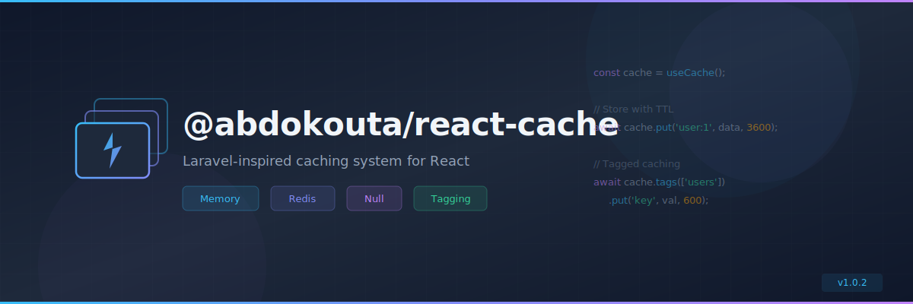

<p align="center">
  
</p>

<p align="center">
  <a href="https://www.npmjs.com/package/@abdokouta/ts-cache"></a>
  <a href="https://www.npmjs.com/package/@abdokouta/ts-cache"></a>
  <a href="https://github.com/abdokouta/cache/blob/main/LICENSE"></a>
  <a href="https://github.com/abdokouta/cache"></a>
</p>

<p align="center">
  Laravel-inspired caching system with multiple drivers for React applications.<br/>
  Built on top of <a href="https://www.npmjs.com/package/@abdokouta/ts-container">@abdokouta/ts-container</a> for seamless dependency injection.
</p>

---

## Table of Contents

- [Features](#features)
- [Installation](#installation)
- [Quick Start](#quick-start)
- [Configuration](#configuration)
  - [Basic Configuration](#basic-configuration)
  - [Using defineConfig](#using-defineconfig)
  - [Environment Variables](#environment-variables)
- [Cache Drivers](#cache-drivers)
  - [Memory Store](#memory-store)
  - [Redis Store](#redis-store)
  - [Null Store](#null-store)
- [Usage](#usage)
  - [Basic Operations](#basic-operations)
  - [Remember Pattern](#remember-pattern)
  - [Multiple Stores](#multiple-stores)
  - [Increment & Decrement](#increment--decrement)
  - [Cache Tagging](#cache-tagging)
- [React Hooks](#react-hooks)
  - [useCache](#usecache)
  - [useCachedQuery](#usecachedquery)
- [API Reference](#api-reference)
  - [CacheService](#cacheservice)
  - [Store Interface](#store-interface)
  - [TaggedCache](#taggedcache)
- [Custom Stores](#custom-stores)
- [TypeScript](#typescript)
- [Laravel Comparison](#laravel-comparison)
- [Requirements](#requirements)
- [License](#license)

---

## Features

- **Multiple Drivers** — Memory, Redis, and Null stores out of the box
- **Laravel-Inspired API** — `remember`, `rememberForever`, `pull`, `tags`, and
  more
- **Cache Tagging** — Group related cache entries and flush them together
  (Redis)
- **React Hooks** — `useCache()` and `useCachedQuery()` for component-level
  caching
- **Dependency Injection** — First-class DI support via
  `@abdokouta/ts-container`
- **Type-Safe Configuration** — `defineConfig()` helper with full autocomplete
- **TTL Support** — Per-operation and per-store default TTL
- **Key Prefixing** — Global and per-store prefixes to avoid collisions
- **LRU Eviction** — Memory store supports max size with automatic eviction
- **Lazy Initialization** — Stores are created on first use
- **Zero Config** — Works with sensible defaults, customize when needed

---

## Installation

```bash
# npm
npm install @abdokouta/ts-cache @abdokouta/ts-container

# pnpm
pnpm add @abdokouta/ts-cache @abdokouta/ts-container

# yarn
yarn add @abdokouta/ts-cache @abdokouta/ts-container
```

For Redis support, also install:

```bash
pnpm add @abdokouta/ts-redis
```

---

## Quick Start

```typescript
import { Module } from '@abdokouta/ts-container';
import { CacheModule } from '@abdokouta/ts-cache';

@Module({
  imports: [
    CacheModule.forRoot({
      default: 'memory',
      stores: {
        memory: {
          driver: 'memory',
          maxSize: 1000,
          ttl: 300,
        },
      },
    }),
  ],
})
export class AppModule {}
```

Then use it anywhere via DI or hooks:

```typescript
import { useCache } from '@abdokouta/ts-cache';

function UserProfile({ userId }: { userId: string }) {
  const cache = useCache();

  useEffect(() => {
    async function load() {
      const user = await cache.remember(`user:${userId}`, 3600, () =>
        fetch(`/api/users/${userId}`).then((r) => r.json())
      );
      setUser(user);
    }
    load();
  }, [userId]);

  // ...
}
```

---

## Configuration

### Basic Configuration

The configuration object follows the same structure as Laravel's
`config/cache.php`:

```typescript
import { CacheModule } from '@abdokouta/ts-cache';

CacheModule.forRoot({
  // Default store used when none is specified
  default: 'memory',

  // All available stores
  stores: {
    memory: {
      driver: 'memory',
      maxSize: 1000,
      ttl: 300, // 5 minutes
      prefix: 'mem_',
    },
    redis: {
      driver: 'redis',
      connection: redisClient,
      prefix: 'cache_',
      ttl: 3600, // 1 hour
    },
    null: {
      driver: 'null',
    },
  },

  // Global key prefix (applied to all stores)
  prefix: 'myapp_',
});
```

### Using defineConfig

For type-safe configuration with IDE autocomplete, use the `defineConfig`
helper:

```typescript
// cache.config.ts
import { defineConfig } from '@abdokouta/ts-cache';

export default defineConfig({
  default: 'memory',
  stores: {
    memory: {
      driver: 'memory',
      maxSize: 1000,
      ttl: 300,
    },
    redis: {
      driver: 'redis',
      connection: redisClient,
      prefix: 'cache_',
      ttl: 3600,
    },
  },
  prefix: 'app_',
});
```

### Environment Variables

The included `config/cache.config.ts` supports Vite environment variables:

| Variable                      | Description                | Default    |
| ----------------------------- | -------------------------- | ---------- |
| `VITE_CACHE_DRIVER`           | Default cache driver       | `'memory'` |
| `CACHE_PREFIX`                | Global key prefix          | `'app_'`   |
| `VITE_CACHE_MEMORY_MAX_SIZE`  | Memory store max entries   | `1000`     |
| `VITE_CACHE_MEMORY_TTL`       | Memory store TTL (seconds) | `300`      |
| `VITE_REDIS_CACHE_CONNECTION` | Redis connection name      | `'cache'`  |
| `VITE_CACHE_REDIS_PREFIX`     | Redis key prefix           | `'cache_'` |
| `VITE_CACHE_REDIS_TTL`        | Redis TTL (seconds)        | `3600`     |

---

## Cache Drivers

### Memory Store

Fast in-memory cache using JavaScript `Map`. Data is lost on page refresh or
process restart.

```typescript
{
  driver: 'memory',
  maxSize: 1000,   // Max entries before LRU eviction (optional)
  ttl: 300,        // Default TTL in seconds (optional)
  prefix: 'mem_',  // Key prefix (optional)
}
```

| Option    | Type       | Default     | Description                        |
| --------- | ---------- | ----------- | ---------------------------------- |
| `driver`  | `'memory'` | —           | Required driver identifier         |
| `maxSize` | `number`   | `undefined` | Max entries (unlimited if omitted) |
| `ttl`     | `number`   | `300`       | Default TTL in seconds             |
| `prefix`  | `string`   | `''`        | Key prefix                         |

Best for: development, client-side caching, temporary data.

### Redis Store

Persistent cache backed by Redis. Supports tagging, distributed caching, and
atomic operations.

```typescript
{
  driver: 'redis',
  connection: redisClient,  // RedisConnection instance
  prefix: 'cache_',         // Key prefix (optional)
  ttl: 3600,                // Default TTL in seconds (optional)
}
```

| Option       | Type              | Default | Description                |
| ------------ | ----------------- | ------- | -------------------------- |
| `driver`     | `'redis'`         | —       | Required driver identifier |
| `connection` | `RedisConnection` | —       | Redis client instance      |
| `ttl`        | `number`          | `300`   | Default TTL in seconds     |
| `prefix`     | `string`          | `''`    | Key prefix                 |

Best for: production, distributed systems, when persistence or tagging is
needed.

### Null Store

No-op store that never caches anything. All writes succeed, all reads return
`undefined`.

```typescript
{
  driver: 'null',
}
```

Best for: testing, disabling cache, benchmarking without cache overhead.

---

## Usage

### Basic Operations

```typescript
const cache = useCache();

// Store a value (TTL in seconds)
await cache.put('user:123', { name: 'John' }, 3600);

// Retrieve a value
const user = await cache.get('user:123');

// Retrieve with a default
const name = await cache.get('user:name', 'Guest');

// Check existence
if (await cache.has('user:123')) {
  // ...
}

// Store multiple values
await cache.putMany({ 'user:1': user1, 'user:2': user2 }, 3600);

// Retrieve multiple values
const users = await cache.many(['user:1', 'user:2']);

// Store only if key doesn't exist
const added = await cache.add('user:123', user, 3600);

// Store indefinitely (no expiration)
await cache.forever('config:app', appConfig);

// Remove a value
await cache.forget('user:123');

// Get and remove in one call
const token = await cache.pull('auth:token');

// Clear everything
await cache.flush();
```

### Remember Pattern

The `remember` method retrieves from cache or executes a callback and stores the
result — the most common caching pattern:

```typescript
// Cache for 1 hour, fetch from DB on miss
const user = await cache.remember('user:123', 3600, async () => {
  return await database.users.findById(123);
});

// Cache forever
const config = await cache.rememberForever('app:config', async () => {
  return await loadConfigFromFile();
});
```

### Multiple Stores

Switch between stores at runtime:

```typescript
const cache = useCache();

// Use default store
await cache.put('key', 'value', 3600);

// Use a specific store
const redisCache = cache.store('redis');
await redisCache.put('key', 'value', 3600);

const memoryCache = cache.store('memory');
await memoryCache.put('key', 'value', 300);

// Or via the hook
const redis = useCache('redis');
```

### Increment & Decrement

Atomic counter operations:

```typescript
await cache.increment('page:views'); // 1
await cache.increment('page:views', 10); // 11
await cache.decrement('stock:item:42'); // -1
await cache.decrement('stock:item:42', 5); // -6
```

### Cache Tagging

Group related cache entries with tags for bulk invalidation. Tagging is only
available with the Redis store.

```typescript
const cache = useCache('redis');

// Store with tags
await cache.tags(['users', 'premium']).put('user:123', user, 3600);
await cache.tags(['users']).put('user:456', user2, 3600);
await cache.tags(['posts']).put('post:1', post, 3600);

// Retrieve tagged items
const user = await cache.tags(['users', 'premium']).get('user:123');

// Flush all entries tagged with 'users'
await cache.tags(['users']).flush();
// user:123 and user:456 are now gone, post:1 is untouched

// Flush specific tag combination
await cache.tags(['users', 'premium']).flush();
```

How tagging works under the hood:

1. Each tag gets a unique namespace ID stored in Redis
2. Cache keys are prefixed with the combined namespace (e.g.,
   `abc123|def456:user:123`)
3. Flushing a tag regenerates its namespace ID, making all old keys inaccessible
4. Expired entries are tracked in Redis sorted sets for cleanup

---

## React Hooks

### useCache

Access the cache service from any React component:

```typescript
import { useCache } from '@abdokouta/ts-cache';

function Dashboard() {
  const cache = useCache();

  const loadStats = async () => {
    return cache.remember('dashboard:stats', 600, async () => {
      const res = await fetch('/api/stats');
      return res.json();
    });
  };

  // ...
}

// Use a specific store
function Widget() {
  const memoryCache = useCache('memory');
  // ...
}
```

### useCachedQuery

A React Query-like hook that caches async query results:

```typescript
import { useCachedQuery } from '@abdokouta/ts-cache';

function UserProfile({ userId }: { userId: string }) {
  const { data, isLoading, error, refetch, invalidate } = useCachedQuery({
    key: `user:${userId}`,
    queryFn: async () => {
      const res = await fetch(`/api/users/${userId}`);
      return res.json();
    },
    ttl: 3600,
  });

  if (isLoading) return <div>Loading...</div>;
  if (error) return <div>Error: {error.message}</div>;

  return (
    <div>
      <h1>{data.name}</h1>
      <button onClick={refetch}>Refresh</button>
      <button onClick={invalidate}>Clear Cache & Refresh</button>
    </div>
  );
}
```

#### Options

| Option            | Type               | Default       | Description                             |
| ----------------- | ------------------ | ------------- | --------------------------------------- |
| `key`             | `string`           | —             | Cache key (required)                    |
| `queryFn`         | `() => Promise<T>` | —             | Async function to fetch data (required) |
| `ttl`             | `number`           | `300`         | TTL in seconds                          |
| `storeName`       | `string`           | default store | Which store to use                      |
| `enabled`         | `boolean`          | `true`        | Enable/disable the query                |
| `refetchOnMount`  | `boolean`          | `false`       | Force refetch on mount                  |
| `refetchInterval` | `number`           | —             | Auto-refetch interval (ms)              |

#### Return Value

| Property     | Type                  | Description                  |
| ------------ | --------------------- | ---------------------------- |
| `data`       | `T \| undefined`      | The cached/fetched data      |
| `isLoading`  | `boolean`             | Loading state                |
| `error`      | `Error \| null`       | Error state                  |
| `refetch`    | `() => Promise<void>` | Re-run query (uses cache)    |
| `invalidate` | `() => Promise<void>` | Clear cache and re-run query |

---

## API Reference

### CacheService

The main service providing all cache operations.

| Method                | Signature                                              | Description                      |
| --------------------- | ------------------------------------------------------ | -------------------------------- |
| `get`                 | `get<T>(key, defaultValue?): Promise<T \| undefined>`  | Retrieve a cached value          |
| `many`                | `many<T>(keys): Promise<Record<string, T>>`            | Retrieve multiple values         |
| `put`                 | `put<T>(key, value, ttl?): Promise<boolean>`           | Store a value                    |
| `putMany`             | `putMany<T>(values, ttl?): Promise<boolean>`           | Store multiple values            |
| `add`                 | `add<T>(key, value, ttl?): Promise<boolean>`           | Store only if key doesn't exist  |
| `has`                 | `has(key): Promise<boolean>`                           | Check if key exists              |
| `increment`           | `increment(key, value?): Promise<number>`              | Increment a numeric value        |
| `decrement`           | `decrement(key, value?): Promise<number>`              | Decrement a numeric value        |
| `forever`             | `forever<T>(key, value): Promise<boolean>`             | Store indefinitely               |
| `remember`            | `remember<T>(key, ttl, callback): Promise<T>`          | Get or compute and store         |
| `rememberForever`     | `rememberForever<T>(key, callback): Promise<T>`        | Get or compute and store forever |
| `pull`                | `pull<T>(key, defaultValue?): Promise<T \| undefined>` | Get and remove                   |
| `forget`              | `forget(key): Promise<boolean>`                        | Remove a value                   |
| `flush`               | `flush(): Promise<boolean>`                            | Clear all values                 |
| `tags`                | `tags(names): TaggedCache`                             | Get tagged cache (Redis only)    |
| `store`               | `store(name?): CacheService`                           | Switch to a different store      |
| `getDefaultStoreName` | `getDefaultStoreName(): string`                        | Get default store name           |
| `getStoreNames`       | `getStoreNames(): string[]`                            | List all configured stores       |
| `hasStore`            | `hasStore(name): boolean`                              | Check if store is configured     |
| `getPrefix`           | `getPrefix(): string`                                  | Get global key prefix            |

### Store Interface

All stores implement this interface:

```typescript
interface Store {
  get(key: string): Promise<any>;
  many(keys: string[]): Promise<Record<string, any>>;
  put(key: string, value: any, seconds: number): Promise<boolean>;
  putMany(values: Record<string, any>, seconds: number): Promise<boolean>;
  increment(key: string, value?: number): Promise<number | boolean>;
  decrement(key: string, value?: number): Promise<number | boolean>;
  forever(key: string, value: any): Promise<boolean>;
  forget(key: string): Promise<boolean>;
  flush(): Promise<boolean>;
  getPrefix(): string;
}
```

### TaggedCache

Returned by `cache.tags([...])`. Same API as Store with tag-scoped keys:

```typescript
interface TaggedCache {
  get<T>(key: string): Promise<T | undefined>;
  many(keys: string[]): Promise<Record<string, any>>;
  put(key: string, value: any, ttl?: number): Promise<boolean>;
  putMany(values: Record<string, any>, ttl?: number): Promise<boolean>;
  increment(key: string, value?: number): Promise<number | boolean>;
  decrement(key: string, value?: number): Promise<number | boolean>;
  forever(key: string, value: any): Promise<boolean>;
  forget(key: string): Promise<boolean>;
  flush(): Promise<boolean>;
  getTags(): TagSet;
}
```

---

## Custom Stores

Implement the `Store` interface to create your own cache driver:

```typescript
import type { Store } from '@abdokouta/ts-cache';

export class LocalStorageStore implements Store {
  async get(key: string): Promise<any> {
    const item = localStorage.getItem(key);
    return item ? JSON.parse(item) : undefined;
  }

  async put(key: string, value: any, seconds: number): Promise<boolean> {
    localStorage.setItem(
      key,
      JSON.stringify({ value, expires: Date.now() + seconds * 1000 })
    );
    return true;
  }

  // ... implement remaining methods
}
```

---

## TypeScript

The package is fully typed. All interfaces and types are exported:

```typescript
import type {
  CacheModuleOptions,
  CacheServiceInterface,
  Store,
  TaggableStore,
  TaggedCache,
  TagSet,
  MemoryStoreConfig,
  RedisStoreConfig,
  NullStoreConfig,
  RedisConnection,
  CacheDriver,
  StoreConfig,
  UseCachedQueryOptions,
  UseCachedQueryResult,
} from '@abdokouta/ts-cache';
```

---

## Laravel Comparison

If you're coming from Laravel, here's how the API maps:

| Laravel                             | react-cache                        |
| ----------------------------------- | ---------------------------------- |
| `Cache::get('key')`                 | `cache.get('key')`                 |
| `Cache::put('key', $val, 3600)`     | `cache.put('key', val, 3600)`      |
| `Cache::remember('key', 3600, fn)`  | `cache.remember('key', 3600, fn)`  |
| `Cache::rememberForever('key', fn)` | `cache.rememberForever('key', fn)` |
| `Cache::forget('key')`              | `cache.forget('key')`              |
| `Cache::pull('key')`                | `cache.pull('key')`                |
| `Cache::flush()`                    | `cache.flush()`                    |
| `Cache::has('key')`                 | `cache.has('key')`                 |
| `Cache::add('key', $val, 3600)`     | `cache.add('key', val, 3600)`      |
| `Cache::forever('key', $val)`       | `cache.forever('key', val)`        |
| `Cache::increment('key')`           | `cache.increment('key')`           |
| `Cache::decrement('key')`           | `cache.decrement('key')`           |
| `Cache::store('redis')`             | `cache.store('redis')`             |
| `Cache::tags(['users'])->get()`     | `cache.tags(['users']).get()`      |
| `config/cache.php`                  | `defineConfig({...})`              |

---

## Requirements

- Node.js >= 18.0.0
- React 18 or 19
- `@abdokouta/ts-container` (dependency injection)
- `@abdokouta/ts-redis` (optional, for Redis driver)

---

## License

[MIT](LICENSE) © [Abdelrhman Kouta](https://github.com/abdokouta)
